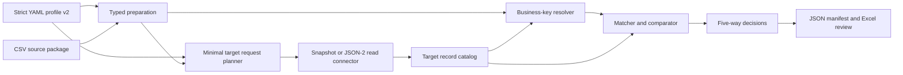

# Architecture

## Objective

The engine answers:

> For this versioned source package, profile, and target snapshot, which
> candidates would be created or updated, which are unchanged, and which
> cannot be decided safely?

Odoo is an input. The only outputs are evidence files.

## Processing flow



## Modules

| Module | Responsibility |
| --- | --- |
| `profile.py` | Strict Pydantic profile v2 contract and dependency-cycle checks |
| `canonical.py` | Lossless parsing, normalization, null policy, decimal safety |
| `source.py` | CSV inventory, source hashing, prepared records, duplicate detection |
| `planner.py` | Batched minimum metadata/record requirements |
| `connectors.py` | Read port, deterministic snapshot adapter, Odoo 19 JSON-2 adapter |
| `metadata.py` | Model, field, type, relation, related-model, inverse, and readonly checks |
| `catalog.py` | Per-model ID and business-key indexes retaining duplicates |
| `engine.py` | Resolution, target matching, comparison, grouping, classification |
| `models.py` | Environment-independent domain and portable result objects |
| `reporting.py` | Canonical JSON and artifact-tool Excel orchestration |
| `cli.py` | Explicit capture and offline-preflight commands |

## Boundaries

### Portable domain

The following contain no numeric Odoo IDs:

- profiles;
- source packages;
- prepared records;
- logical and resolved business references;
- decisions and field differences;
- portable manifest;
- review workbook.

### Environment-specific domain

Numeric Odoo IDs are permitted only in:

- raw/normalized target record snapshots;
- `TargetRecord`;
- catalog `by_id` indexes used to reverse relational values.

Target relation IDs are converted to `BusinessReference(model, key, scope)`
before matching, comparison, or serialization.

## Connector capability

`OdooReadConnector` exposes exactly:

```python
get_environment_fingerprint()
get_model_metadata(requests)
get_records(requests)
```

`Json2ReadConnector` further allowlists only `fields_get` and `search_read`.
There is no public arbitrary call, create, write, unlink, import, execute,
`execute_kw`, or SQL surface. A future write executor must be a separate
package and undergo a separate security review.

## Prepared records

Each source row becomes an immutable `PreparedRecord` containing:

- dataset and row;
- source identity;
- target model;
- canonical target identity and scope intents;
- typed scalar values;
- symbolic incoming or target-only relationships;
- structured issues.

Incoming references stay symbolic, for example
`REF(assets, ASSET-1)`, until dependency-ordered resolution. Target-only
references carry a model and natural-key fields. Neither shape stores an Odoo
ID.

## Metadata validation

Before classification, the profile is checked against captured metadata for:

- missing models or fields;
- scalar type incompatibility;
- relation kind mismatch;
- related-model mismatch;
- one2many ownership;
- missing inverse relation;
- readonly fields proposed for future writing;
- missing target-only reference identity fields.

Metadata problems are applied as blocking dataset evidence. When relevant
module names are configured programmatically, missing module-version
permissions are a non-blocking fingerprint limitation.

## Identity and scope

Source identity, target identity, and target scope are distinct ordered tuples.
Composite identities may include relational components. Scope is part of the
target index key, so identical business codes in two companies/sites/parents
do not collide.

Duplicate source identities block every duplicate row. Duplicate complete
target identities are retained by the catalog and produce `AMBIGUOUS`.

## Relationship resolution

Two origins are supported:

- `dataset`: match another prepared dataset's source identity, then carry its
  resolved target business identity;
- `target_model`: resolve a natural key through a preloaded target catalog.

All reference catalogs are requested in batches. Resolution evidence is
grouped by dataset, field, reference key, and status while each affected
candidate retains its row-level blocking issue.

Many2many values are compared as sets with explicit `replace`, `add`, or
`remove` semantics. Returned ID ordering never becomes business meaning.

## Classification

Precedence is fixed:

```text
blocking issue → BLOCKED
multiple complete target matches → AMBIGUOUS
no target match → CREATE
one target match plus material differences → UPDATE
one target match without differences → UNCHANGED
```

`create` datasets must declare what happens when an identity already exists.
`reference` datasets participate in resolution but are not import candidates.

## Determinism

- JSON uses UTF-8, sorted keys, compact separators, and typed portable values.
- Decimals never pass through binary floating point.
- Target and decision ordering is explicit.
- Source, metadata snapshot, and record snapshot hashes enter the manifest.
- The semantic hash covers the serialized manifest payload: profile
  ID/version, source and snapshot hashes, fingerprint, and conclusions.
- Repeating the golden run produces byte-identical manifest bytes.

Version 0.2.0 does not include a profile-file hash or requirements-plan hash.
Saved snapshots written by the CLI contain profile/source bindings, but their
envelopes are not yet validated with a complete JSON Schema.

## Complexity and memory

Core processing is `O(S × F + T)`, where `S` is source rows, `F` compared
fields, and `T` target/reference rows. Dictionaries index source identities,
target identities, IDs, and references. Network calls scale with models and
pages.

Rows are currently held in memory. The source-reader and snapshot boundaries
are the replacement points for a future DuckDB/Parquet store; no domain
contract depends on Python list storage.

## Further detail

See [docs/architecture/read-only-preflight.md](docs/architecture/read-only-preflight.md),
[docs/decisions/README.md](docs/decisions/README.md), and the
[contract index](docs/README.md). Concrete inputs, expected outputs, and
failure cases are in
[docs/examples-and-edge-cases.md](docs/examples-and-edge-cases.md).
