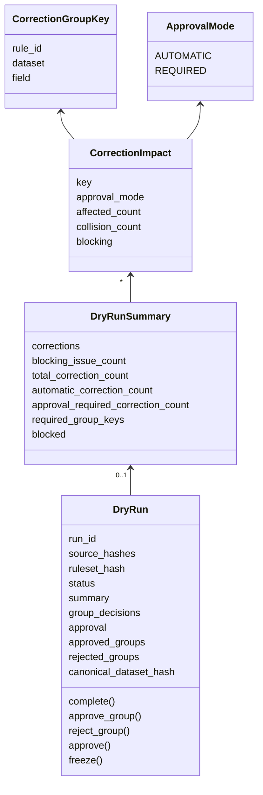
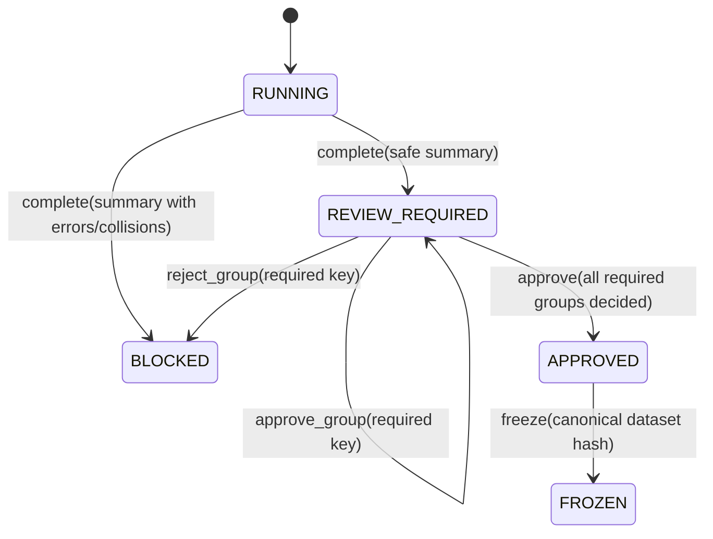

# Normalization dry-run governance

## 1. Purpose and current status

This document explains the first implemented contract slice for source-data
normalization and validation. It covers dry-run governance only:

```text
source files
-> normalization and validation dry run
-> correction review
-> whole-run approval
-> frozen canonical dataset
```

It does not define DuckDB tables, execute normalization rules, provide the
local browser, connect to Odoo, or import data into Odoo.

The implementation is in
[`governance.py`](../../src/uc_migration_profiler/governance.py). Its focused
tests are in
[`test_governance.py`](../../tests/test_governance.py).

## 2. Why this is a separate module

The existing `models.py`, `source.py`, and `engine.py` implement the read-only
Odoo preflight proof of concept. Normalization governance must be usable before
Odoo is involved, so `governance.py` imports none of those modules.

This separation prevents three accidental couplings:

1. approving normalized source data must not grant an Odoo write capability;
2. changing the future browser or DuckDB adapter must not change governance
   rules;
3. a rules evaluator must not decide whether its own results are approved.

The future rule evaluator will produce correction events and aggregates. The
future DuckDB adapter will persist them. The browser will call the lifecycle
methods to record decisions.

## 3. Object relationships



### `ApprovalMode`

`automatic` means the published rule already permits a low-risk correction.
The correction is applied to the dry-run candidate without an individual
manager decision. It remains visible in the summary and the complete dry run
still requires approval.

`required` means the correction group must be approved explicitly before the
complete dry run can be approved.

Approval mode is separate from a future rule action such as `correct`, `warn`,
or `reject`. The action says what the evaluator does. Approval mode says who
must authorize a proposed correction.

### `CorrectionGroupKey`

This key identifies a summary-table row:

```text
(rule_id, dataset, field)
```

For example:

```text
("trim-product-code", "products", "default_code")
```

It allows 241 identical kinds of correction to be reviewed as one coherent
group instead of 241 separate approval dialogs.

### `CorrectionImpact`

This object contains aggregated counts for a correction group. It does not
contain raw customer values.

`affected_count` is the number of rows changed or proposed for change.
`collision_count` is the number of affected rows involved in an identity
collision after normalization.

Any collision makes `blocking` true, including for an automatic correction.
An automatic rule is never allowed to hide a collision.

### `DryRunSummary`

The summary reconciles all correction groups with validation errors. Its
computed properties supply the future browser dashboard:

| Property | Meaning |
| --- | --- |
| `total_correction_count` | All changed or proposed rows |
| `automatic_correction_count` | Rows changed by automatic rules |
| `approval_required_correction_count` | Rows awaiting group approval |
| `required_group_keys` | Exact decisions needed before whole-run approval |
| `blocked` | Whether an error or correction collision makes the run unsafe |

The same correction-group key cannot appear twice. That invariant prevents a
summary from displaying totals that cannot reconcile with row-level evidence.

### `DryRun`

`DryRun` owns the lifecycle. It is created before evaluation and is immediately
bound to:

- exact source-file SHA-256 hashes;
- one immutable ruleset SHA-256 hash.

Every lifecycle method returns a new object. The old object is unchanged. This
allows the future DuckDB audit store to retain a sequence of immutable states.

## 4. Lifecycle and method connections



### `complete(summary)`

This is called after normalization and validation finish.

- If `summary.blocked` is true, the result is `BLOCKED`.
- Otherwise, the result is `REVIEW_REQUIRED`.

There is no direct transition from `RUNNING` to `APPROVED`. The data manager
must validate the dry run even when every correction was automatic.

### `approve_group(key, actor, decided_at, reason)`

This records approval of one `required` correction group. It cannot approve an
automatic group, an unknown group, or a group from another run.
The verified actor must have the `normalization.decide` capability. The
immutable decision retains the stable actor identity, timezone-aware timestamp,
and optional reason.

Approving a group does not approve the complete dry run. It only removes one
item from the set of pending decisions.

### `reject_group(key, actor, decided_at, reason)`

This records rejection and immediately moves the run to `BLOCKED`. The
affected rows are not silently allowed to continue with invalid raw values.
A new run is required after the source or rule is corrected.

### `approve(actor, approved_at, reason)`

This records whole-run approval. It succeeds only when:

- the current state is `REVIEW_REQUIRED`;
- every required correction group is approved;
- the verified actor has the `normalization.approve` capability;
- the approval timestamp contains a timezone.

Automatic corrections do not need group approval, but they remain covered by
this whole-run approval.

### `freeze(canonical_dataset_hash)`

This is the final method in this slice. It binds the approval to the exact
canonical dataset hash and returns `FROZEN`.

Freezing is not an Odoo import and grants no Odoo capability. It creates the
stable source-data artifact that future read-only target preflight may consume.

## 5. Complete example

```python
from datetime import datetime, timezone

from uc_migration_profiler.access import LOCAL_ACTOR
from uc_migration_profiler.governance import (
    ApprovalMode,
    CorrectionGroupKey,
    CorrectionImpact,
    DryRun,
    DryRunSummary,
)


trim_key = CorrectionGroupKey(
    rule_id="trim-product-code",
    dataset="products",
    field="default_code",
)
remap_key = CorrectionGroupKey(
    rule_id="remap-product-code",
    dataset="products",
    field="default_code",
)

summary = DryRunSummary(
    corrections=(
        CorrectionImpact(
            key=trim_key,
            approval_mode=ApprovalMode.AUTOMATIC,
            affected_count=241,
        ),
        CorrectionImpact(
            key=remap_key,
            approval_mode=ApprovalMode.REQUIRED,
            affected_count=18,
        ),
    ),
)

running = DryRun(
    run_id="dry-run-001",
    source_hashes={"products.xlsx": "sha256:" + "a" * 64},
    ruleset_hash="sha256:" + "b" * 64,
)

review = running.complete(summary)
group_approved = review.approve_group(
    remap_key,
    actor=LOCAL_ACTOR,
    decided_at=datetime.now(timezone.utc),
)
run_approved = group_approved.approve(
    actor=LOCAL_ACTOR,
    approved_at=datetime.now(timezone.utc),
)
frozen = run_approved.freeze(
    canonical_dataset_hash="sha256:" + "c" * 64,
)
```

The variables intentionally show the immutable sequence:

```text
running
-> review
-> group_approved
-> run_approved
-> frozen
```

No assignment mutates the object created on the previous line.

## 6. Validation invariants

The constructors and lifecycle methods reject:

- blank run, rule, dataset, field, filename, or manager identifiers;
- malformed SHA-256 evidence;
- an empty source-file hash set;
- zero or negative affected-row counts;
- negative or impossible collision counts;
- duplicate correction groups;
- a group marked both approved and rejected;
- decisions for automatic or unknown correction groups;
- a completed run without a summary;
- an approved run without manager and timezone-aware audit evidence;
- freezing before approval;
- a frozen run without a canonical dataset hash.

These are domain failures, not browser validation conveniences. DuckDB, CLI,
and browser adapters must all pass through the same contracts.

## 7. Test-to-behavior map

`tests/test_governance.py` demonstrates:

| Behavior | Test area |
| --- | --- |
| Separate automatic and required totals | `CorrectionSummaryTests` |
| Correction collisions block the run | `CorrectionSummaryTests` |
| Duplicate and impossible counts fail closed | `CorrectionSummaryTests` |
| Automatic-only runs still need whole-run approval | `DryRunLifecycleTests` |
| Required groups must be approved first | `DryRunLifecycleTests` |
| Automatic groups cannot receive manual group decisions | `DryRunLifecycleTests` |
| Rejection blocks the run | `DryRunLifecycleTests` |
| Freeze is allowed only after approval | `DryRunLifecycleTests` |
| Approval timestamps require a timezone | `DryRunLifecycleTests` |
| Source and ruleset evidence require SHA-256 bindings | `DryRunLifecycleTests` |

## 8. Next implementation connection

The next slice will add strict normalization-rule definitions and a pure
evaluator. Its output will later be aggregated into `CorrectionImpact` objects.
It must not call `approve_group`, `approve`, or `freeze`; those decisions belong
to the governance layer and the data manager.
