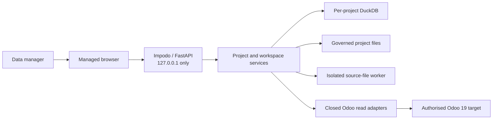

# Impodo architecture

## Purpose

This document is the current structural overview of Impodo. It explains the
main components, data flow, and boundaries without repeating the detailed
[contracts](../README.md#contracts) or
[architecture decisions](../decisions/README.md).

Impodo is currently a local browser application for governing CSV/XLSX data
and preparing an Odoo 19 migration. Odoo access is read-only. Governed
normalization, clean-package certification, functional approval, Odoo writes,
and reconciliation remain later product capabilities described in the
[product vision](../product-vision.md).

## System context

The browser is server-rendered. FastAPI coordinates application services; it
does not contain the core project, mapping, or validation rules. DuckDB and
the filesystem are local adapters behind those rules.

## Current capability boundary

The browser implements:

- project registration and governed source-file intake;
- profile-free CSV/XLSX inspection and bounded previews;
- source confirmation and immutable dataset freezing;
- read-only Odoo model and field capture;
- governed business keys, scalar mappings, transformations, and relations;
- bounded derived-entity authoring previews;
- immutable mapping revisions, semantic validation, and submission evidence.

The repository also contains a profile-driven preflight engine and CLI. That
engine prepares complete source rows, reads saved or live target evidence,
resolves business-key relations, and produces portable manifest/workbook
evidence with `CREATE`, `UPDATE`, `UNCHANGED`, `AMBIGUOUS`, and `BLOCKED`
classifications.

These paths are not yet one executable migration pipeline. A submitted browser
mapping is governed evidence, but it is not a full-row clean package, an Odoo
import plan, or permission to write to Odoo.

## Browser workflow

1. **Project setup** records ownership, classification, retention, `FILE` or
   `ODOO` source mode, and the selected `LOCAL` or `REMOTE` Odoo target.
2. **Source discovery** stores and inspects immutable source bytes for `FILE`
   projects. `ODOO` projects currently proceed first to read-only target model
   and capture-eligibility field discovery; bounded record freezing is not yet
   implemented.
3. **Target schema** captures an effective Odoo schema snapshot through a
   closed read surface.
4. **Governed mapping** records business keys, field providers,
   transformations, relationships, and derived-entity rules.
5. Validation creates deterministic issues and an immutable mapping revision.
   Submission binds the exact validated revision and evidence hashes.

Changing source evidence, frozen datasets, target identity, schema, or
governed business keys invalidates downstream mapping evidence.

## Component layers

| Layer | Responsibilities | Main modules |
| --- | --- | --- |
| Browser | Local route composition, workflow routers, presenters, templates, sessions, CSRF, and security headers | `web/app.py`, `web/routers/`, `web/presenters/` |
| Application | Project commands, intake, inspection, source selection, schema governance, mapping, preparation, quality, normalization, and preflight orchestration | `projects.py`, `intake.py`, `inspection.py`, `application/source_workspace_service.py`, `application/schema_workspace_service.py`, `application/mapping_workspace_service.py`, `application/preparation_service.py`, `application/quality_service.py`, `application/normalization_service.py`, `application/preflight_service.py` |
| Domain | Authorization, project lifecycle, mapping meaning, staging evaluation, approvals, and deterministic values | `access.py`, `projects.py`, `domain/mapping/`, `domain/schema/`, `domain/compiler/`, `domain/staging/`, `approvals.py`, `models.py` |
| Local adapters | Focused DuckDB repositories, artifacts, credentials, jobs, and resource-bounded workers | `adapters/duckdb/`, `artifacts.py`, `secrets.py`, `jobs.py`, `source_worker.py` |
| Odoo reads | Remote JSON-2 reads, fixed local metadata reads, and local-stack readiness | `connectors.py`, `local_odoo_reader.py`, `local_stack.py` |
| Preflight | Compiled semantics, frozen-row adaptation, bounded read planning, comparison, and reporting | `domain/compiler/`, `domain/preflight/`, `planner.py`, `metadata.py`, `catalog.py`, `engine.py`, `reporting.py` |

Domain and application modules do not depend on FastAPI templates. Adapters
may be replaced without changing lifecycle or mapping semantics.

## Persistence and evidence

On Windows, the normal local root is `%LOCALAPPDATA%\Impodo\projects`. A
configured macOS root uses owner-only permissions. The root contains a small
registry plus one directory and DuckDB database per project. Project
directories separate inbox, staging, snapshots, reports, and audit artifacts;
the presence of a staging directory does not mean full-row staging is already
implemented.

Important evidence is immutable or versioned:

- source files retain their original bytes and SHA-256 hash;
- confirmed source selections and target schema captures are hash-bound;
- mapping revisions and submissions are immutable;
- audit events retain stable actor identities;
- target-derived evidence names its connection-target, schema-scope,
  principal/context, and policy hashes explicitly;
- portable outputs use business keys rather than numeric Odoo IDs.

Numeric Odoo IDs are permitted only inside target-specific snapshots and
internal lookup indexes. They must not become portable source, mapping,
decision, manifest, or workbook identifiers.

## Odoo boundary

Remote reads use Odoo 19 JSON-2 and expose only `fields_get` and
`search_read`. Local metadata capture uses a selected `odoo.conf` and fixed
scripts for the model catalogue and `fields_get`; it is not a generic Odoo
shell. Local stack controls can stop only services started and retained by the
current Impodo session.

The reader has no create, write, unlink, import, arbitrary model method, or SQL
surface. The practical disposable-target path uses a separate writer limited
to exact lookups plus create and write. Its model and field capability is derived
from one captured-schema-bound preview, so standard, extension, and custom
schema surfaces do not require a global product allowlist. Its frozen snapshot,
authorization, and journal are independent of the reader. A second closed
adapter performs exact-ID and governed-key `search_read` after the write; the
hash-bound result and concise fallout are persisted separately.

## Performance invariants

Odoo access must remain batched:

- request fields and records per model, not per source row or field;
- paginate target reads deterministically;
- build and reuse business-key and relation indexes;
- cache dependency resolution rather than rescanning datasets;
- split very large key domains into deterministic bounded requests.

No Odoo reader should call `fields_get`, `search_read`, `browse`, or another
ORM/RPC method inside a row loop. Creates use bounded list-form batches. The
practical writer updates one uniquely re-matched record per call because Odoo
write failures must remain attributable to one proposed row.

## Deployment boundary

The current composition root is local and single-user: loopback FastAPI,
local DuckDB, local artifacts, a local credential vault, and inline jobs.

A future hosted deployment uses a separate composition root with corporate
identity, project-scoped authorization, PostgreSQL, shared artifact storage,
durable workers, managed secrets, and a trusted TLS reverse proxy. Local
loopback assumptions must not be relaxed and reused as hosted controls. See
[ADR-008](../decisions/README.md).

## Authoritative detail

- [Security and infrastructure](security-and-infrastructure.md)
- [Migration project contract](../contracts/01-migration-project.md)
- [Browser workspace contract](../contracts/02-workspace.md)
- [Profile-driven preflight contract](../contracts/04-preflight.md)
- [Acceptance and test strategy](../testing/acceptance.md)
