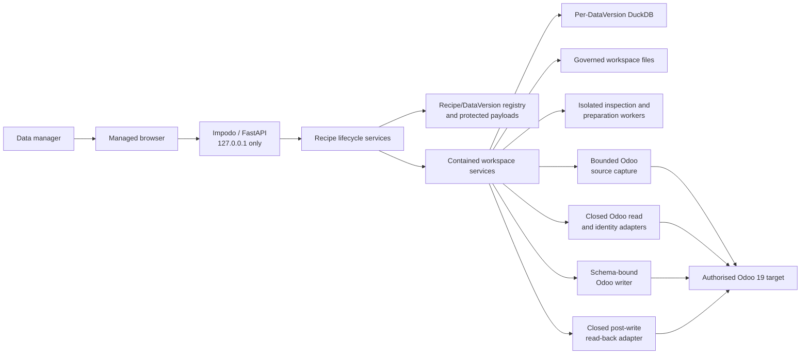

# Impodo architecture

## Purpose

This document is the current structural overview of Impodo. It explains the
main components, data flow, and boundaries without repeating the detailed
[developer contracts](../developer/README.md#normative-contracts) or
[architecture decisions](../decisions/README.md).

Impodo is currently a local browser application for governing source data and
running a bounded Odoo 19 migration workflow. The supported `FILE` path covers
CSV/XLSX intake, mapping, preparation, review, read-only comparison, an
explicit disposable local or remote load, journaling, and reconciliation. The
browser also implements bounded `ODOO` source capture and immutable snapshot
publication. Odoo-origin data can be prepared and compared offline as pinned
updates against that same database, but Odoo-origin writes and cross-database
transfer are not available. A `PRODUCTION` DataVersion is implemented as a
fresh application of one qualified Recipe revision; it does not by itself
authorize a production cutover.

## System context



The browser is server-rendered. FastAPI coordinates application services; it
does not contain the core Recipe, project, mapping, or validation rules.
DuckDB and the filesystem are local adapters behind those rules.

## Current capability boundary

The browser implements:

- operator-project creation as Recipe plus Authoring DataVersion 1, with a
  contained `FILE` or `ODOO` workspace;
- profile-free CSV/XLSX inspection, bounded previews, and immutable dataset
  freezing;
- bounded Odoo record selection, capture, protected provenance, and immutable
  Parquet snapshot publication;
- read-only Odoo model, field, identity, and permission capture;
- governed business keys, scalar mappings, transformations, and relations;
- bounded derived-entity authoring previews;
- immutable mapping revisions, semantic validation, and submission evidence;
- durable canonical staging, quality/quarantine evidence, normalization review,
  and prepared snapshots;
- read-only Odoo comparison with `CREATE`, `UPDATE`, `UNCHANGED`, `AMBIGUOUS`,
  and `BLOCKED` classifications;
- an exact execution snapshot, explicit disposable local or remote loading,
  a durable write journal, and post-write reconciliation.

The Recipe-first lifecycle is implemented. The browser deliberately labels the
operator-facing aggregate a **project**, while the domain and persistence name
that reusable aggregate `Recipe`. **New project** provisions a Recipe,
authoring DataVersion 1, and one contained `MigrationProject` workspace. These
three identities are distinct. Older standalone workspaces are represented by
one registry Recipe/DataVersion shell; opening one hydrates only an allowlisted
setup projection and writes exact local linkage.

The Recipe overview derives publication readiness from exact current workspace
evidence, publishes portable immutable Recipe revisions, and shows
Recipe/DataVersion history. Published Recipe and qualification payloads use an
application-encrypted protected store, while bounded registry projections hold
lineage and recovery state. Existing `/projects/{workspace_project_id}` URLs
remain internal workspace routes resolved through the active Recipe and
DataVersion.

A published revision can provision a clean Test DataVersion, bind current
replacement source and non-secret remote Test target evidence, show focused
drift, rebuild reusable preparation and governance, and compile a fresh mapping
draft. Matching retains its established editor; Recipe application does not add
a parallel engine. After successful Test preparation, comparison, execution,
read-back, and reconciliation, explicit qualification can select that exact
revision as the cutover candidate. **Run with latest data** then creates a
clean Production DataVersion pinned to the selected qualified revision, even
when a newer unqualified revision exists. It receives fresh source, target,
parameter, control, credential, approval, execution, and reconciliation
evidence. Authoring can declare typed per-DataVersion context such as a
warehouse; Product, related Product/BOM, and warehouse-parameterized stock
shapes use the same contracts rather than separate execution paths.

The repository also contains a profile-driven preflight engine and CLI. It is
a separate entry path that retains strict CSV and declared-sheet XLSX loading
while sharing compiled planning, comparison, and reporting semantics with the
browser path.

The supported `FILE` browser path is one executable bounded migration pipeline.
A submitted mapping alone is still only governed evidence: preparation,
normalization approval, a fresh comparison, an exact execution snapshot, and
one explicit **Load into Odoo** confirmation remain mandatory. Captured `ODOO`
sources use protected provenance for offline preparation and same-database
comparison, but current policy publishes no loadable execution snapshot for
them. Neither path is a production-cutover authorization.

## Recipe and data-version lifecycle

```text
operator Project
`-- Recipe
    |-- immutable Recipe revision(s)
    |-- Authoring DataVersion -> contained MigrationProject workspace
    |-- Test DataVersion      -> fresh workspace + Test application evidence
    `-- Production DataVersion -> fresh workspace pinned to the cutover candidate
```

Reusable Recipe meaning contains logical source shapes, preparation and mapping
rules, target requirements and business keys, reusable quality rules,
references, parameters, and controls. It excludes source rows and physical
identities, concrete target/database identity, credentials, numeric Odoo IDs,
approvals, execution journals, and reconciliation results. Those belong to one
DataVersion or its contained workspace and must be regenerated.

## Browser workflow

**New project** records only a name and `FILE` or `ODOO` source mode. In file
mode, initial setup accepts one or more CSV/XLSX files and registers the
workspace; the Odoo destination is configured later in **Odoo data**. In Odoo
source mode, initial setup verifies the same Odoo database from which records
will be captured. The former details, governance, target, and confirmation
wizard is not the normal browser path. A registered DataVersion workspace then
uses six browser stages:

1. **Source data** inspects and freezes CSV/XLSX datasets, or selects, captures,
   and publishes a bounded Odoo-source snapshot.
2. **Odoo data** discovers allowed record types and captures an effective,
   identity-bound Odoo schema through closed read and probe surfaces.
3. **Match data** records business keys, field providers, transformations,
   relationships, and derived-entity rules. Validation and submission bind the
   exact mapping revision to current evidence hashes.
4. **Prepare data** evaluates every supported frozen row, publishes canonical
   staging and prepared snapshots, and requires quality and normalization
   review. It accepts file-origin selections and supported immutable Odoo-origin
   captures; Odoo-origin preparation verifies the protected source provenance
   and remains offline after capture.
5. **Final review** reads Odoo in deterministic batches, classifies every row,
   and freezes the exact execution snapshot when the comparison is ready.
6. **Load into Odoo** requires an explicit confirmation, executes only the
   frozen schema-bound intentions, journals every attempt, and reads committed
   results back for reconciliation.

Changing source evidence, frozen datasets, target identity, schema, or
governed business keys invalidates downstream mapping evidence.

## Component layers

| Layer | Responsibilities | Main modules |
| --- | --- | --- |
| Browser | Local route composition, workflow routers, presenters, templates, sessions, CSRF, and security headers | `web/app.py`, `web/routers/`, `web/presenters/` |
| Application | Recipe lineage, authoring, Test/Production application, qualification, project commands, intake, source capture/publication, schema governance, mapping, preparation, quality, normalization, preflight, execution, and reconciliation orchestration | `application/recipe_service.py`, `application/recipe_authoring_service.py`, `application/recipe_application_service.py`, `application/recipe_qualification_service.py`, `projects.py`, `intake.py`, `application/source_workspace_service.py`, `application/odoo_source_capture_service.py`, `application/odoo_capture_publication_service.py`, `application/schema_workspace_service.py`, `application/mapping_workspace_service.py`, `application/preparation_service.py`, `application/quality_service.py`, `application/normalization_service.py`, `application/preflight_service.py`, `application/execution_service.py`, `application/reconciliation_service.py` |
| Domain | Authorization, Recipe/DataVersion and application identities, exact TargetBindings, project lifecycle, source bindings and snapshots, mapping meaning, staging evaluation, execution snapshots, reconciliation, approvals, and deterministic values | `access.py`, `recipes.py`, `domain/recipe_applications.py`, `projects.py`, `domain/source_binding.py`, `domain/source_snapshot.py`, `domain/odoo_capture.py`, `domain/mapping/`, `domain/compiler/`, `domain/staging/`, `domain/execution.py`, `domain/reconciliation.py`, `approvals.py`, `models.py` |
| Local adapters | Focused DuckDB repositories, protected Recipe and Odoo payloads, artifacts, credentials, jobs, and resource-bounded workers | `adapters/duckdb/`, `adapters/protected_recipe_store.py`, `adapters/protected_odoo_provenance.py`, `artifacts.py`, `secrets.py`, `jobs.py`, `source_worker.py`, `application/preparation_job_service.py` |
| Odoo boundary | Remote JSON-2 identity and data reads, bounded source capture, fixed local metadata reads, schema-bound writes, post-write read-back, and local-stack readiness | `connectors.py`, `adapters/odoo_source_capture.py`, `local_odoo_reader.py`, `odoo_writer.py`, `odoo_readback.py`, `local_stack.py` |
| Preflight | Compiled semantics, frozen-row adaptation, bounded read planning, comparison, and reporting | `domain/compiler/`, `domain/preflight/`, `planner.py`, `metadata.py`, `catalog.py`, `engine.py`, `reporting.py` |

Domain and application modules do not depend on FastAPI templates. Adapters
may be replaced without changing lifecycle or mapping semantics.

## Persistence and evidence

On Windows, the normal local root is `%LOCALAPPDATA%\Impodo\projects`. A
configured macOS root uses owner-only permissions. The root contains a small
registry, an application-encrypted Recipe payload store, plus one directory
and DuckDB database per DataVersion workspace. The registry owns Recipe and
DataVersion lineage, bounded application/qualification projections, cutover selection,
and restart-safe intents without scanning project databases. Project
directories separate inbox, staging, snapshots, reports, and audit artifacts;
canonical staging, prepared Parquet snapshots, protected target evidence,
execution journals, and reconciliation results are implemented within those
boundaries. The current build accepts one exact base project-database
generation and version, then applies only checksum-pinned additive Recipe
workspace migrations through a local ledger. A project from another base
generation or version is rejected rather than read through a compatibility
adapter.

Important evidence is immutable or versioned:

- Recipe revisions retain reusable semantic and payload hashes without
  operational workspace identity;
- Recipe application, qualification, and cutover selection bind exact
  revisions without copying credentials or granting write authority;
- source files retain their original bytes and SHA-256 hash;
- confirmed source selections and target schema captures are hash-bound;
- mapping revisions and submissions are immutable;
- canonical staging and prepared snapshots bind the compiled mapping and exact
  source selection;
- Odoo-source publications bind the capture plan, read identity, protected
  provenance, data hash, and current source snapshot;
- execution snapshots, write journals, and reconciliation runs remain separate
  hash-bound evidence;
- audit events retain stable actor identities;
- target-derived evidence names its connection-target, schema-scope,
  principal/context, and policy hashes explicitly;
- portable outputs use business keys rather than numeric Odoo IDs.

Numeric Odoo IDs are permitted only inside target-specific snapshots and
internal lookup indexes. They must not become portable source, mapping,
decision, manifest, or workbook identifiers.

## Odoo boundary

Remote reads use Odoo 19 JSON-2 through closed version, `context_get`,
`has_access`, `fields_get`, and `search_read` operations. Callers cannot select
an arbitrary model method or raw request context. Odoo-source capture adds only
policy-shaped, keyset-paginated `search_read` requests. Local metadata capture
uses a selected `odoo.conf` and fixed scripts for the model catalogue and
`fields_get`; it is not a generic Odoo shell. Local stack controls can stop
only services started and retained by the current Impodo session.

The shared connection check names its source-read or destination-read purpose
and verifies only the exact Odoo 19 database plus authenticated read identity.
It does not run model-catalogue or `fields_get` discovery; those remain explicit
Odoo-data operations and must not be repeated as connection tests.

The read adapters have no create, write, unlink, import, arbitrary model method,
or SQL surface. The practical disposable-target path uses a separate writer
limited to exact lookups, remote External-ID `load` batches, bounded local
list-form creates, and single-record writes. Its model and field capability is
derived from one captured-schema-bound preview, so standard, extension, and
custom schema surfaces do not require a global product allowlist. Its frozen
snapshot, authorization, and journal are independent of the readers. A second
closed adapter performs exact-ID and governed-key `search_read` after the
write; the hash-bound result and concise fallout are persisted separately.

## Performance invariants

Odoo access must remain batched:

- request fields and records per model, not per source row or field;
- paginate target reads deterministically;
- build and reuse business-key and relation indexes;
- cache dependency resolution rather than rescanning datasets;
- split very large key domains into deterministic bounded requests.

No Odoo reader should call `fields_get`, `search_read`, `browse`, or another
ORM/RPC method inside a row loop. Odoo-source reads use fixed-size deterministic
pages. Remote creates use bounded External-ID `load` batches; local creates use
bounded list-form batches. The practical writer updates one uniquely re-matched
record per call because Odoo write failures must remain attributable to one
proposed row.

## Deployment boundary

The current composition root is local and single-user: loopback FastAPI,
local DuckDB, local artifacts, and a local credential vault. Inspection and
preparation use spawned worker processes; preparation progress is supervised by
the browser process. Odoo capture uses one bounded background thread. These job
control records are session-local rather than durable distributed-worker state.

A future hosted deployment uses a separate composition root with corporate
identity, project-scoped authorization, PostgreSQL, shared artifact storage,
durable workers, managed secrets, and a trusted TLS reverse proxy. Local
loopback assumptions must not be relaxed and reused as hosted controls. See
[ADR-008](../decisions/README.md).

## Authoritative detail

- [Security and infrastructure](security-and-infrastructure.md)
- [Recipe lifecycle contract](../developer/contracts/recipe-lifecycle.md)
- [Contained project lifecycle contract](../developer/contracts/project-lifecycle.md)
- [Workflow evidence lifecycle](../developer/contracts/evidence-lifecycle.md)
- [Canonical staging contract](../developer/contracts/canonical-staging.md)
- [Preflight contract](../developer/contracts/preflight.md)
- [Normalization governance contract](../developer/contracts/normalization.md)
- [Quality and quarantine contract](../developer/contracts/quality-and-quarantine.md)
- [Execution and reconciliation contract](../developer/contracts/execution-and-reconciliation.md)
- [Acceptance and test strategy](../testing/acceptance.md)
