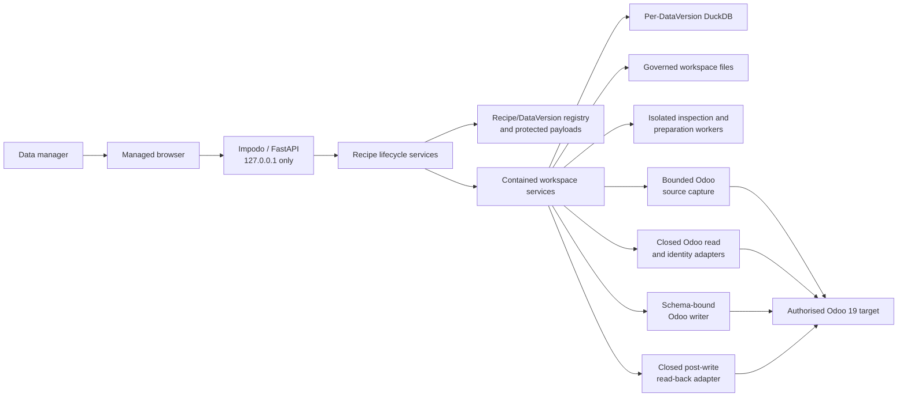

# Impodo architecture

## Purpose

This document explains Impodo's current structure, data flow, and system
boundaries. The linked [developer contracts](../developer/README.md#normative-contracts)
define the detailed rules, while the
[architecture decisions](../decisions/README.md) explain why the system uses
those boundaries.

Impodo currently runs as a local browser application. It helps a data manager
govern source data and perform a bounded migration to Odoo 19.

This page describes the current Recipe-first browser composition. Product
ownership accepted a replacement Project and multi-Recipe architecture in
[ADR-014](../decisions/README.md#adr-014--migration-projects-coordinate-reusable-recipes-and-cutover-plans).
Phases M0 through M2 of the [Migration projects and multi-Recipe cutover
implementation
plan](../plans/migration-projects-and-multi-recipe-cutover-implementation-plan.md)
have established the clean Project, DataVersion source-package, run, and
workspace foundation. Phase M3 owns the browser cutover. The browser behavior
below remains current until that gate passes.

For uploaded files, the supported `FILE` workflow accepts CSV and XLSX data,
maps and prepares it, compares it with Odoo without writing, and creates an
exact execution snapshot. After an explicit confirmation, Impodo can load that
snapshot into a permitted disposable local or remote Odoo target. It records
every write and reconciles the resulting Odoo records.

For existing Odoo records, the `ODOO` workflow captures a bounded selection and
publishes it as an immutable snapshot. Impodo can prepare that snapshot offline
and compare proposed updates with the same Odoo database. It cannot currently
write Odoo-origin changes or transfer them to another database.

A `PRODUCTION` DataVersion applies one qualified Recipe revision to fresh data
and target evidence. The `PRODUCTION` label records lifecycle intent; it does
not authorize a production cutover or relax the disposable-target policy.

## System context



The browser renders pages on the server. FastAPI receives browser requests and
coordinates application services. It does not own the Recipe, workspace,
mapping, or validation rules. Domain and application code own those rules, and
local adapters connect them to DuckDB and the filesystem.

## Current capability boundary

The browser currently provides these capabilities:

- When a data manager creates a project, Impodo creates a reusable `Recipe`
  and its first editable `DataVersion`. That DataVersion owns an isolated
  workspace configured for either uploaded files (`FILE`) or records captured
  from Odoo (`ODOO`).
- For uploaded CSV and XLSX files, Impodo inspects the files without requiring
  a profile, limits the preview size, and freezes accepted datasets as
  immutable evidence.
- For an Odoo source, Impodo limits record selection and capture, protects the
  record provenance, and publishes an immutable Parquet snapshot.
- Impodo captures Odoo model, field, identity, and permission information
  through read-only operations.
- A data manager can define governed business keys, scalar mappings,
  transformations, and relationships. The data manager can also define and
  preview bounded derived-entity rules.
- Impodo versions each mapping, validates its meaning, and records the exact
  submitted revision as evidence.
- During preparation, Impodo builds durable canonical staging, evaluates
  quality rules, quarantines unsuitable rows, presents normalization changes
  for review, and publishes prepared snapshots.
- During final review, Impodo compares prepared rows with Odoo and classifies
  each row as `CREATE`, `UPDATE`, `UNCHANGED`, `AMBIGUOUS`, or `BLOCKED`.
- For a permitted file-source load, Impodo freezes the exact execution
  snapshot, requires explicit confirmation, records every write attempt, and
  reconciles the committed results.

### How projects, Recipes, DataVersions, and workspaces relate

The browser uses **project** as the business name for one reusable migration
effort. In the domain and persistent registry, that reusable aggregate is a
`Recipe`.

Choosing **New project** creates three distinct objects in one recoverable
operation:

1. The `Recipe` owns the reusable migration identity and revision history.
2. Authoring `DataVersion` 1 provides the first editable data package and
   lifecycle context.
3. A contained workspace, represented in the current code by `WorkspaceState`,
   stores that DataVersion's source, target, mapping, credentials, evidence,
   and audit state.

Each object has its own identifier. A workspace identifier must not be used as
a Recipe or DataVersion identifier. Current creation writes the exact Recipe,
DataVersion, and workspace linkage from the first operation. The current build
does not backfill or lazily adopt a standalone workspace into Recipe lineage.

The Recipe overview checks the current Authoring workspace evidence to decide
whether the Recipe is ready to publish. Publishing creates an immutable,
portable Recipe revision and preserves its semantic and payload hashes. The
protected Recipe store encrypts published Recipe and qualification payloads.
The registry stores only bounded lineage and recovery projections, and the
overview displays the Recipe and DataVersion history.

Existing `/projects/{workspace_project_id}` URLs remain internal workspace
routes. Impodo resolves each route through the active Recipe and DataVersion.

### How a Recipe moves from Authoring to Test and Production

A published Recipe revision can create a clean Test DataVersion and workspace.
The data manager supplies replacement source data and current, non-secret Test
target evidence. Impodo then checks relevant drift, rebuilds supported
preparation and governance, and creates a normal mapping draft in the existing
Match data editor. Recipe application does not introduce a second mapping or
execution engine.

After preparation, comparison, execution, read-back, and reconciliation
succeed in Test, the data manager can qualify that exact Recipe revision. A
separate action selects the resulting qualification as the cutover candidate.

Choosing **Run with latest data** creates a clean Production DataVersion. It
pins the selected qualified revision, even if the Recipe has a newer
unqualified revision. The Production DataVersion must establish fresh source,
target, parameter, control, credential, approval, execution, and
reconciliation evidence.

An Authoring DataVersion can also declare typed context that changes between
data versions, such as a warehouse. Product, related Product/BOM, and
warehouse-parameterized stock shapes use the same Recipe contracts and
execution path.

### Other entry points and execution limits

The repository also provides a profile-driven preflight engine and command-line
interface. This separate entry point strictly loads CSV files and declared XLSX
sheets. It shares the browser workflow's compiled planning, comparison, and
reporting semantics.

The `FILE` browser workflow is the supported executable migration path. A
submitted mapping does not authorize a load. The data manager must still
complete preparation, approve normalization changes, run a fresh comparison,
freeze an exact execution snapshot, and explicitly confirm **Load into Odoo**.

The `ODOO` source workflow uses protected provenance so Impodo can prepare its
snapshot offline and compare it with the same database. Current policy does not
publish a loadable execution snapshot for an Odoo source. Neither source mode
authorizes a production cutover by itself.

## Recipe and data-version lifecycle

```text
Project shown in the browser
`-- Recipe: reusable migration identity and revision history
    |-- immutable Recipe revision(s)
    |-- Authoring DataVersion: editable workspace for the next revision
    |-- Test DataVersion: fresh workspace with Test application evidence
    `-- Production DataVersion: fresh workspace pinned to the cutover candidate
```

A Recipe revision contains meaning that should remain reusable across data
versions. This meaning includes logical source shapes, preparation and mapping
rules, target requirements, business keys, reusable quality rules, references,
parameter definitions, and control definitions.

A Recipe revision does not contain source rows, physical source identities, a
specific target or database, credentials, numeric Odoo record IDs, approvals,
execution journals, or reconciliation results. Those facts belong to one
DataVersion or its contained workspace, so Impodo must create them again for
each Test or Production application.

## Browser workflow

Choosing **New project** initially records only the project name and either the
`FILE` or `ODOO` source mode.

For `FILE` mode, the data manager uploads one or more CSV or XLSX files and
registers the workspace. The data manager configures the Odoo destination later
in **Odoo data**. For `ODOO` mode, initial setup verifies the same Odoo database
from which Impodo will capture records. The earlier details, governance,
target, and confirmation wizard is no longer the normal browser path.

A registered file-source workspace then moves through six stages:

1. **Source data** inspects uploaded files and freezes the selected datasets.
2. **Odoo data** discovers permitted record types and captures an effective,
   identity-bound Odoo schema through closed read and probe operations.
3. **Match data** records business keys, field providers, transformations,
   relationships, and derived-entity rules. Validation and submission bind the
   exact mapping revision to the current evidence hashes.
4. **Prepare data** evaluates every supported frozen row, publishes canonical
   staging and prepared snapshots, and requires quality and normalization
   review.
5. **Final review** reads Odoo in deterministic batches, classifies every row,
   and freezes the exact execution snapshot when the comparison is ready.
6. **Load into Odoo** requires explicit confirmation, executes only the frozen
   schema-bound intentions, records every attempt, and reads committed results
   back for reconciliation.

For an Odoo source, the browser presents the first two responsibilities as
**Odoo source data** and **Freeze Odoo records**. Impodo selects, captures, and
publishes a bounded Odoo snapshot before it prepares the data. Preparation
verifies the protected source provenance and performs no further source reads.
The workflow can continue through same-database comparison, but it cannot
create a loadable execution snapshot.

If the data manager changes source evidence, frozen datasets, target identity,
the captured schema, or governed business keys, Impodo invalidates the
dependent mapping and downstream evidence. Historical evidence remains
immutable, and regeneration starts at the earliest affected stage.

## Component layers

| Layer | What the layer does | Main modules |
| --- | --- | --- |
| Browser | The browser layer composes local routes, renders pages, manages sessions and CSRF protection, and applies browser security headers. | `web/app.py`, `web/routers/`, `web/presenters/` |
| Application | Application services coordinate Recipe lineage, Authoring, Test and Production application, qualification, workspace commands, intake, Odoo capture, schema governance, mapping, preparation, quality, comparison, execution, and reconciliation. | `application/recipe_service.py`, `application/recipe_authoring_service.py`, `application/recipe_application_service.py`, `application/recipe_qualification_service.py`, `projects.py`, `intake.py`, `application/source_workspace_service.py`, `application/odoo_source_capture_service.py`, `application/odoo_capture_publication_service.py`, `application/schema_workspace_service.py`, `application/mapping_workspace_service.py`, `application/preparation_service.py`, `application/quality_service.py`, `application/normalization_service.py`, `application/preflight_service.py`, `application/execution_service.py`, `application/reconciliation_service.py` |
| Domain | Domain modules enforce authorization, lifecycle transitions, identities, target bindings, mapping meaning, staging evaluation, execution snapshots, reconciliation, approvals, and deterministic values. | `access.py`, `recipes.py`, `domain/recipe_applications.py`, `projects.py`, `domain/source_binding.py`, `domain/source_snapshot.py`, `domain/odoo_capture.py`, `domain/mapping/`, `domain/compiler/`, `domain/staging/`, `domain/execution.py`, `domain/reconciliation.py`, `approvals.py`, `models.py` |
| Local adapters | Local adapters store workspace data and protected payloads, manage artifacts and credentials, run jobs, and enforce resource bounds around worker processes. | `adapters/duckdb/`, `adapters/protected_recipe_store.py`, `adapters/protected_odoo_provenance.py`, `artifacts.py`, `secrets.py`, `jobs.py`, `source_worker.py`, `application/preparation_job_service.py` |
| Odoo boundary | Closed Odoo adapters read remote identity and data, capture bounded source records, read fixed local metadata, perform schema-bound writes, read committed results back, and check local-stack readiness. | `connectors.py`, `adapters/odoo_source_capture.py`, `local_odoo_reader.py`, `odoo_writer.py`, `odoo_readback.py`, `local_stack.py` |
| Preflight | Preflight modules compile migration meaning, adapt frozen rows, plan bounded target reads, compare proposed rows with Odoo, and produce reports. | `domain/compiler/`, `domain/preflight/`, `planner.py`, `metadata.py`, `catalog.py`, `engine.py`, `reporting.py` |

Domain and application modules do not depend on FastAPI templates. Because
adapters sit behind domain ports, another composition can replace them without
changing the lifecycle or mapping rules.

## Persistence and evidence

On Windows, Impodo normally stores local project data under
`%LOCALAPPDATA%\Impodo\projects`. A configured macOS root uses owner-only
permissions.

The local root contains a small Recipe and DataVersion registry, an
application-encrypted protected Recipe store, and one protected directory with
a DuckDB database for each DataVersion workspace. The registry records lineage,
bounded application and qualification projections, cutover selection, and
restart-safe intents. It does not need to scan every workspace database to
provide this information.

Each workspace directory separates inbox, staging, snapshot, report, and audit
artifacts. Within those boundaries, Impodo stores canonical staging, prepared
Parquet snapshots, protected target evidence, execution journals, and
reconciliation results.

Impodo opens only the exact supported base project-database generation and
version. It applies later Recipe workspace changes only through checksum-pinned
additive migrations recorded in a local ledger. If a project database uses a
different base generation or version, Impodo rejects it instead of guessing
how to interpret it through a compatibility adapter.

Important evidence remains immutable or versioned:

- Each Recipe revision stores reusable semantic and payload hashes without
  storing the operational workspace identity as reusable meaning.
- Recipe application, qualification, and cutover selection bind exact
  revisions. They neither copy credentials nor grant write authority.
- Each accepted source file retains its original bytes and SHA-256 hash.
- Source confirmation and target schema capture bind their exact evidence
  through hashes.
- Every mapping revision and mapping submission remains immutable.
- Canonical staging and prepared snapshots bind the compiled mapping to the
  exact source selection.
- Each Odoo-source publication binds its capture plan, read identity,
  protected provenance, data hash, and current source snapshot.
- Execution snapshots, write journals, and reconciliation runs remain
  separate, hash-bound evidence.
- Audit events retain stable actor identities.
- Target-derived evidence explicitly identifies the connection target, schema
  scope, principal and context, and policy hashes.
- Portable outputs identify Odoo records through business keys rather than
  numeric Odoo IDs.

Numeric Odoo IDs may appear only in target-specific snapshots and internal
lookup indexes. Impodo must not use them as portable source, mapping, decision,
manifest, or workbook identifiers.

## Odoo boundary

Remote readers use the Odoo 19 JSON-2 API. They expose only closed operations
for version checks, `context_get`, `has_access`, `fields_get`, and
`search_read`. A caller cannot choose an arbitrary model method or raw request
context. Odoo-source capture adds only policy-shaped, keyset-paginated
`search_read` requests.

For local metadata capture, Impodo reads a selected `odoo.conf` and runs fixed
scripts for the model catalogue and `fields_get`. It does not expose a generic
Odoo shell. Local stack controls can stop only the services that the current
Impodo session started and retained.

A connection check has one declared purpose: source read or destination read.
It verifies the exact Odoo 19 database and authenticated read identity. It does
not discover the model catalogue or call `fields_get`; the explicit Odoo-data
stage owns those operations.

Read adapters cannot create, write, unlink, import, call arbitrary model
methods, or execute SQL. When the data manager confirms a permitted
disposable-target load, Impodo uses a separate writer. That writer can perform
exact lookups, send bounded remote External-ID `load` batches, create bounded
local record lists, and update one record at a time.

The writer derives its permitted models and fields from the captured schema
that was bound to the final preview. This lets it support standard, extension,
and custom schema fields without maintaining a global product allowlist. The
writer has its own frozen snapshot, authorization, and journal; it does not
inherit them from a read adapter.

After a write, a second closed adapter reads back only the affected records by
exact ID or governed business key. Impodo stores the hash-bound read-back result
and concise fallout separately from the write journal.

## Performance invariants

All Odoo access must remain bounded and batched:

- Readers request fields and records in batches per model. They do not issue a
  new request for each source row or field.
- Readers paginate target records in a deterministic order.
- Comparison and relationship logic build business-key and relation indexes
  once and reuse them.
- Dependency resolution uses cached results instead of rescanning datasets.
- Very large key domains are split into deterministic, bounded requests.

No Odoo reader may call `fields_get`, `search_read`, `browse`, or another
ORM or RPC method from inside a source-row loop. Odoo-source capture reads
fixed-size deterministic pages.

Remote creates use bounded External-ID `load` batches, and local creates use
bounded list-form batches. The practical writer intentionally updates one
uniquely re-matched record per call so that Impodo can attribute an Odoo write
failure to one proposed row.

## Deployment boundary

The current composition runs locally for one data manager. FastAPI listens on
the loopback interface, while DuckDB, artifacts, and credentials remain local.
Spawned worker processes inspect and prepare data, and the browser process
supervises preparation progress. One bounded background thread performs Odoo
capture. Job-control records remain in the current session; they are not
durable distributed-worker state.

A future hosted deployment requires a different composition root. It must
provide corporate identity, project-scoped authorization, PostgreSQL, shared
artifact storage, durable workers, managed secrets, and a trusted TLS reverse
proxy. The hosted design must not reuse local loopback assumptions as hosted
security controls. [ADR-008](../decisions/README.md) records this boundary.

## Authoritative detail

Use these documents when you need the exact contract for a specific boundary:

- [Security and infrastructure](security-and-infrastructure.md) explains the
  implemented security controls and deployment assumptions.
- The [Recipe lifecycle contract](../developer/contracts/recipe-lifecycle.md)
  defines Recipe revisions, DataVersions, application, qualification, and
  cutover selection.
- The [contained project lifecycle contract](../developer/contracts/project-lifecycle.md)
  defines the workspace lifecycle, source mode, target identity, credentials,
  and authorization boundaries.
- The [workflow evidence lifecycle](../developer/contracts/evidence-lifecycle.md)
  defines evidence bindings and invalidation across workflow stages.
- The [canonical staging contract](../developer/contracts/canonical-staging.md)
  defines how Impodo evaluates and stores canonical rows.
- The [preflight contract](../developer/contracts/preflight.md) defines the
  comparison and readiness rules.
- The [normalization governance contract](../developer/contracts/normalization.md)
  defines how Impodo presents and records normalization decisions.
- The [quality and quarantine contract](../developer/contracts/quality-and-quarantine.md)
  defines how Impodo evaluates quality rules and separates unsuitable rows.
- The [execution and reconciliation contract](../developer/contracts/execution-and-reconciliation.md)
  defines write authorization, journaling, unknown outcomes, and read-back.
- The [acceptance and test strategy](../testing/acceptance.md) defines the
  evidence required to claim supported behavior.
