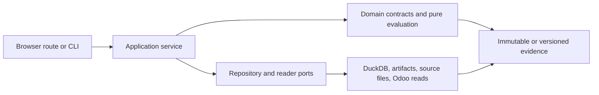
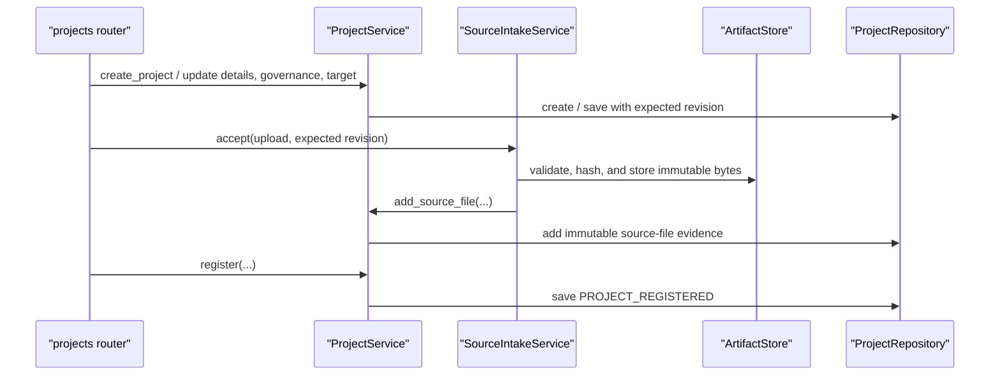
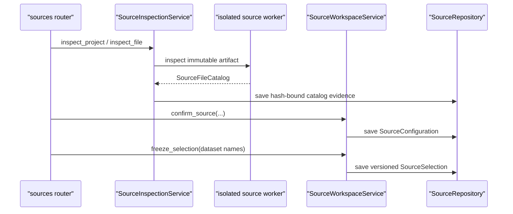
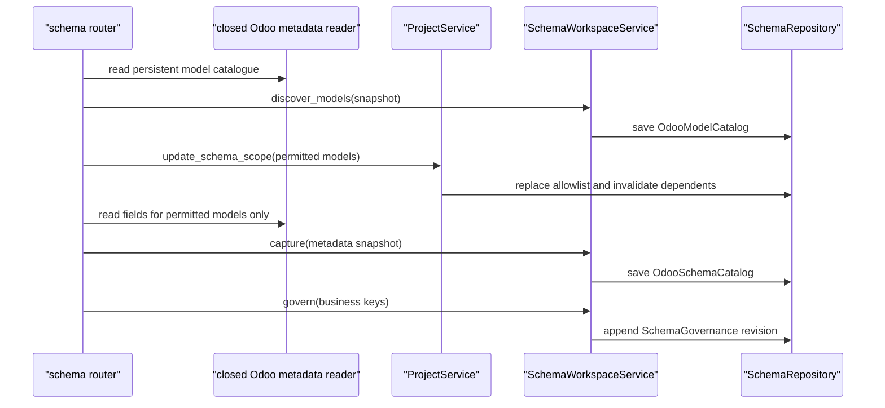
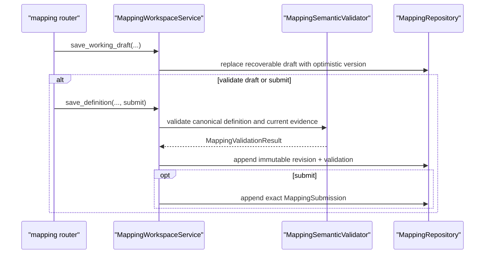
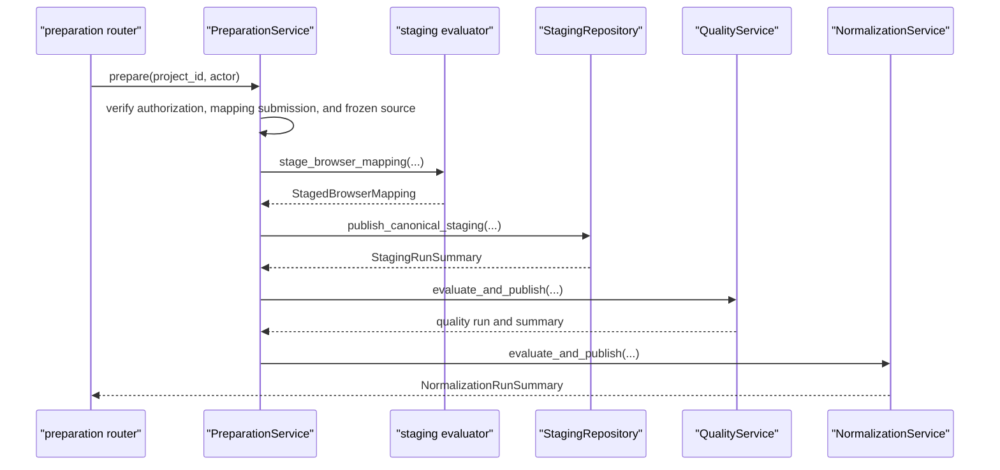
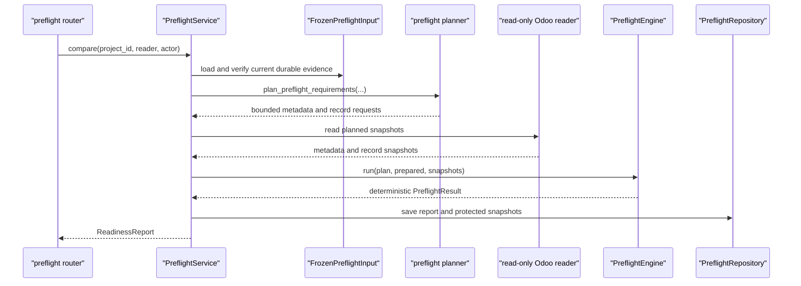

# Python code map

## Purpose

Use this map when entering `src/impodo/` from a browser action, CLI command,
Python module, class, or method. It identifies where orchestration starts, which
layer owns each decision, what evidence is produced, and what to open next.

This is a navigation aid. The [contracts](../README.md#contracts) remain
normative, and the
[data-quality and staging plan](../plans/data-quality-and-staging-plan.md)
records the current implementation boundary.

**Documentation rollout:** the advisory DOC-0 inventory is active and the
DOC-1 navigation spine now covers all six current journeys from project setup
through durable read-only preflight. DOC-2 and later phases deepen individual
domain families, ports, repositories, and algorithms.

## Read the layers from left to right



| Layer | Answers | Main locations |
| --- | --- | --- |
| Browser and CLI | What did the user ask Impodo to do? | [`web/routers/`](../../src/impodo/web/routers), [`web/app.py`](../../src/impodo/web/app.py), [`cli.py`](../../src/impodo/cli.py) |
| Application | In what order must use cases run, and what prerequisites apply? | [`application/`](../../src/impodo/application), plus the older root-level services |
| Domain | What do mappings, rows, issues, identities, relationships, decisions, and hashes mean? | [`domain/`](../../src/impodo/domain), [`models.py`](../../src/impodo/models.py), [`quality.py`](../../src/impodo/quality.py), [`normalization.py`](../../src/impodo/normalization.py), [`staging_contracts.py`](../../src/impodo/staging_contracts.py) |
| Ports | What must persistence or an external reader guarantee? | [`application/readiness_ports.py`](../../src/impodo/application/readiness_ports.py) and focused protocols beside services |
| Adapters | How are durable records, files, credentials, and bounded Odoo reads implemented? | [`adapters/duckdb/`](../../src/impodo/adapters/duckdb), [`artifacts.py`](../../src/impodo/artifacts.py), [`connectors.py`](../../src/impodo/connectors.py), [`local_odoo_reader.py`](../../src/impodo/local_odoo_reader.py) |
| Composition root | Which concrete implementations are connected for the local product? | [`web/app.py`](../../src/impodo/web/app.py), [`web/context.py`](../../src/impodo/web/context.py) |

Imports often cross several of these locations. Follow responsibility rather
than file depth: routes translate HTTP, services order the use case, domain
code defines meaning, and adapters own I/O.

## Documentation inventory

Run the advisory inventory from the repository root:

```console
python scripts/code_documentation_inventory.py
python scripts/code_documentation_inventory.py --missing
```

The first form summarizes coverage by package area. The second identifies
public symbols that need review. Missing text is not automatically a defect:
the documentation standard permits recorded exceptions for obvious accessors,
passive data carriers, and framework callbacks. The inventory is intended to
prioritize semantic gaps in services, ports, repositories, and domain
operations rather than reward repetitive docstrings.

## Migration-stage orientation

Product Stages A–K describe the business lifecycle. Delivery phases such as
Phase 2B describe when capabilities were built; they are not the same thing.

| Stage | Current boundary | First code to open |
| --- | --- | --- |
| A — Register a migration project | Implemented | [`projects.py`](../../src/impodo/projects.py), then [`web/routers/projects.py`](../../src/impodo/web/routers/projects.py) |
| B — Inspect source files | Implemented | [`intake.py`](../../src/impodo/intake.py), [`inspection.py`](../../src/impodo/inspection.py), and [`application/source_workspace_service.py`](../../src/impodo/application/source_workspace_service.py) |
| C — Discover the Odoo target schema | Implemented as read-only capture and governance | [`application/schema_workspace_service.py`](../../src/impodo/application/schema_workspace_service.py), then [`domain/schema/`](../../src/impodo/domain/schema) |
| D — Build and approve the mapping | Implemented through validated submission evidence; this is not import approval | [`application/mapping_workspace_service.py`](../../src/impodo/application/mapping_workspace_service.py), then [`domain/mapping/`](../../src/impodo/domain/mapping) and [`domain/compiler/`](../../src/impodo/domain/compiler) |
| E — Normalize and validate | Implemented for the bounded browser workflow | [`application/preparation_service.py`](../../src/impodo/application/preparation_service.py), then [`domain/staging/evaluator.py`](../../src/impodo/domain/staging/evaluator.py), [`quality.py`](../../src/impodo/quality.py), and [`normalization.py`](../../src/impodo/normalization.py) |
| F — Store canonical staging data | Implemented with immutable rows and current-run pointers | [`staging_contracts.py`](../../src/impodo/staging_contracts.py), then [`adapters/duckdb/staging_repository.py`](../../src/impodo/adapters/duckdb/staging_repository.py) |
| G — Resolve relationships | Implemented across mapping validation, prepared symbolic references, and preflight lookup resolution | [`domain/mapping/validation/`](../../src/impodo/domain/mapping/validation), [`derived_entities.py`](../../src/impodo/derived_entities.py), and [`engine.py`](../../src/impodo/engine.py) |
| H — Read-only target preflight | Implemented from approved durable rows and for strict CLI profiles | [`application/preflight_service.py`](../../src/impodo/application/preflight_service.py), [`domain/preflight/frozen_input.py`](../../src/impodo/domain/preflight/frozen_input.py), [`planner.py`](../../src/impodo/planner.py), and [`engine.py`](../../src/impodo/engine.py) |
| I — Freeze an approved import plan | Not integrated; standalone approval domain objects exist | [`approvals.py`](../../src/impodo/approvals.py) |
| J — Controlled Odoo execution | Not implemented; connectors are intentionally read-only | [`connectors.py`](../../src/impodo/connectors.py) for the boundary, not a writer |
| K — Reconcile after writes | Not implemented | Source/staging accounting must not be mistaken for post-write reconciliation |

## Local browser composition

[`create_local_app`](../../src/impodo/web/app.py) is the local composition
root. It constructs one concrete repository per persistence responsibility,
injects them into application services, stores those services in
[`WebContext`](../../src/impodo/web/context.py), and gives the same context to
every router.

`WebContext` is dependency wiring, not a domain aggregate. When starting from
a route such as `context.preparation.prepare(...)`, open the declared type of
`preparation` to find the use case. When starting from a service dependency
such as `self.staging`, open the matching protocol in
[`application/readiness_ports.py`](../../src/impodo/application/readiness_ports.py),
then the DuckDB implementation assembled in `create_local_app`.

## Stage A–D class and evidence families

The early workflow is easier to navigate as four evidence chains. A `current`
pointer selects active evidence; immutable/versioned objects remain history
when that pointer is invalidated or advanced.

| Stage | Main object family | Owner and organization |
| --- | --- | --- |
| A — Project | `MigrationProject` contains setup identity, governance, target, immutable `SourceFile` references, and lifecycle summaries | `ProjectService` applies lifecycle rules through the `ProjectRepository` port; DuckDB `ProjectRepository` owns registry/project transactions and downstream invalidation |
| B — Source | `SourceFile` → `SourceFileCatalog` → `SourceConfiguration` → versioned `SourceSelection` | `SourceIntakeService` owns compensated artifact intake; `SourceInspectionService` owns bounded inspection; `SourceWorkspaceService` owns confirmation/freezing; `SourceRepository` owns their current pointers |
| C — Schema | `OdooModelCatalog` → permitted-model scope → `OdooSchemaCatalog` → versioned `SchemaGovernance`/`BusinessKeyDefinition` | Closed readers create snapshots; `SchemaWorkspaceService` verifies target identity and meaning; `SchemaRepository` owns current catalogs plus immutable governance revisions |
| D — Mapping | recoverable `MappingWorkingDraft` → semantic `MappingDefinition` → immutable `MappingRevision` + `MappingValidationResult` → `MappingSubmission` | Nested mapping contracts describe datasets, identities, scalar providers, relationships, and totals; `MappingWorkspaceService` coordinates validation; `MappingRepository` owns optimistic draft/current/history pointers |

The important port-to-adapter connections are:

| Service-facing port | Local implementation | Used by |
| --- | --- | --- |
| `projects.ProjectRepository` | `adapters.duckdb.project_repository.ProjectRepository` | `ProjectService` |
| `ArtifactStore` | `LocalArtifactStore` | source intake/inspection and preflight report projections |
| `SourceCatalogRepository` and `SourceWorkspaceRepository` | `adapters.duckdb.source_repository.SourceRepository` | `SourceInspectionService`, `SourceWorkspaceService` |
| `DerivedEntityRepository` | `adapters.duckdb.derived_entity_repository.DerivedEntityRepository` | `DerivedEntityWorkspaceService` |
| `SchemaWorkspaceRepository` | `adapters.duckdb.schema_repository.SchemaRepository` | `SchemaWorkspaceService` |
| `MappingWorkspaceRepository` | `adapters.duckdb.mapping_repository.MappingRepository` | `MappingWorkspaceService` |

The protocols describe semantic guarantees and keep services independent of
DuckDB. `BrowserQueryService` is intentionally different: its small methods
are transparent read-only forwarders used by presenters and are a documented
coverage exception rather than independent business operations.

## Journey 1 — Register a project and its source files (Stage A)

### Outcome

The setup wizard creates a draft, records governance and target identity,
stores validated source bytes under generated names, and registers the project
only after every required fact exists. Registration freezes the editable setup
boundary; later workflow evidence remains independently versioned.



### Navigation chain

1. [`build_projects_router`](../../src/impodo/web/routers/projects.py) owns the
   setup wizard and translates each submitted page into one explicit service
   operation.
2. [`ProjectService`](../../src/impodo/projects.py) owns authorization,
   optimistic revision checks, editable-versus-registered lifecycle rules, and
   field validation. `registration_problems` returns every missing setup fact
   instead of failing on the first one.
3. [`SourceIntakeService.accept`](../../src/impodo/intake.py) validates the
   display name and format, streams the upload through isolated validation,
   hashes/stores it, and registers immutable `SourceFile` evidence. If project
   persistence fails, it deletes the newly stored artifact.
4. [`ProjectRepository`](../../src/impodo/adapters/duckdb/project_repository.py)
   keeps a lightweight registry and one project database/directory. Writes use
   expected revisions, append audit evidence, and refresh the registration
   manifest after registration.

Changing the target removes current schema governance and mapping pointers and
invalidates canonical staging. Changing project ownership/retention governance
invalidates current quality evidence. Adding source files invalidates canonical
staging; Stage B reinspection and freezing perform the more specific workspace
invalidations described next.

### Evidence and tests

```text
draft MigrationProject
-> immutable stored source bytes + SourceFile hashes
-> complete registered MigrationProject
-> project registry + registration manifest + audit events
```

Start verification in
[`tests/test_projects.py`](../../tests/test_projects.py) and the
`ProjectSetupWizardTests` section of
[`tests/test_web_app.py`](../../tests/test_web_app.py).

## Journey 2 — Inspect, confirm, and freeze datasets (Stage B)

### Outcome

Impodo inspects every registered CSV/XLSX in an isolated worker, records
hash-bound catalogs, requires explicit table/warning confirmation, and freezes
stable logical dataset/column identities for mapping. Registered source bytes
are never edited.



### Navigation chain

1. [`build_sources_router`](../../src/impodo/web/routers/sources.py) exposes the
   inspect, per-file configuration/confirmation, and dataset-freeze actions.
2. [`SourceInspectionService`](../../src/impodo/inspection.py) materializes
   registered artifacts and delegates parsing to the isolated source worker.
   The pure `inspect_source_file` implementation verifies bytes against the
   registered size/hash before reading their structure.
3. [`SourceWorkspaceService.confirm_source`](../../src/impodo/application/source_workspace_service.py)
   binds selected tables and acknowledged warnings to the exact catalog hash.
4. [`SourceWorkspaceService.freeze_selection`](../../src/impodo/application/source_workspace_service.py)
   requires every registered file to be confirmed and creates stable dataset
   and column keys plus a new content-hashed `SourceSelection` version.
5. [`SourceRepository`](../../src/impodo/adapters/duckdb/source_repository.py)
   persists catalogs, confirmations, and the current frozen selection.

Reinspection invalidates confirmations, the frozen selection, active derived
plan/mapping, and canonical staging. Reconfirmation invalidates the frozen
selection, active mapping, and staging. Refreezing invalidates the active
derived plan/mapping and staging. Historical immutable downstream revisions
remain history but are no longer current.

### Evidence and tests

```text
registered source bytes
-> SourceFileCatalog per file
-> SourceConfiguration per confirmed file
-> versioned, content-hashed SourceSelection
```

Start verification in
[`tests/test_inspection.py`](../../tests/test_inspection.py),
[`tests/test_workspace.py`](../../tests/test_workspace.py), and the source
workflow sections of [`tests/test_web_app.py`](../../tests/test_web_app.py).

## Journey 3 — Capture and govern the Odoo schema (Stage C)

### Outcome

Impodo discovers available persistent Odoo models, records an explicit model
allowlist, captures only those models through a closed read-only reader, and
confirms natural/business keys against the exact captured schema. An
acknowledged local manual draft can support experiments but cannot support
mapping submission.



### Navigation chain

1. [`build_schema_router`](../../src/impodo/web/routers/schema.py) chooses the
   configured local or remote reader, manages the explicit model scope, and
   translates captured values into service calls.
2. [`ProjectService.update_schema_scope`](../../src/impodo/projects.py) owns the
   exact Stage C model allowlist. A changed scope removes current schema,
   governance, mapping, and staging evidence.
3. [`SchemaWorkspaceService.discover_models`](../../src/impodo/application/schema_workspace_service.py)
   filters a complete target-bound `ir.model` snapshot into persistent model
   choices.
4. [`SchemaWorkspaceService.capture`](../../src/impodo/application/schema_workspace_service.py)
   requires a frozen source selection, exact permitted-model coverage, the
   configured target identity, and Odoo 19 metadata. `capture_local_manual`
   stores an explicitly unverified alternative for local drafting only.
5. [`SchemaWorkspaceService.govern`](../../src/impodo/application/schema_workspace_service.py)
   validates declared key/scope fields against the captured models and creates
   a new immutable governance revision.
6. [`SchemaRepository`](../../src/impodo/adapters/duckdb/schema_repository.py)
   owns current model/schema catalogs and versioned governance evidence.

Recapturing the schema invalidates current business-key governance, mapping,
and staging. Changing governed business keys invalidates current mapping and
staging. These invalidations ensure Stage D cannot silently reuse an earlier
target shape or identity policy.

### Evidence and tests

```text
target-bound OdooModelCatalog
-> explicit permitted-model scope
-> target-bound OdooSchemaCatalog
-> versioned SchemaGovernance with confirmed business keys
```

Start verification in
[`tests/test_workspace.py`](../../tests/test_workspace.py),
[`tests/test_business_keys.py`](../../tests/test_business_keys.py),
[`tests/test_local_odoo_reader.py`](../../tests/test_local_odoo_reader.py), and
the schema sections of [`tests/test_web_app.py`](../../tests/test_web_app.py).

## Journey 4 — Save, validate, and submit a mapping (Stage D)

### Outcome

The mapping workspace saves recoverable progress separately from immutable
semantic revisions. Validation binds a canonicalized mapping to the exact
effective source selection and governed schema. Submission requires a valid
live-schema revision plus acknowledgement of every current warning; it confirms
mapping evidence but is not normalization, package, or execution approval.



### Navigation chain

1. [`build_mapping_router`](../../src/impodo/web/routers/mapping.py) parses the
   mapping editor state. Its save route always preserves a working draft first,
   then optionally creates a checked revision or exact submission.
2. [`MappingWorkspaceService.save_working_draft`](../../src/impodo/application/mapping_workspace_service.py)
   stores incomplete recoverable work without claiming semantic validity.
3. [`MappingWorkspaceService.save_definition`](../../src/impodo/application/mapping_workspace_service.py)
   canonicalizes the full dataset mapping, invokes the validator, creates the
   next immutable revision, and enforces invalid/warning gates before optional
   submission.
4. [`MappingSemanticValidator`](../../src/impodo/domain/mapping/validation/validator.py)
   coordinates focused identity, scalar, relationship, dependency, and control-
   total validators and returns deterministic issues plus deferred runtime
   checks.
5. [`MappingRepository`](../../src/impodo/adapters/duckdb/mapping_repository.py)
   uses optimistic parent/draft versions and stores working drafts, immutable
   revisions, validation evidence, submissions, and audit events.

Creating a new immutable mapping revision invalidates canonical staging. A
submission is accepted only when its mapping content hash and validation hash
match stored evidence and its warning acknowledgements equal the current
warning set.

### Evidence and tests

```text
recoverable MappingWorkingDraft (unchecked)
-> immutable MappingRevision
-> deterministic MappingValidationResult
-> exact MappingSubmission (when valid and acknowledged)
```

Start verification in
[`tests/test_mapping_validation.py`](../../tests/test_mapping_validation.py),
[`tests/test_workspace.py`](../../tests/test_workspace.py), and the mapping
sections of [`tests/test_web_app.py`](../../tests/test_web_app.py).

## Journey 5 — Prepare and review data (Stages E–G)

### Outcome

The action reads the frozen source artifacts, evaluates the submitted mapping,
publishes canonical staging, evaluates quality, creates normalization review
evidence, and returns a summary. It performs no Odoo call.



### Navigation chain

1. [`build_preparation_router`](../../src/impodo/web/routers/preparation.py)
   handles `POST /projects/{project_id}/summary/check` and delegates blocking
   work to a thread pool.
2. [`PreparationService.prepare`](../../src/impodo/application/preparation_service.py)
   enforces the workflow order and owns the use-case transaction boundaries.
3. [`stage_browser_mapping`](../../src/impodo/application/preparation_service.py)
   materializes verified source tables, then calls the storage-independent
   [`evaluate_browser_mapping`](../../src/impodo/domain/staging/evaluator.py).
4. [`StagingRepository.publish_canonical_staging`](../../src/impodo/adapters/duckdb/staging_repository.py)
   atomically publishes immutable canonical rows and advances the current
   staging pointer. Changed content invalidates downstream evidence.
5. [`QualityService.evaluate_and_publish`](../../src/impodo/application/quality_service.py)
   creates the exact quality/quarantine overlay for that staging run.
6. [`NormalizationService.evaluate_and_publish`](../../src/impodo/application/normalization_service.py)
   creates grouped normalization review evidence. A later explicit approval
   freezes the eligible dataset; preparation itself does not contact Odoo.

### Evidence and tests

The important durable result chain is:

```text
submitted mapping + frozen source selection
-> canonical staging run
-> quality run and row dispositions
-> normalization run and review groups
-> explicit frozen eligible dataset
```

Start verification in
[`tests/test_readiness.py`](../../tests/test_readiness.py),
[`tests/test_staging_store.py`](../../tests/test_staging_store.py),
[`tests/test_quality.py`](../../tests/test_quality.py), and
[`tests/test_normalization.py`](../../tests/test_normalization.py).

## Journey 6 — Compare approved rows with Odoo (Stage H)

### Outcome

The action reloads and verifies the exact approved staging, quality, and
normalization evidence, plans bounded target reads, obtains read-only Odoo
snapshots, classifies each eligible prepared record, and publishes a readiness
report plus protected snapshot evidence. It never reloads source files or
writes to Odoo.



### Navigation chain

1. [`build_preflight_router`](../../src/impodo/web/routers/preflight.py) handles
   the compare action, creates a reader bound to the current project, and
   translates expected failures into a review response.
2. [`PreflightService.compare`](../../src/impodo/application/preflight_service.py)
   is the Stage H orchestrator. Its `_load_frozen_input` method refuses stale,
   incomplete, or unapproved source-side evidence before any reader call.
3. [`build_frozen_preflight_input`](../../src/impodo/domain/preflight/frozen_input.py)
   verifies all upstream hashes and adapts eligible canonical rows into the
   shared `PreparedBundle` contract without applying transformations again.
4. [`plan_preflight_requirements`](../../src/impodo/planner.py) merges and
   chunks model requirements. The service rejects any record request whose
   domain is empty, preventing an accidental unrestricted model scan.
5. [`_read_readiness_snapshots`](../../src/impodo/web/target_readers.py) selects
   the configured local or remote read-only adapter. It is the external I/O
   boundary supplied to the service as `reader`.
6. [`PreflightEngine.run`](../../src/impodo/engine.py) validates metadata,
   resolves symbolic references, builds target identity indexes, and emits
   portable classifications and differences.
7. [`PreflightRepository.save_readiness_report`](../../src/impodo/adapters/duckdb/preflight_repository.py)
   atomically binds the report to current upstream and target evidence.

If report publication fails after the manifest was written, the service tries
to remove that unpublished manifest so filesystem evidence cannot appear
current without the repository record.

### Evidence and tests

The important result chain is:

```text
frozen eligible dataset
-> compiled plan + bounded requirement plan
-> read-only metadata and record snapshots
-> portable preflight decisions
-> readiness report + technical manifest
-> optional review workbook projection
```

Start verification in
[`tests/test_preflight_service.py`](../../tests/test_preflight_service.py),
[`tests/test_engine.py`](../../tests/test_engine.py),
[`tests/test_connectors.py`](../../tests/test_connectors.py), and
[`tests/test_readiness.py`](../../tests/test_readiness.py).

## What to document next

The A–H navigation spine and DOC-2 Stage A–D depth are complete. DOC-3 now
deepens Stages E–G: compiled evaluation, canonical rows and lineage, staging
reconciliation/control totals, quality and quarantine, transformation impact,
normalization review, approval/freeze, and their repository ports. DOC-4 and
DOC-5 then deepen preflight and cross-cutting infrastructure without losing
these end-to-end journeys.
