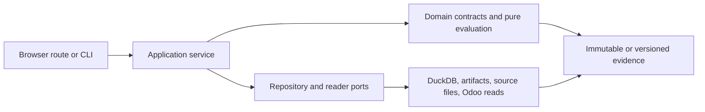
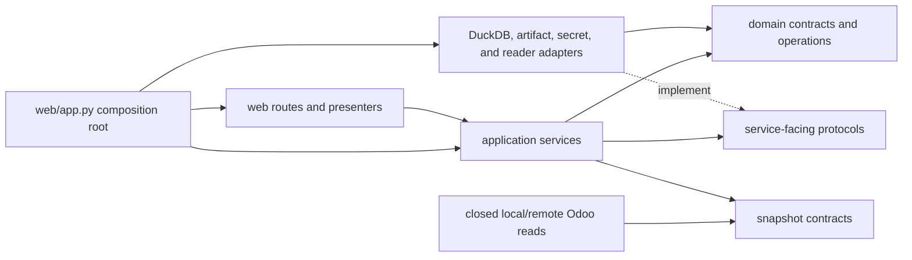
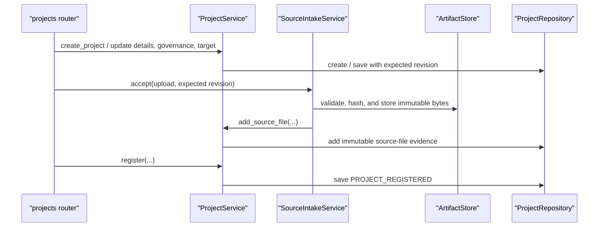
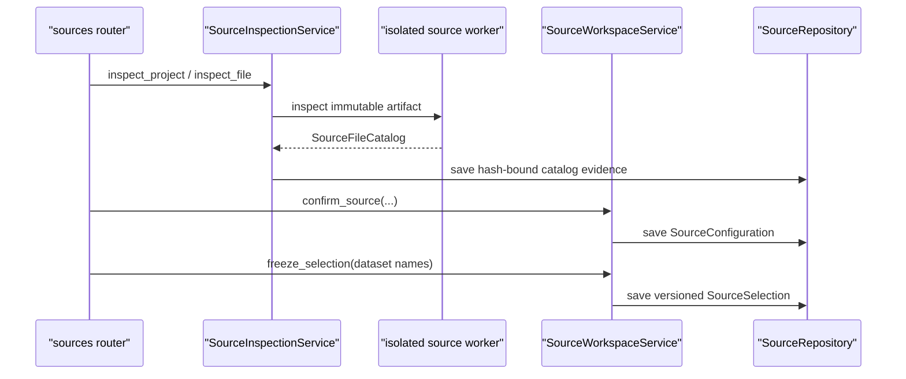
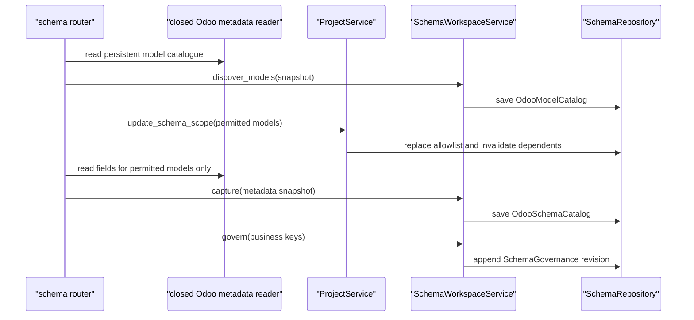
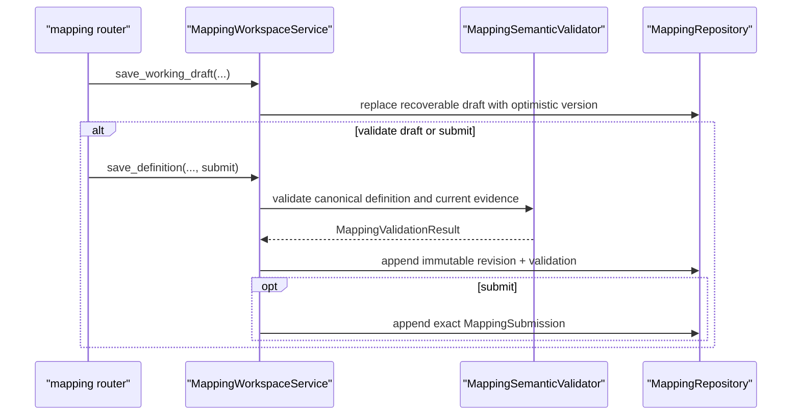
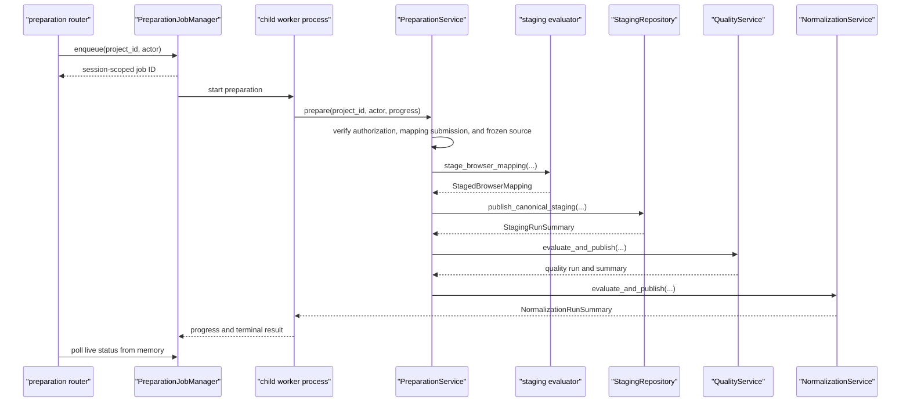
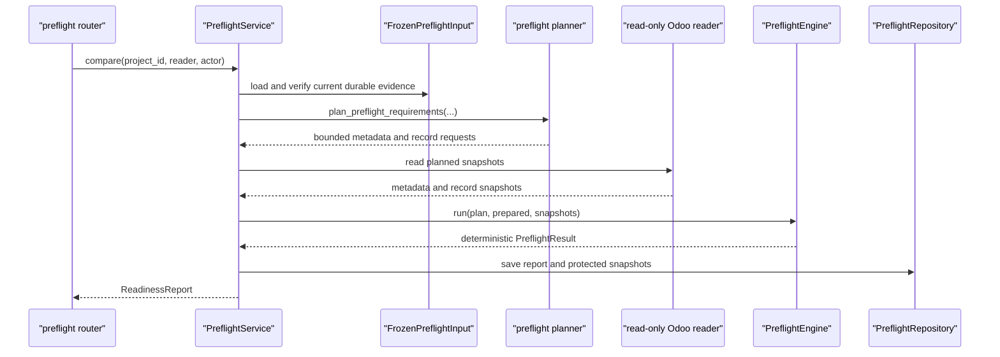

# Python code map

## Purpose

Use this map when entering `src/impodo/` from a browser action, CLI command,
Python module, class, or method. It identifies where orchestration starts, which
layer owns each decision, what evidence is produced, and what to open next.

This is a navigation aid. The [contracts](../README.md#contracts) remain
normative, and the
[data-quality and staging plan](../plans/data-quality-and-staging-plan.md)
records the current implementation boundary.

**Documentation rollout:** the advisory DOC-0 inventory is active; the DOC-1
navigation spine covers all six current journeys; and DOC-2 through DOC-5 now
deepen Stages A–H plus their cross-cutting security/persistence boundaries.

## Read the layers from left to right



| Layer | Answers | Main locations |
| --- | --- | --- |
| Browser and CLI | What did the user ask Impodo to do? | [`web/routers/`](../../src/impodo/web/routers), [`web/app.py`](../../src/impodo/web/app.py), [`cli.py`](../../src/impodo/cli.py) |
| Application | In what order must use cases run, and what prerequisites apply? | [`application/`](../../src/impodo/application), plus the older root-level services |
| Domain | What do mappings, rows, issues, identities, relationships, decisions, and hashes mean? | [`domain/`](../../src/impodo/domain), [`models.py`](../../src/impodo/models.py), [`quality.py`](../../src/impodo/quality.py), [`normalization.py`](../../src/impodo/normalization.py), [`staging_contracts.py`](../../src/impodo/staging_contracts.py) |
| Ports | What must persistence or an external reader guarantee? | [`application/readiness_ports.py`](../../src/impodo/application/readiness_ports.py) and focused protocols beside services |
| Adapters | How are durable records, files, credentials, and bounded Odoo reads implemented? | [`adapters/duckdb/`](../../src/impodo/adapters/duckdb), [`artifacts.py`](../../src/impodo/artifacts.py), [`connectors.py`](../../src/impodo/connectors.py), [`local_odoo_reader.py`](../../src/impodo/local_odoo_reader.py) |
| Composition root | Which concrete implementations are connected for the local product? | [`web/app.py`](../../src/impodo/web/app.py), [`web/context.py`](../../src/impodo/web/context.py) |

Imports often cross several of these locations. Follow responsibility rather
than file depth: routes translate HTTP, services order the use case, domain
code defines meaning, and adapters own I/O.

## Documentation inventory

Run the advisory inventory from the repository root:

```console
python scripts/code_documentation_inventory.py
python scripts/code_documentation_inventory.py --missing
python scripts/code_documentation_inventory.py --check
```

The first form summarizes coverage by package area. The second identifies
public symbols that need review. Missing text is not automatically a defect:
the documentation standard permits recorded exceptions for obvious accessors,
passive data carriers, and framework callbacks. The inventory is intended to
prioritize semantic gaps in services, ports, repositories, and domain
operations rather than reward repetitive docstrings.

``--check`` is the normal regression gate: it fails only when a package module
lacks its orientation docstring. ``tests/test_code_documentation.py`` exercises
the same rule during unit-test discovery and verifies deterministic advisory
output. Public-symbol gaps stay non-blocking until obvious accessors, passive
carriers, framework callbacks, and other intentional exceptions have a reviewed
baseline.

## Migration-stage orientation

Product Stages A–K describe the business lifecycle. Delivery phases such as
Phase 2B describe when capabilities were built; they are not the same thing.

| Stage | Current boundary | First code to open |
| --- | --- | --- |
| A — Register a migration project | Implemented | [`projects.py`](../../src/impodo/projects.py), then [`web/routers/projects.py`](../../src/impodo/web/routers/projects.py) |
| B — Inspect source files | Implemented | [`intake.py`](../../src/impodo/intake.py), [`inspection.py`](../../src/impodo/inspection.py), and [`application/source_workspace_service.py`](../../src/impodo/application/source_workspace_service.py) |
| C — Discover the Odoo target schema | Implemented as read-only capture and governance | [`application/schema_workspace_service.py`](../../src/impodo/application/schema_workspace_service.py), then [`domain/schema/`](../../src/impodo/domain/schema) |
| D — Build and approve the mapping | Implemented through validated submission evidence; this is not import approval | [`application/mapping_workspace_service.py`](../../src/impodo/application/mapping_workspace_service.py), then [`domain/mapping/`](../../src/impodo/domain/mapping) and [`domain/compiler/`](../../src/impodo/domain/compiler) |
| E — Normalize and validate | Implemented for the bounded browser workflow, including scoped advanced checks | [`application/preparation_service.py`](../../src/impodo/application/preparation_service.py), then [`domain/staging/evaluator.py`](../../src/impodo/domain/staging/evaluator.py), [`domain/coverage.py`](../../src/impodo/domain/coverage.py), [`quality.py`](../../src/impodo/quality.py), and [`normalization.py`](../../src/impodo/normalization.py) |
| F — Store canonical staging data | Implemented with immutable canonical and effective rows plus current-run pointers | [`staging_contracts.py`](../../src/impodo/staging_contracts.py), [`domain/resolution.py`](../../src/impodo/domain/resolution.py), then [`adapters/duckdb/staging_repository.py`](../../src/impodo/adapters/duckdb/staging_repository.py) and [`adapters/duckdb/advanced_coverage_repository.py`](../../src/impodo/adapters/duckdb/advanced_coverage_repository.py) |
| G — Resolve relationships | Implemented across mapping validation, structural preparation, exact references, reviewed duplicate resolution, and preflight lookup resolution | [`domain/mapping/validation/`](../../src/impodo/domain/mapping/validation), [`domain/structural.py`](../../src/impodo/domain/structural.py), [`application/resolution_service.py`](../../src/impodo/application/resolution_service.py), and [`engine.py`](../../src/impodo/engine.py) |
| H — Read-only target preflight | Implemented from approved durable rows and for strict CLI profiles | [`application/preflight_service.py`](../../src/impodo/application/preflight_service.py), [`domain/preflight/frozen_input.py`](../../src/impodo/domain/preflight/frozen_input.py), [`planner.py`](../../src/impodo/planner.py), and [`engine.py`](../../src/impodo/engine.py) |
| I — Freeze exact practical execution input | Implemented automatically after browser preflight; no extra certification or approval lifecycle | [`domain/execution_snapshot.py`](../../src/impodo/domain/execution_snapshot.py), emitted and revalidated by [`application/preflight_service.py`](../../src/impodo/application/preflight_service.py) |
| J — Controlled Odoo execution | Implemented for the narrow disposable-local master-data path; readers remain read-only | [`application/execution_service.py`](../../src/impodo/application/execution_service.py), [`odoo_writer.py`](../../src/impodo/odoo_writer.py), and [`web/routers/execution.py`](../../src/impodo/web/routers/execution.py) |
| K — Reconcile after writes | Implemented for the narrow disposable-local master-data path | [`application/reconciliation_service.py`](../../src/impodo/application/reconciliation_service.py), [`odoo_readback.py`](../../src/impodo/odoo_readback.py), and [`adapters/duckdb/reconciliation_repository.py`](../../src/impodo/adapters/duckdb/reconciliation_repository.py) |

## Local browser composition

[`create_local_app`](../../src/impodo/web/app.py) is the local composition
root. It constructs one concrete repository per persistence responsibility,
injects them into application services, stores those services in
[`WebContext`](../../src/impodo/web/context.py), and gives the same context to
every router.

`WebContext` is dependency wiring, not a domain aggregate. When starting from
a route such as `context.preparation.prepare(...)`, open the declared type of
`preparation` to find the use case. When starting from a service dependency
such as `self.staging`, open the matching protocol in
[`application/readiness_ports.py`](../../src/impodo/application/readiness_ports.py),
then the DuckDB implementation assembled in `create_local_app`.

## Cross-cutting ownership and dependency direction

Cross-cutting code owns one guarantee and is called from several stages. It
must not absorb workflow decisions from the services or domain:



The intended direction is from delivery/orchestration toward domain contracts.
Domain modules do not construct FastAPI routes, DuckDB repositories, secret
stores, or Odoo transports. `create_local_app` is the one local place allowed
to know all concrete implementations.

| Guarantee | Owner | How it connects to workflow code |
| --- | --- | --- |
| Command authorization and audit identity | [`access.py`](../../src/impodo/access.py) | Routes provide an `Actor`; application services call `AuthorizationPolicy.require` before governed access; repositories write stable issuer/subject identity in the same transaction as state changes. `PROJECT_ADMIN` is the explicit capability override. |
| Browser request security | [`web/security.py`](../../src/impodo/web/security.py) | Middleware constrains host, forwarding headers, unsafe-request origin, request size, and response headers. Route helpers independently require the launch-token session and CSRF token. This does not replace application authorization. |
| Project-root containment | [`project_security.py`](../../src/impodo/project_security.py) | Startup secures the root before database/artifact construction. Production policy rejects unsafe Windows locations/links and enforces protected DACLs, or owner-only POSIX permissions. |
| Source/report artifacts | [`artifacts.py`](../../src/impodo/artifacts.py) | `ArtifactStore` offers generated, project/run-contained operations rather than arbitrary path writes. Streaming is size-bounded; validation happens before atomic replacement; compensation removes unpublished files. |
| Target credentials | [`secrets.py`](../../src/impodo/secrets.py) | Routes retrieve credentials by opaque ID only at the target-reader boundary. Secrets stay in session memory and optionally the OS vault; they never enter project/domain/repository evidence. |
| Idempotent work | [`jobs.py`](../../src/impodo/jobs.py) | `JobRequest` binds actor/project/input hash to an idempotency key. The local dispatcher is synchronous but preserves queued/running/succeeded/failed transitions and future hosted-queue semantics. |
| Local Odoo lifecycle | [`local_stack.py`](../../src/impodo/local_stack.py) | The service keeps session-only status and exact process ownership. It reads an allowlisted non-secret config subset and may stop/restart only services this Impodo process started; external services are probed but never adopted. |
| Database boundary | [`adapters/duckdb/database.py`](../../src/impodo/adapters/duckdb/database.py) and [`unit_of_work.py`](../../src/impodo/adapters/duckdb/unit_of_work.py) | One hardened connection factory disables external access/extensions. Per-project UUID containment, migrations, explicit begin/commit/rollback, and shared unit-of-work scopes sit below all concrete repositories. |
| Schema evolution | [`adapters/duckdb/migrations/project.py`](../../src/impodo/adapters/duckdb/migrations/project.py) | New databases initialize at the current version; existing databases apply every monotonic migration in order. Semantic incompatibilities are retired explicitly rather than silently reused. |
| Evidence invalidation | [`adapters/duckdb/invalidation.py`](../../src/impodo/adapters/duckdb/invalidation.py) | Upstream writes retire dependent lifecycle state and remove only `current` pointers in the caller's transaction. Immutable historical evidence remains. The cascade follows staging/effective dataset → quality → normalization → preflight. |
| Serialization and hashing | [`models.py`](../../src/impodo/models.py), [`domain/serialization.py`](../../src/impodo/domain/serialization.py), and DuckDB [`serialization.py`](../../src/impodo/adapters/duckdb/serialization.py) | Portable values and canonical JSON make content identities deterministic. Repository serializers adapt fixed row shapes without redefining domain semantics; numeric Odoo IDs remain forbidden from portable artifacts. |
| Audit | [`adapters/duckdb/audit.py`](../../src/impodo/adapters/duckdb/audit.py) | Audit rows are appended inside the state-changing transaction, so a mutation and its actor evidence either commit or roll back together. |

### Error ownership and translation

Errors are grouped by where recovery belongs:

| Error family | Meaning | Translation point |
| --- | --- | --- |
| Domain/value `ValueError` subclasses | An immutable contract or pure operation received invalid evidence | Application services normally translate workflow-relevant cases; CLI `main` maps expected profile/value failures to stable exit codes. |
| `ProjectError` / `WorkspaceError` | A user-correctable lifecycle, stale-current, optimistic-concurrency, or governed-workspace problem | Browser routes catch these around one action and re-render the owning page with plain-language guidance. |
| `ReadinessError` | Preparation/preflight cannot safely progress, often before Odoo contact | Preparation/preflight routes return actionable review feedback; it is not treated as an unexpected server error. |
| Connector, artifact, secret, local-stack errors | A contained infrastructure boundary could not complete safely | The route owning that boundary catches its typed error and avoids exposing response bodies, credentials, raw filesystem capability, or arbitrary process controls. |
| Unexpected exceptions | Programming/infrastructure faults outside an expected recovery contract | They propagate; repositories/unit-of-work roll back and artifact-compensation blocks prevent partial publication. |

## Stage A–D class and evidence families

The early workflow is easier to navigate as four evidence chains. A `current`
pointer selects active evidence; immutable/versioned objects remain history
when that pointer is invalidated or advanced.

| Stage | Main object family | Owner and organization |
| --- | --- | --- |
| A — Project | `MigrationProject` contains setup identity, governance, target, immutable `SourceFile` references, and lifecycle summaries | `ProjectService` applies lifecycle rules through the `ProjectRepository` port; DuckDB `ProjectRepository` owns registry/project transactions and downstream invalidation |
| B — Source | `SourceFile` → `SourceFileCatalog` → `SourceConfiguration` → versioned `SourceSelection` | `SourceIntakeService` owns compensated artifact intake; `SourceInspectionService` owns bounded inspection; `SourceWorkspaceService` owns confirmation/freezing; `SourceRepository` owns their current pointers |
| C — Schema | `OdooModelCatalog` → permitted-model scope → `OdooSchemaCatalog` → versioned `SchemaGovernance`/`BusinessKeyDefinition` | Closed readers create snapshots; `SchemaWorkspaceService` verifies target identity and meaning; `SchemaRepository` owns current catalogs plus immutable governance revisions |
| D — Mapping | recoverable `MappingWorkingDraft` → semantic `MappingDefinition` → immutable `MappingRevision` + `MappingValidationResult` → `MappingSubmission` | Nested mapping contracts describe datasets, identities, scalar providers, relationships, and totals; `MappingWorkspaceService` coordinates validation; `MappingRepository` owns optimistic draft/current/history pointers |

The important port-to-adapter connections are:

| Service-facing port | Local implementation | Used by |
| --- | --- | --- |
| `projects.ProjectRepository` | `adapters.duckdb.project_repository.ProjectRepository` | `ProjectService` |
| `ArtifactStore` | `LocalArtifactStore` | source intake/inspection and preflight report projections |
| `SourceCatalogRepository` and `SourceWorkspaceRepository` | `adapters.duckdb.source_repository.SourceRepository` | `SourceInspectionService`, `SourceWorkspaceService` |
| `DerivedEntityRepository` | `adapters.duckdb.derived_entity_repository.DerivedEntityRepository` | `DerivedEntityWorkspaceService` |
| `SchemaWorkspaceRepository` | `adapters.duckdb.schema_repository.SchemaRepository` | `SchemaWorkspaceService` |
| `MappingWorkspaceRepository` | `adapters.duckdb.mapping_repository.MappingRepository` | `MappingWorkspaceService` |

The protocols describe semantic guarantees and keep services independent of
DuckDB. `BrowserQueryService` is intentionally different: its small methods
are transparent read-only forwarders used by presenters and are a documented
coverage exception rather than independent business operations.

## Journey 1 — Register a project and its source files (Stage A)

### Outcome

The setup wizard creates a draft, records governance and target identity,
stores validated source bytes under generated names, and registers the project
only after every required fact exists. Registration freezes the editable setup
boundary; later workflow evidence remains independently versioned.



### Navigation chain

1. [`build_projects_router`](../../src/impodo/web/routers/projects.py) owns the
   setup wizard and translates each submitted page into one explicit service
   operation.
2. [`ProjectService`](../../src/impodo/projects.py) owns authorization,
   optimistic revision checks, editable-versus-registered lifecycle rules, and
   field validation. `registration_problems` returns every missing setup fact
   instead of failing on the first one.
3. [`SourceIntakeService.accept`](../../src/impodo/intake.py) validates the
   display name and format, streams the upload through isolated validation,
   hashes/stores it, and registers immutable `SourceFile` evidence. If project
   persistence fails, it deletes the newly stored artifact.
4. [`ProjectRepository`](../../src/impodo/adapters/duckdb/project_repository.py)
   keeps a lightweight registry and one project database/directory. Writes use
   expected revisions, append audit evidence, and refresh the registration
   manifest after registration.

Changing the target removes current schema governance and mapping pointers and
invalidates canonical staging. Changing project ownership/retention governance
invalidates current quality evidence. Adding source files invalidates canonical
staging; Stage B reinspection and freezing perform the more specific workspace
invalidations described next.

### Evidence and tests

```text
draft MigrationProject
-> immutable stored source bytes + SourceFile hashes
-> complete registered MigrationProject
-> project registry + registration manifest + audit events
```

Start verification in
[`tests/test_projects.py`](../../tests/test_projects.py) and the
`ProjectSetupWizardTests` section of
[`tests/test_web_app.py`](../../tests/test_web_app.py).

## Journey 2 — Inspect, confirm, and freeze datasets (Stage B)

### Outcome

Impodo inspects every registered CSV/XLSX in an isolated worker, records
hash-bound catalogs, requires explicit table/warning confirmation, and freezes
stable logical dataset/column identities for mapping. Registered source bytes
are never edited.



### Navigation chain

1. [`build_sources_router`](../../src/impodo/web/routers/sources.py) exposes the
   inspect, per-file configuration/confirmation, and dataset-freeze actions.
2. [`SourceInspectionService`](../../src/impodo/inspection.py) materializes
   registered artifacts and delegates parsing to the isolated source worker.
   The pure `inspect_source_file` implementation verifies bytes against the
   registered size/hash before reading their structure.
3. [`SourceWorkspaceService.confirm_source`](../../src/impodo/application/source_workspace_service.py)
   binds selected tables and acknowledged warnings to the exact catalog hash.
4. [`SourceWorkspaceService.freeze_selection`](../../src/impodo/application/source_workspace_service.py)
   requires every registered file to be confirmed and creates stable dataset
   and column keys plus a new content-hashed `SourceSelection` version.
5. [`SourceRepository`](../../src/impodo/adapters/duckdb/source_repository.py)
   persists catalogs, confirmations, and the current frozen selection.

Reinspection invalidates confirmations, the frozen selection, active derived
plan/mapping, and canonical staging. Reconfirmation invalidates the frozen
selection, active mapping, and staging. Refreezing invalidates the active
derived plan/mapping and staging. Historical immutable downstream revisions
remain history but are no longer current.

### Evidence and tests

```text
registered source bytes
-> SourceFileCatalog per file
-> SourceConfiguration per confirmed file
-> versioned, content-hashed SourceSelection
```

Start verification in
[`tests/test_inspection.py`](../../tests/test_inspection.py),
[`tests/test_workspace.py`](../../tests/test_workspace.py), and the source
workflow sections of [`tests/test_web_app.py`](../../tests/test_web_app.py).

## Journey 3 — Capture and govern the Odoo schema (Stage C)

### Outcome

Impodo discovers available persistent Odoo models, records an explicit model
allowlist, captures only those models through a closed read-only reader, and
confirms natural/business keys against the exact captured schema. An
acknowledged local manual draft can support experiments but cannot support
mapping submission.



### Navigation chain

1. [`build_schema_router`](../../src/impodo/web/routers/schema.py) chooses the
   configured local or remote reader, manages the explicit model scope, and
   translates captured values into service calls.
2. [`ProjectService.update_schema_scope`](../../src/impodo/projects.py) owns the
   exact Stage C model allowlist. A changed scope removes current schema,
   governance, mapping, and staging evidence.
3. [`SchemaWorkspaceService.discover_models`](../../src/impodo/application/schema_workspace_service.py)
   filters a complete target-bound `ir.model` snapshot into persistent model
   choices.
4. [`SchemaWorkspaceService.capture`](../../src/impodo/application/schema_workspace_service.py)
   requires a frozen source selection, exact permitted-model coverage, the
   configured target identity, and Odoo 19 metadata. `capture_local_manual`
   stores an explicitly unverified alternative for local drafting only.
5. [`SchemaWorkspaceService.govern`](../../src/impodo/application/schema_workspace_service.py)
   validates declared key/scope fields against the captured models and creates
   a new immutable governance revision.
6. [`SchemaRepository`](../../src/impodo/adapters/duckdb/schema_repository.py)
   owns current model/schema catalogs and versioned governance evidence.

Recapturing the schema invalidates current business-key governance, mapping,
and staging. Changing governed business keys invalidates current mapping and
staging. These invalidations ensure Stage D cannot silently reuse an earlier
target shape or identity policy.

### Evidence and tests

```text
target-bound OdooModelCatalog
-> explicit permitted-model scope
-> target-bound OdooSchemaCatalog
-> versioned SchemaGovernance with confirmed business keys
```

Start verification in
[`tests/test_workspace.py`](../../tests/test_workspace.py),
[`tests/test_business_keys.py`](../../tests/test_business_keys.py),
[`tests/test_local_odoo_reader.py`](../../tests/test_local_odoo_reader.py), and
the schema sections of [`tests/test_web_app.py`](../../tests/test_web_app.py).

## Journey 4 — Save, validate, and submit a mapping (Stage D)

### Outcome

The mapping workspace saves recoverable progress separately from immutable
semantic revisions. Validation binds a canonicalized mapping to the exact
effective source selection and governed schema. Submission requires a valid
live-schema revision plus acknowledgement of every current warning; it confirms
mapping evidence but is not normalization, package, or execution approval.



### Navigation chain

1. [`build_mapping_router`](../../src/impodo/web/routers/mapping.py) parses the
   mapping editor state. Its save route always preserves a working draft first,
   then optionally creates a checked revision or exact submission.
2. [`MappingWorkspaceService.save_working_draft`](../../src/impodo/application/mapping_workspace_service.py)
   stores incomplete recoverable work without claiming semantic validity.
3. [`MappingWorkspaceService.save_definition`](../../src/impodo/application/mapping_workspace_service.py)
   canonicalizes the full dataset mapping, invokes the validator, creates the
   next immutable revision, and enforces invalid/warning gates before optional
   submission.
4. [`MappingSemanticValidator`](../../src/impodo/domain/mapping/validation/validator.py)
   coordinates focused identity, scalar, relationship, dependency, and control-
   total validators and returns deterministic issues plus deferred runtime
   checks.
5. [`MappingRepository`](../../src/impodo/adapters/duckdb/mapping_repository.py)
   uses optimistic parent/draft versions and stores working drafts, immutable
   revisions, validation evidence, submissions, and audit events.

Creating a new immutable mapping revision invalidates canonical staging. A
submission is accepted only when its mapping content hash and validation hash
match stored evidence and its warning acknowledgements equal the current
warning set.

### Evidence and tests

```text
recoverable MappingWorkingDraft (unchecked)
-> immutable MappingRevision
-> deterministic MappingValidationResult
-> exact MappingSubmission (when valid and acknowledged)
```

Start verification in
[`tests/test_mapping_validation.py`](../../tests/test_mapping_validation.py),
[`tests/test_workspace.py`](../../tests/test_workspace.py), and the mapping
sections of [`tests/test_web_app.py`](../../tests/test_web_app.py).

## Stage E–G class and evidence families

The product-stage names overlap in implementation, so follow the fixed evidence
order rather than assuming that each service creates only one stage's object:

| Pipeline step | Main object family | Connection to the next step |
| --- | --- | --- |
| Compile and evaluate | `CompiledMigrationPlan` + `PreparedBundle` → `StagedBrowserMapping` | The evaluator applies the submitted mapping to every frozen row and assembles the portable staging contract without storage or Odoo access. |
| Canonical staging | `CanonicalLineage` + `CanonicalRow` + dataset/run reconciliation + control totals → `CanonicalStagingRun`/`StagingRunSummary` | Row identities, proposed values, symbolic references, issues, and physical-source links become immutable Stage-E evidence. Its published content hash is the input identity for quality. |
| Transformation impact | streamed `TransformationImpactRow` → `TransformationImpactReport`/`TransformationImpactSnapshot` | This is a filterable before/after projection of the same evaluation, not a second transformation pass with different semantics. Its identity binds physical/effective sources, mapping, schema, derived plan, and evaluator versions. |
| Quality and quarantine | `QualityRuleSet` + canonical run → `QualityIssue`, `QualityRowResult`, `SourceAccountingEntry`, `QuarantineEntry` → `QualityRun`/summary | The quality overlay preserves canonical rows but decides which IDs remain eligible. Accounting proves every physical row is represented or explicitly set aside. The quality content hash feeds normalization. |
| Normalization review | impact candidates + staging/quality → `NormalizationEffect` → `NormalizationReviewGroup` → `NormalizationEvaluation` | Effects explain individual field changes; groups collapse them into stable business decisions. Restricted projects mask displayed examples. |
| Decide and freeze | review groups → `CorrectionImpact`/`CorrectionDecision` in `DryRun` → `NormalizationRunSummary` | Optimistic lifecycle versions protect concurrent decisions. Final approval freezes `eligible_dataset_hash`, the exact canonical rows Stage H may consume. |

The service-facing persistence connections are:

| Service-facing port | Local implementation | Durable responsibility |
| --- | --- | --- |
| `PreparationStagingRepository` / `CanonicalStagingRepository` | `adapters.duckdb.staging_repository.StagingRepository` | Verify current submitted inputs, batch-store immutable canonical evidence, advance the staging pointer, and invalidate downstream quality when content changes. |
| `QualityRepository` | `adapters.duckdb.quality_repository.QualityRepository` | Version rulesets; publish full row/accounting/quarantine overlays; advance quality pointers; invalidate normalization when rules or results change. |
| `TransformationImpactRepository` | `adapters.duckdb.transformation_impact_repository.TransformationImpactRepository` | Stream and atomically replace the filterable impact snapshot for one exact input identity. |
| `NormalizationRepository` | `adapters.duckdb.normalization_repository.NormalizationRepository` | Store immutable effects/groups, version decisions with optimistic concurrency, and freeze the eligible-dataset identity after approval. |

Content hashes form a forward-only evidence chain. Changing a submitted mapping,
frozen selection, derived plan, quality ruleset, or project retention/ownership
context retires the affected current pointer and requires downstream evidence to
be regenerated; historical immutable runs remain audit history.

## Journey 5 — Prepare and review data (Stages E–G)

### Outcome

The action reads the frozen source artifacts, evaluates the submitted mapping,
publishes canonical staging, evaluates quality, creates normalization review
evidence, and returns a summary. It performs no Odoo call.



### Navigation chain

1. [`build_preparation_router`](../../src/impodo/web/routers/preparation.py)
   handles `POST /projects/{project_id}/summary/check`, registers the work for
   the current application session, and immediately redirects to a progress
   page.
2. [`PreparationJobManager`](../../src/impodo/application/preparation_job_service.py)
   supervises a child process, cancellation, retry, and crash completion. Its
   small progress snapshots stay in application memory while the worker writes
   project DuckDB. The local default runs one heavy worker at a time so
   concurrent projects do not multiply the preparation RAM peak; later jobs
   remain queued for this application session. Restarting Impodo clears these
   transient snapshots without affecting completed evidence in DuckDB.
3. [`PreparationService.prepare`](../../src/impodo/application/preparation_service.py)
   enforces the workflow order and owns the use-case transaction boundaries.
4. [`stage_browser_mapping`](../../src/impodo/application/preparation_service.py)
   materializes verified source tables, then calls the storage-independent
   [`evaluate_browser_mapping`](../../src/impodo/domain/staging/evaluator.py).
5. [`StagingRepository.publish_canonical_staging`](../../src/impodo/adapters/duckdb/staging_repository.py)
   atomically publishes immutable canonical rows and advances the current
   staging pointer. Changed content invalidates downstream evidence.
6. [`QualityService.evaluate_and_publish`](../../src/impodo/application/quality_service.py)
   creates the exact quality/quarantine overlay for that staging run.
7. [`NormalizationService.evaluate_and_publish`](../../src/impodo/application/normalization_service.py)
   creates grouped normalization review evidence. A later explicit approval
   freezes the eligible dataset; preparation itself does not contact Odoo.

### Evidence and tests

The important durable result chain is:

```text
submitted mapping + frozen source selection
-> canonical staging run
-> quality run and row dispositions
-> normalization run and review groups
-> explicit frozen eligible dataset
```

Start verification in
[`tests/test_readiness.py`](../../tests/test_readiness.py),
[`tests/test_staging_store.py`](../../tests/test_staging_store.py),
[`tests/test_quality.py`](../../tests/test_quality.py), and
[`tests/test_normalization.py`](../../tests/test_normalization.py).

## Stage H class, read, and evidence families

Stage H has two entry paths that converge on one comparison core:

| Concern | Submitted browser-mapping path | Strict profile/CLI path | Shared downstream code |
| --- | --- | --- | --- |
| Prepared input | `PreflightService._load_frozen_input` reloads submitted mapping, canonical staging, quality, and frozen normalization evidence; `build_frozen_preflight_input` verifies hashes/lifecycles and adapts eligible canonical rows without transforming again. | `load_profile` → `compile_profile_document` → `prepare_sources` rebuilds typed rows from the declared source package; saved snapshots are bound to profile/source hashes. | Both supply a `CompiledMigrationPlan` and `PreparedBundle`. |
| Read planning | `plan_preflight_requirements` uses only frozen eligible rows. | `plan_metadata_requests` and `plan_record_requests` use strict-profile prepared rows. | `MetadataRequest`, `RecordRequest`, and `PreflightRequirementPlan` contain sorted fields plus key-derived domains chunked at the safety limit. Empty/unrestricted record domains are rejected before target I/O. |
| Target capture | `_read_readiness_snapshots` chooses a fixed local shell reader or closed remote JSON-2 reader from project configuration. | Snapshot commands use `OdooReadConnector`; offline preflight uses `SnapshotConnector`. | Connectors expose only target fingerprint, metadata reads, and record reads. Metadata and record snapshots must share one fingerprint and receive deterministic content hashes. |
| Validation and lookup | Browser verifies the exact planned snapshot projection and configured target identity before the engine. | Snapshot binding verifies profile/source provenance before the engine. | `validate_plan_metadata` checks required model/field semantics; `TargetCatalog` indexes captured rows and contains numeric Odoo IDs; `_resolve_records` emits portable `BusinessReference` values and grouped `ReferenceResolution` evidence. |
| Comparison | Same engine. | Same engine. | `PreflightEngine.run` applies blocking precedence, indexes target business identities, then emits `Decision` classifications: `BLOCKED`, `AMBIGUOUS`, `CREATE`, `UPDATE`, or `UNCHANGED`, with portable `FieldDifference` evidence. |
| Output | `_readiness_report` projects decisions; `PreflightRepository` atomically stores the header, paged rows, protected snapshots, current pointer, and audit event. `PreflightService` also generates the practical `ExecutionSnapshot` automatically beside the technical manifest; the workbook is a disposable projection. | `write_preflight_outputs` writes the portable manifest and workbook directly; it does not create browser lifecycle records. | `PreflightResult` is the canonical portable comparison result. `ExecutionSnapshot` binds every row disposition and exact create/update field intentions for the practical writer. Numeric Odoo IDs may exist in protected target snapshots but are recursively forbidden from portable manifests, reports, and execution snapshots. |

The browser evidence chain is:

```text
FrozenPreflightInput
-> PreflightRequirementPlan
-> MetadataSnapshot + RecordSnapshot (protected)
-> PreflightResult (portable)
-> ReadinessReport header + paged ReadinessRow records
-> technical manifest + optional review workbook projection
```

Important boundaries when navigating:

- `PreflightService.compare` is the only browser service operation allowed to
  call the supplied target reader. `_load_frozen_input` and request-domain
  checks run first.
- `connectors.py` is a closed read surface: remote JSON-2 supports the planned
  `fields_get` and `search_read` operations, while the local reader runs only
  fixed scripts and relies on transaction rollback.
- `TargetCatalog` is the numeric-ID containment boundary. Engine decisions use
  governed business keys and source trace IDs.
- `reporting.py` projects canonical portable results. The workbook is never an
  input to classification, approval, or persistence.

## Practical Stages I–K

The practical path freezes Stage-H evidence automatically and can load its
narrow, disposable-local master-data scope, then reads the written records
back. Optional production approval remains a separate later boundary:

| Stage | Code that exists now | Remaining boundary |
| --- | --- | --- |
| I — Freeze exact execution input | [`domain/execution_snapshot.py`](../../src/impodo/domain/execution_snapshot.py) automatically adapts frozen prepared rows and Stage-H decisions into a portable, row-hashed artifact. The database-bound preflight manifest anchors its semantic hash. [`approvals.py`](../../src/impodo/approvals.py) still defines standalone higher-governance approval values. | The practical snapshot needs no separate approval; the user will confirm **Load** in Stage J. Clean-package certification, dual approval, expiry, and signed grants remain unintegrated optional controls for higher-risk targets. |
| J — Controlled Odoo execution | [`application/execution_service.py`](../../src/impodo/application/execution_service.py) validates the current snapshot and orders writes; [`odoo_writer.py`](../../src/impodo/odoo_writer.py) owns the separate closed JSON-2 write surface; [`adapters/duckdb/execution_repository.py`](../../src/impodo/adapters/duckdb/execution_repository.py) journals every proposed write; and the load route/template expose one explicit action and saved outcome. | Limited to Local Odoo 19, contacts/categories/products, creates, explicit updates, simple many2one relationships, and batches of at most 50. It is not production cutover or a generic writer. |
| K — Post-write reconciliation | [`application/reconciliation_service.py`](../../src/impodo/application/reconciliation_service.py) binds a completed run to its historical snapshot, [`odoo_readback.py`](../../src/impodo/odoo_readback.py) exposes only exact-ID and exact-key `search_read`, and [`adapters/duckdb/reconciliation_repository.py`](../../src/impodo/adapters/duckdb/reconciliation_repository.py) atomically stores the hash-bound result. The load page shows the plain result and serves fallout CSV. | Committed rows are checked by journaled ID; uncertain responses are re-matched by business key. Only an absent uncertain create is marked safe to plan again. There is no blind replay, automatic rollback, or production closure workflow. |

Stage K deliberately uses a separate read-back service and reconciliation
evidence rather than broadening the writer or repurposing readiness reports.

## Journey 6 — Compare approved rows with Odoo (Stage H)

### Outcome

The action reloads and verifies the exact approved staging, quality, and
normalization evidence, plans bounded target reads, obtains read-only Odoo
snapshots, classifies each eligible prepared record, and publishes a readiness
report plus protected snapshot evidence. It never reloads source files or
writes to Odoo.



### Navigation chain

1. [`build_preflight_router`](../../src/impodo/web/routers/preflight.py) handles
   the compare action, creates a reader bound to the current project, and
   translates expected failures into a review response.
2. [`PreflightService.compare`](../../src/impodo/application/preflight_service.py)
   is the Stage H orchestrator. Its `_load_frozen_input` method refuses stale,
   incomplete, or unapproved source-side evidence before any reader call.
3. [`build_frozen_preflight_input`](../../src/impodo/domain/preflight/frozen_input.py)
   verifies all upstream hashes and adapts eligible canonical rows into the
   shared `PreparedBundle` contract without applying transformations again.
4. [`plan_preflight_requirements`](../../src/impodo/planner.py) merges and
   chunks model requirements. The service rejects any record request whose
   domain is empty, preventing an accidental unrestricted model scan.
5. [`_read_readiness_snapshots`](../../src/impodo/web/target_readers.py) selects
   the configured local or remote read-only adapter. It is the external I/O
   boundary supplied to the service as `reader`.
6. [`PreflightEngine.run`](../../src/impodo/engine.py) validates metadata,
   resolves symbolic references, builds target identity indexes, and emits
   portable classifications and differences.
7. [`PreflightRepository.save_readiness_report`](../../src/impodo/adapters/duckdb/preflight_repository.py)
   atomically binds the report to current upstream and target evidence.

If report publication fails after the manifest was written, the service tries
to remove that unpublished manifest so filesystem evidence cannot appear
current without the repository record.

### Evidence and tests

The important result chain is:

```text
frozen eligible dataset
-> compiled plan + bounded requirement plan
-> read-only metadata and record snapshots
-> portable preflight decisions
-> readiness report + technical manifest
-> optional review workbook projection
```

Start verification in
[`tests/test_preflight_service.py`](../../tests/test_preflight_service.py),
[`tests/test_engine.py`](../../tests/test_engine.py),
[`tests/test_connectors.py`](../../tests/test_connectors.py), and
[`tests/test_readiness.py`](../../tests/test_readiness.py).

## What to document next

The initial DOC-0 through DOC-6 rollout is complete. Documentation is now a
continuous part of workflow changes: update the owning module/class/method
docstrings, stage/evidence map, contract or active plan, and focused tests when
a connection, prerequisite, side effect, invalidation, or implementation
status changes. Use the advisory missing-symbol report during review and keep
the module-docstring check in normal verification.
