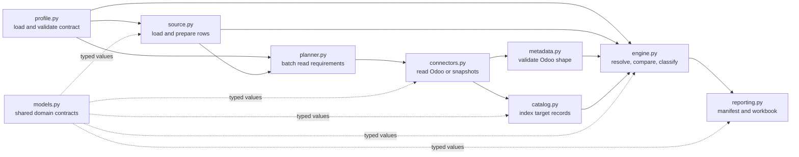

# Python module connections

## 1. Purpose

This guide explains how the profiler's main Python modules cooperate. It is a
navigation map for reading the code; the docstrings inside each module explain
the individual classes, functions, parameters, return values, and failure
conditions.

The current pipeline is read-only. Odoo supplies metadata and target records,
but none of these modules creates or updates an Odoo record.

## 2. End-to-end call flow



At runtime, the CLI connects these modules in this order:

```python
profile = load_profile(profile_path)
prepared = prepare_sources(profile, input_directory)

metadata_requests = plan_metadata_requests(profile)
record_requests = plan_record_requests(profile, prepared.records)

metadata = connector.get_model_metadata(metadata_requests)
records = connector.get_records(record_requests)

result = PreflightEngine().run(profile, prepared, metadata, records)
manifest_path, workbook_path = write_preflight_outputs(result, output_directory)
```

The actual CLI separates live capture from offline replay, but both paths
produce the same `MetadataSnapshot` and `RecordSnapshot` contracts.

## 3. Responsibility of each module

| Module | Main responsibility | Receives | Produces |
| --- | --- | --- | --- |
| `profile.py` | Validate the YAML mapping and dependency graph | YAML file | `ProfileDocument` |
| `source.py` | Safely read CSV/XLSX and type each source row | Profile and source directory | `PreparedBundle` |
| `planner.py` | Merge row/profile requirements into batched Odoo reads | Profile and prepared records | Metadata/record requests |
| `connectors.py` | Fulfil read requests from JSON-2 or saved JSON | Planned requests | Metadata/record snapshots |
| `metadata.py` | Check that the profile agrees with Odoo's model schema | Profile and metadata snapshot | Issues and coverage |
| `catalog.py` | Index captured targets and decode relation IDs | Target records | Fast lookups and business references |
| `engine.py` | Resolve references, match targets, compare, classify | Profile, prepared bundle, both snapshots | `PreflightResult` |
| `models.py` | Define immutable data exchanged between layers | Typed constructor values | Domain/evidence objects |
| `reporting.py` | Project the completed result into review artifacts | `PreflightResult` | Canonical JSON and XLSX |

## 4. Detailed connections

### `profile.py` starts the contract

`load_profile()` parses YAML into strict Pydantic models. `ProfileDocument`
validates unique dataset names, incoming-dataset references, resolver key
arity, and dependency cycles. Downstream code can therefore use
`profile.dataset(name)` without repeating profile-shape validation.

The other modules use different parts of the same contract:

- `source.py` uses source files, mappings, normalization, identities, and
  relation definitions;
- `planner.py` uses target models, fields, resolvers, and domains;
- `metadata.py` checks those declarations against Odoo;
- `engine.py` applies target modes, comparison rules, and missing/ambiguous
  policies.

### `source.py` creates portable prepared records

`load_source_tables()` validates file containment and safely parses CSV/XLSX.
`prepare_sources()` calls `_prepare_row()` for every row. Scalar mappings use
the shared canonical parsers; relations and resolved identity components
become `LogicalReference` objects.

A `PreparedRecord` intentionally contains no Odoo numeric ID. It is a portable
description of the source row and the business identities it wants to use.
`_mark_duplicate_source_identities()` indexes all prepared rows once and
attaches an issue to every duplicate.

### `planner.py` prevents per-row Odoo calls

`plan_metadata_requests()` collects the complete field set per model.
`plan_record_requests()` additionally inspects prepared identities and logical
references to build safe target domains.

Both functions merge requirements by model. As a result, the connector calls
`fields_get` once per model and `search_read` once per model/page, rather than
once per source row or field. Composite identities fall back to the declared
profile domain when they cannot be narrowed safely.

### `connectors.py isolates transport and replay

`OdooReadConnector` is the three-method port consumed by the workflow:

```text
get_target_fingerprint
get_model_metadata
get_records
```

`Json2ReadConnector` implements it against Odoo 19 JSON-2. Its internal
dispatcher allowlists only `fields_get` and `search_read`. Record reads use
deterministic `id asc` pagination and reject repeated IDs across pages.

`SnapshotConnector` implements the same port from JSON files. Snapshot writers
bind evidence to the profile, source hashes, and target fingerprint.
This makes live capture replaceable by deterministic offline replay without
changing the engine.

### `metadata.py checks the profile before comparison

`validate_profile_metadata()` verifies requested models, fields, scalar types,
relation kinds, related models, readonly status, and relation inverse fields.
It returns issues plus coverage counts.

`PreflightEngine.run()` calls this validator before classification and applies
its dataset issues to all affected prepared rows. Schema disagreement
therefore blocks decisions instead of producing a misleading comparison.

### `catalog.py keeps numeric IDs inside the target boundary

`TargetCatalog` builds model and ID indexes once. `find_by_fields()` lazily
builds business-key indexes and preserves all matches, including duplicates.
This gives the engine constant-time repeated lookup after the first index
build and prevents an N+1 scan over target records.

`reference_from_id()` uses `relation_id()` or `relation_ids()` to decode Odoo
relation shapes, then returns a `BusinessReference`. Numeric IDs do not appear
in portable decisions or reports.

### `engine.py owns decision semantics

`PreflightEngine.run()` is the central orchestrator. It:

1. verifies that both snapshots describe the same exact target;
2. validates metadata;
3. creates the target catalog;
4. resolves incoming and target-only logical references;
5. builds a canonical identity/scope index for each actionable dataset;
6. classifies every row; and
7. groups issues and resolution evidence deterministically.

`_resolve_records()` may recursively resolve an incoming dependency, but its
cache ensures each dataset/row pair is resolved once. `_build_target_index()`
canonicalizes each captured target once. `_classify_record()` then applies the
fixed precedence: blocked, ambiguous, create, update, or unchanged.

For a unique target match, `_compare_record()` normalizes source and target
scalars using the same rule. It converts existing Odoo relations to business
references before `_relation_difference()` applies many2one null policy or
many2many replace/add/remove semantics.

### `models.py is the common language

The modules exchange immutable dataclasses from `models.py` rather than raw
dictionaries. Important boundaries are:

- `PreparedRecord`: typed source row with unresolved/resolved business values;
- `TargetRecord`: target-database-specific captured Odoo row, including its ID;
- `LogicalReference`: a lookup still to perform;
- `BusinessReference`: a resolved, portable relation;
- `Issue` and `ReferenceResolution`: validation and lookup evidence;
- `Decision` and `FieldDifference`: the result for one source row;
- `PreflightResult`: the complete reportable run.

`PreflightResult.to_portable_dict()` is the security boundary for output. It
uses `assert_no_numeric_odoo_ids()` to reject prohibited numeric-ID field
names before serialization.

### `reporting.py is a projection, not a decision maker

`write_preflight_outputs()` converts the completed result to canonical JSON,
writes the manifest, and builds the XLSX review workbook from that manifest.
It does not resolve references or reclassify rows. `read_manifest()` verifies
the stored semantic hash when a manifest is read again.

Keeping reporting downstream of `PreflightResult` means JSON and Excel show
the same decisions and evidence.

## 5. Data contracts at each boundary

```text
YAML
  -> ProfileDocument
CSV/XLSX + ProfileDocument
  -> SourceTable
  -> PreparedBundle[PreparedRecord, Issue, source hashes]
ProfileDocument + PreparedRecord
  -> MetadataRequest / RecordRequest
Connector reads
  -> MetadataSnapshot / RecordSnapshot[TargetRecord]
Engine
  -> PreflightResult[Decision, FieldDifference, Issue, ReferenceResolution]
Reporting
  -> manifest.json + review.xlsx
```

Only `TargetRecord` and the private catalog indexes carry numeric Odoo IDs.
Prepared data, business references, decisions, and reports remain
target-independent.

## 6. Performance and Odoo blind spots to watch

The present design avoids the most common N+1 mistakes:

- request fields and domains are merged per Odoo model;
- live records are retrieved by page, not by source row;
- source duplicates are found with a dictionary index;
- catalog business-key indexes are cached by model/field tuple;
- incoming dependency resolution is cached by dataset/source row;
- target identity indexes are built once per actionable dataset.

Future work should preserve these boundaries. In particular, browser previews,
DuckDB persistence, and eventual Odoo import code should not perform
`search_read`, `browse`, `create`, or `write` inside a row loop. Large
single-field `in` domains will eventually need bounded request chunks, while
composite keys need a deliberate batching strategy that does not broaden
access silently.

## 7. Connection to normalization governance

The modules in this guide implement source preparation and read-only Odoo
preflight. The separate
[normalization governance](normalization-governance.md) layer covers dry-run
correction review, manager approval, and freezing a canonical dataset before
this pipeline.

The intended future sequence is:

```text
raw source
-> normalization/validation dry run
-> manager-approved frozen canonical dataset
-> read-only Odoo preflight
-> review artifacts
```

Approval of normalization does not grant permission to write to Odoo.
