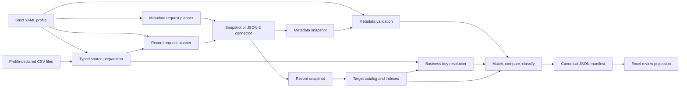

# Read-only Odoo preflight architecture

## 1. Purpose and status

This proof of concept answers one question without changing Odoo:

> Given a CSV source package, mapping profile, and specific target
> snapshots, what would be created or changed, what is already equal, and what
> cannot be decided safely?

The implementation produces review evidence only. It has a complete
fixture-backed path and an Odoo 19 JSON-2 read adapter. Live UC DEV/TEST
validation, Odoo-side ACL evidence, and the larger sanitized acceptance slice
remain external acceptance gates.

## 2. Scope

Implemented:

- strict YAML profile loading;
- CSV source ingestion;
- typed source preparation;
- environment-independent prepared records;
- composite and relational target identities;
- company/site/parent-style scoped identity;
- incoming-dataset and target-only relation resolution;
- profile-derived metadata and record requests;
- normalized fixture snapshots;
- live Odoo 19 JSON-2 `fields_get` and `search_read`;
- scalar, many2one, and many2many comparison;
- `CREATE`, `UPDATE`, `UNCHANGED`, `AMBIGUOUS`, and `BLOCKED`;
- exact field differences;
- grouped issue and reference evidence;
- portable JSON and a twelve-sheet Excel workbook.

Not implemented:

- XLSX source ingestion;
- Odoo versions before 19;
- production access;
- create, write, unlink, import, generic RPC, or SQL;
- approval signatures or an executable import plan;
- requirements-plan hashing in snapshots;
- full JSON Schema validation of snapshot envelopes;
- write retry, reconciliation, rollback, or SharePoint automation.

The future sequence remains:

```text
read-only preflight
→ approval manifest
→ environment-independent import plan
→ separately reviewed restricted executor
→ retry and reconciliation
→ SharePoint workflow
```

Every arrow is a separate architecture and security review gate.

## 3. Non-negotiable invariants

1. **Read-only by capability.** The connector protocol exposes only
   fingerprint, metadata, and record reads.
2. **No generic live call.** The JSON-2 adapter allowlists only `fields_get`
   and `search_read`.
3. **Portable prepared data.** A `PreparedRecord` contains no target numeric
   ID, URL, database name, or credential.
4. **Typed values survive validation.** Parsing produces the values used by
   matching and comparison.
5. **Business-key relations.** Portable relationships contain target model,
   ordered key, and ordered scope.
6. **Batch access.** Requests are built per model and field set, not per source
   row.
7. **Duplicate preservation.** Target duplicates remain visible and can
   produce `AMBIGUOUS`.
8. **Fail closed.** Blocking source, metadata, relation, and comparison issues
   do not become proposed actions.
9. **Deterministic evidence.** Identical source bytes, profile, and snapshots
   produce identical manifest bytes.
10. **Generic core.** Dataset and Odoo model names come from profiles. No
    product, BOM, contact, invoice, or golden-fixture branch exists in engine
    code.

## 4. Processing flow



Odoo is an input to this milestone, never an output.

## 5. Implementation boundaries

| Module | Boundary |
| --- | --- |
| `profile.py` | strict Pydantic profile objects and dependency-cycle validation |
| `canonical.py` | scalar parsing, normalization, decimal quantization, null equality |
| `source.py` | CSV reading, byte hashes, prepared records, source duplicate detection |
| `planner.py` | deterministic metadata and record request functions |
| `connectors.py` | connector protocol, fixture/saved snapshots, live JSON-2 reads |
| `metadata.py` | profile-to-Odoo model/field/type/relation validation |
| `catalog.py` | per-model ID lookup and duplicate-preserving field indexes |
| `engine.py` | resolution, target indexing, comparison, issue grouping, classification |
| `models.py` | prepared, target, evidence, decision, and portable result values |
| `reporting.py` | canonical manifest and workbook-builder orchestration |
| `cli.py` | explicit source, capture, offline, and benchmark commands |

Domain matching does not import the CLI, HTTP transport, or workbook library.
Workbook construction consumes the completed manifest and contains no matching
logic.

The Python package does not define abstract source-reader, clock, or artifact
store ports. The current replacement boundaries are the CSV
preparation functions, connector protocol, and reporting functions.

## 6. Profile and source preparation

The loader accepts one current strict profile shape. Pydantic forbids unknown
fields. The loader also rejects:

- duplicate dataset names;
- unknown incoming datasets;
- incoming resolver keys that differ from the referenced dataset's complete
  source identity;
- dependency cycles;
- invalid scalar/relation settings;
- contradictory validate-only/comparison settings.

Each declared CSV file is read with its configured encoding and one-character
delimiter. Its exact bytes are SHA-256 hashed. CSV row numbers start at 2
because row 1 is the header.

Every read row becomes a frozen `PreparedRecord` containing:

- dataset and source row;
- target model;
- source trace identity;
- canonical target identity and scope;
- typed scalar mappings;
- unresolved logical references;
- structured issues.

Supported scalar values are string, arbitrary-precision integer, `Decimal`,
boolean, date, timezone-aware UTC datetime, and null. Source identities are
trimmed strings. Target identity components use their declared type or
resolver.

Missing headers create dataset-level and row-level issues. Parsing continues
with null placeholders to preserve traceability. Duplicate source trace
identities block every duplicate row.

## 7. Request planning

`plan_metadata_requests` collects exactly the target fields needed for:

- target identity and scope;
- scalar comparison/validation;
- relations;
- target-only resolver identity and scope rendering.

Requests are sorted by model and field.

`plan_record_requests` adds source-derived domains:

- a single scalar identity field produces one `in` restriction;
- a single target-only reference field produces one `in` restriction;
- profile `target_domain` expressions are preserved;
- different requirements for the same model are combined into one model
  request.

Composite identities and composite reference keys do not currently generate a
tuple-wise bounded domain. They use the profile domain, which can retrieve a
broader candidate catalog. Very large `in` lists are not split into smaller
transport batches in the proof of concept.

The request objects are deterministic but have no separately persisted
requirements hash.

## 8. Connector boundary

The complete public protocol is:

```python
get_environment_fingerprint()
get_model_metadata(requests)
get_records(requests)
```

`Json2ReadConnector` additionally restricts its internal method dispatcher to:

```text
fields_get
search_read
```

There is no create, write, unlink, import, `execute_kw`, server-action, generic
call, or SQL surface.

### Live JSON-2 behavior

- rejects non-HTTPS base URLs;
- accepts only `DEV` and `TEST`;
- sends bearer authorization and `X-Odoo-Database`;
- calls `POST /json/2/<model>/<method>`;
- sends named JSON arguments;
- uses deterministic `id asc` pagination;
- retries timeouts and HTTP 429/502/503/504 reads;
- rejects duplicate IDs across pages;
- rejects redirects to another hostname;
- omits response bodies and secrets from errors.

The Odoo version endpoint is best-effort. Programmatic configuration supports
relevant module names; denied module reads create a non-blocking limitation.
The CLI does not yet expose relevant modules or an Odoo context, so CLI-created
live fingerprints currently have no module-version query and use an empty
context.

Odoo-side read-only ACLs and record rules remain required defense in depth.

### Snapshot behavior

The snapshot adapter can read:

- one combined deterministic fixture; or
- separate saved metadata and record snapshots.

For saved snapshots it computes hashes from exact file bytes, compares
metadata/record fingerprints, and checks profile/source bindings when those
fields are present. It rejects `complete: false` record snapshots. Metadata
incompleteness is converted to a global blocking issue during metadata
validation.

Current trust boundary:

- `kind` is written but not strictly schema-validated on load;
- missing profile/source envelope bindings are not rejected;
- requested domains and request hashes are not persisted;
- fixture/saved records are assumed already scoped and the adapter does not
  execute Odoo-domain expressions.

For live evidence, use snapshots produced by this CLI and retain them
unchanged.

## 9. Metadata validation

Before classification, captured metadata is checked for:

- unavailable target or reference model;
- unavailable field;
- scalar type incompatibility;
- relation-kind mismatch;
- related-model mismatch;
- readonly proposed fields;
- one2many configured as the owned imported relation;
- missing one2many inverse field;
- missing target-only business-key fields.

Metadata issues are attached to all affected import-candidate records.
Coverage rows record requested and available field counts per dataset/model.

Odoo `false` is later interpreted using the profile type: boolean false for a
boolean and null for a nullable non-boolean. Selection values are captured
when returned. Decimal precision is profile-governed; the implementation does
not infer Odoo digits/rounding metadata.

## 10. Catalogs, identity, and scope

The target catalog stores raw numeric IDs only inside target records and
in-memory indexes. It provides:

- model-to-record tuples sorted by ID;
- model-and-ID reverse lookup;
- lazily built indexes by ordered target field tuple;
- duplicate-preserving match buckets.

Three keys remain distinct:

- `source_identity`: trace and source duplicate key;
- `target_identity`: target matching key;
- `business_scope`: uniqueness boundary such as company or parent.

The target index key is `(target_identity, business_scope)`. Target-side
relational identity values are reverse-resolved from IDs to
`BusinessReference(model, key, scope)` before matching.

Source duplicate detection uses the string source identity. A profile can
still map two different source trace keys to the same typed target identity;
the proof of concept does not add a second duplicate-source check at that
boundary.

## 11. Relationship resolution

### Incoming dataset

An incoming logical reference matches another prepared row by:

```text
(referenced dataset, complete source identity)
```

One unblocked match becomes the referenced row's target model, target identity,
and scope. No match gives `REFERENCE_NOT_FOUND`; multiple matches give
`REFERENCE_AMBIGUOUS`; a blocked parent gives
`REFERENCE_BLOCKED_BY_DEPENDENCY`.

### Target-only

A target-only logical reference looks up a preloaded target catalog by its
declared business-key fields. One match becomes a `BusinessReference`. Missing
or ambiguous matches follow the relation's configured severity policy.

`target_scope_fields` are included when reverse-rendering existing target
relations. Forward resolution currently matches only `target_fields`; the
profile has no source-side scope mapping for target-only relations. Duplicate
keys across scopes therefore resolve as ambiguous. Resolver source keys are
trimmed strings and otherwise match captured target values exactly; resolvers
do not have their own scalar type/normalization policy.

### Grouping

Row-level issues remain attached to every affected candidate. Repeated
reference evidence is grouped by dataset, field, logical reference, status,
and match count with an `affected_count`.

## 12. Comparison

Only fields and relations with `compare: true` and
`validate_only: false` participate.

Scalar comparison applies the same declared type, normalization, and null
policy to source and target. Decimal values use `Decimal` and optional
half-up quantization. Datetimes normalize to UTC.

Many2one comparison uses either null or one `BusinessReference`. Many2many
comparison uses sets of `BusinessReference` values:

- `replace`: final set is the source set;
- `add`: final set is existing union source;
- `remove`: final set is existing minus source.

Each material difference records:

- dataset;
- business identity and scope;
- target field;
- existing canonical business value;
- final proposed canonical business value;
- comparison rule;
- material flag.

If an existing target relation ID cannot be reverse-resolved through the
captured catalog, the candidate is blocked with
`TARGET_REFERENCE_UNRESOLVED`.

## 13. Classification

Precedence is fixed:

| Priority | Condition | Result |
| ---: | --- | --- |
| 1 | Any blocking preparation, metadata, identity, reference, or comparison issue | `BLOCKED` |
| 2 | More than one complete scoped target match | `AMBIGUOUS` |
| 3 | No target match and create requirements are satisfied | `CREATE` |
| 4 | One match and one or more material differences | `UPDATE` |
| 5 | One match and no material difference | `UNCHANGED` |

`required_on_create` is evaluated only after zero matches. A create-only
dataset uses its explicit `on_existing` policy. A reference dataset produces
resolution evidence and issues but no decision.

Every CSV row in an import-candidate dataset receives exactly one decision.
An incomplete record snapshot stops the run before any decisions.

## 14. Portable result and workbook

`PreflightResult.to_portable_dict()` creates the manifest envelope with:

- engine name and profile ID;
- source hashes;
- exact metadata and record snapshot hashes;
- target environment fingerprint;
- five classification totals;
- decisions and differences;
- grouped reference resolutions;
- grouped source/metadata/runtime issues;
- metadata coverage;
- semantic hash.

The serializer rejects the keys `odoo_id`, `odoo_ids`, `record_id`, and
`record_ids` recursively.

The workbook is generated from that manifest and has:

1. Dashboard
2. Target Environment
3. Dataset Summary
4. Proposed Creates
5. Proposed Updates
6. Field Differences
7. Unchanged
8. Ambiguous Matches
9. Blocked Records
10. Reference Resolution
11. Source Issues
12. Metadata Coverage

The workbook uses business keys, frozen headers, filters, status colors, and
governed Dashboard formulas. Source-controlled strings beginning with formula
markers are written as text. The manifest remains the decision source.

If workbook generation fails after manifest creation, the manifest can remain
alone. A valid review package requires both files.

## 15. Determinism and hashes

Canonical JSON uses UTF-8, sorted object keys, compact separators, typed
decimal/date/datetime values, and stable list ordering supplied by the engine.

The manifest includes:

- profile ID, but not a hash of the profile file;
- exact source-file byte hashes;
- exact saved snapshot byte hashes;
- engine name;
- environment fingerprint, including snapshot timestamp;
- semantic hash over the complete payload except the semantic hash field.

There is no generated manifest timestamp or run ID. The snapshot timestamp is
meaningful evidence and is part of the semantic hash. Reusing unchanged saved
snapshots and source files produces byte-identical manifest output.

## 16. Performance and memory

Let:

- `S` be source rows;
- `T` be retrieved target/reference rows;
- `F` be compared fields.

Indexed preparation, resolution, matching, and comparison are approximately
`O(S × F + T)`. Connector calls scale with requested models and pages, not
source rows.

The proof of concept holds source and target records in memory. The source and
snapshot boundaries are future substitution points for DuckDB/Parquet.

Implemented controls:

- per-model field projection;
- single-field key domains;
- deterministic pagination;
- duplicate-page detection;
- configurable page size and timeout;
- a non-gating 360,000-key dictionary benchmark.

Not yet implemented or measured:

- maximum source/snapshot row limits;
- streaming CSV preparation;
- composite-domain batching;
- transport-sized splitting of large `in` domains;
- live call/page/timing metrics in artifacts;
- historical 360,000-row end-to-end memory profiling.

## 17. Deployment and acceptance boundary

The CLI separates target capture from offline analysis:

```text
DEV or TEST capture
       ↓
saved metadata + record snapshots
       ↓
offline preflight
       ↓
manifest + workbook
```

The committed 12-candidate fixture proves the local semantic path. Before
claiming UC acceptance, complete:

- a reviewed 100–300-record sanitized slice;
- live DEV and TEST smoke runs;
- confirmation of governed business keys, scopes, decimals, and timezones;
- real database routing and company-context decisions;
- Odoo-side read-only account/ACL evidence;
- retention and access policy for snapshots and reports;
- memory evidence at expected source scale.

See [Examples and edge cases](../examples-and-edge-cases.md) for concrete
inputs, outputs, and failure behavior.
