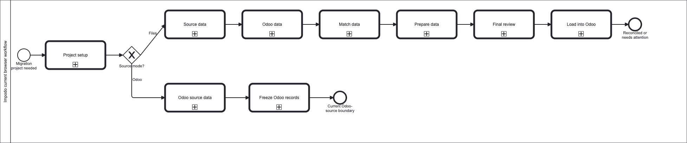

# Impodo BPMN models

These BPMN 2.0 models describe the workflows currently implemented in Impodo.
They are documentation models, not executable workflow definitions.

## Model set

Open the overview first:

- [Current end-to-end workflow](current/impodo-current-workflow.bpmn)



The overview calls the detailed workflow models:

1. [Project setup](current/00-project-setup.bpmn)
2. [Source data](current/01-source-data.bpmn)
3. [Odoo data](current/02-odoo-data.bpmn)
4. [Match data](current/03-match-data.bpmn)
5. [Prepare data](current/04-prepare-data.bpmn)
6. [Final review](current/05-final-review.bpmn)
7. [Load into Odoo](current/06-load-into-odoo.bpmn)
8. [Integrated multi-Recipe Test run](current/07-integrated-test-run.bpmn)
9. [Integrated Test qualification](current/08-integrated-qualification.bpmn)
10. [Production rollout with latest data](current/09-production-rollout.bpmn)

The files use standard BPMN 2.0 XML and BPMN Diagram Interchange coordinates.
They can be opened in BPMN-compatible tools such as the bpmn.io modeler or
Camunda Modeler.

## Current capability boundary

The overview deliberately shows two source-mode paths:

- a file-source project follows **Source data → Odoo data → Match data →
  Prepare data → Final review → Load into Odoo**;
- an Odoo-source project follows **Odoo source data → Freeze Odoo records**
  and then reaches the current implemented boundary. Odoo-source mapping and
  round-trip update are planned, not current.

The load process models the shared controlled Odoo 19 write and reconciliation
path. It also shows the optional focused scalar correction successor for an
eligible verified Authoring load. Production may enter the main load path only
through the separate Production activation guard; the completed-load correction
entry remains Authoring-only.

The integrated Test models are separate Project-level workflows. Planning
consumes one already accepted Test DataVersion and published Recipe revisions,
creates isolated fresh application drafts, and binds an exact CutoverPlan
revision. Qualification requires ordered execution and verified read-back,
then records qualification and rollout selection separately. The Production
model starts from that selection but creates fresh data, target, credential,
comparison, approval, execution, and reconciliation evidence.

## BPMN conventions

- **User task:** a decision or action performed by the data manager in the
  Impodo browser.
- **Service task:** automated behavior performed by Impodo.
- **Exclusive gateway:** a decision with one selected path.
- **Collapsed call activity:** a link from the overview to a detailed workflow.
- **Message flow:** a bounded interaction between Impodo and the exact Odoo 19
  target.
- **End event:** a completed stage, a needs-attention state, or an explicit
  current product boundary.

The models use two lanes, **Data manager** and **Impodo**, where responsibility
needs to be explicit. Odoo is a separate black-box participant because Impodo
calls it through narrow supported interfaces rather than controlling its
internal process.

## Authority and maintenance

The models summarize current user and developer workflow documentation. The
accepted contracts and implementation remain authoritative where a diagram is
ambiguous.

Regenerate the diagrams after changing the model definitions:

```console
uv run python scripts/generate_current_bpmn.py
```

Check that committed files match the generator:

```console
uv run python scripts/generate_current_bpmn.py --check
```

Also run the documentation checks listed in the main
[documentation index](../README.md).
