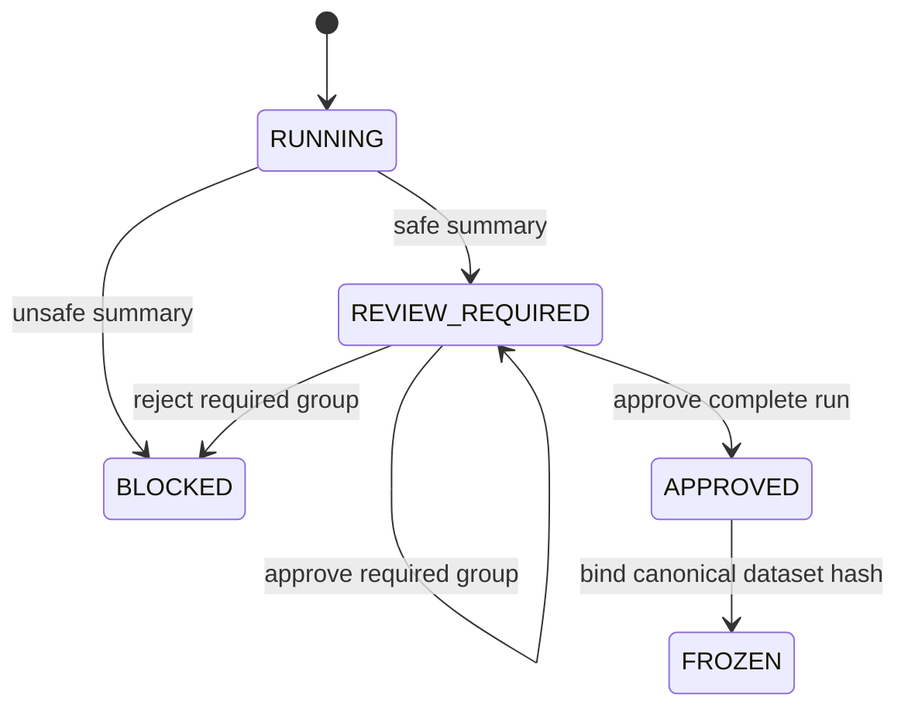

# Normalization dry-run governance contract

## Status and boundary

**Status:** Integrated in the bounded browser workflow.

`src/impodo/governance.py` retains the immutable lifecycle authority.
`src/impodo/normalization.py`, the readiness service, schema-v16 DuckDB
adapter, and the browser's **Review prepared data** page now integrate that
authority with exact staging and quality evidence.

The integration evaluates and persists prepared-value review evidence and
freezes the exact eligible dataset. It does not rewrite registered source
files, certify a clean package, grant export approval, or write to Odoo.

## Intended flow

```text
immutable source evidence
-> canonical and quality evaluation
-> DryRunSummary
-> correction-group decisions
-> whole-run approval
-> canonical dataset hash freeze
```

Approval of source corrections never grants an Odoo capability.

## Domain objects

| Object | Responsibility |
| --- | --- |
| `ApprovalMode` | Distinguishes published automatic corrections from corrections requiring a group decision |
| `CorrectionGroupKey` | Identifies one `(rule_id, dataset, field)` review group |
| `CorrectionImpact` | Records affected-row and collision counts without raw customer values |
| `DryRunSummary` | Reconciles correction groups and blocking issues |
| `DryRun` | Owns the immutable review, approval, and freeze lifecycle |

Automatic corrections remain visible and still require whole-run approval.
Any correction collision blocks the run.

## Lifecycle



Every transition returns a new `DryRun`; it does not mutate the previous
state.

### Group decisions

`approve_group()` and `reject_group()` apply only to known groups whose
approval mode is `required`. A verified actor needs the
`normalization.decide` capability. Rejection blocks the run and requires new
source or rule evidence before retrying.

### Whole-run approval

`approve()` requires:

- `REVIEW_REQUIRED` state;
- approval of every required correction group;
- a verified actor with `normalization.approve`;
- timezone-aware audit evidence.

### Freeze

`freeze()` is allowed only after whole-run approval and binds the result to an
exact canonical-dataset SHA-256 hash. Freezing is evidence creation, not an
Odoo import or write authorization.

## Invariants

The contract rejects:

- blank identifiers or filenames;
- malformed or missing SHA-256 bindings;
- duplicate correction groups;
- zero or impossible affected/collision counts;
- decisions for automatic, unknown, or cross-run groups;
- conflicting approval and rejection evidence;
- approval without actor and timezone-aware audit evidence;
- freezing before approval or without a canonical dataset hash.

Adapters must use these domain transitions rather than reproducing lifecycle
rules in browser forms or database code.

## Integrated boundary

The browser-authored rules remain the only transformation language. Their
full-row execution emits deterministic review effects; it does not create a
second editable correction engine. Source, mapping, schema, staging, quality,
ownership, classification, or retention changes invalidate the current
normalization pointer while retaining history. The read-only Odoo comparison
requires the exact current result in `FROZEN` state.

The implementation boundary, evidence adapters, conservative review policy,
data-manager UI, and freeze gate are specified in the
[Slice 4 normalization review plan](../plans/slice-4-normalization-review-plan.md).

## Executable evidence

- [`governance.py`](../../src/impodo/governance.py)
- [`normalization.py`](../../src/impodo/normalization.py)
- [`test_governance.py`](../../tests/test_governance.py)
- [`test_normalization.py`](../../tests/test_normalization.py)
