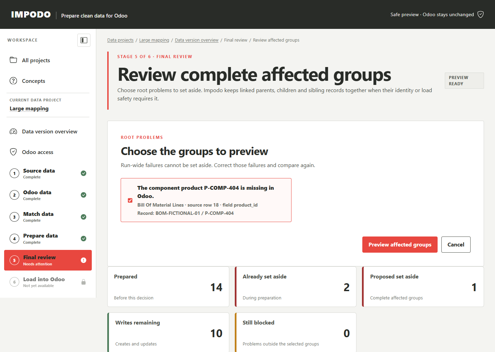

# Reviewed deferred record groups

## Scope

This contract governs the local review, explicit acceptance, persistence, and
load-time use of a reduced execution scope derived from one completed Odoo
comparison. It covers file-source workspaces, dependency closure, exact numeric
precision findings, portable decision artifacts, the browser review, and the
review workbook. It does not authorize source edits, matching changes, target
writes, automatic omission, or reuse against a later comparison.

## Responsibility

For a file-source workspace, Impodo may derive one smaller load from the
current saved Odoo comparison when the data manager explicitly sets aside
complete affected record groups. This decision applies only to that comparison
and load. It does not change the accepted source, prepared values, matching
rules, or Odoo.

The shared **Compare with Odoo** action is available after Prepare data has
frozen the current prepared result and from Final review. Both entry points run
`PreflightService.compare`; neither creates a second target checker. Opening a
review page, calculating a group preview, accepting it, or creating the review
workbook makes no Odoo request.

## Evidence boundary

The full portable comparison manifest and full execution snapshot remain the
historical source of truth. A preview is derived locally from these saved
artifacts, the frozen prepared records, saved reference resolutions, and the
captured target field precision. Impodo does not reopen source files or rerun
preparation.

Each selectable `DeferredIssue` names one affected execution row. A run-wide
issue cannot be selected. `prepared_dependency_facts` reconstructs only the
incoming dependencies already proven by the comparison:

- An identity or scope dependency keeps its parent, dependants, and sibling
  records in one group.
- An ordinary relationship propagates an unsafe parent to its dependant but
  does not remove the lookup record when only the dependant is unsafe.
- A target-first relationship follows an incoming row only when the saved
  comparison resolved it through that incoming row. Impodo never changes the
  resolution to another Odoo record while reducing the scope.

`DeferredScopePreview` binds the selected issues, omitted rows, counts, full
snapshot hash, and comparison hash. A row omitted through more than one cause
is counted once. Direct and inherited causes remain separate evidence.

## Exact precision findings

The captured Odoo `digits` metadata is applied to exact `CREATE` and `UPDATE`
field intents after comparison. An unchanged prepared value is not a write and
cannot become a false precision blocker. Impodo never rounds, truncates, or
converts the value implicitly.

`TARGET_NUMERIC_PRECISION_LOSS` is a row-level deferred issue when the intended
write cannot be represented exactly. The data manager may set aside its
complete affected group, approve an explicit upstream conversion rule, or ask
the Odoo owner to change the field precision and refresh Odoo evidence.

## Reviewed decision and execution

The browser calculates a preview only after the data manager selects root
issues. Acceptance requires the comparison identifier and preview semantic
hash submitted by that page. `PreflightService.accept_deferred_scope` then:

1. Rebuilds the preview from current saved evidence.
2. Removes only the reviewed row closure.
3. Replans the remaining relationships with `plan_execution_rows`.
4. Rejects a remaining relationship blocker, incomplete count, empty write
   set, stale binding, or changed preview.
5. Stores the preview, reduced snapshot, and `DeferredScopeDecision`.
6. Atomically replaces the compact execution projection and records the
   decision hash in DuckDB.

The load service receives the reduced snapshot only while its decision,
preview, full comparison, and row accounting still agree. The original full
snapshot is retained. A crash before the decision marker is published cannot
activate a partial reduction, and any corrupt or missing artifact fails closed.

Stage 5 may say **Ready with records set aside** only when at least one row is
omitted, at least one write remains, and no row-level or run-wide problem
survives. The ordinary explicit load confirmation and target freshness checks
still apply.

## Workbook projection

The review workbook uses the full saved comparison as historical evidence and
the accepted reduced scope as its active projection. **Records to load**,
**Changes to Odoo**, and **Needs attention** exclude omitted rows. **Review
overview** shows prepared, already set aside, newly set aside, ready-to-write,
and still-blocked counts.

**Deferred issues** contains every omitted prepared record once. It retains the
source dataset and row, portable source identity, affected group, direct or
inherited reason, root issue, correction guidance, and comparison identifier.
Workbook cells cannot change the saved decision or authorize a load.

## Authorization, invalidation, and performance

Reading the preview requires protected-evidence read access. Accepting the
decision requires `PREFLIGHT_RUN`; publishing its compact execution projection
uses the existing workspace mutation boundary. Portable artifacts reject
numeric Odoo IDs and credentials.

A changed source, mapping, preparation, target, comparison, execution
snapshot, or decision artifact invalidates the reviewed scope. Impodo requires
one explicit fresh comparison rather than silently recalculating against new
target evidence.

The preview is a pure local graph closure. The 2026-09-23 Windows qualification
used 25,000 rows and 12,499 relationship edges. It omitted 12,500 affected rows
while retaining 12,500 writes in 0.191 seconds, projected the bounded 100-row
page in 0.00023 seconds, and generated the 12,500-row deferred workbook in
5.934 seconds. The workbook was 477,272 bytes. Resident memory grew 7.9 MiB
during group calculation and 45.2 MiB across group calculation plus workbook
generation. These local operations made zero Odoo requests. The figures are
point-in-time test evidence, not a guarantee for every workstation.

## Verification

- [`test_deferred_scope.py`](../../../tests/domain/preflight/test_deferred_scope.py)
- [`test_deferred_execution.py`](../../../tests/domain/preflight/test_deferred_execution.py)
- [`test_preflight.py`](../../../tests/application/workspace/review/test_preflight.py)
- [`test_preflight_repository.py`](../../../tests/integration/duckdb/test_preflight_repository.py)
- [`test_reporting_cli.py`](../../../tests/integration/artifacts/test_reporting_cli.py)
- [`test_deferred_scope_presenter.py`](../../../tests/integration/web/test_deferred_scope_presenter.py)
- [`test_deferred_scope_routes.py`](../../../tests/integration/web/test_deferred_scope_routes.py)
- [`test_deferred_scope_scale.py`](../../../tests/performance/test_deferred_scope_scale.py)

## Related documentation

- [Prepare data workflow](../workflow/04-prepare-data.md)
- [Final review workflow](../workflow/05-final-review.md)
- [Preflight contract](preflight.md)
- [Quality and quarantine contract](quality-and-quarantine.md)
- [Execution and reconciliation contract](execution-and-reconciliation.md)
