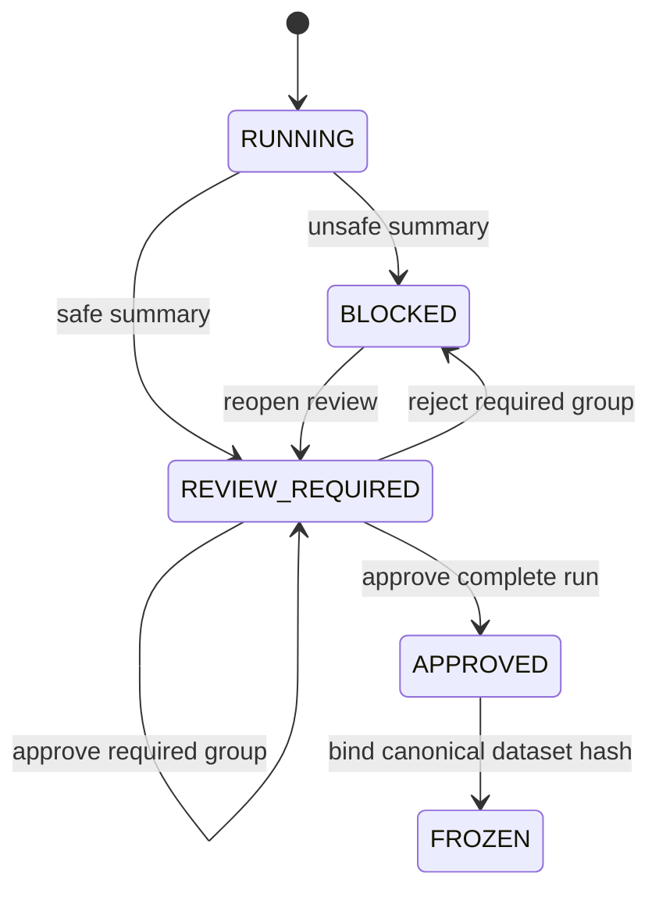

# Normalization governance contract

## Scope

Normalization records immutable prepared-value review, approval, and freeze
evidence. It never rewrites registered sources, certifies a package, grants
execution approval, or writes to Odoo.

Automatic corrections remain visible and require whole-run approval. A
correction collision blocks the run.

## Lifecycle

Every transition returns a new lifecycle value and retains prior evidence.

## Decisions and authorization

Group decisions apply only to known groups marked `required`. A verified actor
needs `normalization.decide`; rejection blocks the run. Reopening preserves
accepted decisions, returns rejected groups to pending, and creates a new
audited lifecycle version.

Whole-run approval requires `REVIEW_REQUIRED`, approval of every required
group, `normalization.approve`, and timezone-aware actor evidence. Freeze is
allowed only after approval and binds the exact canonical-dataset SHA-256 hash.

## Invariants

The domain rejects blank identities, malformed hashes, duplicate groups,
impossible affected/collision counts, decisions for automatic or unknown
groups, cross-run decisions, conflicting evidence, unauthenticated approval,
and freeze before approval.

Adapters must invoke domain transitions rather than reproducing lifecycle
rules in forms, services, or repositories.

## Binding and invalidation

Normalization binds source, mapping, schema, staging, quality, ownership,
classification, and retention evidence. Any change retires the current result
while retaining history. Read-only Odoo comparison requires the exact current
result in `FROZEN` state.

## Related documentation

- [Prepare data implementation](../workflow/04-prepare-data.md)
- [Python code map](../../architecture/python-code-map.md)
