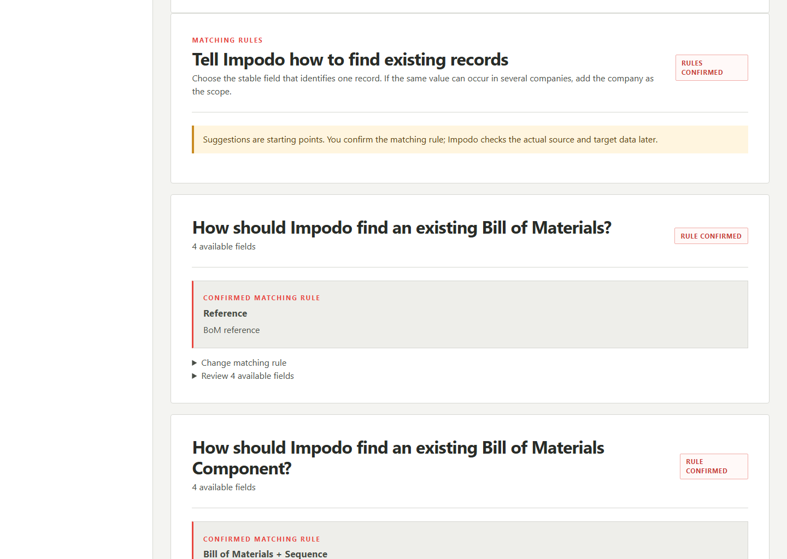
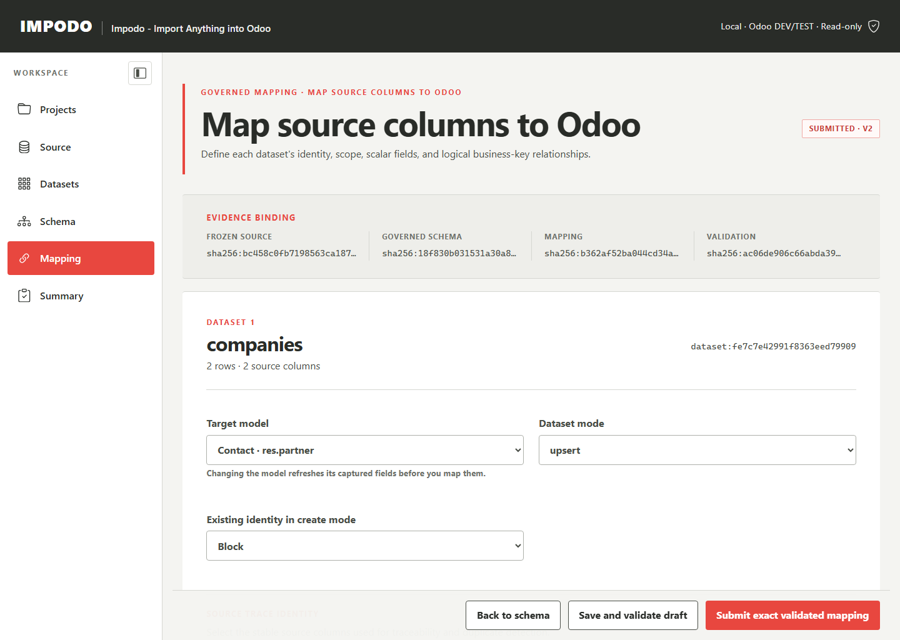

# Impodo local-browser user guide

## Audience and current boundary

This guide is for data analysts and data managers using the current local
browser workflow:

```text
Project setup -> Source discovery -> Target schema -> Governed mapping
```

Impodo registers and inspects CSV/XLSX evidence, freezes selected datasets,
captures an Odoo 19 schema, and creates validated mapping revisions. It is
read-only toward Odoo. It does not yet execute full-row cleaning, create a
clean import package, write to Odoo, or reconcile a completed load.

The [migration project contract](../contracts/migration-project.md) and
[browser workspace contract](../contracts/workspace.md) define the exact
persistence, invalidation, and submission rules.

The screenshots use fictional training data at a desktop viewport.

## Quick safe route

1. Start Impodo from the approved shortcut.
2. Create one project for the complete migration scope.
3. Add every related source file before registering the project.
4. Configure an authorised `LOCAL` or `REMOTE` Odoo target.
5. Inspect and confirm every file, then freeze the selected datasets.
6. Capture the permitted Odoo models and fields.
7. Confirm natural business keys and scope.
8. Map identity, ordinary fields, and relationships.
9. Save and validate a mapping revision.
10. Resolve blocking findings, review warnings, and submit the exact revision.
11. Use **Quit Impodo** when finished.

## Before starting

Prepare:

- final `.csv` or `.xlsx` exports with clear headers;
- stable source and target business identifiers;
- the source export date, data owner, classification, and retention decision;
- the exact authorised Odoo 19 URL, database, models, and business keys;
- a dedicated read-only API key for `REMOTE`, or the selected local
  `odoo.conf` for `LOCAL`.

Keep the original export unchanged. When the source owner issues a correction,
register it as new governed evidence rather than editing a registered project
file.

## Start Impodo

Use the shortcut supplied with the accepted installation. Developers may run:

```powershell
.\.venv\Scripts\impodo.exe
```

Impodo opens a random `http://127.0.0.1:<port>` address. Do not bookmark or
share it: the launch URL contains a short-lived, single-use sign-in token.

## 1. Project setup

The first page lists projects stored on this computer.


Select an existing project or **New project**. One project may contain many
related files, datasets, and Odoo models, but it must not combine unrelated
customers, target databases, or approval chains.


Record:

- recognizable project name and source system;
- export status and source export date;
- responsible data manager and functional owner;
- data classification, purpose, and retention after acceptance;
- every required source file;
- `LOCAL` or `REMOTE` target, exact URL, and database.

Registration requires **Files received**, an export date, and at least one
source file. Add related files one at a time while the project is still a
draft. **Continue** changes the setup page; it does not register the project.

Selecting **Register project** freezes the source-file list. Afterward, files
can be inspected but not added, removed, or replaced. If the source set is
incomplete, create a new project or rehearsal rather than modifying stored
files or DuckDB directly.

### Choose the target

- **Local Odoo** accepts only a literal loopback target and does not need an
  API key when Impodo uses the selected local workspace.
- **Remote / on-premises Odoo** requires HTTPS and a dedicated read-only API
  key. The key may be kept in the operating-system credential vault, never in
  the project database.

For local discovery, readiness, Start/Stop/Restart, and ownership rules, use
the [local Odoo runbook](local-odoo.md).

The migration-application selection is reviewer context. The technical model
allowlist configured later is the enforced schema-read boundary.

## 2. Source discovery

Impodo verifies every stored file against its registered size and SHA-256 hash
before inspection.


For every file, review:

- CSV encoding, delimiter, and proposed header;
- XLSX worksheets, named tables, and ranges;
- bounded preview and candidate column types;
- null, distinct, minimum, maximum, and length statistics;
- duplicate/blank headers, formulas, errors, and structural warnings.


Correct supported parsing choices, such as delimiter or header row, and
inspect again. Confirm only when the preview represents the intended table.
Blank or duplicate headers block confirmation; other warnings require explicit
acknowledgement.

Acknowledgement proves review, not data readiness. Inspection never trims,
replaces, deduplicates, recalculates, or rewrites source values.

### Freeze datasets

After confirming every source, select the exact CSV table, worksheet, or named
table to map. Assign stable snake-case names such as `companies`, `contacts`,
or `product_categories`.


Freezing creates a versioned, hash-bound selection. Reinspection,
reconfirmation, or refreezing keeps history but invalidates the active mapping
pointer.

Use **Prepare related datasets** when one denormalized source field represents
reusable related records or when repeated parent/line data needs a governed
split. This remains a bounded authoring preview; see
[derived-entity authoring](../derived-entity-authoring.md).

## 3. Target schema

Open **Odoo schema**, select only approved technical models, and capture their
effective fields. Schema capture is read-only and uses stored, hash-bound
snapshots for later mapping.

Review field type, required/readonly state, relation, inverse field, and
selection values. Do not substitute a similarly named field without
functional confirmation.

The schema origin is visible:

- `LIVE_API` is verified evidence captured from the selected target;
- `LOCAL_MANUAL` is an unverified local draft.

A manual draft may support mapping experiments when local access is not ready,
but submission remains blocked until live capture replaces it. Changing the
permitted models or recapturing schema invalidates governed keys and the active
mapping.

## 4. Governed mapping

### Confirm business keys

A business key is the stable value used to find one Odoo record. It is never
the internal numeric `id`.



| Target | Natural key | Scope example |
| --- | --- | --- |
| Contact | `ref` | `company_id` |
| Product | `default_code` | `company_id` when required |
| Account | `code` | `company_id` |
| Country | `code` | none |

Avoid mutable names, guessed fields, sample-only uniqueness, or numeric IDs.
Confirmation records the intended rule; full source/target duplicate checks
remain deferred to staging and preflight.

### Map each dataset



Choose:

- `upsert` to compare one business-key match or propose a create when absent;
- `create` for controlled new records with an explicit existing-key policy;
- `reference` for supporting relationship data without an import decision.

Map in this order:

1. Source trace identity: the exact source row key.
2. Target identity and company/tenant/parent scope.
3. Writable scalar fields.
4. Relationships.

Scalar providers are source column, constant, source-with-fallback, or
leave-unset/Odoo-default. The mapping can author allowlisted trim, whitespace,
empty-to-null, casing, decimal-locale, date-format, boolean, and UTC-datetime
policies. Odoo-default intent remains a warning because schema metadata cannot
prove runtime defaults.

The raw-to-proposed display is a bounded sample. It does not prove every row
can be transformed safely.

### Map relationships


Relationships use governed business keys:

- **Incoming dataset** when the related record is part of this project;
- **Existing Odoo catalog** when it must already exist in the target.

For many2many fields, declare the separator and `replace`, `add`, or `remove`.
Do not map a parent's one2many list directly; map the inverse many2one on each
child row. Required missing/ambiguous references and dependency cycles must
block validation.

## 5. Validate and submit

Select **Save and validate draft** after a coherent group of changes.


| Result | Meaning | Action |
| --- | --- | --- |
| Invalid | Unsafe or incomplete mapping definition | Resolve every blocking finding |
| Valid with warnings | Structurally valid but requires conscious review | Read and acknowledge each warning |
| Valid | No semantic finding for the current evidence | Perform final review and submit |

Validation checks mapping structure and meaning. It does not prove full-row
uniqueness, required values, relationship resolution, or successful Odoo
execution.

**Submit exact validated mapping** binds the exact mapping, validation, source,
schema, and business-key evidence. Submission is not functional approval,
clean-package certification, an Odoo import, or a write action.

## Use Impodo safely today

- Preserve the registered source and prefer a new source-owner export for
  corrections.
- Configure supported mapping rules so their intent is hash-bound.
- Treat previews as examples, not full-row proof.
- Record unsupported lookup, structural, domain, entity-resolution, and
  exception rules in an approved transformation register.
- Recheck business-key and relationship collisions after any correction.
- Treat **Valid** and **Submitted** as mapping states only.

The proposed full-row coverage and clean-package gates are in the
[data-quality coverage ledger](../plans/data-quality-coverage.md).

## Final review

Before submission confirm:

- the complete registered source set and intended tables are frozen;
- every dataset has a stable source identity and governed target key/scope;
- only permitted writable fields are mapped once;
- providers, transformations, null policies, and required-on-create behavior
  are deliberate;
- relationships use incoming datasets or confirmed target keys;
- dependency cycles and blocking findings are absent;
- every warning is understood and acknowledged;
- the exact displayed evidence belongs to the intended project and target;
- everyone understands that the revision is not load-ready or write-approved.

## Common problems

| Symptom | Action |
| --- | --- |
| Session unavailable | Restart Impodo from its launcher |
| Need another source file after registration | Create a new project/rehearsal with the complete source set |
| Source no longer confirmed | Reinspect and reconfirm it |
| Mapping no longer active | Review the changed source/schema/key evidence and create a new revision |
| Missing source column | Freeze the intended table/dataset |
| Missing target field | Review the permitted model scope and Odoo access |
| Business key not confirmed | Obtain functional approval and confirm key plus scope |
| Relationship unresolved or ambiguous | Correct the resolver/key/scope; do not ignore ambiguity |
| Preview still looks dirty | Configure a supported rule or govern the correction outside Impodo |
| Mapping valid but rows look invalid | Do not treat it as load-ready; full-row checks are still required |

## End the session

If the local Odoo runbook shows services managed by this session, stop them
before quitting. Then select **Quit Impodo**. Closing only the browser tab does
not stop the Impodo process or managed Odoo/PostgreSQL services.

Retain or dispose of project data according to the recorded policy and the
organization's approved process.
