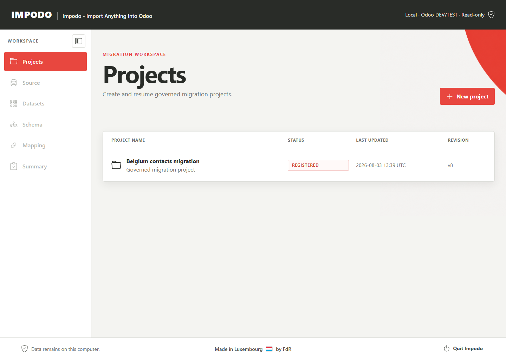
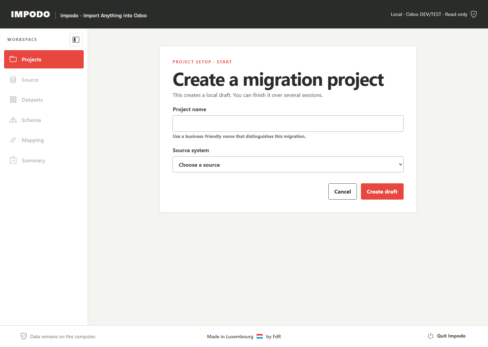
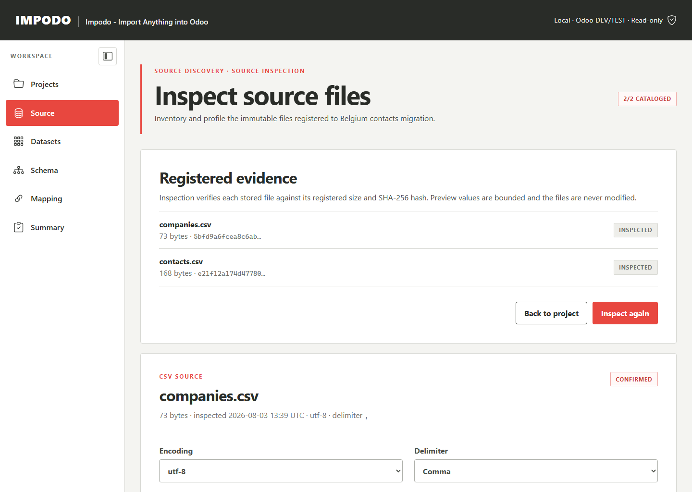
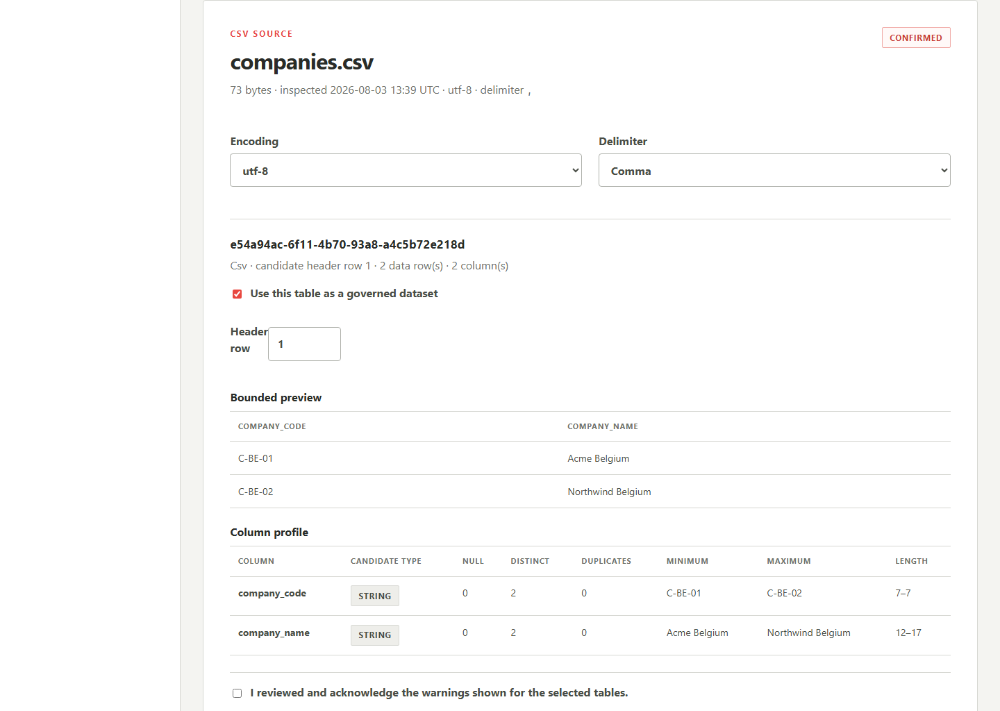
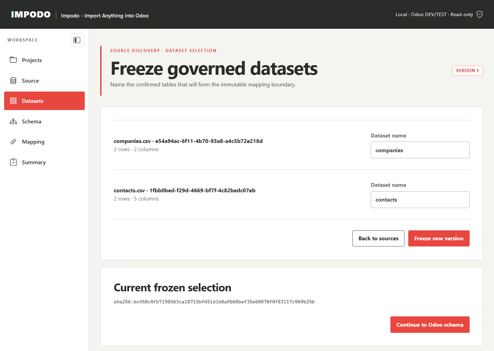
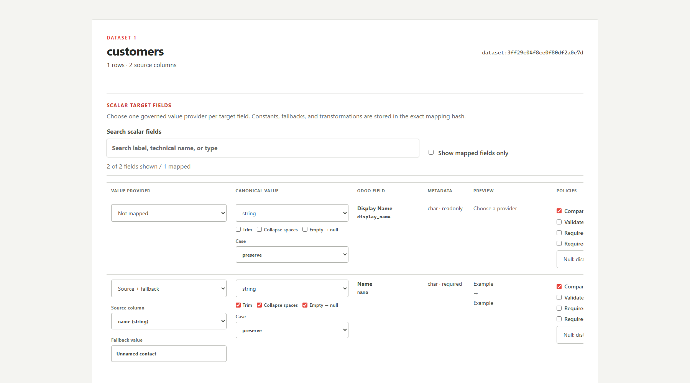
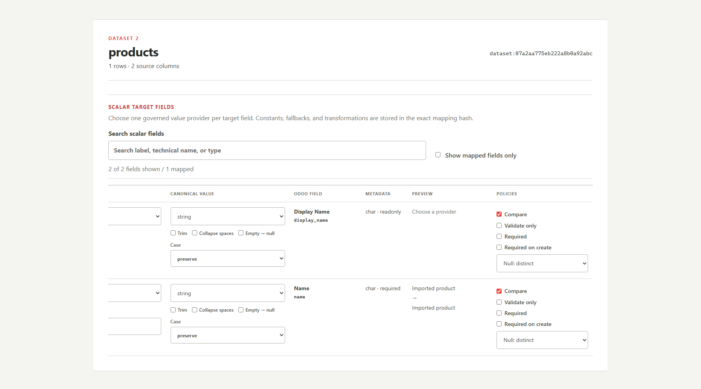
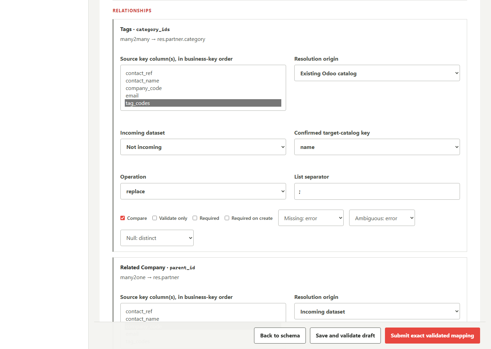
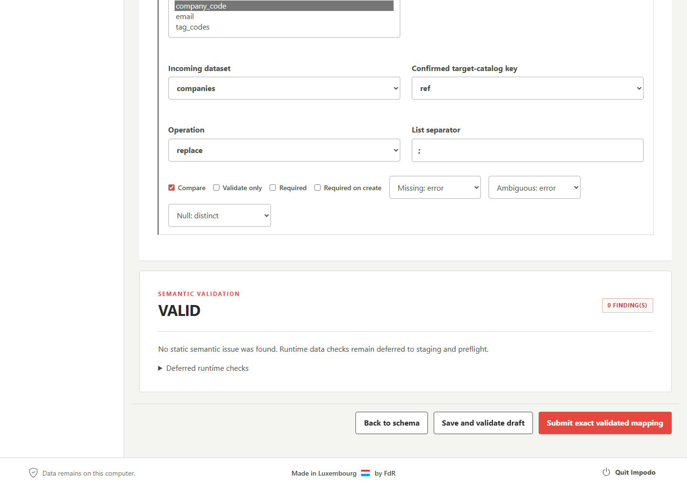

# Impodo local-browser user guide

## Audience and current boundary

This guide is for data analysts and data managers using the current local
browser workflow:

```text
Project setup -> Source discovery -> Target schema -> Governed mapping
```

Impodo registers and inspects CSV/XLSX evidence, freezes selected datasets,
captures an Odoo 19 schema, and creates validated mapping revisions. After
submission, it can check every frozen source row against the mapping and the
read-only Odoo evidence. It does not write to Odoo or reconcile a completed
load.

The [migration project contract](../contracts/migration-project.md) and
[browser workspace contract](../contracts/workspace.md) define the exact
persistence, invalidation, and submission rules.

The screenshots use fictional training data at a desktop viewport.

## Quick safe route

1. Start Impodo from the approved shortcut.
2. Create one project for the complete migration scope.
3. Add every related source file before registering the project.
4. Configure an authorised `LOCAL` or `REMOTE` Odoo target.
5. Inspect and confirm every file, then freeze the selected datasets.
6. Capture the permitted Odoo models and fields.
7. Confirm natural business keys and scope.
8. Map identity, ordinary fields, and relationships.
9. Save progress regularly, then validate a coherent mapping revision.
10. Select **Review transformation impact** and inspect the raw-to-proposed
    results across the frozen source.
11. Resolve blocking findings, review warnings, and submit the exact revision.
12. Open **Summary**, select **Check data readiness**, and review every blocked
    or decision-required row.
13. Generate the review package when every row is ready.
14. Use **Quit Impodo** when finished.

## Before starting

Prepare:

- final `.csv` or `.xlsx` exports with clear headers;
- stable source and target business identifiers;
- the source export date, data owner, classification, and retention decision;
- the exact authorised Odoo 19 URL, database, models, and business keys;
- a dedicated read-only API key for `REMOTE`, or the selected local
  `odoo.conf` for `LOCAL`.

Keep the original export unchanged. When the source owner issues a correction,
register it as new governed evidence rather than editing a registered project
file.

## Start Impodo

Use the shortcut supplied with the accepted installation. Developers may run:

```powershell
.\.venv\Scripts\impodo.exe
```

Impodo opens a random `http://127.0.0.1:<port>` address. Do not bookmark or
share it: the launch URL contains a short-lived, single-use sign-in token.

## 1. Project setup

The first page lists projects stored on this computer.



Select an existing project or **New project**. One project may contain many
related files, datasets, and Odoo models, but it must not combine unrelated
customers, target databases, or approval chains.



Record:

- recognizable project name and source system;
- export status and source export date;
- responsible data manager and functional owner;
- data classification, purpose, and retention after acceptance;
- every required source file;
- `LOCAL` or `REMOTE` target, exact URL, and database.

Registration requires **Files received**, an export date, and at least one
source file. Add related files one at a time while the project is still a
draft. **Continue** changes the setup page; it does not register the project.

Selecting **Register project** freezes the source-file list. Afterward, files
can be inspected but not added, removed, or replaced. If the source set is
incomplete, create a new project or rehearsal rather than modifying stored
files or DuckDB directly.

### Choose the target

- **Local Odoo** accepts only a literal loopback target and does not need an
  API key when Impodo uses the selected local workspace.
- **Remote / on-premises Odoo** requires HTTPS and a dedicated read-only API
  key. The key may be kept in the operating-system credential vault, never in
  the project database.

For local discovery, readiness, Start/Stop/Restart, and ownership rules, use
the [local Odoo runbook](local-odoo.md).

The migration-application selection is reviewer context. The technical model
allowlist configured later is the enforced schema-read boundary.

## 2. Source discovery

Impodo verifies every stored file against its registered size and SHA-256 hash
before inspection.



For every file, review:

- CSV encoding, delimiter, and proposed header;
- XLSX worksheets, named tables, and ranges;
- bounded preview and candidate column types;
- null, distinct, minimum, maximum, and length statistics;
- duplicate/blank headers, formulas, errors, and structural warnings.



Correct supported parsing choices, such as delimiter or header row, and
inspect again. Confirm only when the preview represents the intended table.
Blank or duplicate headers block confirmation; other warnings require explicit
acknowledgement.

Acknowledgement proves review, not data readiness. Inspection never trims,
replaces, deduplicates, recalculates, or rewrites source values.

### Freeze datasets

After confirming every source, select the exact CSV table, worksheet, or named
table to map. Assign stable snake-case names such as `companies`, `contacts`,
or `product_categories`.



Freezing creates a versioned, hash-bound selection. Reinspection,
reconfirmation, or refreezing keeps history but invalidates the active mapping
pointer.

Use **Prepare related datasets** when one denormalized source field represents
reusable related records or when repeated parent/line data needs a governed
split. For one related-record field, preview the unique candidates and create
the related dataset. Mapping then shows both the new related dataset and the
original rows, and suggests a compatible incoming many2one relationship.
Readiness repeats the rule over every frozen row; the page preview remains
bounded evidence. See
[derived-entity authoring](../derived-entity-authoring.md).

## 3. Target schema

Open **Odoo schema**, select only approved technical models, and capture their
effective fields. Schema capture is read-only and uses stored, hash-bound
snapshots for later mapping.

Review field type, required/readonly state, relation, inverse field, and
selection values. Do not substitute a similarly named field without
functional confirmation.

The schema origin is visible:

- `LIVE_API` is verified evidence captured from the selected target;
- `LOCAL_MANUAL` is an unverified local draft.

A manual draft may support mapping experiments when local access is not ready,
but submission remains blocked until live capture replaces it. Changing the
permitted models or recapturing schema invalidates governed keys and the active
mapping.

## 4. Governed mapping

### Confirm business keys

A business key is the stable value used to find one Odoo record. It is never
the internal numeric `id`.

For each permitted model, Impodo keeps the page simple:

1. If Odoo exposes one safe uniqueness rule, review the suggested matching
   field and choose **Use suggestion**.
2. If there is no single safe suggestion, choose a field by its business label.
   The technical name remains visible in brackets.
3. Add **Within** only when the same value may exist in several companies or
   organizational scopes.
4. Use **Combined key or technical entry** only for a genuinely composite key.
5. Select **Confirm keys and open mapping** to create governed evidence.

This works for standard and custom models. For example, a custom model with an
Odoo uniqueness rule on `code` and `company_id` can be presented as **Code,
within Company** without requiring the data manager to remember either
technical name.

Some standard examples still need judgment:

| Target | Page behavior | Important limitation |
| --- | --- | --- |
| Country | Suggest Country Code (`code`) | Odoo enforces uniqueness |
| Product variant | Suggest Internal Reference (`default_code`) | Odoo permits duplicates |
| Product template | Suggest Internal Reference (`default_code`) | Multi-variant templates may have no template-level reference |
| Contact | Ask the owner to choose | Odoo has no universally safe contact key |
| Account | Ask the owner to choose | Odoo 19 account codes depend on company context; do not invent a `company_id` field |

Avoid mutable names, guessed fields, sample-only uniqueness, or numeric IDs.
Confirmation records the intended rule; **Check data readiness** later applies
it across the frozen rows and the captured target evidence.

### Map each dataset

Choose:

- `upsert` to compare one business-key match or propose a create when absent;
- `create` for controlled new records with an explicit existing-key policy;
- `reference` for supporting relationship data without an import decision.

The page keeps the first two choices side by side so you can compare source and
Odoo directly. Work in this order:

1. **Source**: choose the column or combination that identifies each source row.
2. **Odoo**: choose how the matching Odoo record is identified, including any
   company, tenant, or parent scope.
3. **Fields to fill in Odoo**: choose where ordinary values come from.
4. **Links to other Odoo records**: connect categories, units, companies,
   parents, and other related records.

### Fields to fill in Odoo

A scalar field is an ordinary Odoo value such as a name, code, date, amount,
checkbox, note, or selection. The page calls these **Fields to fill in Odoo**;
you do not need to know the technical term. Each row answers four questions:

1. Where should the value come from?
2. What consistent value type should Impodo produce?
3. Which transformations should be applied?
4. How should the value be checked and compared?

Only three fields are shown at first. Search by business label or technical
name, or use the **3**, **10**, **20**, and **50** controls to show more. Start
with the Odoo field you want to populate, then work from left to right. Use
**Show only fields already mapped** after the first save to focus on the
choices you have made.

#### Choose where the value comes from



Each row represents one Odoo field:

| Column | What it tells you |
| --- | --- |
| **Value comes from** | Where the proposed value comes from |
| **Format and cleanup** | How Impodo normalizes and interprets that value |
| **Odoo field** | The business label and technical field name |
| **Odoo details** | The captured Odoo type and whether the field is required or read-only |
| **Preview** | One source example before and after the current rules |
| **Checks** | Whether and when the field is compared or required |

A read-only Odoo field may appear as useful target context, but it cannot be
proposed for writing. **Not mapped** excludes the field even when default
policy controls remain visible.

| Value provider | What Impodo does | Good use |
| --- | --- | --- |
| **Not mapped** | Provides no value for this Odoo field | The field is outside this migration scope |
| **Source column** | Reads the value from the selected CSV/XLSX column | Names, codes, dates, amounts, and other supplied data |
| **Constant value** | Uses the same declared value for every row | A controlled value such as one company, country, language, or status |
| **Source + fallback** | Uses the source value when present; otherwise uses the declared fallback | A governed replacement such as `Unnamed contact` when the source is empty |
| **Leave unset / Odoo default** | Sends no proposed value and leaves the runtime choice to Odoo | A field with an intentionally accepted Odoo default |

With **Source + fallback**, a blank text cell uses the fallback when **Empty →
null** is selected. A genuinely missing/null source value also uses the
fallback. The fallback passes through the same transformations and type check
as a source value.

**Leave unset / Odoo default** cannot also be compared, validated, or marked
required. Impodo keeps a visible warning because captured field metadata does
not prove which value Odoo will choose at runtime.

#### Choose the canonical value

The canonical value is Impodo's consistent representation of the proposed
value. It makes validation and later comparison predictable even when the
source file uses a different display format.

| Type | What Impodo accepts | Example result |
| --- | --- | --- |
| `string` | Text after the selected transformations | `"  Acme  SA "` can become `"Acme SA"` |
| `integer` | Whole digits with an optional leading `+` or `-` | `"0012"` becomes `12` |
| `decimal` | A strict number using the selected decimal locale | `"1.234,50"` with `de_DE` becomes `1234.50` |
| `boolean` | `true`, `1`, `yes`, `y` or `false`, `0`, `no`, `n`, ignoring letter case | `"No"` becomes false |
| `date` | The selected ISO, slash, or dot date format | `"31/08/2026"` becomes 31 August 2026 |
| `datetime` | ISO or the selected date format with a time; stored in UTC | An ISO value with an offset is converted to the same UTC instant |

Impodo proposes the type suggested by the captured Odoo field. Change it only
when the business meaning and Odoo compatibility are clear.

For decimals, choose the source convention deliberately:

| Decimal locale | Example |
| --- | --- |
| `invariant` | `1234.50` |
| `en_US` | `1,234.50` |
| `de_DE` | `1.234,50` |
| `fr_FR` | `1 234,50` |

For dates, select the exact source format: `YYYY-MM-DD`, `DD/MM/YYYY`,
`MM/DD/YYYY`, or `DD.MM.YYYY`. Datetimes use the same selected date order and
include a time. The browser's governed timezone is currently UTC.

When Odoo exposes a selection list, use its technical value—the stored key—not
only its translated display label. The field control offers the captured
technical choices for constants and fallbacks. When a source column uses
different choices, select **Match values**. The dialog shows each distinct
source choice and its row count; choose the corresponding Odoo choice, then
select **Use matches**. You can save a partial match and return to finish it.

#### Apply transformations

Impodo applies the chosen value in a fixed order. For **Source + fallback**, it
first uses the selected basic text cleanup to decide whether the source is
empty and the fallback is needed.

```text
selected source, constant, or governed fallback
-> optional exact source-choice to Odoo-choice match
-> optional safe formula
-> trim
-> collapse spaces
-> find and replace
-> casing
-> empty to null
-> canonical type parsing
-> decimal rounding
-> final value checks
-> preview
```

| Control | What it changes | Example |
| --- | --- | --- |
| **Trim** | Removes whitespace before and after the value | `"  ACME "` → `"ACME"` |
| **Collapse spaces** | Replaces each internal run of whitespace with one space | `"Acme   Europe"` → `"Acme Europe"` |
| **Case: preserve** | Keeps the source letter case | `"eBay"` remains `"eBay"` |
| **Case: uppercase** | Converts letters to uppercase | `"be-001"` → `"BE-001"` |
| **Case: lowercase** | Converts letters to lowercase | `"USER@EXAMPLE.COM"` → `"user@example.com"` |
| **Empty → null** | Treats an empty transformed value as no value | A cell containing only spaces becomes null when Trim is also selected |
| **Sentence case** | Capitalizes the first letter and preserves the remaining text | `"customer note"` becomes `"Customer note"` |
| **Title Case** | Capitalizes each word | `"acme europe"` becomes `"Acme Europe"` |

Use transformations to express an agreed business rule, especially for keys.
For names and free text, preserve case unless the data owner has approved a
different convention.

#### Add value rules

Open **Value rules** only for a field that needs an additional business rule.
The everyday controls use plain language:

| Business requirement | What to select |
| --- | --- |
| Exactly three digits | **Must be exactly:** `3`; **Characters to check:** The whole value; **They must be:** Digits 0-9 |
| Seven characters of any kind | **Must be exactly:** `7`; leave the character check off |
| First three characters are capital letters | **Characters to check:** The first characters; **How many:** `3`; **They must be:** Capital letters A-Z |
| Last four characters are digits | **Characters to check:** The last characters; **How many:** `4`; **They must be:** Digits 0-9 |
| Remove an old prefix or separator | Enter ordinary text under **Find**, enter the new text under **Replace with**, and keep **Plain text (recommended)** |
| Round an amount | Choose the decimal type, enter the number of decimal places, and choose the explicit rounding method |

Impodo checks the final proposed value, after the selected transformations.
Empty/null values are still governed by **Required**; a format check does not
silently make a field required. Character rules use the explicit ASCII ranges
`A-Z`, `a-z`, and `0-9`, which keeps identifiers and leading-zero codes
predictable.

Use **Advanced: custom pattern** when an approved format cannot be expressed
with the guided length and character controls. Impodo validates and bounds the
pattern before checking any row.

Use **Advanced: formula or custom calculation** for a reviewed calculation.
The panel lists row aliases such as `column_2` beside their source column
names. Safe formulas support arithmetic, comparisons, conditions, and the
listed helper functions. They cannot import or execute arbitrary Python, open
files, access the network, contact Odoo, or run loops.

Title and sentence casing can damage acronyms, product names, or personal
names. Review the preview and obtain data-owner agreement before using them.
For monetary rounding, confirm the currency precision and later reconcile the
rounded totals.

#### Decide how the field participates



| Policy | Meaning in Impodo | When to select it |
| --- | --- | --- |
| **Compare** | Include the proposed value when Impodo compares a source row with its matching Odoo record | The migration should identify whether this field is unchanged or needs an update |
| **Validate only** | Check the governed value without proposing that the field be changed | The value is useful for control or review but is not part of the proposed update |
| **Required** | Every row must provide a value after provider and transformation rules | The business process does not permit an empty value |
| **Required on create** | Require the value only when no target match exists and a new record would be created | Odoo needs the field for new records, while existing records may already carry it |

**Compare** and **Validate only** are mutually exclusive. A validate-only field
can still be required, but it never produces a proposed field difference.

**Required** is checked for every staged row. **Required on create** is checked
after target matching, because Impodo must first know whether the row represents
a create or an existing record.

#### Choose how null values compare

The null policy matters when the governed source value is null:

| Null policy | Meaning | Typical choice |
| --- | --- | --- |
| **distinct** | Null and an empty target value are different | Use when absence and an explicitly empty value have different business meaning |
| **equivalent** | Null and an empty target value may be treated as equal | Use when the source and Odoo represent the same absence differently |
| **ignore_source_null** | A null source value leaves the existing target value unchanged | Use for partial updates where a blank source cell means “no instruction” |

`ignore_source_null` is not a fallback and does not invent a value. It tells
comparison to preserve an existing target value when the source provides none.

#### Read the preview and validate the complete mapping

The preview shows one bounded source example as **raw value → proposed value**.
It helps you catch an incorrect provider, locale, date format, or transformation
while editing. A red proposed value explains why the displayed sample cannot be
converted.

The preview is a working aid, not the complete dataset result. Select **Save
progress** to keep unfinished work without validation. Select **Validate draft**
to check the complete mapping definition. When that definition is valid, select
**Review transformation impact** before submission. Impodo then reloads every
frozen source row locally and reports each affected raw source value beside its
proposed value without contacting Odoo.

The transformation page provides complete counts for changed, fallback, null,
invalid, constant-provided, and unchanged values. The browser table shows up to
5,000 affected values and supports local dataset, outcome, and text filters.
Select **Download filtered rows (.csv)** for the current view or **Download all
affected rows (.csv)** for complete row-level evidence. These controls use only
the JavaScript shipped with Impodo; they do not use a CDN, browser extension, or
Node.js.

After submitting the exact validated revision, open **Summary** and select
**Check data readiness**. That later step repeats the mapping over every frozen
row, checks relationships and target matches, and reports **Ready**, **Needs
review**, or **Blocked** without changing Odoo.

#### Worked example

For the Odoo field **Name**:

```text
Provider: Source + fallback
Source column: company_name
Fallback: Unnamed company
Canonical value: string
Transformations: Trim + Collapse spaces + Empty → null
Case: preserve
Policies: Compare + Required on create
Null policy: distinct
```

The source value `"  Acme   Europe  "` previews as `"Acme Europe"`. A blank
cell becomes null after trimming, so Impodo uses `"Unnamed company"`. During
the row-level readiness check, an existing contact can be compared normally;
a new contact must have the resulting name before it can be marked ready.

### Link to other Odoo records



Open **Links to other Odoo records** when a source value must point to a
category, unit of measure, company, parent, or another Odoo record. For example,
the `Category` value on a product row can be matched to a category in another
incoming dataset or to an existing category in Odoo.

These links use confirmed matching rules:

- **Another incoming dataset** when the related record is part of this project;
- **Existing Odoo records** when it must already exist in the target.

For a many2one link to existing records, **Match values** provides the same
simple source-choice-to-Odoo-choice dialog. Choose one source column and one
confirmed Odoo business key first. For example, match source country `FRA` to
the existing Odoo country key `FR`. Impodo stores `FRA -> FR`, resolves `FR`
during the readiness check, and never stores the Odoo numeric record ID.
Duplicate Odoo key values are omitted and reported instead of guessed. The
dialog is read-only: it does not create or change Odoo records.

The page shows three linked fields at first. Search the complete captured model
by business label, technical field name, or related Odoo model; for example,
`Category`, `categ_id`, or `product.category`. Use **3**, **10**, **20**, or
**50** to change the number shown. Existing mappings appear first, followed by
Impodo's prepared-dataset suggestions and then the remaining fields in
alphabetical order. Searching and paging use the cached schema and do not
reconnect to Odoo.

For many2many fields, declare the separator and `replace`, `add`, or `remove`.
Do not map a parent's one2many list directly; map the inverse many2one on each
child row. Required missing/ambiguous references and dependency cycles must
block validation.

## 5. Save, validate, and submit

Select **Save progress** regularly while mapping. This stores the complete
working page without semantic validation, including incomplete scalar-field
choices. The saved working draft is restored after Impodo or the computer is
restarted. `Ctrl+S` performs the same action, and the page warns before leaving
with unsaved changes.

Working drafts are bound to the exact frozen source and governed schema. If
either changes, Impodo retains the earlier draft as recovery evidence but does
not silently apply it to the new fields.

Select **Validate draft** after a coherent group of changes.



| Result | Meaning | Action |
| --- | --- | --- |
| Invalid | Unsafe or incomplete mapping definition | Resolve every blocking finding |
| Valid with warnings | Structurally valid but requires conscious review | Read and acknowledge each warning |
| Valid | No semantic finding for the current evidence | Perform final review and submit |

Validation checks the mapping structure and meaning. Row-level values,
uniqueness, relationship resolution, and target matches are checked after
submission through **Check data readiness**.

For a valid or valid-with-warnings revision, select **Review transformation
impact** before submission. This is the normalization and transformation review:
it compares the raw scalar input with the locally proposed value across every
frozen row. Resolve invalid results and obtain the data owner's agreement on
intentional changes before submitting the exact mapping.

**Submit exact validated mapping** binds the exact mapping, validation, source,
schema, and business-key evidence. Submission is not functional approval,
clean-package certification, an Odoo import, or a write action.

## 6. Check data readiness

Open **Summary** and select **Check data readiness**. Impodo reloads every
frozen row, applies the submitted providers, transformations, types, and
policies, resolves relationships, and compares candidates with the captured
read-only Odoo target evidence.

| Result | Meaning | Next action |
| --- | --- | --- |
| **Ready** | The row is classified as create, update, or unchanged without a blocking issue | Review the proposed result |
| **Needs review** | Impodo needs a governed decision | Review the displayed reason and complete the decision |
| **Blocked** | A key, value, relationship, or target condition prevents the row from continuing | Correct the governing source or mapping evidence, then recheck |

Use the status cards and dataset totals to filter the row list. Impodo shows a
plain-language reason and recommended action first; expand **Technical
details** only when you need the classification or issue code.

After every relevant source, mapping, schema, or target-evidence change, run
the check again. When every row is ready, generate the review package. The
readiness check and review package remain read-only and do not authorize an
Odoo import.

The downloadable Excel review package is created by Impodo's controlled Python
runtime using the same `openpyxl` dependency already used for governed XLSX
intake. It does not require Node.js. The workbook is downloaded for review; it
is not embedded as an Excel preview in the browser.

## Use Impodo safely today

- Preserve the registered source and prefer a new source-owner export for
  corrections.
- Configure each visible provider, transformation, type, and policy so its
  intent is retained with the mapping hash.
- Use the one-value preview while authoring, **Review transformation impact**
  after validation, and **Check data readiness** after submission.
- Recheck business keys, transformations, and relationships after any source
  or mapping revision.
- Treat **Valid**, **Submitted**, and **Ready** as review states, never as Odoo
  write authorization.

## Final review

Before submission confirm:

- the complete registered source set and intended tables are frozen;
- every dataset has a stable source identity and governed target key/scope;
- only permitted writable fields are mapped once;
- providers, transformations, null policies, and required-on-create behavior
  are deliberate;
- relationships use incoming datasets or confirmed target keys;
- dependency cycles and blocking findings are absent;
- every warning is understood and acknowledged;
- the exact displayed evidence belongs to the intended project and target;
- everyone understands that submission is followed by a row-level readiness
  check and does not authorize an Odoo write.

## Common problems

| Symptom | Action |
| --- | --- |
| Session unavailable | Restart Impodo from its launcher |
| Need another source file after registration | Create a new project/rehearsal with the complete source set |
| Source no longer confirmed | Reinspect and reconfirm it |
| Mapping no longer active | Review the changed source/schema/key evidence and create a new revision |
| Missing source column | Freeze the intended table/dataset |
| Missing target field | Review the permitted model scope and Odoo access |
| Business key not confirmed | Obtain functional approval and confirm key plus scope |
| Relationship unresolved or ambiguous | Correct the resolver/key/scope; do not ignore ambiguity |
| Preview result is unexpected | Recheck provider, type, transformation order, locale, and date format |
| Mapping is valid but rows are blocked | Open Summary, filter **Blocked**, and follow the reason and recommended action |

## End the session

If the local Odoo runbook shows services managed by this session, stop them
before quitting. Then select **Quit Impodo**. Closing only the browser tab does
not stop the Impodo process or managed Odoo/PostgreSQL services.

Retain or dispose of project data according to the recorded policy and the
organization's approved process.
