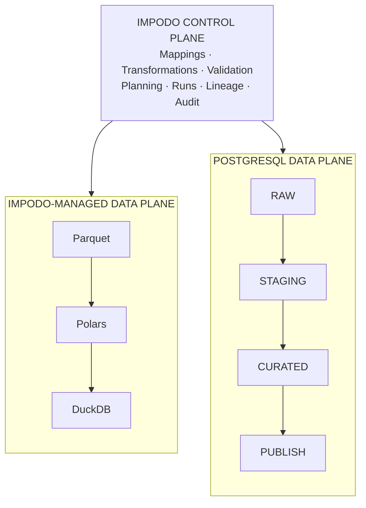
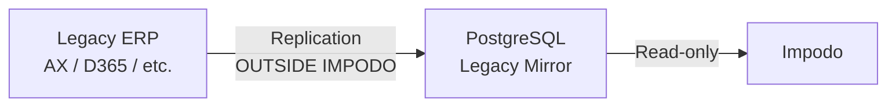
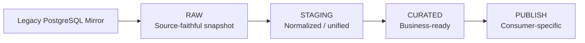
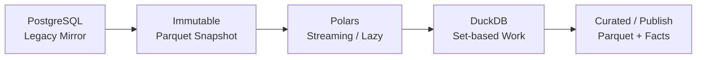
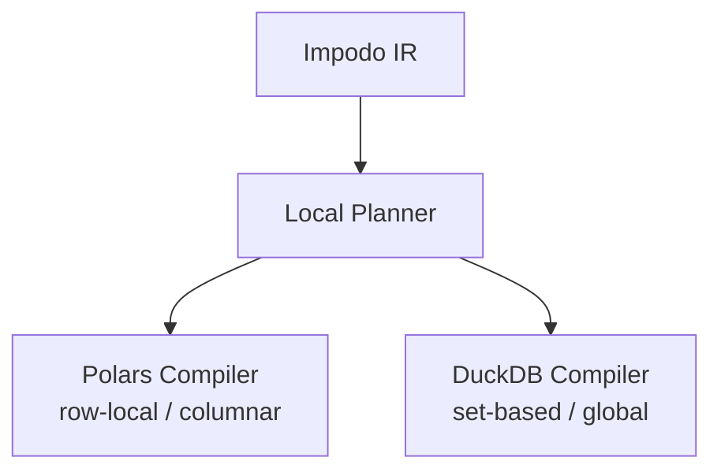
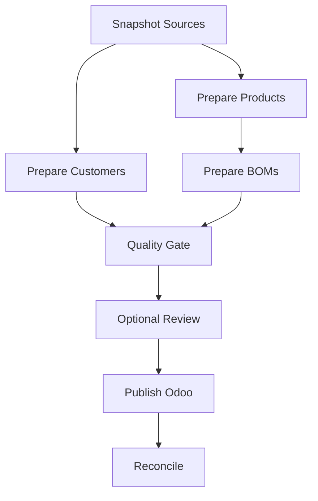
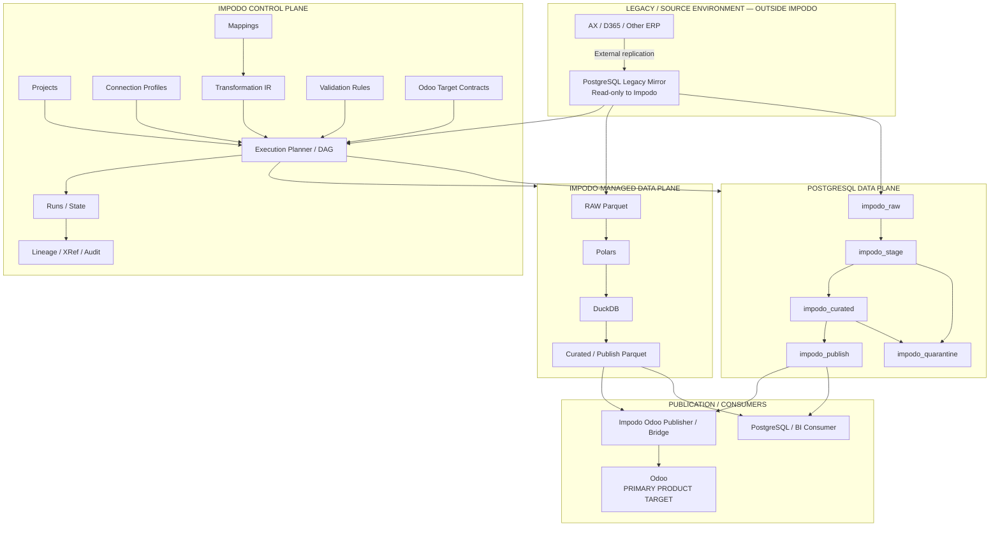
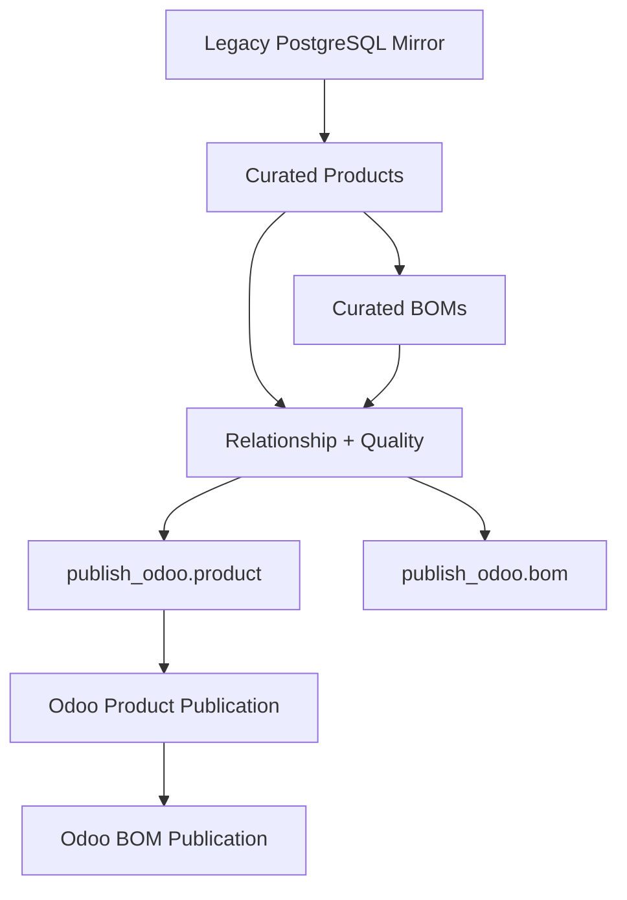

# Impodo Data Migration & ELT Architecture — Foundation Proposal

**Status:** Proposed architectural baseline
**Purpose:** Foundation for future Impodo development
**Primary product focus:** Odoo migration, import, transformation, and reconciliation
**Extended capability:** General staging, transformation, and ELT orchestration against PostgreSQL data environments
**Architecture principle:** Impodo owns the definitions, planning, orchestration, validation, lineage, and audit trail; the selected execution environment performs the bulk data processing.

---

## 1. Executive decision

Impodo should continue to be developed primarily as an **Odoo-focused migration and data import platform**, while its internal architecture should be generalized enough to support staging and transformation pipelines that are not necessarily executed inside the Impodo application process.

The proposed architecture therefore separates:

1. **Impodo's control plane** — what should happen.
2. **Impodo's execution/data planes** — where the bulk data processing happens.
3. **Target publishers** — how prepared data is committed to its final consumer, with Odoo remaining a first-class target rather than a generic database endpoint.

Two execution modes should be supported by the architecture:



### Mode A — Impodo-managed execution

Bulk data is brought into an Impodo-controlled workspace and transformed with:

* **Parquet** for immutable bulk artifacts;
* **Polars** for lazy/streaming columnar transformations;
* **DuckDB** for set-based operations, joins, identity resolution, relationship processing, quality checks, indexes, manifests, and project/run facts.

"Local" does **not** have to mean a laptop.

It means:

> The data processing is performed inside an Impodo-managed compute and storage environment.

That environment could be:

* a developer workstation;
* a dedicated Windows/Linux server;
* an Impodo appliance;
* a hosted Impodo worker.

The existing high-volume architecture work already concluded that the correct evolution of the current local product is the hybrid **Parquet + Polars + DuckDB** design rather than a premature PostgreSQL rewrite. 

### Mode B — PostgreSQL ELT execution

When the bulk source data already lives remotely in PostgreSQL and transferring large volumes through an Impodo worker would be inefficient, Impodo can orchestrate transformations **inside a PostgreSQL workspace**.

The PostgreSQL server then performs:

* joins;
* filters;
* grouping;
* deduplication;
* normalization;
* calculations;
* reference mapping;
* quality rules;
* materialization of staging and curated datasets.

Impodo sends and supervises the execution plan, but it does not need to carry every row through its own process.

The architecture must support both modes **without defining two different migration products**.

---

# 2. Product identity

The recommended positioning is:

> **Impodo is an Odoo-focused data migration and import platform built on a general data transformation and orchestration architecture.**

A more technical definition is:

> **Impodo defines, plans, validates, orchestrates and audits data movement and transformation. Pluggable execution workspaces perform bulk processing, while target publishers commit validated data to systems such as Odoo.**

This distinction matters because Impodo should not gradually become either:

* merely a CSV → Odoo importer; or
* a generic clone of dbt, SSIS, Dagster, Airflow, or another general data platform.

Its differentiating domain remains ERP/Odoo migration.

Impodo should understand concepts such as:

* Odoo models and fields;
* relational fields;
* external IDs;
* record dependencies;
* source-to-target identities;
* fresh-instance imports;
* migration into populated Odoo instances;
* matching and conflict resolution;
* source-to-Odoo reconciliation;
* migration reruns;
* Odoo-specific validation.

The transformation/orchestration core should nevertheless remain sufficiently generic that the same engine can also produce:

* PostgreSQL tables;
* BI datasets;
* dimensions and facts;
* reporting structures;
* downstream mirror databases.

---

# 3. Hard architectural boundary: Impodo does not connect to legacy ERP production systems

This should now be considered a design rule.

Impodo does **not** own replication from:

* AX 2012;
* AX v4;
* Dynamics 365;
* SAP;
* another production ERP.

Instead:



The replication mechanism belongs to infrastructure or another integration process.

Impodo begins from:

> **a PostgreSQL representation of the legacy ERP that it can safely inspect and read.**

This has several advantages:

* Impodo does not increase load on the production ERP.
* ERP-specific connectivity and authentication are outside the product.
* The transformation system works against a stable relational interface.
* AX/D365/SAP-specific database drivers do not pollute the Impodo connector architecture.
* Customers can control how their production systems are mirrored.
* Migration work can continue independently of production-system availability.

The source connector architecture can consequently remain relatively narrow:

```text
SourceConnector
│
├── PostgreSQLMirrorSource     strategic ERP source
├── CSVSource                  original/manual Impodo source
├── ExcelSource                original/manual Impodo source
└── OdooSource                 useful for Odoo → Odoo scenarios
```

There is deliberately no:

```text
AX2012Connector
D365Connector
SAPConnector
...
```

The ERP identity is metadata describing the PostgreSQL source, not a separate transport implementation.

---

# 4. Relationship with the existing BI/SSIS architecture

The supplied **BI Staging / Transform Process** is a useful functional reference for the remote PostgreSQL mode.

The current BI methodology explicitly separates:

```text
Sources
   ↓
Staging database
   ↓
Transformation database
   ↓
OLAP / Jedox / other consumers
```

and describes this methodology as independent from the particular technology used. It also explains the purpose of the common staging model: heterogeneous ERP fields representing equivalent business concepts are mapped into a unified staging structure, after which a single transformation process can operate consistently. 

The transformation phase described in that document performs exactly the kinds of operations Impodo needs to model:

* joining tables;
* selecting required columns;
* deriving calculated columns;
* grouping and aggregation;
* cleaning and normalization;
* dimension/fact key preparation.

The current SSIS solution then uses master packages and SQL Server Agent to orchestrate package order, scheduling, failures, retries and logging. 

Impodo should reproduce the **useful architectural concepts**, not reproduce SSIS itself.

| Existing BI / SSIS concept | Proposed Impodo concept    |
| -------------------------- | -------------------------- |
| SSIS Solution              | Impodo Project             |
| Connection Manager         | Connection Profile         |
| SSIS Package               | Pipeline / Task Definition |
| Master Package             | Execution Plan / DAG       |
| OLE DB Source              | PostgreSQL Mirror Source   |
| Staging DB                 | Staging Workspace          |
| Transformation DB          | Curated Workspace          |
| Lookup                     | Lookup / Mapping Operation |
| Merge Join                 | Join Operation             |
| Derived Column             | Transformation Expression  |
| Conditional Split          | Validation / Quarantine    |
| SQL Server Agent           | Workflow Backend / Runner  |
| Job history                | Migration Run              |
| Transform DB mirror        | Publication Target         |
| DIM / FACT tables          | Curated Data Products      |
| OLAP/Jedox                 | Consumer                   |
| —                          | Odoo Target Contract       |
| —                          | Odoo Publisher             |
| —                          | Source-to-target XRef      |
| —                          | Migration Lineage          |
| —                          | Odoo reconciliation        |

Impodo therefore acts as a modern control layer around the same general staging/transformation methodology, but with stronger migration governance and Odoo awareness.

---

# 5. One important refinement over the existing staging model: add RAW

The existing BI methodology moves heterogeneous source data into a common staging structure.

For Impodo, an additional **RAW** boundary is recommended.



The purpose is to distinguish:

```text
What the source contained
          from
How Impodo interpreted it
```

This is very important for migration debugging and auditability.

If AX contains:

```text
CUSTTABLE.ACCOUNTNUM
CUSTTABLE.NAME
CUSTTABLE.DATAAREAID
```

the RAW representation should remain source-oriented.

Later:

```text
raw.custtable
      ↓
staging.customer
      ↓
curated.customer
      ↓
publish_odoo.res_partner
```

This gives four semantically different layers.

---

# 6. Logical data layers

The architecture should define six logical dataset states.

## 6.1 SOURCE MIRROR

The externally managed PostgreSQL representation of the legacy ERP.

Characteristics:

* outside Impodo ownership;
* read-only from Impodo;
* source-specific structure;
* may change as upstream replication executes;
* never mutated by an Impodo transformation.

Example:

```text
ax12.custtable
ax12.salestable
ax12.salesline
ax12.inventtable
ax12.bom
```

---

## 6.2 RAW

An immutable representation bound to one Impodo run.

Example:

```text
raw.custtable
raw.salesline
raw.inventtable
```

RAW preserves source meaning and provides the reproducibility boundary.

It can physically be:

### Impodo-managed mode

```text
Parquet
```

### PostgreSQL mode

```text
PostgreSQL materialized raw tables
```

A run should never silently continue transforming against an unbound, continuously changing mirror.

---

## 6.3 STAGING

Normalized/unified source information.

Examples:

```text
staging.customer
staging.product
staging.sales_order
staging.sales_order_line
staging.bom
```

Operations here include:

* consistent types;
* normalized null representation;
* source-field renaming;
* source-system harmonization;
* straightforward cleansing;
* common business identifiers.

This corresponds closely to the common staging concept described in the BI document. 

---

## 6.4 CURATED

Business-ready data produced through substantive transformation.

Examples:

```text
curated.customer
curated.product
curated.sales
curated.stock
curated.bom
```

or, for analytical workloads:

```text
curated.dim_customer
curated.dim_product
curated.fact_sales
curated.fact_stock
```

The existing BI process already produces large sets of DIM and FACT transformation tables for downstream OLAP/Jedox consumption. 

Within Impodo, **Curated Dataset** or **Data Product** is a better technical term than "cube."

"Cube" can remain a user-facing term where the actual use case is analytical/OLAP.

---

## 6.5 PUBLISH

A consumer-specific projection.

For example:

```text
publish_odoo.res_partner
publish_odoo.product_template
publish_odoo.product_product
publish_odoo.mrp_bom
```

or:

```text
publish_bi.fact_sales
```

or:

```text
publish_partner.customer_extract
```

The important point is:

> A publish dataset expresses what a consumer needs. It is not necessarily a physical copy of the consumer's internal database table.

For Odoo specifically, `publish_odoo.res_partner` is an **Odoo import contract**, not an attempt to recreate the physical PostgreSQL `res_partner` table.

---

## 6.6 QUARANTINE

Rows that cannot safely proceed.

Examples:

```text
quarantine.customer
quarantine.product
quarantine.bom
```

Reasons could include:

* missing mandatory values;
* duplicate source identities;
* ambiguous references;
* invalid conversions;
* unresolved parents;
* invalid business rules;
* conflicting existing Odoo matches.

Quarantine should be an explicit data state rather than an exception buried in logs.

---

# 7. Not every logical layer must become a physical table

The logical architecture should not force unnecessary materialization.

A pipeline may logically contain:

```text
RAW
 ↓
STAGING
 ↓
CURATED
 ↓
PUBLISH
```

while physically executing:

```text
RAW Parquet
     │
     └── lazy Polars/DuckDB plan
                 │
                 ▼
          PUBLISH Parquet
```

or:

```text
raw PostgreSQL table
       │
       └── CTEs / views / SQL
                 │
                 ▼
       publish PostgreSQL table
```

Materialize an intermediate layer when it provides a concrete benefit:

* restart/checkpoint boundary;
* expensive dataset reused by several descendants;
* audit requirement;
* human review;
* multiple consumers;
* debugging;
* long-running transformation;
* data-quality approval gate.

This prevents Impodo from creating five physical copies of every dataset merely because the conceptual architecture contains five layers.

---

# 8. Immutable source snapshots are mandatory for governed runs

A migration run must be reproducible.

The source mirror may continue changing while the migration is executed, therefore each governed run needs a clearly bound source state.

## Local / Impodo-managed mode

```text
PostgreSQL Mirror
       │
       ▼
Immutable Parquet snapshot
       │
       ▼
Transformation
```

The Parquet artifact becomes the source evidence for that run.

Parquet is specifically designed as a column-oriented persistent data format and organizes data into row groups and column chunks for efficient selective reads. DuckDB can apply projection and predicate pushdown when reading Parquet. ([Parquet][1])

## PostgreSQL workspace mode

```text
PostgreSQL Mirror
       │
       ▼
impodo_raw.run_<id>_*
       │
       ▼
Transformation
```

PostgreSQL `REPEATABLE READ` provides a stable transaction snapshot for repeated reads within a transaction. PostgreSQL also supports exporting a transaction snapshot so additional sessions can synchronize to the same snapshot when parallel extraction is required. ([PostgreSQL][2])

The architecture should therefore record:

```text
Run
├── source connection
├── source schema revision
├── source snapshot identity
├── extraction timestamp
├── selected source tables
├── row counts
├── artifact/table hashes or fingerprints
└── transformation revision
```

The exact hashing strategy remains governed by the existing Impodo evidence architecture rather than being reinvented here. The current high-volume plan already establishes immutable run manifests, pending publication and hash-bound artifacts as core requirements. 

---

# 9. Two data planes, not two products

## 9.1 Impodo-managed data plane

Recommended stack:



### Responsibilities

**Parquet**

* immutable source snapshots;
* bulk typed canonical datasets;
* transformed artifacts;
* large review/export artifacts.

**Polars**

* projection;
* casts;
* row-local transformations;
* string normalization;
* conditional expressions;
* lazy columnar processing;
* streaming/bounded transformations.

Polars' lazy API supports predicate/projection pushdown and streaming execution, allowing large datasets to be processed without requiring the complete dataset as Python row objects. ([Polars User Guide][3])

**DuckDB**

* querying Parquet;
* joins;
* grouping;
* deduplication;
* relationship resolution;
* global quality rules;
* identity indexes;
* lineage/effect facts;
* manifests;
* execution facts;
* set-based reconciliation.

DuckDB supports disk spilling for many larger-than-memory operations, although blocking operations such as joins, grouping and sorting still require explicit resource governance. ([DuckDB][4])

The existing Impodo scale architecture already chose this responsibility split and should remain authoritative for the local product. 

---

## 9.2 PostgreSQL ELT data plane

Recommended conceptual workspace:

```text
PostgreSQL Workspace

impodo_raw
impodo_stage
impodo_curated
impodo_publish
impodo_quarantine
impodo_runtime
```

PostgreSQL schemas are namespaces and therefore provide a natural mechanism for separating these logical layers within one database where that deployment model is appropriate. ([PostgreSQL][5])

Example:


Here Impodo orchestrates commands such as:

```text
Materialize source snapshot
        ↓
Create normalized customer staging
        ↓
Resolve reference mappings
        ↓
Build curated customer
        ↓
Run validations
        ↓
Build Odoo publication projection
```

PostgreSQL performs the expensive set-based operations close to the data.

---

# 10. How Impodo chooses between local and PostgreSQL execution

Execution location should **not** simply depend on the final target.

The correct question is:

> Where can this data be transformed most safely and efficiently?

Important factors include:

| Factor                            | Impodo-managed execution | PostgreSQL execution   |
| --------------------------------- | ------------------------ | ---------------------- |
| Small/medium migration            | Strong fit               | Often unnecessary      |
| CSV/Excel input                   | Strong fit               | Requires loading first |
| Desktop/offline work              | Strong fit               | Weak fit               |
| Data already in remote PostgreSQL | Possible                 | Strong fit             |
| Very large relational joins       | Good with DuckDB         | Often strong           |
| Avoid network egress              | Weak if data is remote   | Strong                 |
| Shared transformation environment | Limited                  | Strong                 |
| Local exploratory review          | Strong                   | Possible               |
| DBA-controlled infrastructure     | Not required             | Required               |
| Odoo target                       | Strong                   | Also valid             |

Therefore:

```text
PostgreSQL mirror → PostgreSQL transform → Odoo
```

can be completely reasonable.

The use of PostgreSQL does **not** require PostgreSQL to be the final target.

---

# 11. Do not implement automatic cross-engine optimization yet

Eventually an execution planner could split a logical pipeline:

```text
Transformation Plan
        │
        ├── PostgreSQL-capable operations
        │
        └── Python/Impodo-specific operations
```

and move computation dynamically between environments.

That is a much later optimization.

The first architecture should select a **primary execution workspace** for a dataset/pipeline run:

```text
ExecutionWorkspace
│
├── LocalWorkspace
│
└── PostgreSQLWorkspace
```

A plan must clearly state whether it is executable in the chosen workspace.

If not, Impodo should:

* reject it with an explicit capability explanation; or
* execute a deliberately bounded fallback.

It should **not silently download millions of rows into Python because one transformation is unsupported remotely**.

---

# 12. The canonical transformation definition must belong to Impodo

This is one of the most important foundation decisions.

Impodo should not define transformations primarily as:

```python
def transform_customer(row):
    ...
```

and should not define them primarily as arbitrary PostgreSQL SQL either.

Instead:

```text
User Mapping / UI
        │
        ▼
Impodo Transformation Definition
        │
        ▼
Typed Transformation IR
        │
        ▼
Execution Planner
       / \
      /   \
     ▼     ▼
Local     PostgreSQL
compiler   compiler
```

The **Impodo Transformation IR** is the source of truth.

---

# 13. Transformation IR

The IR should be:

* declarative;
* typed;
* versioned;
* deterministic;
* serializable;
* engine-aware but engine-independent.

Pydantic v2 is a good fit for defining and validating these Python domain contracts and generating stable serialized representations.

The canonical persisted representation should preferably be versioned JSON.

YAML may be offered as a human-friendly import/export representation, but YAML should not become the canonical storage contract.

Example:

```yaml
version: 1

dataset: customer

source:
  dataset: raw.custtable

columns:
  source_key:
    source: ACCOUNTNUM
    type: string

  name:
    source: NAME
    operations:
      - trim
      - normalize_whitespace

  vat:
    source: VATNUM
    operations:
      - trim
      - uppercase

  country_code:
    source: COUNTRYREGIONID

lookups:
  country:
    source: country_code
    mapping: country_mapping

validation:
  - required: source_key
  - unique: source_key
  - required: name

target:
  type: odoo
  model: res.partner
```

Internally this should become objects such as:

```text
DatasetPlan
│
├── SourceNode
├── ProjectionNode
│   ├── ColumnExpression
│   ├── TrimExpression
│   ├── UpperExpression
│   └── CastExpression
├── LookupNode
├── JoinNode
├── ValidationNode
└── TargetProjectionNode
```

---

# 14. Transformation operations to support

The initial IR should be deliberately bounded.

Impodo does not need to become a general programming language.

### Scalar/column operations

```text
select
rename
cast
trim
lower
upper
replace
regex_replace
substring
concat
coalesce
null_if
default
case_when
date_parse
decimal conversion
```

### Relational operations

```text
filter
join
union
group
aggregate
window
deduplicate
sort
```

### Migration-specific operations

```text
value_map
lookup
normalize_identity
resolve_reference
resolve_parent
generate_external_id
match_target_identity
source_to_target_xref
```

### Quality operations

```text
required
unique
accepted_values
regex
range
foreign_reference_resolved
control_total
row_count
custom_assertion
```

These cover most legacy ERP → Odoo and BI transformation scenarios without attempting to support arbitrary programs.

---

# 15. Portability semantics must be defined explicitly

A transformation is only portable if DuckDB/Polars and PostgreSQL interpret it equivalently.

Impodo therefore needs explicit semantic rules for:

* `NULL` versus empty string;
* whitespace;
* case normalization;
* decimal precision and scale;
* floating-point usage;
* date interpretation;
* timestamps;
* time zones;
* boolean coercion;
* ordering;
* uniqueness;
* string collation/case sensitivity;
* invalid casts;
* missing references.

These semantics belong to the **Impodo transformation contract**, not to whichever database happens to execute the plan.

Golden parity tests must verify that supported operations produce the same logical results under both data planes.

---

# 16. Engine capabilities

Each operation should declare where it can execute.

Example:

| Operation                  |       Polars |          DuckDB |       PostgreSQL |
| -------------------------- | -----------: | --------------: | ---------------: |
| trim                       |            ✓ |               ✓ |                ✓ |
| cast                       |            ✓ |               ✓ |                ✓ |
| regex replace              |            ✓ |               ✓ |                ✓ |
| join                       |            ✓ |               ✓ |                ✓ |
| large global deduplication |     possible | preferred local | preferred remote |
| relationship graph         |      limited |               ✓ |                ✓ |
| Odoo identity resolution   |            — |  metadata based |   metadata based |
| arbitrary Python plugin    | ✓ local only |               — |                — |
| PostgreSQL-specific SQL    |            — |               — |  PostgreSQL only |

If a transformation uses an escape hatch such as:

```text
PythonPlugin
```

the project should visibly become:

```text
Portable: NO
Required engine: LocalWorkspace
```

Similarly, custom PostgreSQL SQL should be explicitly marked backend-specific.

Portability must never be implied when it does not exist.

---

# 17. Local compiler strategy

Do not replace the current local architecture with a SQL-only architecture.

The local planner should use the appropriate existing engine.



Typical allocation:

### Polars

```text
projection
cast
trim
replace
case
simple normalization
column expressions
row-local issue flags
```

### DuckDB

```text
joins
global duplicates
grouping
relationship resolution
cross-dataset validation
large aggregations
set-based quality
indexes
reconciliation
```

This is consistent with the already selected high-volume Proposal B architecture rather than requiring a rewrite of the local data plane. 

---

# 18. PostgreSQL compiler strategy

The remote PostgreSQL backend needs to compile the same Impodo IR into PostgreSQL-compatible SQL.

Recommended architecture:

```text
Impodo IR
    │
    ▼
PostgreSQL Compiler
    │
    ▼
SQLGlot AST
    │
    ▼
PostgreSQL SQL
```

SQLGlot provides a SQL parser, AST, optimizer/transpiler framework and multiple SQL dialects, making it useful as the SQL-generation layer rather than manually concatenating SQL strings. ([SQLGlot][6])

However:

> **SQLGlot AST must not become Impodo's stored transformation model.**

SQLGlot is an adapter/compiler dependency.

Impodo IR remains authoritative.

This ensures that replacing SQLGlot in the future would not invalidate stored projects and migration definitions.

---

# 19. PostgreSQL connectivity: revised tool decision

After rechecking the available technologies, the recommended PostgreSQL connectivity stack is deliberately layered.

## 19.1 Psycopg 3 — control and correctness path

Use Psycopg 3 for:

* transactions;
* DDL;
* schema management;
* run metadata;
* snapshot control;
* parameterized queries;
* `COPY`;
* fallback bulk transfer.

Psycopg 3 exposes PostgreSQL's `COPY` protocol, which provides an efficient path for bulk loading. ([Psycopg][7])

This should be the dependable PostgreSQL control adapter.

---

## 19.2 Apache Arrow ADBC PostgreSQL — preferred columnar bulk path after qualification

ADBC is particularly interesting for Impodo because its connectivity model is Arrow-native rather than Python-row-oriented. The Apache Arrow project currently classifies its PostgreSQL driver as stable. ([Apache Arrow][8])

That maps naturally to:

```text
PostgreSQL
    ↓
Arrow RecordBatch
    ↓
Polars / Parquet
```

rather than:

```text
PostgreSQL
    ↓
Python tuple
    ↓
dict
    ↓
DataFrame
```

Arrow `RecordBatch` is a natural typed batch boundary for columnar interoperability. ([Apache Arrow][9])

However, this should be introduced behind a **type-parity qualification gate**.

Current ADBC PostgreSQL documentation notes, for example, that PostgreSQL `NUMERIC` currently requires special handling because it does not map directly to an Arrow decimal in the normal read path. ([Apache Arrow][10])

Therefore the decision is:

> **ADBC is the preferred high-volume columnar adapter once our ERP datatype matrix passes. Psycopg remains the correctness/control/fallback adapter.**

Not:

> Replace Psycopg with ADBC everywhere.

---

# 20. DuckDB PostgreSQL extension should not be the foundation connector

DuckDB can attach to and query PostgreSQL through its PostgreSQL extension. ([DuckDB][11])

That is useful for:

* exploration;
* previews;
* ad hoc queries;
* selected acceleration paths.

However, current DuckDB documentation classifies the PostgreSQL extension in its secondary-support category rather than the strongest core-support tier. ([DuckDB][12])

Therefore:

> **Do not make DuckDB's PostgreSQL extension the only production-grade source interface for Impodo.**

It can remain an optional optimization.

The production source boundary should remain behind Impodo's own connector contract using qualified PostgreSQL transport implementations.

---

# 21. Remote PostgreSQL-to-PostgreSQL data movement

Several transport strategies should be supported.

## Case A — source mirror and workspace share the same PostgreSQL database

Best case:

```text
Mirror schema
    │
    ▼
CREATE TABLE / INSERT ... SELECT
    │
    ▼
Impodo RAW schema
```

There is almost no application-level data transport.

---

## Case B — different PostgreSQL databases/servers, FDW permitted

`postgres_fdw` provides a PostgreSQL-native mechanism for accessing tables in another PostgreSQL database. ([PostgreSQL][13])

Possible architecture:

```text
Legacy Mirror PostgreSQL
         │
         │ postgres_fdw
         ▼
Impodo Workspace PostgreSQL
         │
         ▼
Materialized RAW snapshot
```

The important word is **materialized**.

Production transformations should generally operate from the Impodo-bound RAW state, not continuously against mutable foreign tables.

`postgres_fdw` is therefore a transport mechanism, not the governance boundary.

---

## Case C — FDW unavailable

Impodo relays the data:

```text
PostgreSQL Mirror
       │
       │ ADBC / Psycopg
       ▼
Impodo Worker
       │
       │ bounded batches
       ▼
PostgreSQL Workspace
```

The worker streams the data but does not need to persist it locally.

This is less network-efficient than server-side transfer but remains portable.

---

# 22. Source connector contract

A source connector should describe and stream data without depending on a particular execution engine.

Conceptually:

```python
class SourceConnector:
    def describe(self) -> SourceSchema:
        ...

    def snapshot(self, request: SnapshotRequest) -> SnapshotHandle:
        ...

    def read_batches(
        self,
        snapshot: SnapshotHandle,
    ) -> Iterator[RecordBatch]:
        ...
```

The exact Python API may differ, but the separation is useful:

```text
Source
    !=
Workspace
    !=
Transformation
```

This allows:

```text
PostgreSQLMirrorSource
           │
           ├── LocalWorkspace
           │
           └── PostgreSQLWorkspace
```

without coupling the connector to either destination.

---

# 23. Apache Arrow as an interchange contract, not necessarily a storage format

Arrow should be used where a columnar batch boundary is useful.

For example:

```text
PostgreSQL ADBC
      │
      ▼
Arrow RecordBatch
      │
   ┌──┴───────┐
   ▼          ▼
Polars      Parquet
```

But Impodo should not force gratuitous Arrow conversion where two components already have an efficient direct integration.

The rule should be:

> **Use Arrow-compatible typed batches as the interoperability contract; avoid conversions performed only to satisfy an architectural diagram.**

Parquet remains the durable file format.

Arrow remains the in-memory/inter-process columnar interchange model.

---

# 24. DuckDB concurrency rule

The local workspace should retain the current architecture of **one heavy writer process per DuckDB project database**.

DuckDB's supported concurrency model allows multiple writer threads within a process, while multi-process writing to the same database file is not the normal supported architecture. ([DuckDB][14])

Therefore:

```text
Browser / API
      │
      ▼
Job request
      │
      ▼
Single Impodo preparation worker
      │
      ▼
Project DuckDB
```

The browser/server UI should never itself retain the complete transformed dataset.

This is already consistent with the current Impodo high-volume plan. 

---

# 25. Control plane architecture

Impodo's real product value increasingly belongs in the control plane.

It should own objects such as:

```text
Project
ConnectionProfile
SourceDefinition
SourceSchemaSnapshot
DatasetDefinition
MappingRevision
TransformationProgram
ValidationRuleset
TargetContract
ExecutionPlan
MigrationRun
ArtifactManifest
Lineage
SourceTargetXRef
PublicationState
ReconciliationResult
```

These are relatively small metadata objects.

Bulk business rows should **not** live inside these domain objects.

---

# 26. Metadata storage

For the local product:

> **Keep DuckDB as the current project control database and set-based working database.**

That aligns with the existing architecture and avoids adding infrastructure merely for architecture purity. 

However, persistence should remain behind:

```text
MetadataRepository
```

because a future hosted/multi-user version may eventually use:

```text
Central PostgreSQL
```

for control-plane state.

This should be a future implementation option, not a current migration project.

Bulk data remains in:

```text
Parquet / PostgreSQL workspace
```

rather than being pushed into the metadata repository.

---

# 27. Artifact storage

Introduce the concept:

```text
ArtifactStore
```

Current implementation:

```text
LocalFileArtifactStore
        │
        └── Parquet
```

Future hosted implementation:

```text
ObjectStorageArtifactStore
```

The domain model only sees:

```text
ArtifactHandle
ArtifactHash
ArtifactManifest
```

This provides a clean path from workstation/server deployment to hosted deployment without changing transformation definitions.

---

# 28. Odoo must remain first-class

Generic architecture should not make Odoo merely:

```text
TargetAdapter #4
```

Impodo should have an explicit Odoo domain layer.

```text
Impodo Core
│
├── transformations
├── validation
├── workspaces
├── orchestration
└── lineage
        │
        ▼
Impodo Odoo
├── metadata discovery
├── target contracts
├── relationship handling
├── dependency planning
├── matching policies
├── external IDs
├── publication
└── reconciliation
```

This is where Impodo retains its original identity.

---

# 29. Odoo Target Contract

Before publishing, Impodo should build an immutable snapshot describing the relevant target Odoo environment.

Example:

```text
OdooTargetContract

Odoo version
Installed modules
Model: res.partner
Fields:
  name
  ref
  vat
  email
  country_id
  parent_id
  company_type

Relations:
  country_id -> res.country
  parent_id -> res.partner

Required fields
Readonly/computed fields
Selection values
Company rules
Target identity policies
```

Then transformations can prepare against this frozen contract instead of repeatedly querying Odoo while transforming.

This prevents N+1 Odoo access patterns.

---

# 30. Odoo publication projection

A publication dataset might contain:

```text
publish_odoo.res_partner

_impodo_source_system
_impodo_source_key
_impodo_external_id

name
ref
vat
email

country_external_key
parent_source_key

company_type
customer_rank
```

It should **not necessarily contain**:

```text
country_id = 127
parent_id = 4938
```

because those integer IDs belong to one particular Odoo database.

The Odoo Publisher resolves relationships using:

* source-target XRefs;
* external IDs;
* known natural keys;
* target metadata.

This makes the same prepared dataset more portable and rerunnable.

---

# 31. Never use direct SQL writes to Odoo as the normal publication path

Odoo's ORM documentation explicitly warns that direct SQL bypasses ORM behavior and security mechanisms. Odoo's supported APIs, by contrast, operate through its access-right and record-rule system. ([Odoo][15])

Therefore the architecture is:

```text
Prepared Odoo Dataset
        │
        ▼
   Odoo Publisher
        │
        ▼
 Odoo ORM / supported API
        │
        ▼
     Odoo DB
```

not:

```text
Prepared PostgreSQL
        │
        ▼
INSERT INTO Odoo tables
```

The fact that both systems use PostgreSQL is not a reason to bypass Odoo's application layer.

---

# 32. Impodo Odoo Bridge addon

A dedicated **Impodo Odoo Bridge** addon is recommended as the long-term publication interface.

Its responsibilities can include:

* expose target capability metadata;
* validate Impodo compatibility;
* accept bounded batches;
* call Odoo ORM internally;
* resolve external references;
* return created/updated IDs;
* support idempotency tokens;
* handle controlled transaction boundaries;
* expose reconciliation results;
* report Odoo-specific errors in structured form.

Odoo's ORM accepts a list of value dictionaries for `create()`, allowing record creation to be handled in batches rather than one network request per record. ([Odoo][15])

The bridge therefore allows:

```text
Impodo
   │
   │ batch
   ▼
Impodo Odoo Bridge
   │
   │ ORM
   ▼
Odoo Models
```

This is a stronger product boundary than making every Impodo version know the implementation details of every Odoo version.

---

# 33. Fresh Odoo versus populated Odoo

This belongs to the **publication policy**, not the transformation engine.

## Fresh Odoo

Typical policy:

```text
CREATE
```

with source-target mappings recorded.

## Existing Odoo

Typical flow:

```text
MATCH
  │
  ├── unique match → UPDATE / SKIP
  ├── no match     → CREATE
  └── ambiguous    → QUARANTINE / REVIEW
```

Example policy:

```yaml
match:
  - impodo_external_id
  - ref
  - vat

on_unique_match: update
on_missing: create
on_ambiguous: quarantine
```

The same curated customer dataset can therefore be published according to different target policies.

---

# 34. Source-to-target XRef is a core data structure

Impodo should maintain a durable cross-reference such as:

```text
source_system: AX12
source_entity: CUSTTABLE
source_key: 004573

target_system: ODOO
target_model: res.partner
target_id: 18294
external_id: impodo_ax12.partner_004573
```

This supports:

* reruns;
* idempotency;
* relation resolution;
* updates;
* audit;
* reconciliation;
* troubleshooting.

For related datasets:

```text
AX customer 004573
        │
        ▼
xref
        │
        ▼
Odoo partner 18294
```

then an invoice, sale order, contact or other child can resolve its parent through the XRef rather than guessing based on Odoo numerical IDs.

---

# 35. Orchestration model

Impodo needs a pipeline DAG, but Impodo itself should remain the domain owner.

Example:



Pipeline nodes should be explicit tasks such as:

```text
SNAPSHOT
TRANSFORM
MATERIALIZE
VALIDATE
APPROVE
PUBLISH
RECONCILE
```

Dependencies belong to Impodo's execution plan rather than hidden procedural code.

---

# 36. Run states

A run should have explicit durable states.

For example:

```text
CREATED
    ↓
SNAPSHOTTING
    ↓
TRANSFORMING
    ↓
VALIDATING
    ↓
READY
    ↓
PUBLISHING
    ↓
PUBLISHED
    ↓
RECONCILED
```

Failure branches:

```text
FAILED
CANCELLED
QUARANTINED
```

A failed attempt must not alter the last successful "current" run.

The existing local architecture already uses pending immutable work followed by short atomic promotion of the verified run, which should remain the model for future execution backends. 

---

# 37. Idempotency and restartability are foundation requirements

ERP migration pipelines will fail.

Examples:

* network interruption;
* Odoo timeout;
* invalid reference;
* PostgreSQL worker failure;
* disk limit;
* user cancellation.

Impodo must therefore know:

```text
What completed?
What failed?
What input version was used?
Which transformation revision was used?
What is safe to retry?
What was already published?
```

Each task should be designed for either:

```text
safe retry
```

or:

```text
explicit rollback/restart
```

Never:

```text
"we think these records probably completed"
```

---

# 38. Native workflow runner first; Temporal later

Impodo should define:

```text
WorkflowBackend
```

Current implementation:

```text
NativeWorkflowBackend
```

This owns:

* task dependency execution;
* statuses;
* retries;
* cancellation;
* checkpoints;
* progress.

Do **not** introduce a heavyweight orchestration product merely to have an orchestration product.

Temporal becomes interesting later because its workflow model is designed to survive worker/process failures and resume durable workflows. ([Temporal][16])

A future architecture could be:

```text
Impodo MigrationRun
        │
        ▼
TemporalWorkflowBackend
        │
        ├── snapshot
        ├── transform
        ├── validation
        ├── approval
        ├── publish
        └── reconcile
```

But Temporal should remain infrastructure.

Impodo remains the product/control plane.

---

# 39. Why dbt, SQLMesh, Dagster and Prefect are not the core architecture

These tools solve real problems, but none should own the canonical Impodo project model at this stage.

If Impodo were only an internal company ETL process, using an external orchestration/transformation system as the main platform would be reasonable.

Impodo instead owns Odoo-specific concepts that are central to the product:

```text
mapping revision
Odoo target schema
relationship resolution
source-target identities
migration conflict
fresh vs existing instance policy
publication
reconciliation
migration evidence
```

Therefore:

```text
Impodo → dbt project
```

or:

```text
Impodo → Dagster assets
```

should not define the product architecture.

Future adapters/exporters are possible.

For example:

```text
Impodo IR
   │
   └── SQLMesh/dbt export
```

could later provide value for customers already operating those environments.

But the source of truth remains Impodo IR.

---

# 40. Why Spark is not part of the current foundation

Nothing in the current product requirements justifies introducing a distributed Spark cluster.

The existing local performance target is approximately 16,000 products plus 80,000 related BOM lines, and the current implementation plan deliberately retains the Parquet/Polars/DuckDB worker architecture for that class of workload. 

PostgreSQL provides a natural remote execution environment for the much larger relational datasets currently anticipated.

Spark would introduce:

* deployment complexity;
* distributed state;
* serialization concerns;
* operational infrastructure;
* another transformation semantic target.

It should only be reconsidered when measured workloads demonstrate a requirement that neither the Impodo-managed engine nor PostgreSQL workspace can reasonably satisfy.

---

# 41. Security model

The architecture should introduce a `SecretProvider` abstraction.

Connection profiles should contain:

```text
host
port
database
username
secret_reference
TLS configuration
connection policy
```

not:

```text
plaintext password
```

The existing SSIS process similarly centralizes connection details and protects sensitive package values, demonstrating that connection/security configuration is already an important operational concern in the current architecture. 

Impodo should additionally enforce least privilege.

### Legacy mirror credential

```text
SELECT only
```

### PostgreSQL workspace credential

```text
read/write only within configured Impodo schemas
```

### Odoo service credential

```text
permissions required for intended migration
```

No credential should automatically grant access across all three environments.

---

# 42. SQL safety

Generated SQL should never be built from arbitrary string concatenation.

The PostgreSQL compiler should:

* build validated ASTs;
* parameterize values;
* quote identifiers correctly;
* restrict allowable schemas;
* restrict allowable functions;
* validate referenced datasets;
* reject unapproved arbitrary SQL.

Custom SQL should be an explicit advanced capability with clear backend and security implications.

The transformation UI should normally produce structured IR, not free-form SQL.

---

# 43. Lineage

A user should ultimately be able to trace:

```text
Odoo record
     ↑
Publish row
     ↑
Curated row
     ↑
Staging row
     ↑
RAW row
     ↑
Legacy mirror row
```

Example:

```text
Odoo res.partner ID 18294

← publish_odoo.res_partner row 384
← curated.customer row 384
← staging.customer row 492
← raw.CUSTTABLE source row
← AX12 / CUSTTABLE / ACCOUNTNUM 004573
```

The existing local high-volume architecture already calls for compact lineage-edge facts rather than duplicating complete row payloads at every stage. 

That should extend naturally to PostgreSQL execution.

---

# 44. Data quality

Quality rules belong to Impodo definitions and should therefore be executable in either workspace where supported.

Examples:

```text
customer source key required
customer source key unique
VAT conforms to expected rules
country reference resolved
product reference unique
BOM parent exists
BOM component exists
invoice total reconciles
```

Results should be represented as:

```text
valid
warning
quarantine
blocking failure
```

Quality is not merely a log message.

A downstream publish stage must be able to consume:

```text
eligible rows only
```

while preserving explicit evidence explaining why other rows were excluded.

---

# 45. Validation versus Odoo target validation

Two types of validation should be distinguished.

## Data validation

```text
Is VAT present?
Is key unique?
Does parent resolve?
Is quantity valid?
```

This can often run entirely in the local/PostgreSQL data plane.

## Target validation

```text
Does this Odoo model exist?
Is this field available?
Is this selection value accepted?
Does target module configuration allow this?
Does matching find an existing record?
```

This requires an Odoo target contract/snapshot.

The transformation phase should never perform one Odoo query per source row.

---

# 46. Architecture package boundaries

A possible target package structure is:

```text
impodo/
│
├── domain/
│   ├── project.py
│   ├── connection.py
│   ├── dataset.py
│   ├── mapping.py
│   ├── transformation_ir.py
│   ├── validation.py
│   ├── target_contract.py
│   ├── execution_plan.py
│   └── run.py
│
├── application/
│   ├── planner.py
│   ├── runner.py
│   ├── snapshot.py
│   └── reconciliation.py
│
├── ports/
│   ├── source_connector.py
│   ├── execution_workspace.py
│   ├── artifact_store.py
│   ├── target_publisher.py
│   ├── metadata_repository.py
│   ├── workflow_backend.py
│   └── secret_provider.py
│
├── compiler/
│   ├── ir.py
│   ├── capabilities.py
│   ├── local.py
│   └── postgres.py
│
├── adapters/
│   │
│   ├── postgres_source/
│   │   ├── psycopg_control.py
│   │   ├── adbc_data.py
│   │   └── fdw_transport.py
│   │
│   ├── local_workspace/
│   │   ├── parquet_store.py
│   │   ├── polars_executor.py
│   │   └── duckdb_workspace.py
│   │
│   ├── postgres_workspace/
│   │   ├── sql_compiler.py
│   │   └── postgres_executor.py
│   │
│   └── odoo/
│       ├── metadata.py
│       ├── target_contract.py
│       ├── publisher.py
│       └── bridge_client.py
│
├── orchestration/
│   ├── graph.py
│   ├── checkpoint.py
│   └── state.py
│
├── security/
│
└── observability/
```

This is a directional structure, not a requirement to immediately create dozens of empty abstractions.

The rule should be:

> Introduce an interface when we have one current implementation and a credible second implementation, not merely because an architecture diagram allows one.

`ExecutionWorkspace` clearly passes that test because we know we want:

```text
LocalWorkspace
PostgreSQLWorkspace
```

---

# 47. Recommended tool stack

## Commit now

| Responsibility               | Technology               | Decision                            |
| ---------------------------- | ------------------------ | ----------------------------------- |
| Main application/domain      | Python                   | Keep                                |
| Typed definitions / IR       | Pydantic v2              | Adopt                               |
| Immutable bulk files         | Apache Parquet           | Keep                                |
| Columnar interchange         | Apache Arrow             | Adopt as boundary                   |
| Local lazy transforms        | Polars                   | Keep                                |
| Local set-based engine       | DuckDB                   | Keep                                |
| Local project metadata       | DuckDB                   | Keep for current product            |
| PostgreSQL control           | Psycopg 3                | Adopt                               |
| Bulk PostgreSQL columnar I/O | ADBC PostgreSQL          | Qualify, then prefer where suitable |
| Bulk PostgreSQL fallback     | Psycopg COPY             | Adopt                               |
| Odoo target                  | Impodo Odoo Bridge + ORM | Build                               |
| Workflow execution           | Impodo-native runner     | Keep/build                          |

## Add with PostgreSQL execution

| Responsibility                 | Technology     |
| ------------------------------ | -------------- |
| SQL AST/generation             | SQLGlot        |
| Remote staging                 | PostgreSQL     |
| Remote transformation          | PostgreSQL SQL |
| Remote quality/materialization | PostgreSQL     |

## Future, only when required

| Requirement                           | Technology direction                |
| ------------------------------------- | ----------------------------------- |
| Distributed durable workflows         | Temporal                            |
| Hosted bulk artifact storage          | Object storage                      |
| Hosted multi-user metadata/control DB | PostgreSQL                          |
| dbt/SQLMesh interoperability          | Adapter/export, not canonical model |

## Explicitly not core

```text
Pandas for bulk transformation
Spark
Direct Odoo PostgreSQL writes
Native AX/D365 source connectors
dbt as Impodo's domain model
Dagster/Prefect as Impodo's control plane
DuckDB PostgreSQL extension as sole production connector
```

---

# 48. Full target architecture



The most important visual distinction is:

```text
Impodo control plane
        ≠
bulk data plane
```

---

# 49. What a normal Odoo migration should still look like to the user

The architecture must not make a simple migration feel like operating a data warehouse.

A normal Impodo user should still be able to experience:

```text
1. Connect to PostgreSQL mirror / upload files
2. Select source tables
3. Connect to Odoo
4. Map fields
5. Define transformations
6. Preview
7. Validate
8. Import
9. Reconcile
```

Not:

```text
Please configure RAW, STAGING, CURATED and ELT execution schemas before importing 4,000 customers.
```

The layers are architecture.

The UI exposes complexity only when useful.

---

# 50. Example: simple customer migration

```text
PostgreSQL AX Mirror
         │
         ▼
RAW snapshot
         │
         ▼
Customer transform
         │
         ▼
Odoo projection
         │
         ▼
Odoo Publisher
         │
         ▼
res.partner
```

Internally it may technically contain staging and validation relations, but they need not be permanent or user-visible.

---

# 51. Example: large Odoo manufacturing migration



Products must resolve before BOM relationships are safely published.

That dependency is an Impodo DAG concern, not procedural knowledge buried inside one giant transformation function.

---

# 52. Example: BI modernization use case

The existing BI architecture could eventually be represented as:

```text
AX12 Mirror ──────┐
AX4 Mirror ───────┤
D365 Mirror ──────┤
Other sources ────┘
        │
        ▼
Unified Staging
        │
        ▼
Curated
├── DIMCUSTOMER
├── DIMARTICLE
├── FACTSALES
├── FACTSTOCK
└── ...
        │
        ▼
PostgreSQL Publication
        │
        ▼
Jedox / BI / other consumer
```

This corresponds to the staging → transformation → consumer methodology documented in the existing BI process, but the execution definitions, mapping, orchestration and audit would live in Impodo rather than SSIS packages and SQL Server Agent. 

---

# 53. Development roadmap

## Phase 0 — lock the architecture contracts

Before substantial implementation, create ADRs for:

```text
ADR-001 Source mirror boundary
ADR-002 ExecutionWorkspace abstraction
ADR-003 Impodo Transformation IR
ADR-004 Data-layer semantics
ADR-005 Immutable source snapshots
ADR-006 Odoo publication boundary
ADR-007 Source-to-target XRef
```

No PostgreSQL transformation engine is required yet.

The purpose is to prevent current code from introducing incompatible assumptions.

---

## Phase 1 — formalize PostgreSQL Mirror Source

Implement:

```text
PostgreSQLMirrorSource
```

with:

* schema introspection;
* read-only safety;
* snapshot creation;
* bounded extraction;
* type mapping;
* source metadata.

Perform a transport spike comparing:

```text
ADBC
vs
Psycopg COPY
```

on representative/sanitized ERP datasets.

Required datatype coverage:

```text
INTEGER
BIGINT
NUMERIC
DECIMAL
FLOAT
BOOLEAN
DATE
TIMESTAMP
TIMESTAMPTZ
TEXT
VARCHAR
UUID
BYTEA
NULL
large strings
```

Because ADBC currently has a PostgreSQL `NUMERIC` mapping caveat, exact-value parity must be demonstrated before it becomes the default bulk path. ([Apache Arrow][10])

---

## Phase 2 — place the existing local engine behind `LocalWorkspace`

Do **not** rewrite it.

Encapsulate the existing:

```text
Parquet
Polars
DuckDB
bounded worker
pending publication
```

behind:

```text
ExecutionWorkspace
```

while preserving all existing performance and governance behavior.

The existing high-volume architecture and its 16,000-product + 80,000-BOM target remain the release criteria for this work. 

---

## Phase 3 — formalize the Transformation IR

Move transformation definitions toward:

```text
Versioned typed IR
```

rather than engine-specific Python implementation.

Start with operations already supported by Impodo.

Do not expand scope merely to make the IR look complete.

Build:

```text
CapabilityRegistry
```

and mark each transformation as:

```text
local_polars
local_duckdb
postgresql
portable
non_portable
```

---

## Phase 4 — formalize Odoo Target Contract and Publisher

Build:

```text
OdooTargetContract
OdooPublisher
SourceTargetXRef
PublicationPolicy
ReconciliationResult
```

Then develop the Impodo Odoo Bridge addon.

This phase strengthens Impodo's existing primary product even before PostgreSQL ELT execution exists.

---

## Phase 5 — build `PostgreSQLWorkspace`

Implement:

```text
PostgreSQLWorkspace
```

with configurable logical schemas:

```text
raw
stage
curated
publish
quarantine
```

Capabilities:

* create run namespaces;
* materialize snapshots;
* execute generated SQL;
* write validation results;
* expose dataset metadata;
* resume/checkpoint;
* clean abandoned runs.

---

## Phase 6 — PostgreSQL compiler

Implement:

```text
Impodo IR
   ↓
PostgreSQL Compiler
   ↓
SQLGlot
   ↓
PostgreSQL SQL
```

Begin with the portable subset.

Do not attempt automatic Python/SQL hybrid execution.

If a requested transformation is unsupported:

```text
PlannerError:
Operation X cannot execute in PostgreSQLWorkspace.
```

That is preferable to an invisible multi-million-row fallback.

---

## Phase 7 — cross-engine semantic parity

Create golden datasets and verify:

```text
same source snapshot
+
same Transformation IR
=
same logical result
```

for:

```text
LocalWorkspace
PostgreSQLWorkspace
```

where the pipeline declares itself portable.

This is the real proof that we designed the transformation abstraction correctly.

---

## Phase 8 — durable distributed workflow only when needed

When requirements include:

* multiple hosted workers;
* long-running remote jobs;
* server failover;
* tenant concurrency;
* durable waits/approvals;
* robust distributed retries,

implement:

```text
TemporalWorkflowBackend
```

or reconsider the available durable orchestration technology at that time.

Do not make this a prerequisite for the core architecture.

---

# 54. Mandatory technical spikes

Before declaring the stack final, perform four measured prototypes.

## Spike A — PostgreSQL → local columnar extraction

Compare:

```text
ADBC → Arrow/Polars → Parquet
Psycopg COPY → conversion → Parquet
```

Measure:

* throughput;
* CPU;
* peak memory;
* network bytes;
* exact-value parity;
* null semantics;
* decimal precision;
* timestamps;
* binary fields.

---

## Spike B — PostgreSQL mirror → PostgreSQL workspace

Compare where infrastructure permits:

```text
postgres_fdw materialization
vs
Impodo streaming relay
```

Measure:

* transfer throughput;
* server CPU;
* network traffic;
* operational complexity;
* permissions required;
* reproducible snapshot behavior.

---

## Spike C — Transformation parity

Implement representative transformations in both engines:

```text
trim
cast
case
lookup
join
deduplicate
aggregate
relationship resolution
```

Verify exact logical parity.

---

## Spike D — Odoo publication

Measure bounded publication through the proposed bridge:

```text
100
500
1,000
...
records per batch
```

Measure:

* wall time;
* transaction behavior;
* error isolation;
* memory;
* retry semantics;
* idempotency.

Batch size must be selected from evidence rather than hard-coded architectural preference.

---

# 55. Test strategy

The architecture requires more than unit tests.

## Semantic tests

```text
IR → expected output
```

## Cross-engine tests

```text
LocalWorkspace result
==
PostgreSQLWorkspace result
```

for portable transformations.

## Snapshot tests

Verify that a run never mixes source states.

## Failure tests

Inject failure:

```text
after source snapshot
after transform
after validation
during publication
after partial Odoo batch
```

and verify recovery.

## Idempotency tests

Run the same migration twice and verify that it does not duplicate Odoo records.

## Relationship tests

```text
missing parent
duplicate parent
cycle
ambiguous reference
deep dependency
```

## Datatype tests

Especially:

```text
decimal precision
timezone
large text
binary
UUID
NULL
empty string
Unicode
```

## Performance tests

Retain the existing Impodo high-volume fixtures and requirements, including the product/BOM workload described in the current implementation plan. 

---

# 56. Observability

Every execution task should report structured metrics.

Example:

```text
run_id
pipeline_id
task_id
workspace
dataset

started_at
finished_at
elapsed

input_rows
output_rows
quarantined_rows

input_bytes
output_bytes
network_bytes

peak_memory
temporary_disk

source_snapshot_id
transformation_revision
validation_revision
```

Do not log unrestricted business values.

Errors should identify:

```text
dataset
row/source identity where allowed
rule
stage
operation
```

without leaking restricted data into generic application logs.

---

# 57. Design rules to protect now

The following should be treated as non-negotiable architectural rules unless deliberately superseded by an ADR.

### Rule 1

**Legacy ERP replication is outside Impodo.**

### Rule 2

**Impodo never writes to a legacy mirror.**

### Rule 3

**Every governed migration run is bound to an immutable source state.**

### Rule 4

**Impodo Transformation IR is canonical; Python, Polars, DuckDB SQL and PostgreSQL SQL are execution representations.**

### Rule 5

**Bulk business data does not live primarily in Python domain-object graphs.**

### Rule 6

**Local/Impodo-managed execution remains Parquet + Polars + DuckDB.**

### Rule 7

**PostgreSQL is an additional remote ELT workspace, not a replacement for the local engine.**

### Rule 8

**No silent unbounded fallback from PostgreSQL execution to Python materialization.**

### Rule 9

**Odoo is a first-class target domain.**

### Rule 10

**Odoo publication goes through Odoo's application/ORM boundary, not direct database inserts.**

### Rule 11

**Source-to-target XRef and lineage are first-class migration evidence.**

### Rule 12

**Failed or cancelled pending work never replaces the last verified current run.**

---

# 58. Explicit anti-goals

The following are **not** current goals.

```text
Build a complete dbt replacement
Build an Airflow/Dagster replacement
Support every database engine
Connect directly to every ERP
Automatically optimize pipelines across multiple engines
Create distributed Spark infrastructure
Write directly to Odoo's PostgreSQL schema
Turn every transformation into arbitrary Python
Turn every transformation into arbitrary SQL
Require PostgreSQL for simple local Odoo imports
Require users to understand data-engineering internals for normal migrations
```

This keeps the architecture extensible without allowing the platform work to swallow the product.

---

# 59. Architectural success test

The best simple test of this design is the future addition of remote PostgreSQL execution.

Suppose today an Odoo migration project contains:

```text
source mapping
transformation definitions
validation rules
Odoo mappings
target policy
```

and executes with:

```text
LocalWorkspace
```

Later the same project should be able to select:

```text
PostgreSQLWorkspace
```

provided its transformation operations are supported there.

If enabling PostgreSQL requires us to rewrite:

```text
the source mappings
the validation definitions
the Odoo mappings
the migration project
```

then the abstraction has failed.

If it mainly requires:

```text
PostgreSQLWorkspace
PostgreSQLCompiler
PostgreSQL transport
capability definitions
```

then the foundation is correct.

---

# 60. Final architectural baseline

The proposed long-term model is therefore:

```text
                    IMPODO
                      │
              CONTROL PLANE
                      │
    ┌─────────────────┼──────────────────┐
    │                 │                  │
 Connections       Mappings        Odoo Contracts
    │                 │                  │
    └─────────────────┼──────────────────┘
                      │
              Transformation IR
                      │
                Validation Rules
                      │
                Execution Planner
                      │
          ┌───────────┴───────────┐
          │                       │
          ▼                       ▼
 IMPODO-MANAGED             POSTGRESQL
 DATA PLANE                 DATA PLANE

 Parquet                     RAW
 Polars                       ↓
 DuckDB                     STAGING
    │                         ↓
    │                       CURATED
    │                         ↓
    └──────────────┬────────PUBLISH
                   │
                   ▼
            TARGET CONTRACT
                   │
          ┌────────┴─────────┐
          │                  │
          ▼                  ▼
     Odoo Publisher      DB / BI Publisher
          │
          ▼
         Odoo
```

The core architectural sentence for future decisions should be:

> **Impodo owns the migration semantics, transformation definitions, validation, execution plan, lineage and publication intent. The selected workspace owns bulk execution.**

And the product sentence should remain:

> **Impodo is first and foremost an Odoo data migration and import platform, while its orchestration foundation allows the same technology to stage, transform, validate and publish large ERP datasets through local columnar processing or remote PostgreSQL ELT execution.**

This preserves the original Impodo product while creating a credible path from:

```text
CSV / Excel
      ↓
Impodo local processing
      ↓
Odoo
```

to:

```text
Legacy ERP
    │
external replication
    ▼
PostgreSQL Mirror
    │
    ▼
Impodo orchestration
    │
    ├── Impodo-managed Parquet / Polars / DuckDB
    │
    └── Remote PostgreSQL ELT
                     │
                     ▼
               Curated datasets
                     │
            ┌────────┴────────┐
            ▼                 ▼
          Odoo              BI / DB
```

without requiring Impodo to abandon either its current local architecture or its Odoo identity.


The feedback is strong overall. I would accept most of it, with a few corrections in wording and priority.

The biggest value is that it catches **implementation hazards that the architecture document treated a bit too abstractly**. In particular, Risks 1–4 should become explicit architecture constraints, not just notes.

## 1. Risk 1 — cross-engine semantic drift

This is absolutely valid, and I would elevate it from “testing concern” to **core design constraint**.

The regex example is especially real. DuckDB uses RE2, while PostgreSQL uses POSIX-style regex semantics; Polars uses Rust regex semantics. These are not guaranteed to behave identically on edge cases. 

So I would amend our principle from:

> “the same IR can compile to both engines”

to:

> **A transformation operation is portable only if Impodo defines its semantics independently and both backends have passed parity tests for that operation.**

That leads to a capability registry like:

```text
trim
  local: supported
  postgres: supported
  parity: certified

regex_replace
  local: supported
  postgres: supported
  parity: restricted
  regex_profile: impodo_regex_v1
```

For regex specifically, I would seriously consider defining a **restricted Impodo regex subset** rather than accepting arbitrary regex and hoping transpilation works.

Same for timestamps and decimals.

So the Golden Cross-Engine Parity Suite should move earlier. I would not leave it until “Phase 7” conceptually. The tests should begin as soon as the first IR operations exist.

---

## 2. Risk 2 — ADBC and numeric precision

Also correct, and the current ADBC docs are actually even clearer than the feedback wording.

The PostgreSQL ADBC driver currently reads PostgreSQL `NUMERIC` as a **string representation** because PostgreSQL `NUMERIC` cannot always be losslessly represented as Arrow decimal types. 

For an ERP migration product, this affects exactly the fields we cannot casually approximate:

```text
invoice amounts
unit prices
tax values
currency amounts
BOM quantities
costs
stock quantities
exchange rates
```

So I would revise our recommendation.

Previously:

```text
ADBC → preferred high-volume path after qualification
Psycopg → fallback
```

I would now say:

```text
Psycopg 3 / COPY
    = baseline qualified PostgreSQL transport

ADBC
    = optional optimized columnar transport
      for datatype profiles we explicitly certify
```

That is a safer hierarchy.

We shouldn't make ADBC part of the critical path until its datatype behavior gives us an actual advantage for the specific workload.

---

## 3. Risk 3 — PostgreSQL permissions

Very good point.

Our conceptual schemas:

```text
impodo_raw
impodo_stage
impodo_curated
impodo_publish
```

are useful **logical namespaces**.

They should not become a deployment requirement.

Enterprise reality may give us something like:

```text
DBA creates:

database: migration_workspace
schema: impodo

Impodo user:
USAGE impodo
CREATE TABLE in impodo
SELECT/INSERT/UPDATE/DELETE
```

Then Impodo can create:

```text
impodo.raw_customer
impodo.stage_customer
impodo.curated_customer
impodo.publish_res_partner
```

Alternatively the DBA could pre-create the required objects and give Impodo only DML permissions.

So I would distinguish:

```text
Logical layer
    RAW
    STAGING
    CURATED
    PUBLISH

Physical namespace
    deployment-specific
```

This is a better architecture anyway.

### I would support three PostgreSQL workspace modes

```text
1. Managed workspace
   Impodo may create schema/tables.

2. Restricted workspace
   DBA provides one writable namespace.

3. External Impodo workspace
   Source mirror is read-only;
   staging/transform happens in another PostgreSQL instance.
```

That third case is probably quite common.

---

## 4. Risk 4 — UX complexity

Completely agree.

This should become a strict product rule:

> **The architecture may expose data-engineering layers internally without exposing data-engineering terminology unnecessarily to the migration user.**

A functional Odoo consultant should see:

```text
Source
Mappings
Transformations
Validation
Preview
Errors
Target
Import
Reconciliation
```

not:

```text
RAW
STAGING
CURATED
PUBLISH
materialization strategy
execution backend
```

unless they intentionally switch to an advanced/data-engineering view.

I would likely make two views eventually:

```text
Migration View
    business-oriented

Advanced Pipeline View
    engineering-oriented
```

For the normal Odoo migration workflow, the six-layer model stays mostly invisible.

---

# 5. Derived entities — this is an important gap

This is probably the most useful codebase-specific point in the feedback.

If Impodo already has deterministic derived-entity generation, then our IR cannot be limited to:

```text
column → transformed column
```

We need an operation that can produce **new datasets/entities**.

Conceptually:

```text
Source Product Dataset
        │
        │ derive_entity
        ▼
Derived Brand Dataset
```

or:

```text
product.description
        │
        ├── extract category
        ├── normalize
        ├── deduplicate
        └── assign deterministic identity
                │
                ▼
        derived.product_category
```

I would add explicit IR concepts such as:

```text
DeriveEntity
DeriveHierarchy
ExplodeEntity
ReferenceDerivedEntity
```

For example:

```yaml
operation: derive_entity

source_dataset: product

entity: brand

source_expression:
  field: description

identity:
  normalized_value: true
  deterministic_hash: true

output:
  dataset: derived.brand
```

That is much more important architecturally than adding another scalar function.

### Remote PostgreSQL execution

Some derived entity operations translate naturally:

```sql
SELECT DISTINCT
    normalized_brand,
    hash(...)
FROM staging.product
```

Others may not.

That's exactly where the capability registry matters.

```text
derive_entity/simple_distinct
    DuckDB: yes
    PostgreSQL: yes

derive_entity/custom_parser
    Polars/Python: yes
    PostgreSQL: no
```

So yes: the feedback identifies a real missing abstraction.

---

# 6. Credentials/security point

Agreed, though I would make the abstraction broader than integrating everything directly into `target_credentials.py`.

We should have:

```text
SecretProvider
```

and connection profiles should contain:

```text
host
port
database
username
secret_ref
TLS policy
```

not passwords.

Existing project filesystem protections remain useful for local artifacts, but database credentials introduce a different threat model.

For PostgreSQL connections we should eventually support:

```text
TLS required
certificate validation
CA reference
client certificate if required
secret rotation
connection timeout
read-only enforcement where applicable
```

So I would treat this as a **security architecture extension**, not merely an update to one credentials file.

---

# 7. The proposed immediate implementation sequence is mostly right

I like the first step:

> Wrap the existing engine rather than rewrite it.

That's exactly what I would do.

```text
ExecutionWorkspace
        ▲
        │
 LocalWorkspace
        │
        ├── current Polars pipeline
        ├── current DuckDB repository
        └── current Parquet artifacts
```

The danger would be rewriting working code just to conform to the new architecture.

We should instead create the port around it.

---

## 8. I would modify the proposed PostgreSQL step slightly

The feedback says:

> Implement PostgreSQLMirrorSource using Psycopg 3 for schema introspection and COPY batch reading.

Yes.

Then:

> Prototype PostgreSQLWorkspace using SQLGlot to generate standard PostgreSQL DDL/DML for RAW → STAGE → PUBLISH.

Mostly yes, but I would **not start with SQLGlot as the first thing**.

I'd do:

```text
Impodo IR
    ↓
very small explicit PostgreSQL compiler
    ↓
SQLGlot AST/generator
```

for maybe five operations:

```text
select
rename
cast
trim
filter
```

Then add:

```text
join
lookup
deduplicate
derive_entity
```

one at a time with parity tests.

The risk is otherwise that we start believing:

```text
SQLGlot transpiles it
=
Impodo supports it
```

Those are not equivalent.

SQLGlot itself describes its purpose as bridging differing SQL dialects, which is useful, but that does not remove the need for our own semantic contract. 

---

# 9. One feedback detail I would correct

This statement:

> “Polars/DuckDB use PCRE/RE2 syntax”

is slightly imprecise.

DuckDB explicitly uses Google's **RE2**. 

Polars documents its patterns as compatible with the Rust **regex crate**. 

They are similar in philosophy and capabilities, but they're not literally the same engine.

That actually makes the feedback's overall concern **stronger**, because we potentially have three regex environments:

```text
Polars → Rust regex
DuckDB → RE2
PostgreSQL → POSIX regex
```

Therefore regex portability really does need an Impodo-defined subset or explicit backend qualification.

---

# 10. There is one additional risk I would add: deterministic identity across engines

The feedback mentions derived entities and deterministic hash-bound entities. That raises another issue.

If we compute identities like:

```text
hash(normalized_source_values)
```

then **hashing must not depend on database-native hash functions**.

For example, we should not let:

```text
DuckDB hash(...)
```

and:

```text
PostgreSQL hashtext(...)
```

become equivalent implementations.

They may use different algorithms, widths, versions, and representations.

Impodo needs a canonical identity algorithm such as:

```text
1. canonical UTF-8 encoding
2. defined NULL marker
3. defined separator/length framing
4. defined normalization rules
5. fixed cryptographic hash algorithm
```

Conceptually:

```text
ImpodoIdentityV1(
    entity_type,
    source_system,
    canonical_business_key
)
    ↓
SHA-256
```

Then every backend has to implement exactly that contract.

For migration lineage and XRefs, this is more important than SQL portability.

---

# 11. Another risk: source snapshot consistency

The feedback doesn't challenge this, but I would keep it prominent.

A PostgreSQL mirror may be changing during extraction.

We should not do:

```text
read customers at 10:00
read orders at 10:25
read order lines at 11:00
```

if replication is meanwhile updating the source.

The snapshot/run contract needs to ensure we know what source state a run represents.

For smaller extraction this can simply mean:

```text
repeatable-read snapshot
```

For remote PostgreSQL staging it can mean:

```text
materialize RAW for run 123
```

Then everything downstream reads that bound state.

---

# 12. One more addition: destructive transformation audit

Since Impodo will eventually perform operations like:

```text
deduplicate
aggregate
derive entities
map references
drop invalid rows
```

the transformation engine should track **cardinality effects**.

For every operation/dataset:

```text
input rows:       1,204,593
output rows:      1,197,221
quarantined:          4,113
deduplicated:         3,259
```

That becomes very useful during ERP migrations.

A migration manager will frequently ask:

> Why did 7,372 source rows disappear?

Impodo should be able to answer that directly.

---

# 13. So I would incorporate the feedback into the architecture like this

The revised core becomes:

```text
                     IMPODO CONTROL PLANE
                              │
                              ▼
                 Transformation Program IR
                              │
                    Semantic Contracts
                              │
                   Capability Registry
                              │
                    Execution Planner
                              │
              ┌───────────────┴───────────────┐
              │                               │
              ▼                               ▼
       LocalWorkspace                  PostgreSQLWorkspace
              │                               │
      Polars + DuckDB                  PostgreSQL compiler
              │                               │
              └───────────────┬───────────────┘
                              │
                      PARITY CERTIFICATION
                              │
                      Validation / Audit
```

With operations labeled:

```text
PORTABLE_CERTIFIED
LOCAL_ONLY
POSTGRES_ONLY
PORTABLE_RESTRICTED
```

instead of assuming everything in the IR automatically works everywhere.

---

# 14. My revised immediate priority order

I would now make the next work:

1. **Freeze current behavior with tests.** Especially transformation outputs, derived entities, hashing/identity, validation, and Odoo mapping behavior.

2. **Define `ExecutionWorkspace` and wrap the existing local pipeline.** No major rewrite.

3. **Formalize the existing transformation representation into the smallest viable Pydantic IR.** Include `derive_entity` from the beginning.

4. **Create `CapabilityRegistry` and semantic contracts.** Particularly NULL, strings, decimal, date/time, regex and deterministic identities.

5. **Start the cross-engine golden test harness immediately.** It may only test `trim`, `cast`, etc. initially.

6. **Implement `PostgreSQLMirrorSource` with Psycopg 3 as the baseline connector.**

7. **Design PostgreSQL workspace deployment modes:** managed schema, DBA-provisioned restricted schema, external Impodo workspace.

8. **Prototype PostgreSQL execution for a very narrow transformation subset.** Don't attempt the complete IR.

9. **In parallel, harden Odoo publication:** target contract, XRef and then Bridge.

That sequence reduces the chance that we design the new architecture around PostgreSQL rather than around **Impodo's already-working migration semantics**.

## Bottom line

I would classify the feedback as **high quality and worth incorporating**.

The four listed risks are real. The most important corrections I would make to our plan are:

- make parity certification a **design feature**, not just a late test phase;
- treat Psycopg/COPY as the baseline PostgreSQL transport and ADBC as an optional certified optimization;
- separate logical RAW/STAGING/CURATED layers from physical PostgreSQL schemas;
- add derived entities/hierarchies explicitly to the IR;
- introduce a strict canonical identity/hash specification;
- keep all ELT-layer terminology mostly invisible in the default Odoo-migration UX.

Those changes make the architecture more conservative technically without reducing its long-term ambition.


[1]: https://parquet.apache.org/docs/concepts/?utm_source=chatgpt.com "Concepts | Parquet"
[2]: https://www.postgresql.org/docs/current/transaction-iso.html?utm_source=chatgpt.com "PostgreSQL: Documentation: 18: 13.2. Transaction Isolation"
[3]: https://docs.pola.rs/user-guide/lazy/optimizations/?utm_source=chatgpt.com "Optimizations - Polars user guide"
[4]: https://duckdb.org/docs/current/guides/performance/how_to_tune_workloads?utm_source=chatgpt.com "Tuning Workloads – DuckDB"
[5]: https://www.postgresql.org/docs/18/ddl-schemas.html?utm_source=chatgpt.com "PostgreSQL: Documentation: 18: 5.10. Schemas"
[6]: https://sqlglot.com/?utm_source=chatgpt.com "sqlglot API documentation"
[7]: https://www.psycopg.org/psycopg3/docs/basic/copy.html?utm_source=chatgpt.com "Using COPY TO and COPY FROM - psycopg 3.3.5.dev1 documentation"
[8]: https://arrow.apache.org/adbc/current/driver/status.html?utm_source=chatgpt.com "Driver Implementation Status - ADBC 23 documentation"
[9]: https://arrow.apache.org/docs/format/Columnar.html?utm_source=chatgpt.com "Arrow Columnar Format — Apache Arrow v25.0.0"
[10]: https://arrow.apache.org/adbc/current/python/recipe/postgresql.html "PostgreSQL Recipes - ADBC 24 Documentation"
[11]: https://duckdb.org/docs/lts/core_extensions/postgres?utm_source=chatgpt.com "PostgreSQL Extension – DuckDB"
[12]: https://duckdb.org/docs/current/core_extensions/overview?utm_source=chatgpt.com "Core Extensions – DuckDB"
[13]: https://www.postgresql.org/docs/current/ddl-foreign-data.html?utm_source=chatgpt.com "PostgreSQL: Documentation: 18: 5.13. Foreign Data"
[14]: https://duckdb.org/docs/current/connect/concurrency?utm_source=chatgpt.com "Concurrency – DuckDB"
[15]: https://www.odoo.com/documentation/19.0/developer/reference/backend/orm.html?utm_source=chatgpt.com "ORM API — Odoo 19.0 documentation"
[16]: https://docs.temporal.io/?utm_source=chatgpt.com "Temporal Docs | Temporal Platform Documentation"


