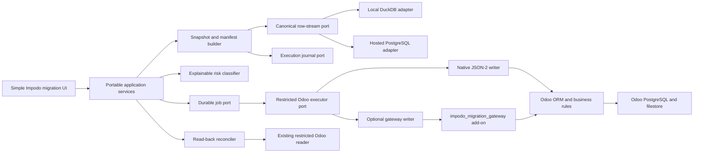

# Pragmatic Odoo loading and reconciliation plan

## Status and decision

**Status:** Reference architecture. Only the routine migration MVP is active
under the [practical delivery reset](practical-delivery-reset.md). Standard,
controlled, gateway, hosted, and production-hardening slices are parked until
the representative disposable-target migration succeeds.

The governing principle is **progressive assurance**: keep routine migrations
easy, automate evidence collection, and add ceremony only when the target or
data is genuinely risky.

The default path is:

```text
accepted canonical data
-> automatic frozen migration snapshot and execution manifest
-> preview/dry run
-> bounded native Odoo API writes
-> automatic execution journal
-> read-back reconciliation and result report
```

Impodo must **not** copy DuckDB or future Impodo PostgreSQL rows into Odoo's
PostgreSQL database. Odoo writes must go through its ORM so access controls,
record rules, company checks, computed fields, constraints, mail/activity
behavior, and custom-module logic remain effective. Odoo's security guidance
also warns that direct SQL bypasses ORM and security behavior.

For ordinary master-data loads, Impodo uses Odoo 19 JSON-2 over HTTPS with a
dedicated integration user. It calls a small allowlisted subset of native
model operations through an `OdooWriteExecutor` port. This requires no custom
Odoo module and keeps installation and upgrades straightforward.

For higher-risk work, an optional reviewed `impodo_migration_gateway` add-on
adds target-side batch receipts, manifest-bound grants, and atomic operations
that cannot be safely expressed in one native API call. The UI chooses or
recommends the profile from the migration risk; users do not configure RPC
methods, timeouts, batches, or transaction boundaries.

Generating dependency-ordered, import-compatible CSV files remains a useful
manual fallback. It is not the primary automated path because it cannot give
Impodo the same restart and reconciliation guarantees.

## Progressive assurance, not universal ceremony

Impodo classifies a run before execution. A higher level inherits all lower
level safeguards.

| Level | Typical use | Writer | User-visible controls |
| --- | --- | --- | --- |
| Routine | Disposable/local target, rehearsal, or a fresh isolated database with ordinary master data | Native API | Preview, dry run, and one explicit **Load** action |
| Standard | Fresh remote production target, meaningful volume, or controlled updates | Native API by default; gateway when the planned operation needs it | Target confirmation, recent backup/restore-point confirmation, pause, and verification |
| Controlled | Existing live database; accounting, stock, multi-company-sensitive data; business state transitions; or a customer policy requiring dual control | Gateway and named model handlers | Restore-tested backup, rehearsal where useful, explicit approval, maintenance/cutover control, and signed or short-lived execution grant |

The classifier is deterministic and explainable. Ambiguous cases move up one
level; they never silently move down. A project administrator may also require
a higher level. The first implementation is a short ordered rule table, not an
AI model or weighted governance engine. Large volume alone changes batching
and may require the standard profile; it does not by itself justify the
gateway.

Safeguards fall into three groups:

- **Always automatic:** immutable input snapshot, target fingerprint, hashes,
  dependency ordering, bounded batches, journal, safe retry classification,
  and read-back reconciliation.
- **Always required:** Odoo ORM/API use, scoped credentials, TLS for remote
  targets, no blind retry of an uncertain write, and no arbitrary method or
  caller-supplied context.
- **Risk-triggered:** clone rehearsal, restore-tested backup, second-person
  approval, signed grants, maintenance windows, and the gateway add-on.

The immutable snapshot and manifest are technical implementation details, not
forms the user must manually certify. Normally Impodo creates and refreshes
them behind the preview screen.

The routine MVP deliberately does **not** require a custom Odoo module, a
second approver, a signed manifest, a clone rehearsal, a restore test, a
maintenance window, a separate copy of every clean row, or manual handling of
hashes and receipts. Those capabilities remain available only when later
scope or customer policy justifies them.

## Why this shape follows Odoo's guidance

Odoo 19 documentation establishes the following constraints:

- imports are permanent and are not generally undoable;
- large files can time out and should be processed in smaller batches;
- External IDs make repeated imports update rather than duplicate records and
  are the preferred way to rebuild relations between imported tables;
- related records should be loaded before their dependants, and ambiguous
  name matching should be avoided in favor of External IDs;
- an omitted field receives its default, while a supplied empty value clears
  the field, so Impodo must preserve its existing leave-unset versus null
  distinction;
- Odoo ORM creation should receive a list of values rather than creating one
  record at a time;
- each JSON-2 call is a separate SQL transaction. A native batch should fit in
  one call; related work that must be atomic across calls requires a named
  server-side method or the gateway profile;
- JSON-2 uses Odoo access rights, record rules, and field access, and Odoo
  recommends a dedicated bot user for automated integrations;
- API keys expire after at most three months, should be rotated, and should
  be shorter-lived for exposed or high-privilege use;
- Odoo's older XML-RPC and JSON-RPC services are deprecated, so a new Impodo
  executor should use JSON-2 rather than add new legacy transport debt.

These rules support a pragmatic split. A native API writer is sufficient when
one batch is independently safe, records can be re-matched by a deterministic
External ID or unambiguous business key, and an uncertain result can be
reported honestly. A gateway is justified when data, identity, and receipt
must commit together or when a business document requires a larger atomic
boundary.

Odoo 19's `Model.load(fields, data)` remains a candidate inside the optional
gateway for import-compatible models. It is an Odoo implementation API rather
than Impodo's portable contract, so it must be version-pinned and contract
tested. The native client uses documented external API methods instead.

### Practical lessons incorporated from STML

STML's public evolution supports several pragmatic choices in this plan:

- make the native Odoo API and “no custom module” the ordinary path;
- keep mappings/recipes reusable and separate from the current source file;
- automatically order related datasets and prefetch relation values;
- offer a no-write test followed by an explicit commit action;
- allow an explicit existing-record policy such as `update`, `skip`, or
  `error`;
- use different timeouts for connection, reads, and writes;
- retry idempotent reads, never blindly resend an uncertain write, re-match by
  key, and expose `OUTCOME_UNKNOWN` when proof is impossible;
- feature-detect Odoo schema differences instead of scattering
  version-specific assumptions through mappings;
- produce a row-level activity ledger and practical fallout report.

STML's historical direct-SQL master-data path is deliberately not copied. Its
current native-API direction better preserves Odoo business behavior and
supports Odoo deployments where a custom module cannot be installed.

## Scope

This plan covers:

- fresh local and remote on-premise Odoo 19 targets;
- large, normalized and transformed datasets already accepted by Impodo;
- creates, governed updates, symbolic relationship resolution, retry, and
  reconciliation;
- a local DuckDB composition and a future hosted PostgreSQL composition;
- native-API and optional gateway execution profiles;
- a simple browser journey that hides risk classification, partitioning,
  batching, and retries.

The first release does not support:

- generic deletion or rollback-by-unlink;
- direct target PostgreSQL access, database credentials, or arbitrary SQL;
- arbitrary Odoo model methods, server actions, or caller-supplied context;
- automatic posting, confirmation, reservation, payment, stock validation,
  or another business state transition;
- importing users, access-control configuration, credentials, or system
  settings unless a later model-specific security review explicitly adds
  them;
- pretending that a successful HTTP response is sufficient reconciliation.

State transitions can be added later as separately named, model-specific
controlled-profile handlers. They must never be smuggled through a generic
method-name field in an import row.

## Current Impodo fit and gaps

Impodo already provides most of the safety foundation:

- immutable source hashes and frozen dataset selections;
- versioned target schema, business keys, mapping, staging, quality,
  normalization, and preflight evidence;
- typed canonical values, source lineage, symbolic relations, and portable
  business identities with no portable numeric Odoo IDs;
- `CREATE`, `UPDATE`, `UNCHANGED`, `AMBIGUOUS`, and `BLOCKED` decisions;
- application ports above focused DuckDB repositories;
- storage-key-based artifacts, actor-bound state changes, and idempotent job
  contracts;
- a deliberate separation between local/DuckDB and future
  hosted/PostgreSQL composition roots.

The missing capabilities are:

1. an automatically generated immutable migration snapshot and execution
   manifest;
2. a restricted native Odoo writer behind a portable executor port;
3. an execution journal with explicit uncertain-outcome handling and a
   target-specific ID crosswalk;
4. post-write read-back and complete reconciliation;
5. streamed preparation beyond the current 25,000-physical-row browser
   boundary;
6. risk classification and the standard-profile operational controls;
7. an optional target-side gateway for controlled-profile work.

## Target architecture



Only adapters know whether Impodo uses DuckDB, PostgreSQL, a local artifact
directory, object storage, an inline worker, or a durable queue. The snapshot,
manifest, executor request, journal, and reconciliation contracts remain
portable. The execution profile changes the Odoo adapter, not preparation or
the UI journey.

### Composition profiles

| Concern | Local profile | Hosted profile |
| --- | --- | --- |
| System of record | Per-project DuckDB | PostgreSQL with project/tenant scope |
| Large analytical work | DuckDB, optionally Parquet spill | Worker-local DuckDB/Parquet is still allowed |
| Artifacts | Protected project directory | Encrypted object storage |
| Jobs | Persisted local queue; one active execution | Durable queue and isolated workers |
| Identity | Verified local actor | Corporate SSO and central authorization |
| Secrets | OS credential vault | Managed secrets service/KMS |
| Odoo transport | Native loopback JSON-2 by default; optional gateway | Native JSON-2 over trusted HTTPS by default; optional gateway |

The hosted profile is not a containerized copy of local browser assumptions.
It receives its own HTTP, identity, authorization, repository, artifact,
secret, lock, and job adapters, consistent with ADR-008.

## Portable contracts

All contracts are immutable, explicitly versioned, canonically serialized,
and hash-bound. This is internal reliability machinery: users see a preview
and result, not contract-management steps. Contract upgrades require readers
for supported old versions or an automatic rebuild before execution.

### `MigrationSnapshotV1`

The automatically generated snapshot contains:

- project, mapping, schema, staging, quality, normalization, and preflight
  hashes;
- target Odoo major/minor compatibility and required module versions;
- the immutable preparation-run identity, row-selection bounds, ordered
  datasets/models, and dependency graph;
- a canonical row-hash recipe covering deterministic row ID, business
  identity, company scope, intended operation, typed values, symbolic
  relations, and lineage reference;
- deterministic Impodo row identities and proposed External IDs that contain
  no personal or business values;
- explicit `OMIT`, `SET_NULL`, and `SET_VALUE` field intentions;
- reconciliation totals and declared business controls;
- a root hash computed over the selected rows in deterministic order.

The snapshot stays small and does not duplicate all clean data for the local
MVP. The executor streams rows from the immutable preparation run through
`EligibleRowReader` and verifies page hashes as it proceeds. Materialized
newline-delimited JSON or Parquet partitions are optional adapters for offline
handoff, distributed workers, or deployments where the original repository is
not shared; they are not a prerequisite for a routine local migration.

### Identity and External ID policy

Every row receives a deterministic Impodo identity. The preferred Odoo
External ID form is:

```text
impodo_<stable-project-namespace>.<model-token>_<business-identity-hash>
```

Rules:

- the namespace is stable across retries and environments for the same
  migration project;
- the name uses lower-case safe characters and a hash, not PII;
- uniqueness is checked across every model in the snapshot;
- existing Odoo External IDs are reused when proven;
- the gateway profile creates the business record, External ID, and receipt in
  one transaction;
- the native profile uses an existing External ID or a declared, unique,
  re-readable business key as its recovery identity. It registers the proposed
  External ID only when the target permissions and tested API sequence support
  that safely;
- a native create without a provably unique recovery key is not eligible for
  the native profile and is promoted to the gateway or left blocked;
- attaching a new Impodo External ID to a pre-existing Odoo record is an
  explicit planned mutation, never a silent side effect;
- numeric Odoo IDs remain forbidden from the snapshot and are retained
  only in the protected target-specific journal.

### `ExecutionManifestV1`

The manifest binds:

- the exact migration-snapshot hash;
- target fingerprint: normalized URL mode, database, Odoo version, execution
  profile, optional gateway version, installed relevant modules, companies,
  and schema snapshot;
- exact `CREATE`, `UPDATE`, `UNCHANGED`, and blocked/excluded row sets;
- one explicit existing-record policy per dataset: `update`, `skip`, or
  `error`;
- dependency phases, deferred relationship patches, and batch partitioning;
- field-level update values and preconditions for existing records;
- allowed model-specific operations, never arbitrary method names;
- batch-size and retry policy bounds;
- automatically selected risk level and the reasons for it;
- required preconditions for that risk level;
- actor confirmation or approval data only when the selected level requires
  it.

Any consequential change creates a new manifest and invalidates a previous
preview or approval. A load never reads from a mutable mapping or current
staging pointer.

### `ExecutionJournalV1`

The target-specific journal records:

- run and batch IDs, sequence, snapshot/manifest/batch hashes, and attempt
  number;
- requested model, operation, row count, and field names, but no credential;
- lifecycle state: `PLANNED`, `SENT`, `COMMITTED`, `OUTCOME_UNKNOWN`,
  `FAILED`, `BLOCKED`, `PAUSED`, or `RECONCILED`;
- safe error category and a protected diagnostic reference;
- API response or gateway receipt hash and timing;
- source row ID/External ID to Odoo numeric-ID crosswalk;
- the actor that confirmed or approved when required, and started, paused,
  resumed, or closed the run.

Numeric Odoo IDs are allowed here because the journal is target-specific and
protected. They must not leak into portable mappings or snapshots.

### `ReconciliationReportV1`

Every import candidate has exactly one terminal result:

- created and verified;
- updated and verified;
- unchanged and verified;
- deliberately excluded;
- failed;
- blocked by a failed dependency;
- committed but not yet verified;
- outcome unknown after safe re-matching could not prove whether a timed-out
  write landed.

The report proves row counts, source-to-target traceability, field read-back,
relationship resolution, declared totals, unresolved work, available API or
gateway receipts, and the exact target and manifest. `committed but not yet
verified` and `outcome unknown` prevent network ambiguity from being
misreported as success.

## Storage-neutral ports

Add application-facing protocols, with DuckDB implementations first and
PostgreSQL implementations later:

```python
class EligibleRowReader(Protocol):
    def iter_page(self, project_id, run_id, *, after_key, limit): ...

class MigrationSnapshotRepository(Protocol): ...
class ExecutionManifestRepository(Protocol): ...
class ExecutionJournalRepository(Protocol): ...
class TargetExecutionLock(Protocol): ...
class OdooWriteExecutor(Protocol): ...
class ReconciliationRepository(Protocol): ...
```

Important invariants:

- application services use keyset/cursor paging, never DuckDB offsets or
  PostgreSQL-specific row objects;
- a page has deterministic ordering and is bound to one immutable run;
- the same fixtures produce the same snapshot and manifest hashes through
  DuckDB and PostgreSQL adapters;
- web routes enqueue or inspect work; they do not stream rows to Odoo;
- a durable worker can resume solely from the execution manifest, immutable
  preparation run or optional materialized partition, journal, secret
  reference, and target lock;
- one execution lock covers a target database and migration namespace, not
  merely one browser session;
- repository transactions never span network calls to Odoo.

## Native Odoo API writer

The native writer is the default for routine and standard master-data loads.
It uses documented JSON-2 endpoints and a dedicated integration user. Its
client-side allowlist permits only the required metadata/read operations and
`create`/`write` operations for approved models and fields. It exposes no
generic method-name, domain, context, or `sudo` escape hatch to the UI or
migration rows.

The client allowlist prevents accidental or application-driven scope
expansion; it is not presented as a target-side security boundary. The bot's
Odoo ACLs, record rules, field access, and company scope remain the native
profile's authorization boundary. A customer that requires method-level
enforcement on the target selects the gateway profile.

Execution behavior:

- inspect the live schema and feature-detect supported field variants;
- match in bulk by an existing External ID or a declared unambiguous business
  key;
- compute `CREATE`, `UPDATE`, `UNCHANGED`, `SKIP`, and `ERROR` before writing;
- prefetch relationships and compare many2one/many2many/one2many values
  semantically so unchanged relations are not rewritten;
- group compatible creates in list-form batches and use bounded writes;
- use phase-specific timeouts: short connection, retryable reads, and a
  target-profiled longer write timeout;
- retry idempotent reads, but never blindly retry a timed-out create or write;
- after an uncertain write, re-match by identity and verify intended values;
  record `OUTCOME_UNKNOWN` if that cannot prove the result;
- journal every decision and reconcile by read-back before reporting success.

One native API call is one Odoo transaction. The manifest must not place work
in a native batch when correctness depends on another API call committing
atomically. Such work is split into safely restartable phases or promoted to
the gateway profile.

The initial native writer supports ordinary master data only. It does not call
arbitrary `execute` methods, post accounting moves, validate stock, confirm
documents, create users, alter access rights, or delete records.

## Optional Odoo gateway add-on

The gateway is an assurance tool, not a prerequisite for every migration. It
is selected when a controlled profile is required or when a planned operation
needs target-side idempotency, a larger atomic boundary, or a named business
handler. Routine and standard runs must not be promoted merely because the
gateway exists.

### Closed method surface

The add-on exposes only versioned methods equivalent to:

- `capabilities` — report gateway/Odoo versions and configured policy;
- `open_run` — validate a signed or approved manifest grant and establish the
  target-side run identity;
- `apply_batch` — atomically validate and apply one deterministic batch;
- `batch_status` — return a receipt after an ambiguous client outcome;
- `finish_run` — close the run after all planned batches are accounted for;
- `abort_run` — prevent further batches without deleting committed records.

The client cannot supply another model method to call. The reverse proxy may
allow only this gateway method surface plus the explicitly allowlisted
`fields_get`/`search_read` paths used by read-only preflight.

### `apply_batch` transaction

One request includes the run ID, manifest hash, batch ID, sequence, batch
hash, model, named operation, company scope, field set, and bounded rows.

Within one Odoo transaction, the gateway:

1. authenticates the dedicated service user and checks the run grant;
2. rejects an expired, closed, out-of-order, wrong-target, wrong-company, or
   wrong-manifest request;
3. checks the configured model, field, operation, row-count, and byte limits;
4. returns the previous receipt if the same batch ID and hash committed;
5. rejects a reused batch ID with a different hash;
6. resolves planned existing External IDs and business references in bulk;
7. checks update preconditions so target drift cannot be overwritten;
8. invokes the selected model handler. The ordinary import handler preferably
   wraps the version-pinned Odoo `Model.load` path so import field semantics,
   batch creation, relations, and External IDs stay aligned with Odoo; another
   handler may use profiled ORM list-create/write behavior;
9. treats every Odoo import error message as an exception so the complete
   Impodo batch rolls back, then verifies the expected `impodo_*` External IDs
   in the same transaction;
10. resolves relations or an explicitly planned deferred relation patch;
11. persists a compact receipt and returns protected result IDs.

An exception rolls back the whole batch. Impodo then classifies the failure.
A deterministic row-data failure may split the batch in half until the bad
row is isolated; a permission, schema, company, capacity, or system failure
stops the run. Splitting is never used to force through a failed business
document whose rows must be atomic together.

### Model handler registry

Simple master data uses a generic, allowlisted import handler backed by the
version-pinned Odoo importer when its spike and contract tests pass. Complex
models use named ORM handlers registered in the add-on, for example a draft
document with line values. A handler owns:

- allowed fields and contexts;
- natural-key and External-ID behavior;
- transaction boundary and atomic grouping;
- Odoo defaults and company rules;
- relation commands;
- safe read-back fields;
- whether a later state transition is supported.

There is no generic escape hatch. Unsupported models fail during capability
checking while the preview is built, before a run can start.

### Odoo-side data retention

The gateway stores hashes, counts, state, timestamps, External IDs, numeric
result IDs, and compact error codes. It does not retain complete source rows
or duplicate the Impodo snapshot data unless an organization explicitly
requires that audit policy. Gateway metadata follows the target organization's normal
database backup and retention policy.

## End-to-end workflow

### 1. Freeze the migration snapshot automatically

- Stream only eligible frozen rows; do not rematerialize all records in
  memory.
- Reject blocking, ambiguous, quarantined, stale, or unreconciled evidence.
- Validate technical field names/types, writable status, selections,
  defaults, company/currency/unit/language context, constraints known to
  Impodo, and External ID uniqueness.
- Topologically order datasets by symbolic relationship.
- Model one2many input through the child's many2one, as Impodo already does.
- Plan many2many operations explicitly as replace/add/remove.
- Break nullable dependency cycles into create and deferred-patch phases;
  block required cycles without a reviewed model handler.
- Compute the ordered snapshot root hash incrementally without copying all
  accepted rows into a second local artifact.
- Present ordinary data-quality problems as actions the user can resolve;
  keep snapshot hashes and optional materialization under technical details.

### 2. Connect, inspect, and select the assurance level

- Verify the exact Odoo version, API availability, database, installed
  relevant modules, company context, schema, and target identity.
- When the gateway profile is selected, call `capabilities` and compare its
  version and policy with the snapshot.
- Capture the exact database and company context; fail closed if the Host or
  `X-Odoo-Database` selection is ambiguous.
- Verify TLS, credential identity, ACLs, record rules, field access, permitted
  models, and reverse-proxy route limits.
- Run the existing read-only preflight again close to execution.
- Classify the run as routine, standard, or controlled and show the short
  reasons, for example “fresh target + contacts only = routine.”
- Require no backup ceremony for a disposable target. For a standard remote
  production run, confirm a recent database-and-filestore backup or platform
  restore point. Require clone rehearsal and restore testing only for the
  controlled profile or an explicit customer policy.

### 3. Preview and confirm

- Convert current preflight decisions into exact target-specific actions and
  update preconditions.
- Generate `ExecutionManifestV1` automatically and choose conservative hidden
  batch and timeout values from the target profile and prior observations.
- Show the user business totals, models, companies, creates, updates,
  unchanged rows, exclusions, warnings, and the selected assurance level.
- Run a no-write dry run by default. It validates mappings, dependencies,
  identities, permissions, drift, and planned operations without pretending
  to simulate every Odoo business constraint.
- A routine run needs one explicit **Load** action. A standard run additionally
  confirms the exact remote target and restore point. A controlled run uses an
  explicit approval and, where required, a short-lived grant bound to the
  manifest hash, models, companies, maximum rows, and expiry.

### 4. Execute in bounded phases

Recommended dependency phases are:

1. required configuration and existing-reference verification;
2. lookup/reference records;
3. parent master data;
4. child master data and lines;
5. deferred many2one/many2many patches;
6. draft transactional documents through model handlers;
7. separately approved state transitions, if ever supported.

Execution rules:

- take the target execution lock and repeat all staleness checks;
- start with one active batch at a time per target database;
- use the same run and batch IDs for every retry;
- after a native-writer timeout, re-match by identity and verify values; never
  replay while the outcome is uncertain;
- after a gateway timeout, ask `batch_status` before replaying the same batch
  ID and hash;
- pause safely between committed batches;
- stop dependants after a parent failure;
- never infer success from a client timeout;
- never automatically broaden models, fields, companies, methods, or context.

### 5. Verify and finish

- Read back records by proven Odoo External ID or the manifest's verified
  business key and scope in bounded pages.
- Compare intended scalar values using the same type/null/precision rules as
  preflight.
- Resolve relationships back to business identities rather than comparing
  portable numeric IDs.
- Verify created, updated, unchanged, failed, blocked, and excluded totals.
- Re-run declared business control totals and model-specific health checks.
- Produce one immutable reconciliation report. Routine runs finish when every
  row is accounted for and automated checks pass. Standard and controlled
  runs may additionally require operator or business-owner acceptance.
- Keep the target isolated or in a maintenance window only when the selected
  assurance level requires it.
- Close any target-side run grant, release the lock, and rotate or revoke
  temporary credentials when they were issued for the run.

## Large-volume strategy

### Streaming and checkpoints

- Raise the current 25,000-row product limit only after the separate bounded
  preparation work passes its gates.
- Read canonical rows by stable keyset pages and release each page after its
  rows are hashed and the completed Odoo batch is journaled.
- Partition first by dependency phase, model, company, operation, and
  compatible field set; then by bounded row count and serialized bytes.
- Keep binary attachments/images out of normal JSON record batches. Add a
  separately bounded attachment handler when required.
- Never make a network request per row or per field.

### Adaptive batches

There is no universal safe row count because Odoo models, computed fields,
custom modules, attachment sizes, and server limits differ. Use hidden,
target-profiled controls:

- initial ceiling: 200 ordinary rows or 1 MiB of uncompressed JSON, whichever
  comes first;
- lower ceilings for wide/complex models and attachments;
- grow cautiously after consecutive fast batches, up to a reviewed target
  ceiling;
- halve after a capacity timeout or memory-pressure response;
- never exceed executor, reverse-proxy, Odoo worker, or manifest limits;
- keep concurrency at one for the first release. Later, parallelize only
  independent models after target-specific load tests.

The numbers above are conservative starting hypotheses, not values from Odoo
documentation. Observed target performance—and controlled-profile rehearsal
when required—determines later batches automatically.

### Failure policy

| Failure | Behavior |
| --- | --- |
| Lost connection or timeout after native API send | Re-match by identity and verify intended values; do not replay while uncertain |
| Lost connection or timeout after gateway send | Query receipt; replay the same batch ID/hash only when the gateway proves it did not commit |
| Expired/invalid credential | Stop; never fall back to another account |
| ACL, record-rule, field, company, schema, or manifest mismatch | Stop the run and rebuild the preview/manifest where applicable |
| Deterministic scalar/constraint failure | Roll back batch; split to isolate when the model handler permits |
| Parent failure | Mark dependant rows blocked; continue only independent branches if policy allows |
| Target overload | Pause, reduce hidden batch size, and resume within approved bounds |
| Snapshot/journal/hash mismatch | Fail closed and rebuild from accepted data; do not patch evidence manually |

## Remote on-premise security profile

Security remains strict for remote targets, but most controls are installation
defaults rather than steps repeated for every run.

### Baseline for every remote target

- Impodo initiates outbound connections only; Odoo never connects inbound to
  the user's workstation or hosted Impodo worker.
- Put Odoo behind a maintained reverse proxy with valid HTTPS, HSTS, secure
  cookies, body-size limits, timeouts, and Odoo `proxy_mode` configured as
  documented.
- Trust an organization CA or public CA and verify hostname. Never offer a
  production "ignore certificate errors" switch.
- Configure `dbfilter`/`db_name` to select one database, send
  `X-Odoo-Database` only when required, disable database listing/manager
  access after provisioning, and reject authenticated redirects.
- Keep Odoo PostgreSQL private. If it is on another host, use a private path
  and certificate-verified TLS; never expose it for Impodo.
- Use a dedicated, non-interactive Odoo bot with only the required groups,
  model ACLs, record rules, field access, and companies.
- Store keys only in the OS credential vault or managed secret service. Store
  a secret reference, never the key, in projects, snapshots, jobs, logs,
  reports, browser storage, or URLs.
- Redact Authorization headers, Odoo debug tracebacks, row values, and
  credentials from user-facing errors and normal telemetry.
- Run supported patched Odoo builds on Linux in production, with appropriately
  sized multi-process workers and memory/CPU/request-time limits.
- Use a non-superuser Odoo PostgreSQL role, protect the master password, set a
  strict database filter, disable database listing, and restrict the database
  manager.
- Allow only one active Impodo execution per target database/namespace and
  provide a kill switch: pause the job or revoke the key.

These controls are checked when the connection is created and monitored for
drift. The run screen should normally show a compact “Secure connection”
status rather than a checklist.

### Additional controls for standard and controlled profiles

- Prefer a private VPN/network path for sensitive installations. Where
  practical, restrict the migration route to approved worker egress addresses
  and use mTLS at the reverse proxy for controlled deployments.
- Firewall the Odoo origin so it is not reachable around the approved proxy or
  private-network path.
- Use separate read and execution credentials when policy or privilege level
  warrants it. For controlled runs, issue a short-lived execution key or grant
  and revoke it after the migration window.
- Sign and pin the optional gateway add-on release; deploy it through normal
  Odoo module change control. It downloads or evaluates no code at runtime.
- Gateway business-model work runs as the bot user. Narrow elevated work for
  receipts or the `impodo_*` External-ID namespace must be locally
  implemented, allowlisted, and independently reviewed; it must not turn
  business creates/updates into superuser operations.
- For standard production runs, verify a recent database-and-filestore backup
  or platform restore point. For controlled runs, require a tested restore
  procedure. Backup restore remains the default rollback for a fresh isolated
  target.
- Do not run rehearsal against live integrations. Use a neutralized clone so
  scheduled jobs, email, payments, delivery, and other external effects are
  disabled whenever rehearsal is selected or required.

## User experience

The browser exposes one guided journey:

1. **Connect** — choose the Odoo target; Impodo checks identity, permissions,
   schema, and security in the background.
2. **Preview** — see business counts, creates/updates/unchanged/exclusions,
   warnings, and a plain-language assurance level with its reasons.
3. **Load** — one explicit action starts or resumes the durable job. Only
   standard or controlled runs show the additional confirmation they need.
4. **Verify** — follow progress by business dataset and receive a final
   reconciled result with actionable fallout.

Rows per batch, bytes, retry counts, dependency phases, hashes, API receipts,
numeric Odoo IDs, snapshots, and manifests stay under **Technical details**.
Users never split CSVs, order files, choose an RPC method, classify risk, or
decide retry safety. A pause/resume action is visible; unsafe failures present
a specific next action rather than a generic retry button.

## Delivery slices and gates

### Slice 0 — Native API proof

- Record the progressive-assurance decision and direct-SQL prohibition in an
  ADR.
- Prove Odoo 19 JSON-2 schema discovery, restricted read/create/write, batch
  behavior, ACLs, record rules, External IDs, relations, omit/null semantics,
  and read-back on a disposable target.
- Inject a lost write response and prove that identity re-matching either
  determines the result or produces `OUTCOME_UNKNOWN` without a blind replay.

**Gate:** a routine single-company master-data load completes without a custom
module, generic method surface, duplicate, or silent loss.

### Slice 1 — Routine migration MVP

- Implement `MigrationSnapshotV1`, incremental row hashing,
  `ExecutionManifestV1`, DuckDB row-stream repositories, dependency ordering,
  identity policies, the native writer, execution journal, and target lock.
- Add phase-specific timeouts, uncertain-outcome handling, protected
  read-back, complete row accounting, fallout reporting, and the four-step UI.
- Start with single-company contacts and product/category master data; support
  create and explicit update, with no delete or state transition.

**Gate:** a user can preview and load a routine migration in one guided flow;
every row is verified or has an explicit non-success status; restart and lost
responses produce no duplicate or silent loss.

### Slice 2 — Standard remote and large-volume hardening

- Implement remote target fingerprinting, secure credential storage, baseline
  TLS checks, backup/restore-point and target confirmation, pause/resume, and
  operational recovery guidance.
- Add adaptive bounded batches, permissible bad-row isolation, 100,000-row
  representative tests, and fault injection at every send/commit/journal
  boundary. Add a one-million-row soak only where customer scale requires it.

**Gate:** a standard remote run stays within target resource limits and never
reports success from an HTTP response alone.

### Slice 3 — Optional controlled gateway

- Build the signed/versioned Odoo add-on, target-side receipts, manifest-bound
  grants, JSON-2 gateway adapter, and named model-handler registry.
- Spike the version-pinned `Model.load` wrapper against typed ORM list-create
  and write; choose per model from measured behavior and contract tests.
- Add controlled-profile approval, rehearsal, restore testing, maintenance
  control, and narrowly scoped credential separation.

**Gate:** the gateway adds provable atomicity/idempotency for qualifying work
without becoming the default path or exposing generic RPC/SQL capabilities.

### Slice 4 — Hosted/PostgreSQL composition

- Implement PostgreSQL repositories, object storage, durable workers,
  distributed target locks, SSO actors, centralized authorization, and a
  managed secret adapter.
- Run the same contract, fault, security, and Odoo integration suite against
  both compositions.

**Gate:** DuckDB and PostgreSQL produce semantically identical portable
snapshots/manifests, and a worker can move between hosts without losing
execution state or retry safety.

### Slice 5 — Model-specific expansion and production readiness

- Add only approved model handlers and separately approved business actions.
- Complete threat modeling, penetration testing, observability, retention,
  disaster recovery, release/rollback, and customer acceptance.

**Gate:** each added model/action has its own permissions, transaction,
failure, reconciliation, and risk-appropriate rehearsal evidence; there is
still no arbitrary RPC escape hatch.

## Acceptance matrix

### Correctness

- Create, update, unchanged, omit, null, scalar type, many2one, one2many via
  child, many2many, deferred relation, company, default, duplicate key, and
  conflicting External ID cases.
- Target drift between preflight and write is detected.
- Source/snapshot/manifest/journal hashes and counts reconcile; gateway receipt
  hashes reconcile when that profile is used.
- Repeating the complete manifest is a no-op, safely updates the same records,
  or returns the same gateway receipts.

### Fault tolerance

- Drop the connection before send, during send, after Odoo commit, and before
  the client journals the receipt.
- Restart the Impodo process/worker after every journal state.
- Expire/revoke the key mid-run; pause Odoo; return overload; change schema;
  fail a parent; and corrupt an immutable source page or optional materialized
  partition.
- No test may produce duplicates, silent skips, unsafe automatic retry, or an
  unaccounted row.

### Security

- For every profile, prove model/field/company allowlists, bot ACLs, record
  rules, field access, target binding, TLS failure behavior, credential
  redaction, target locking, and rejection of caller-controlled
  method/context data.
- For controlled profiles, additionally prove route filtering, approval/grant
  expiry, credential separation, and the gateway's narrowly elevated internal
  operations.

### Performance

- Preserve the existing 25,000-row limit until its successor gate passes.
- Measure 100,000 narrow rows, 100,000 representative wide rows, deep
  dependency chains, relation-heavy data, and the largest supported binary.
- Record snapshot-hashing rate, Odoo rows/second by model, p50/p95 batch time, target
  CPU/memory, PostgreSQL growth, failure recovery time, and reconciliation
  time.
- Accept only target-specific batch ceilings that remain comfortably below
  proxy and Odoo worker time/memory limits.

### Operations

- Every profile: target identity, monitoring, pause/kill procedure, complete
  fallout report, and documented recovery action.
- Standard profile: recent database-and-filestore backup or platform restore
  point and operator confirmation of the exact target.
- Controlled profile: restore-tested backup, neutralized rehearsal when the
  risk requires it, maintenance/cutover plan, temporary key/grant
  issuance/revocation, gateway release pin, and recorded acceptance.

## Recommended first migration scope

Keep the first production slice deliberately narrow even though the
architecture is general:

- one company;
- contacts, product categories, and product master data;
- creates and explicit updates only;
- simple many2one/many2many relations;
- no attachments, accounting entries, stock quantities, users, deletes,
  document confirmation, or posting;
- a 100–300-record smoke load on a disposable target, then 10,000 records,
  then the full volume on the fresh target.

This slice validates the hard properties—identity, dependency order,
idempotency, security, restart, and reconciliation—through the native API
before model-specific business workflows multiply the risk.

The staged volume ramp is an implementation-validation activity, not a
mandatory ritual repeated for every later routine migration.

## Decisions required before implementation

1. Which Odoo 19 edition/build and custom modules define the first supported
   target, and is JSON-2 available under its deployment/subscription?
2. Which models and companies are in the first native-API migration scope?
3. Which concrete conditions automatically promote a run from routine to
   standard or controlled in the first release?
4. What backup or platform restore-point evidence is easy to obtain for the
   first production target?
5. What row counts, row widths, attachments, and relationship depth define
   "large" for the first customer?
6. May Impodo attach its External IDs to matched pre-existing records?
7. Which later model or business action would first justify installing the
   optional gateway?
8. What evidence may contain sensitive row values, and what must be masked or
   suppressed?

## Source references

- [Odoo 19: Export and import data](https://www.odoo.com/documentation/19.0/applications/essentials/export_import_data.html)
- [Odoo 19: External JSON-2 API](https://www.odoo.com/documentation/19.0/developer/reference/external_api.html)
- [Odoo 19: External RPC API deprecation](https://www.odoo.com/documentation/19.0/developer/reference/external_rpc_api.html)
- [Odoo 19: ORM API](https://www.odoo.com/documentation/19.0/developer/reference/backend/orm.html)
- [Odoo 19 source: `Model.load` import implementation](https://github.com/odoo/odoo/blob/19.0/odoo/orm/models.py)
- [Odoo 19: Performance and batch operations](https://www.odoo.com/documentation/19.0/developer/reference/backend/performance.html)
- [Odoo 19: Security in Odoo](https://www.odoo.com/documentation/19.0/developer/reference/backend/security.html)
- [Odoo 19: On-premise system configuration and security](https://www.odoo.com/documentation/19.0/administration/on_premise/deploy.html)
- [Odoo 19: Neutralized databases](https://www.odoo.com/documentation/19.0/administration/neutralized_database.html)
- [Odoo 19: On-premise backups before change](https://www.odoo.com/documentation/19.0/administration/on_premise/update.html)
- [STML: Odoo native-API positioning](https://www.stml.io/)
- [STML release notes: sync-engine behavior and architecture clues](https://www.stml.io/release-notes)
- [Odoo Experience 2024: STML and Stimula migration demonstration](https://www.odoo.com/event/odoo-experience-2024-4662/track/easy-data-import-export-and-migration-with-stml-and-stimula-6665)
