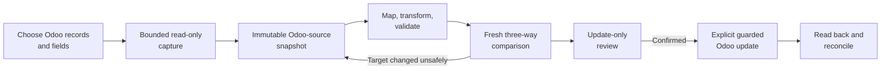

# Odoo source import and round-trip update implementation plan

## Status and authority

**Status:** Detailed implementation proposal.

This document defines a scoped delivery path for using Odoo 19 records as
governed Impodo source data and, when explicitly authorized, applying reviewed
transformations back to the same Odoo database. It does not describe current
behavior and does not replace the priority order in
[Impodo remaining work](remaining-work.md).

The first supported profile is intentionally narrow: one exact Odoo 19
database acts as both source and destination; the operator selects existing
records, freezes them locally, transforms selected fields, reviews a fresh
comparison, and performs update-only writes. Production authorization remains
separate from feature completeness.

## 1. Outcome

A data manager can complete this browser workflow without first creating a
CSV or XLSX export:

1. choose **Use data already in Odoo**;
2. select one captured Odoo record type;
3. choose the records and fields to bring into Impodo;
4. review the record count, context, and bounded sample;
5. freeze an immutable local source snapshot;
6. use the existing mapping, transformation, quality, and normalization flow;
7. compare the proposed values with current Odoo values;
8. review an update-only execution preview;
9. explicitly apply the reviewed changes; and
10. reconcile every proposed update and repeat the comparison with no
    remaining differences.

The feature is complete only when the frozen source, proposed values, current
Odoo values, exact target, write outcome, and read-back result are connected by
durable hashes and row-level provenance.

## 2. Current foundations to reuse

The implementation should extend existing boundaries rather than build a
second migration engine:

- `workspace_contracts.py` owns the immutable Stage B dataset and Odoo schema
  contracts;
- `domain/source_snapshot.py` and `source_snapshot_io.py` own immutable,
  content-addressed Parquet source snapshots;
- `application/source_workspace_service.py` owns source confirmation, freeze,
  and atomic pointer advancement;
- `application/schema_workspace_service.py` owns target-bound Odoo model and
  field catalogues;
- `connectors.py` and `local_odoo_reader.py` provide closed Odoo 19 metadata and
  preflight record reads;
- the mapping compiler, columnar preparation, staging, quality, normalization,
  and transformation-impact layers already consume frozen datasets;
- `planner.py`, `application/preflight_service.py`, and `engine.py` already
  compare proposed values with bounded Odoo snapshots;
- `application/execution_service.py`, `odoo_writer.py`, and
  `application/reconciliation_service.py` already freeze, journal, write, and
  read back explicit updates.

The existing preflight reader must not be converted into a general export
endpoint. It requires domains derived from prepared business keys and rejects
broad or extra record projections. Odoo source capture needs a separate,
equally narrow capability with different authorization, limits, evidence, and
audit semantics.

## 3. First supported profile

### 3.1 Included

- Odoo version 19 only.
- The configured Impodo Odoo target is also the source database.
- Persistent, concrete models already present in the current target-bound
  model catalogue.
- One Odoo model per captured source dataset.
- Update-only round trips for records captured from that exact target.
- Scalar fields supported by the existing canonical type system: text,
  integer, float/decimal, monetary, boolean, date, datetime, and selection.
- Stored or computed fields may be captured as context, but readonly fields
  cannot become write intentions.
- Explicit language, timezone, company, and archived-record context.
- Bounded paginated reads and immutable local Parquet publication.
- Existing transformation, quality, normalization, comparison, execution,
  journaling, and reconciliation behavior.
- Local and remote Odoo targets through a dedicated read credential for record
  extraction. Existing no-key local metadata discovery remains unchanged.

### 3.2 Deferred to later increments

- Many2one fields resolved through captured business keys.
- Many2many fields with explicit replace semantics.
- Related product variants and template/variant coordination.
- Multiple Odoo models captured as one transactional source selection.
- Cross-Odoo migration where source database A differs from target database B.
- Incremental or change-data capture.
- Scheduling and unattended refresh.
- Binary fields, images, attachments, HTML bodies, chatter, and mail records.
- One2many capture as an editable parent list.
- Delete, archive, unarchive, workflow transition, posting, or arbitrary Odoo
  business actions.
- Production use before the production gates in this plan and the main roadmap
  are satisfied.

### 3.3 Proposed initial limits

- Maximum 25,000 captured records per selection, matching the current
  materialized-path preparation boundary.
- Maximum 100 selected fields, subject to a lower byte-size limit for wide
  models.
- Fixed read pages of at most 500 records.
- A hard maximum response and snapshot size, measured and documented before
  release.
- No binary or unbounded x2many value in the first release.

These are fail-closed release limits, not expected Odoo limits. Raise them only
after fresh-process time, memory, Odoo-call-count, and snapshot-integrity
evidence.

## 4. Non-negotiable invariants

1. **Read and write capabilities stay separate.** Capturing Odoo source data
   never authorizes a write.
2. **No generic Odoo surface.** Callers cannot supply an arbitrary method name,
   Python expression, raw RPC payload, raw domain string, or unrestricted
   context.
3. **No `sudo()` for business-data extraction.** Record access must reflect a
   dedicated read user's ACLs, record rules, and allowed companies.
4. **No direct PostgreSQL access.** Odoo ORM/API behavior remains authoritative.
5. **The source target is exact.** URL, database, connection mode, and Odoo
   version are bound by the existing target fingerprint.
6. **Numeric Odoo IDs remain target-internal.** They may exist in protected
   origin provenance and execution evidence, but never as user-authored mapping
   keys or portable review values.
7. **Freeze before transform.** Preparation reads only the immutable local
   snapshot and makes no Odoo calls.
8. **Update-only means update-only.** A missing extracted record is blocked; it
   never becomes `CREATE`.
9. **Concurrent change fails closed.** Impodo does not overwrite a field that
   changed outside the reviewed baseline.
10. **No silent refresh.** A new capture creates a new immutable version and
    invalidates dependent evidence through repository/application services.
11. **No N+1 source reads.** Metadata, record pages, related-key reads, and
    concurrency checks are planned in bounded model-level batches.
12. **Unknown write outcomes are never blindly retried.** Existing journal and
    reconciliation semantics remain authoritative.

## 5. Target architecture

### 5.1 Separate Odoo-source capture port

Introduce an application-facing Odoo-source capture capability distinct from
the current metadata/preflight reader. A proposed contract may be named
`OdooSourceCapturePort`; the exact name is an implementation choice.

It accepts only a service-generated request containing:

- project ID and expected target hash;
- one permitted persistent model;
- an ordered, validated field projection;
- a structured allowlisted filter expression;
- fixed context values for language, timezone, allowed company IDs, and
  archived-record inclusion;
- page size, maximum rows, and maximum bytes; and
- an expected schema-catalog hash.

It returns deterministic pages ordered by numeric `id`, plus capture
accounting. It exposes no write and no caller-selected method.

The adapter may share the existing JSON-2 transport and redaction utilities,
but it must not share the preflight request contract. The different contracts
make it possible to permit a user-confirmed whole-model capture up to a hard
limit without weakening the rule that preflight target reads must be narrowed
by prepared identities.

### 5.2 Credential decision

The first release should require a dedicated read credential for Odoo record
extraction in both Local and Remote modes:

- metadata discovery may continue to use the existing fixed no-key local
  reader;
- business-data extraction uses Odoo JSON-2 with the dedicated user's ACLs and
  record rules;
- write credentials remain separate and are requested only at explicit load;
  and
- neither credential is stored in project DuckDB, mappings, snapshots,
  reports, browser storage, or logs.

An optional local no-key extractor should be deferred unless it can switch to
an explicitly selected Odoo user and prove ACL/record-rule parity without
`sudo()`.

### 5.3 Safe record selection

The browser must produce a structured filter; it must not accept raw Odoo
domain syntax. Initial filters should cover:

- exact values and explicit sets for scalar/selection fields;
- date and datetime ranges;
- boolean state;
- company selection constrained to the credential's allowed companies;
- active versus archived records; and
- an explicit **All records up to the limit** choice.

The service validates field names against the exact captured schema, validates
operators against field types, canonicalizes filter order, and hashes the
result. The adapter stops at `maximum_rows + 1`; exceeding the limit fails
without publishing a partial current snapshot.

Count/sample behavior must remain bounded. If an exact pre-capture count would
require widening the closed method surface, use paginated `search_read` with an
ID-only projection and stop at the limit rather than adding generic
`search_count` prematurely.

### 5.4 Source and provenance contracts

Do not create fake CSV files, fake `file_id` values, or synthetic file hashes.
Evolve the source contracts to represent their origin explicitly.

The proposed immutable evidence is:

| Evidence | Portable | Required contents |
| --- | --- | --- |
| Odoo source selection | No, target-bound | Project, target hash, model, fields, filter, context, schema hash, actor, limits, capture version |
| Source dataset contract | Yes except origin binding | Dataset/column stable keys, labels, types, row count, origin kind, source-evidence hash |
| Parquet source snapshot | Locally portable only with its manifest | Raw captured field values in deterministic row/column order |
| Protected row-origin sidecar | No, target-bound | Dataset row ordinal, model, Odoo ID, extraction `write_date`, baseline hash |
| Source snapshot manifest | No, target-bound for this origin | Selection hash, target hash, schema hash, row count, data hash, Parquet hash, provenance hash, timestamps |

The preferred contract shape is a discriminated source binding such as
`FILE` or `ODOO`, rather than adding nullable Odoo fields throughout the
existing file contract. Existing file selections deserialize as `FILE` and
retain the same semantic hashes unless a deliberate contract-version migration
is approved.

The protected row-origin sidecar is essential. It permits exact same-database
updates without asking the data manager to treat `default_code`, barcode, or
another mutable/non-unique product field as a universal identifier. Numeric IDs
must not appear as visible mapping columns or in portable review workbooks.

### 5.5 Atomic publication

Reuse the source-snapshot publication pattern:

1. validate authorization, target binding, schema binding, limits, and filter;
2. stream deterministic pages into a temporary protected workspace;
3. encode canonical source cell types and compute row/data hashes while
   writing bounded Parquet fragments;
4. write the target-bound provenance sidecar and its hash;
5. verify row counts, schema, IDs, ordering, hashes, and target fingerprint;
6. persist immutable manifests and selection history;
7. atomically advance the current source-selection and dataset pointers; and
8. remove unpublished candidates after failure while retaining the previous
   valid current version.

Do not hold all Odoo records as Python objects before publication. The source
capture path should be streaming/batched from its first implementation.

### 5.6 Mapping and preparation integration

After publication, downstream preparation should be origin-neutral:

- mapping consumes the same stable dataset and column identities;
- raw Odoo values remain immutable source evidence;
- transformations produce proposed values and visible impact evidence;
- readonly/computed source columns may support validation or transformation
  input but cannot become write fields unless the captured target schema says
  they are writable;
- quality, normalization, lineage, and accounting cover every captured row;
- preparation opens only the frozen Parquet snapshot and never contacts Odoo;
  and
- a source refresh invalidates mapping/staging evidence through the same
  current-pointer rules as a changed file selection.

The mapping UI should preselect the originating model and suggest same-name
fields, but the user must confirm every target field and transformation.
Suggestions are not approvals.

### 5.7 Target-bound identity and three-way comparison

The round-trip classifier needs three values for each writable field:

- **baseline:** the value captured from Odoo;
- **proposed:** the value produced by Impodo; and
- **current:** the value read from Odoo during fresh comparison.

The comparison rules are:

| Condition | Result |
| --- | --- |
| Target hash differs | Block the whole round trip |
| Extracted Odoo ID no longer exists | `BLOCKED: RECORD_REMOVED_SINCE_CAPTURE` |
| Baseline equals proposed and current | `UNCHANGED` |
| Baseline differs from proposed, current still equals baseline | `UPDATE` |
| Current differs from baseline in a field Impodo intends to write | `BLOCKED: CONCURRENT_FIELD_CHANGE` |
| Current changed only in fields Impodo will not write | Permit after recording current comparison evidence |
| Field became readonly, absent, or type-incompatible | `BLOCKED: TARGET_SCHEMA_CHANGED` |

Preflight reads extracted IDs in bounded `id in [...]` chunks and projects
only baseline/concurrency/write fields. It must not reclassify a missing ID as
a create or fall back to a potentially ambiguous business key.

The first release should require `write_date` for writable round trips. Models
without safe concurrency evidence may be captured read-only but cannot be
loaded back until an equivalent guard is designed.

### 5.8 Execution-time concurrency

A fresh preflight still leaves a race between comparison and `write`.

For disposable-target acceptance, the existing writer may add one bounded
pre-write current-value check immediately before each update and stop on any
baseline mismatch. This reduces but does not eliminate the race because JSON-2
calls are separate Odoo transactions.

Impodo must not claim production-safe round trips until one of these is
implemented and accepted:

1. a narrow Odoo 19 server-side method that atomically checks target ID,
   expected `write_date`/baseline fields, permitted values, and then calls ORM
   `write`; or
2. an equivalent target-side gateway with the same atomic and auditable
   semantics.

Any Odoo addon used for that purpose must follow Odoo 19 conventions, use the
ORM, honor ACLs and record rules, operate on recordsets in batches, avoid
searches inside record loops, expose no generic model/method surface, and
include access, transaction, upgrade, and failure tests. Direct SQL is not an
acceptable concurrency shortcut.

### 5.9 Execution and reconciliation

Extend the execution snapshot with protected origin binding for update rows:

- expected target hash;
- Odoo model and protected record ID;
- baseline/provenance hash;
- expected concurrency evidence;
- exact changed fields and proposed values; and
- current comparison snapshot hash.

Execution must:

- refuse `CREATE` for an Odoo-origin update-only dataset;
- avoid a business-key lookup when a validated protected ID is available;
- validate the ID/model/target binding before write;
- write only the reviewed changed fields;
- record rejection, unknown outcome, or commit through the existing journal;
- stop later writes after an unknown outcome; and
- never infer success from HTTP status alone.

Reconciliation reads committed rows by protected ID, verifies the exact
reviewed fields, retains current `write_date`, and publishes the existing
hash-bound result and fallout artifact. A repeat comparison must propose zero
writes for successfully reconciled rows.

## 6. Browser experience

The UI should add one source choice rather than a parallel technical workflow.

### 6.1 Source data

Present two plain-language choices:

- **Use files** — current CSV/XLSX workflow;
- **Use data already in Odoo** — new target-bound capture workflow.

For Odoo data, the next obvious action is **Choose Odoo records**.

### 6.2 Choose Odoo records

The page shows:

- connected database and Odoo version;
- record type selector from the stored model catalogue;
- context choices for language, company, and archived records;
- guided filters;
- field checklist grouped into editable scalar fields and optional context
  fields;
- estimated or bounded count and a small redacted sample; and
- the hard row/field/byte limits.

The confirmation action is **Freeze these Odoo records**. The confirmation
copy must state that Odoo is read-only at this point and that a later change in
Odoo will be detected before any write.

### 6.3 Mapping through load

- Show the originating Odoo model as the recommended target.
- Default the dataset to **Update the records selected from Odoo**.
- Do not show a create fallback for this mode.
- Show baseline, proposed, and current values in transformation/final review.
- Explain concurrent changes in business language and offer one next action:
  **Refresh the Odoo source**.
- Preserve the existing explicit **Load into Odoo** confirmation and outcome
  pages.

Accessibility and browser tests must cover keyboard operation, labels, focus,
errors, bounded tables, and narrow viewports before acceptance.

## 7. Delivery sequence

Each work package is independently reviewable. Do not begin the next package
until the previous exit gate is met.

### Work package 0 — Baseline and decisions

**Deliverables**

- Make the focused source, workspace, preflight, execution, reconciliation,
  browser, and security suites green before feature changes.
- Fix the existing execution-test fixture mismatch where invalid batch-size
  subtests inspect a nonexistent journal attribute.
- Record an ADR for Odoo-source origin, target-bound numeric-ID provenance,
  update-only semantics, and production concurrency.
- Approve the initial supported field types and limits.

**Exit gate**

- Existing file-source behavior and disposable Odoo load evidence have a clean
  baseline.
- No open decision changes the source evidence or concurrency architecture.

### Work package 1 — Origin-aware contracts and persistence

**Deliverables**

- Add discriminated source-origin and Odoo-source selection contracts.
- Add target-bound row-origin and capture-manifest contracts.
- Version deterministic serialization and semantic hashing.
- Add DuckDB history/current-pointer storage for Odoo capture selections,
  manifests, and provenance.
- Extend project invalidation and deletion through repositories/services.
- Preserve existing file-source selection behavior.

**Tests**

- deterministic round trips and hashes;
- target/schema/filter/context binding;
- malformed or mixed-origin rejection;
- stale revision and wrong-project rejection;
- pointer atomicity and failure cleanup; and
- legacy/current file selection regression tests.

**Exit gate**

- Immutable Odoo-source evidence can be constructed, stored, restored, and
  invalidated without Odoo access or source-file impersonation.

### Work package 2 — Closed Odoo-source reader

**Deliverables**

- Add the separate capture port and validated request planner.
- Reuse closed JSON-2 transport with a read-only credential.
- Add field/type eligibility and structured-filter policy.
- Implement deterministic paging, duplicate-ID detection, row/byte limits,
  bounded sampling, and cancellation.
- Capture target/schema/context fingerprints and concurrency fields.
- Redact credentials and bounded Odoo errors.

**Tests**

- page boundaries `0`, `1`, `499`, `500`, `501`, and maximum plus one;
- duplicate, missing, reordered, malformed, and partial pages;
- target/schema changes during capture;
- ACL, record-rule, company, archived, and credential failures;
- invalid model/field/operator/context rejection;
- timeout/cancellation with no partial current publication; and
- call-count proof that reads scale by pages, not records.

**Exit gate**

- The adapter can capture permitted Odoo records read-only with deterministic
  completeness evidence and no generic or elevated access surface.

### Work package 3 — Streaming snapshot publication

**Deliverables**

- Convert Odoo pages to the existing source-cell type system.
- Stream bounded Parquet fragments and protected provenance.
- Compute logical/data/Parquet/provenance hashes once per capture.
- Verify, persist, and atomically promote the full source selection.
- Retain the prior valid selection after injected failures.

**Tests**

- null versus empty text, decimals, dates, datetimes, booleans, selections,
  Unicode, and large text;
- exact row/column order and batch-size invariance;
- crash/failure injection before artifact write, manifest write, and pointer
  promotion;
- cleanup without deleting historical evidence; and
- bounded working set at the proposed release limit.

**Exit gate**

- One frozen Odoo-source dataset can be reopened after restart without Odoo
  traffic and produces identical logical evidence across page sizes.

### Work package 4 — Browser capture workflow

**Deliverables**

- Add the source-origin choice and Odoo record-selection pages.
- Use the stored model/schema catalogue for choices.
- Add guided filters, field eligibility, sample, limits, confirmation, progress,
  cancellation, and plain-language errors.
- Keep credentials session-only and route blocking work through a worker
  thread/background job consistent with current browser architecture.
- Add navigation and current-state recovery after restart.

**Tests**

- authorization and CSRF;
- invalid form keys and raw-domain attempts;
- Post/Redirect/Get behavior;
- cancellation and restart recovery;
- stale target/schema/source selection;
- accessibility and responsive-layout checks; and
- no regression to CSV/XLSX source pages.

**Exit gate**

- A non-technical data manager can select, preview, freeze, reopen, and replace
  an Odoo-source snapshot with one obvious next action at each step.

### Work package 5 — Origin-neutral preparation and mapping

**Deliverables**

- Feed Odoo-source snapshots through the current mapping compiler and bounded
  preparation path.
- Suggest same-model/same-field mappings without auto-approving them.
- Enforce update-only target behavior for the round-trip mode.
- Carry protected row-origin references alongside, not inside, portable
  canonical values.
- Bind staging, quality, normalization, impact, and mapping evidence to the
  Odoo-source selection hash.

**Tests**

- existing transformations across every initial scalar field type;
- readonly/computed fields as input but never write intent;
- mapping/source refresh invalidation;
- row accounting and lineage for every captured record;
- zero Odoo calls during preparation; and
- current file-source compilation/hash regressions.

**Exit gate**

- The existing preparation and review middle can process Odoo-origin records
  without knowing how they were captured and without leaking numeric IDs into
  portable evidence.

### Work package 6 — Pinned-ID preflight and concurrency

**Deliverables**

- Add the target-bound exact-ID comparison planner.
- Read IDs and relevant fields in bounded model-level batches.
- Produce baseline/proposed/current field evidence.
- Block missing records, target mismatch, schema drift, and conflicting
  concurrent field changes.
- Create update-only execution rows bound to protected provenance.

**Tests**

- unchanged, update, missing, target mismatch, schema drift, and concurrent
  change classifications;
- duplicate business keys do not affect pinned-ID updates;
- no create fallback;
- non-written concurrent fields do not cause data loss;
- batch/domain/call-count invariants; and
- deterministic report/workbook evidence without visible numeric IDs.

**Exit gate**

- Every eligible row is classified deterministically against the exact current
  Odoo record, and unsafe rows fail before the load page is enabled.

### Work package 7 — Guarded update and reconciliation

**Deliverables**

- Extend the preview-derived API scope for protected exact-ID updates.
- Add the disposable-target pre-write concurrency check.
- Reuse journaling, unknown-outcome stopping, read-back, and fallout behavior.
- Prove a repeat preview has no proposed writes.
- Measure per-row lookup and write calls and document the accepted disposable
  limit.

**Tests**

- reviewed scalar updates and field omission;
- wrong target/model/ID/provenance/scope rejection;
- concurrent change between preflight and execution;
- definitive rejection, timeout, invalid receipt, and unknown outcome;
- reconciliation by protected ID and exact fields; and
- no automatic retry or accidental create.

**Exit gate**

- A disposable Odoo 19 round trip is fully journaled and reconciled, and an
  interrupted or conflicting run cannot silently overwrite or duplicate data.

### Work package 8 — Product and relationship qualification

**Deliverables**

- Qualify `product.template` separately from `product.product`.
- Document and test template-only versus variant-owned fields.
- Add many2one capture using explicit related-model business keys and batched
  related reads.
- Add many2many only with reviewed final-set replacement semantics.
- Test active/archived, multi-company, language, category, UoM, taxes, and
  custom fields.
- Retain model-generic contracts; product behavior is acceptance coverage, not
  a hard-coded product connector.

**Exit gate**

- Simple products and products with variants have unambiguous model/field
  behavior, and relationship reads introduce no per-row Odoo query.

### Work package 9 — Scale and production hardening

**Deliverables**

- Run retained sanitized local and remote acceptance at representative volume.
- Measure metadata, page, concurrency, lookup, write, and read-back calls.
- Group identical recordsets/values where Odoo ORM semantics permit it; do not
  hide different values in pseudo-batches.
- Decide and implement the atomic Odoo-side guarded update seam.
- Complete ACL/record-rule/company tests, threat model, privacy assessment,
  fault injection, backup/restore, observability, release, and rollback work.
- Raise limits only from measurement evidence.

**Exit gate**

- All production-readiness gates in `remaining-work.md` pass, including N+1
  prevention, target permissions, failure recovery, and representative live
  acceptance.

## 8. N+1 and performance policy

The source feature must not inherit avoidable per-record access patterns.

| Operation | Required call shape |
| --- | --- |
| Model/field metadata | Once per selected model/snapshot refresh |
| Source record capture | `ceil(rows / page_size)` bounded pages |
| Many2one related keys | Unique keys grouped by related model and chunked |
| Preflight current values | Extracted IDs grouped by model and chunked |
| Execution identity lookup | None when protected ID binding is valid |
| Execution write | Initially at most one per changed row; measure and hard-limit disposable use |
| Reconciliation | IDs grouped by model and chunked |

No implementation may call `search_read`, `browse`, `fields_get`, or related
record lookup inside a source-row loop. In any conditional Odoo addon, use
recordsets and ORM batch operations, prefetch related data, and avoid
`search`/`search_count` inside computed-field or constraint loops.

The one-write-per-changed-row boundary is acceptable only for the bounded
disposable profile and must be visible in throughput evidence. Production
promotion requires either measured acceptance at the approved volume or an
atomic bounded bulk seam that preserves per-row results and unknown-outcome
semantics.

## 9. Failure and security matrix

| Failure | Required behavior |
| --- | --- |
| Credential missing/expired | Stop before capture; retain prior snapshot |
| ACL or record-rule denial | Show bounded safe error; never retry with elevated access |
| Target fingerprint changed | Invalidate capture/comparison; no write |
| Schema changed during capture | Reject candidate; retain prior snapshot |
| Limit exceeded | Publish nothing; require narrower selection |
| Duplicate/reordered page ID | Treat completeness as uncertain; publish nothing |
| Capture connection lost | Publish nothing; safe manual restart from a new candidate |
| Record removed after capture | Block row; never create replacement |
| Writable field changed externally | Block row and require source refresh |
| Unwritten field changed externally | Record current evidence; do not overwrite it |
| Write rejection | Record failed; continue only where dependency policy permits |
| Write outcome unknown | Stop later writes; reconcile; never blind retry |
| Journal/reconciliation failure | Preserve exact execution evidence and recover through repository APIs |

## 10. Acceptance scenarios

### 10.1 Mandatory disposable product slice

Use a fresh disposable Odoo 19 database with sanitized fixtures:

- simple `product.template` records;
- archived and active records;
- at least two companies within explicit allowed-company context;
- selections, booleans, text, decimal/monetary, date, and datetime fields;
- custom writable and custom readonly fields; and
- duplicate or blank human business keys to prove protected-ID behavior.

The run must:

1. capture at least 1,000 records without CSV/XLSX;
2. freeze and reopen the source without Odoo traffic;
3. transform at least three writable field types;
4. classify intended changes, unchanged rows, and injected concurrent changes;
5. block removed and concurrently changed records;
6. update only the reviewed safe rows;
7. reconcile every attempted row;
8. repeat comparison with zero writes for committed rows; and
9. retain exact read/write call counts and time/memory evidence.

### 10.2 Regression acceptance

- Existing CSV/XLSX projects produce unchanged source/mapping/preflight
  semantics.
- A file-source dataset and Odoo-source dataset cannot be silently confused.
- Existing schema discovery remains cached and target-bound.
- Existing disposable create/update/reconciliation acceptance remains valid.
- Frozen source artifacts remain content-addressed and restart-safe on Windows
  and macOS.

## 11. Documentation and release changes required with implementation

When the feature is implemented, update in the same delivery:

- `README.md` current capability and explicit limits;
- `docs/product-vision.md` Stage B/C boundary;
- `docs/contracts/01-migration-project.md` source-origin registration;
- `docs/contracts/02-workspace.md` Odoo-source selection and invalidation;
- `docs/contracts/03-canonical-staging.md` protected origin sidecar;
- `docs/contracts/04-preflight.md` pinned-ID three-way comparison;
- `docs/architecture/overview.md` and `python-code-map.md`;
- `docs/architecture/security-and-infrastructure.md` read credential and
  production concurrency boundary;
- the local-browser user guide and remote acceptance runbook;
- `docs/testing/acceptance.md` with retained evidence; and
- `docs/plans/remaining-work.md` to remove completed work or retain open
  production gates.

Do not describe planned behavior as current capability before its exit gate and
acceptance evidence exist.

## 12. Definition of done

The initial Odoo-source round-trip feature is done when all of the following
are true:

- the browser can capture and freeze bounded Odoo 19 scalar records without a
  file export;
- capture uses a dedicated read identity and never `sudo()` or direct SQL;
- the frozen snapshot and protected provenance are deterministic, immutable,
  target-bound, and restart-safe;
- existing preparation and mapping process the dataset without Odoo traffic;
- the final review shows baseline, proposed, and current values;
- missing, schema-changed, wrong-target, and concurrently changed records fail
  closed;
- extracted records can only be updated, never accidentally created;
- execution uses only protected preview-derived IDs/fields and one explicit
  confirmation;
- every attempted update is journaled and reconciled;
- repeat comparison is idempotent;
- source capture and comparison have proved non-N+1 call counts;
- the focused, browser, full, security, deterministic, fault-injection, and
  bounded-scale suites pass; and
- documentation accurately distinguishes disposable capability from
  production authorization.

Production round-trip support is a later definition of done. It additionally
requires the atomic target-side concurrency seam and every applicable
production-readiness gate in the authoritative roadmap.
