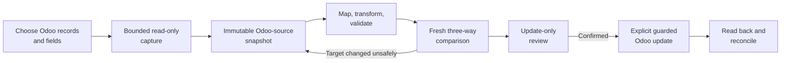

# Odoo source import and round-trip update implementation plan

## Status and authority

**Status:** Repository-checked implementation proposal, revised 2026-08-12.

This document defines a scoped delivery path for using Odoo 19 records as
governed Impodo source data and, when explicitly authorized, applying reviewed
transformations back to the same Odoo database. It does not describe current
behavior and does not replace the priority order in
[Impodo remaining work](remaining-work.md).

The first supported profile is intentionally narrow: one exact Odoo 19
database acts as both source and destination; the operator selects existing
records, freezes them locally, transforms selected fields, reviews a fresh
comparison, and performs update-only writes. Production authorization remains
separate from feature completeness.

The repository check found several prerequisites that must be delivered before
record capture. The first two slices resolve the original file-only
registration/source-before-schema cycle and the shared read/write credential
slot. The existing portable execution snapshot still deliberately rejects
numeric Odoo IDs. The remaining phased sequence resolves that and the other
constraints explicitly rather than treating source capture as an adapter-only
change.

**Implementation progress (2026-08-12):**

- Slice 1 is implemented in the current schema: persisted `FILE`/`ODOO` source
  mode, conditional registration/file-intake rules, the Odoo-only setup path,
  and eligibility-schema capture before source freeze.
- Slice 2 is implemented: target- and role-specific read/write vault IDs,
  separate browser fields and operating-system service labels, strict no-
  fallback retrieval, target-change/project-deletion cleanup, and a non-secret
  read-credential-generation binding in model/schema evidence. That binding is
  random and secret-independent; it deliberately does **not** claim to identify
  the authenticated Odoo principal.
- Slice 3 is implemented for remote reads: a closed JSON-2 probe retrieves only
  the API key's own `res.users/context_get` identity, its exact self-record, and
  `has_access('read')` for the service-selected model scope. Model/schema
  evidence now binds non-secret principal, observed permission, and context
  hashes; later reads re-probe them. Rotating a key for the same user/context is
  accepted, while a different principal or context fails closed.
- Slice 4 is implemented for remote execution: a separate closed probe requires
  read-back access to every model in the reviewed API scope and write access to
  every model with reviewed write fields. The execution journal binds the
  write credential generation, principal, observed-permission, and context
  hashes before target I/O; read-back re-probes and requires an exact match.
  Successful read/write credential storage and replacement append actor-bound
  lifecycle events containing only the random binding hash and storage class.
- Slice 5 implements the first Phase-2 contract seam with one current source
  representation: `FileSourceBinding`, `OdooSourceBinding`, and
  `DerivedSourceBinding` are discriminated variants of `SourceDataset.source`.
  Derived datasets no longer impersonate files. Strict deserializers accept
  only this shape. A closed Odoo capture selection records one live-schema
  model, approved scalar fields, active/archive policy, fixed 500-row paging
  contract, and a hard row limit. Revisions are append-only with one current
  pointer. Target or schema changes invalidate only the current pointer. The
  browser can save this bounded plan and explicitly states that it performs no
  Odoo request and freezes no rows. The project database likewise supports one
  exact current schema generation; it contains no upgrade path.
- Slice 6 closes the current architecture/policy decisions in executable
  evidence. Each capture plan and Odoo source binding now binds one policy hash
  fixing Odoo 19 JSON-2, same-target protected-ID update-only semantics,
  Tier-1 types, request/response/value/row/snapshot/temp/history limits, and
  restricted-evidence handling. Native JSON-2 target identity is explicitly
  connection-only and production writes are `PRODUCTION_WRITE_UNSUPPORTED`
  because restore/clone identity and atomic compare-and-write are unavailable.
  Schema contracts use distinct connection-target and schema-scope hashes.
  Target changes and project deletion now create non-secret credential-removal
  receipts outside the deletable project database. The immutable policy hash
  is calculated once per process, capture selection creation encodes/hashes its
  manifest once, and the Odoo source binding reuses that selection hash instead
  of wrapping it in a redundant digest.
- Slice 7 implements the offline protected-provenance boundary. Bounded Odoo
  origins are page-sized typed ID/write-date columns with implicit contiguous
  ordinals, encoded once into one binary sidecar and encrypted with AES-256-GCM.
  One logical payload root and one exact encrypted-byte root are bound into a
  strict capture manifest; there are no row hashes, row JSON, or copied business
  values. The application-encryption key is project-scoped in the operating-
  system vault. Authorized services publish immutable DuckDB history/current
  pointers, enforce retained data-plus-provenance quota and retention, preserve
  history on invalidation, and delete the key/artifacts with the project. A
  protected execution-origin contract reuses existing execution row hashes and
  source ordinals rather than adding signatures or duplicating numeric IDs.
- Slice 8 implements the Phase-3 live reader boundary. A service-generated
  request has no generic method, raw domain, field path, or arbitrary context
  surface. It validates explicit Tier-1 eligibility metadata, obtains one
  matching high-water ID, streams fixed 500-row keyset pages as typed columns,
  enforces request/response/value/row/snapshot limits before unbounded
  materialization, preserves type-dependent `false`/null/empty-text semantics,
  and exposes bounded non-authoritative samples. The application service
  rechecks the current selection, complete schema scope, connection, read
  principal, permission, company/locale context, and schema at both ends.
  Native-page interval consistency and connection-only target assurance remain
  explicit limitations. Local and remote live capture both use the governed
  JSON-2 read credential; the privileged local no-key shell is not a business-
  record capture fallback.
- Slice 9 implements the Phase-4 publication core. Odoo Tier-1 value pages feed
  the same current tagged Parquet source-snapshot contract used by the offline
  transformation path. Each cell is encoded once; the logical data root is
  updated from those encoded column batches, and the exact Parquet hash is one
  artifact boundary. Protected origins remain a narrow encrypted sidecar. Disk
  headroom is checked before target I/O, value/provenance candidates are byte-
  bounded, and one short DuckDB transaction advances the source selection,
  source snapshot, and protected manifest pointers after all target reads end.
  Cancellation, quota, retention, pointer-rollback, and restart/orphan cleanup
  preserve the previous valid roots. Quota and purge operate on distinct value
  storage keys, so a content-addressed value artifact reused by retained
  manifests is counted once and is not deleted early. The core service is
  composed in the local app.
- Slice 10 completes the Phase-4 browser workflow. Exact current-selection
  confirmation enqueues one background capture per project, reports phase,
  page, row, response-byte, and normalized-byte counters from the existing
  one-pass stream, and cancels at bounded reader checkpoints. Stale forms and
  credential generations fail before target I/O. Local and remote capture both
  construct the same governed JSON-2 adapter from the role-qualified read
  credential; the local shell remains metadata-only. The source page presents
  the current published row count and immutable retained manifest history with
  zero Odoo traffic. A failed, stopped, or restarted candidate never replaces
  the previous current roots.
- The current permission hash covers directly observed group membership and
  model-level read outcomes, not a complete fingerprint of all ACL/record-rule
  definitions. Local no-key shell metadata also remains explicitly unverified.
  Local no-key write-principal parity, strong target-instance identity, the
  production write feasibility beyond the explicit unsupported disposition
  remain open.

### Slices 1–6 scale-architecture audit

The implemented slices were rechecked against the control-plane/data-plane and
hash-once rules in the
[transformation-scale architecture](transformation-scale-architecture-plan.md).
No remaining Slice-1-to-6 path hashes Odoo data rows, materializes a parallel
row-JSON value store, or inserts Python row/cell callbacks into the admitted
transformation hot path.

| Slice | Scale-architecture check | Verdict |
| --- | --- | --- |
| 1 — source lifecycle | Project/source mode, registration order, and current pointers are bounded control-plane state; no record payload or row hash exists | Aligned |
| 2 — credential roles | Vault IDs, generation bindings, and deletion receipts are small secret/audit boundaries calculated on credential lifecycle events, outside the data plane | Aligned |
| 3 — read identity | Principal, permission, and context fingerprints are calculated once per bounded identity probe over the service-selected model scope, never per record | Aligned |
| 4 — write identity | Write/read-back identity bindings are one bounded execution control-plane check; no captured values or provenance rows are reconstructed | Aligned |
| 5 — origin/selection seam | Discriminated source bindings prevent file impersonation; selection hashes bounded metadata once; dataset/column identities are field-level metadata and are derived once for a publication manifest | Aligned |
| 6 — executable policy | The immutable policy hash is cached once per process, capture creation hashes one canonical manifest, restore verifies once, and source evidence reuses the selection hash | Aligned after the hash-reuse correction |

This audit does not qualify the future live reader or values publisher. Those
must still prove page-bounded typed transport, encode values once, and compute
any semantic stream root from those same published bytes.

## 1. Outcome

A data manager can complete this browser workflow without first creating a
CSV or XLSX export:

1. choose **Use data already in Odoo**;
2. select one captured Odoo record type;
3. choose the records and fields to bring into Impodo;
4. review the record count, context, and bounded sample;
5. freeze an immutable local source snapshot;
6. use the existing mapping, transformation, quality, and normalization flow;
7. compare the proposed values with current Odoo values;
8. review an update-only execution preview;
9. explicitly apply the reviewed changes; and
10. reconcile every proposed update and repeat the comparison with no
    remaining differences.



The feature is complete only when the frozen source, proposed values, current
Odoo values, exact target, write outcome, and read-back result are connected by
durable hashes and row-level provenance.

## 2. Current foundations to reuse

The implementation should extend existing boundaries rather than build a
second migration engine:

- `workspace_contracts.py` owns the immutable Stage B dataset and Odoo schema
  contracts;
- `domain/source_snapshot.py` and `source_snapshot_io.py` own immutable,
  content-addressed Parquet source snapshots;
- `application/source_workspace_service.py` owns source confirmation, freeze,
  and atomic pointer advancement;
- `application/schema_workspace_service.py` owns target-bound Odoo model and
  field catalogues;
- `connectors.py` and `local_odoo_reader.py` provide closed Odoo 19 metadata and
  preflight record reads;
- the mapping compiler, columnar preparation, staging, quality, normalization,
  and transformation-impact layers already consume frozen datasets;
- `planner.py`, `application/preflight_service.py`, and `engine.py` already
  compare proposed values with bounded Odoo snapshots;
- `application/execution_service.py`, `odoo_writer.py`, and
  `application/reconciliation_service.py` already freeze, journal, write, and
  read back explicit updates.

The existing preflight reader must not be converted into a general export
endpoint. It requires domains derived from prepared business keys and rejects
broad or extra record projections. Odoo source capture needs a separate,
equally narrow capability with different authorization, limits, evidence, and
audit semantics.

Some foundations require refactoring rather than direct reuse:

- `MigrationProject` and registration currently require a received export date
  and at least one source file;
- `SchemaWorkspaceService._capture_context` currently requires a frozen source
  selection, which creates a cycle when Odoo field metadata is needed to choose
  Odoo source fields;
- the generic `SourceDataset`/`SourceSnapshot` contract and shared tagged
  Parquet writer are now origin-neutral, while the browser still needs to call
  the composed Odoo publication service;
- the live reader uses offset pagination and materializes all returned records,
  neither of which is suitable for source capture;
- `ExecutionSnapshot` is portable and calls
  `assert_no_numeric_odoo_ids`, so protected IDs must remain in a separate
  execution companion rather than being added to that snapshot; and
- remote read principal/context probing now exists, but its permission hash is
  observational rather than a complete ACL/record-rule configuration digest;
  write-principal and local no-key identity probes are still absent.

### 2.1 Repository-check findings and required responses

| Blind spot | Consequence if left unresolved | Required response |
| --- | --- | --- |
| File-only registration | An Odoo-only project cannot reach Stage B | Add a project-level `FILE`/`ODOO` source mode and origin-specific registration rules before capture work |
| Source-before-schema gate | Odoo capture needs field metadata that cannot currently be captured yet | For `ODOO` projects, permit model discovery and capture-eligibility schema before source freeze; keep business-key governance after source freeze |
| Ambiguous `target_hash` vocabulary | Connector target identity and schema-scope identity can be confused | Separate `connection_target_hash`, `target_instance_hash`, and `schema_scope_hash` contracts |
| Endpoint/database is not an instance identity | A restored or replaced database at the same URL/name can reuse numeric IDs | Treat endpoint identity as disposable-only; require a database/deployment instance fingerprint and restore invalidation for production |
| Shared credential slot | Entering a write key can silently replace the read identity | Use distinct read and write vault entries, prompts, probes, and audit fingerprints with no fallback between them |
| Offset pagination | Concurrent inserts/deletes can skip rows even when duplicate IDs are rejected | Use high-water-marked keyset pagination (`id > last_id` and `id <= high_water_id`) |
| No database-wide snapshot transaction | Pages can reflect different instants and filter membership can change during capture | State the consistency contract honestly, record the capture interval/high-water mark, and reserve strict point-in-time export for a server-side seam |
| Missing response-byte bound | A wide page can exceed memory before row limits are checked | Add request, response, per-cell, per-row, page, snapshot, disk, and historical-project byte limits at the transport boundary |
| Incomplete field metadata | `readonly` and type alone cannot govern stored, computed, translated, company-dependent, searchable, or numeric fields | Capture `store`, `compute`, `inverse`, `related`, `translate`, `company_dependent`, `searchable`, `sortable`, `exportable`, `digits`, and `currency_field` where applicable |
| Odoo's type-dependent `false` value | An unset non-boolean field can be confused with the boolean value `false` | Decode with captured field type: preserve boolean `false`, map non-boolean unset values to null, and retain empty text distinctly where Odoo returns it |
| ACL visibility is not data governance | A technically readable model or field may still be outside the approved migration purpose | Require least-privilege read users plus explicit capture-model and capture-field allowlists; absence from policy fails closed |
| Numeric and monetary fidelity | JSON floating-point values and missing Odoo precision metadata can cause phantom differences or non-idempotent writes | Keep float/decimal/monetary out of Tier 1; qualify them with field-specific rounding and currency evidence later |
| Missing target-field baseline | A source column can be mapped to a target field that was never captured | Require every proposed write field to have a captured baseline under the exact same context |
| Existing compiler assumes business identities | Blank or duplicate human keys would still block before protected-ID matching | Add an explicit Odoo-pinned update mode with an opaque row-origin reference outside portable canonical values |
| Portable execution snapshot rejects IDs | Putting Odoo IDs into it would break an intentional invariant and exports | Persist a protected execution-origin companion keyed by execution row ID/hash |
| `write_date` policy is inconsistent with field-level concurrency | A coarse `write_date` guard blocks harmless changes, while ignoring it leaves a race | Define separate disposable and production policies; production requires one atomic lock/check/write transaction |
| Generic `write` has business side effects | Model overrides, automation, tracking, mail, and computed fields can change more than the reviewed values | Add project-specific writable-field governance and model/automation qualification; never infer “scalar” means side-effect-free |
| Current reports omit business values | The requested baseline/proposed/current review cannot be reconstructed from readiness summaries | Add a protected, paged, hash-bound three-way field-difference artifact |
| “Protected” evidence is underspecified | IDs, filters, baseline/current values, or company/principal identifiers can leak through files, logs, browser caches, exports, or backups | Define one protected-data class with repository authorization, private filesystem permissions, retention/deletion, backup treatment, redaction, and an explicit at-rest encryption decision |
| Process-only job state and unlimited history | Restart loses progress and repeated immutable captures can exhaust disk | Make candidate cleanup restart-safe; add per-project historical quota and retention behavior before browser release |
| JSON-2 entitlement is assumed | Some Odoo deployments cannot use the external API | Make Odoo 19 JSON-2 availability and the applicable Odoo plan/deployment entitlement an installation preflight |

## 3. First supported profile

### 3.1 Included

- Odoo version 19 only.
- A project declares `ODOO` source mode before registration and does not need a
  placeholder source file or export date.
- The configured Impodo Odoo target is also the source database.
- Persistent, concrete models already present in the current target-bound
  model catalogue and an explicit capture-model allowlist.
- One Odoo model per captured source dataset.
- Update-only round trips for records captured from that exact target.
- Tier-1 stored, non-relational scalar fields: bounded character/text, integer,
  boolean, date, datetime, and selection.
- Stored readonly fields may be captured as context, but cannot become write
  intentions. Non-stored computed fields are not in Tier 1.
- Tier-1 write fields must be stored, non-computed, non-related,
  non-translated, non-company-dependent, statically non-readonly, explicitly
  approved for this project, and present in the captured baseline.
- Explicit language, timezone, primary company, ordered allowed-company set,
  and archived-record context, bound through capture, comparison, execution,
  and reconciliation.
- Bounded paginated reads and immutable local Parquet publication.
- Existing transformation, quality, normalization, comparison, execution,
  journaling, and reconciliation behavior.
- Local and remote Odoo record extraction through a dedicated read credential.
  Existing no-key local metadata discovery remains unchanged.
- Odoo 19 JSON-2 is available and contractually enabled for the deployment.

### 3.2 Deferred to later increments

- Many2one fields resolved through captured business keys.
- Many2many fields with explicit replace semantics.
- Related product variants and template/variant coordination.
- Multiple Odoo models captured as one transactional source selection.
- Cross-Odoo migration where source database A differs from target database B.
- Incremental or change-data capture.
- Scheduling and unattended refresh.
- Strict database-wide point-in-time capture across multiple JSON-2 calls.
- Binary fields, images, attachments, HTML bodies, chatter, and mail records.
- One2many capture as an editable parent list.
- Non-stored computed fields and custom search methods as capture filters.
- Float, decimal, and monetary writes until Odoo digits/currency semantics have
  a retained idempotence qualification.
- Translated and company-dependent writes until context-specific baseline,
  write, and read-back semantics are qualified.
- Delete, archive, unarchive, workflow transition, posting, or arbitrary Odoo
  business actions.
- Production use before the production gates in this plan and the main roadmap
  are satisfied.

### 3.3 Proposed initial limits

- Maximum 10,000 captured records per selection for the first reader slice.
- Maximum 50 selected fields, subject to lower response and snapshot byte
  limits once the transport reader is implemented.
- Fixed read pages of at most 500 records.
- Hard UTF-8 byte limits per value, row, response, snapshot, temporary capture,
  and retained project history, measured and documented before release.
- A disk-space preflight that includes temporary fragments and compaction
  overhead.
- No binary or unbounded x2many value in the first release.

These are fail-closed release limits, not expected Odoo limits. Raise them only
after fresh-process time, memory, Odoo-call-count, and snapshot-integrity
evidence.

## 4. Non-negotiable invariants

1. **Read and write capabilities stay separate.** Capturing Odoo source data
   never authorizes a write.
2. **No generic Odoo surface.** Callers cannot supply an arbitrary method name,
   Python expression, raw RPC payload, raw domain string, or unrestricted
   context.
3. **No `sudo()` for business-data extraction.** Record access must reflect a
   dedicated read user's ACLs, record rules, and allowed companies.
4. **No direct PostgreSQL access.** Odoo ORM/API behavior remains authoritative.
5. **The source target is exact.** URL, database, connection mode, and Odoo
   version are bound by the connection identity. Production additionally
   requires a strong database/deployment instance fingerprint and documented
   invalidation after restore or clone.
6. **Numeric Odoo IDs remain target-internal.** They may exist in protected
   origin provenance and execution evidence, but never as user-authored mapping
   keys or portable review values.
7. **Freeze before transform.** Preparation reads only the immutable local
   snapshot and makes no Odoo calls.
8. **Update-only means update-only.** A missing extracted record is blocked; it
   never becomes `CREATE`.
9. **Concurrent change fails closed.** Impodo does not overwrite a field that
   changed outside the reviewed baseline.
10. **No silent refresh.** A new capture creates a new immutable version and
    invalidates dependent evidence through repository/application services.
11. **No N+1 source reads.** Metadata, record pages, related-key reads, and
    concurrency checks are planned in bounded model-level batches.
12. **Unknown write outcomes are never blindly retried.** Existing journal and
    reconciliation semantics remain authoritative.
13. **Paging is keyset-based.** Source capture never uses offsets; one captured
    high-water ID excludes records created after enumeration begins.
14. **Capture consistency is not overstated.** Each page is transactionally
    coherent, but native JSON-2 pages are not a database-wide point-in-time
    snapshot. The manifest records this limitation.
15. **Every write has a baseline.** A mapped target field cannot become a write
    intent unless its value was captured from the same record and context.
16. **Context is evidence.** Language, timezone, active-test behavior, primary
    company, allowed companies, and credential principal are never silently
    changed between capture, comparison, write, and read-back.
17. **Portable and protected evidence remain separate.** Numeric IDs, company
    IDs, principal IDs, and target-bound row-origin bindings never enter
    portable mappings, canonical rows, workbooks, or the portable execution
    snapshot.
18. **A scalar write is still business logic.** Only project-approved fields
    may be written, and production qualification accounts for model overrides,
    automation, tracking, notifications, constraints, and computed side
    effects.

## 5. Target architecture

### 5.1 Project lifecycle and dependency order

Add `source_mode: FILE | ODOO` to the project contract and select it during
draft setup. The first release does not mix both modes in one project.

- `FILE` registration and navigation retain their current behavior and hashes.
- `ODOO` registration requires target connection details and governance owners,
  but not an export date or placeholder file.
- Model discovery is allowed after registration for both modes.
- For `ODOO`, capture-eligibility field metadata is allowed before source
  freeze. Business-key governance and mapping submission still follow source
  freeze.

The Odoo-source journey becomes:

```text
Register ODOO project
  -> verify read identity and target
  -> discover/select one permitted model
  -> capture eligibility metadata
  -> choose/filter/freeze records
  -> govern target schema where still required
  -> map/transform/prepare
  -> compare
  -> optionally write
```

This conditional ordering breaks the current `source -> schema -> mapping`
cycle without weakening the file-source workflow.

### 5.2 Target, schema, principal, context, and credential identity

Use distinct names and hashes for distinct facts:

| Evidence | Meaning |
| --- | --- |
| `connection_target_hash` | Normalized connection mode, base URL, and database name; replaces the ambiguous generic target-hash usage |
| `target_instance_hash` | Strong database/deployment identity, such as a narrowly exposed database UUID plus deployment nonce; mandatory for production exact-ID writes |
| `schema_scope_hash` | Exact permitted model/field metadata and schema contract |
| `read_credential_binding_hash` | Non-secret, target- and role-bound random vault-generation fingerprint; implemented as rotation evidence, not principal identity |
| `read_principal_hash` | Stable, non-secret fingerprint of the principal used for metadata, capture, and ordinary comparison reads |
| `write_principal_hash` | Stable, non-secret fingerprint of the separately approved execution principal; absent until load is configured |
| `context_hash` | Canonical language, timezone, primary company, ordered allowed-company set, and `active_test` behavior |

Endpoint/database identity alone is acceptable only for explicitly disposable
acceptance. Before production, a narrow identity probe or gateway must expose a
stable instance and principal identity without granting access to arbitrary
`ir.config_parameter` values. A database restore, clone, or instance-identity
change invalidates every current protected-ID binding.

Split the existing credential storage into read and write roles:

- metadata and business-data extraction use only the read credential and bind
  `read_principal_hash`;
- fresh comparison uses that same read principal;
- the execution-time check, write, and read-back use the separately approved
  write credential and bind `write_principal_hash`;
- the two roles have separate vault IDs, UI fields, service labels, permission
  probes, and audit fingerprints; and
- no route falls back from one role to the other.

The Slice-2 `read_credential_binding_hash` remains rotation evidence: rotating
or re-entering the same secret creates a new binding without hashing the
secret. Slice 3 adds the Odoo-derived `read_principal_hash`,
`read_permission_hash`, and `read_context_hash`, allowing two different keys
for the same user/context to retain the same principal identity. The observed
permission hash changes with the returned direct groups or tested model scope,
but it cannot prove that an administrator changed an unobserved ACL or record
rule in place; capture reads and bounded consistency checks remain necessary.

Credentials remain in process memory or the operating-system vault and never
enter DuckDB, snapshots, reports, browser storage, or logs. An optional local
no-key extractor remains deferred unless it can impersonate one explicit Odoo
user and prove ACL and record-rule parity without `sudo()`.

### 5.3 Separate Odoo-source capture port

Introduce an application-facing `OdooSourceCapturePort` distinct from the
metadata/preflight reader. It accepts only a service-generated request with:

- project ID plus expected connection, instance, read-principal, schema-scope,
  and context hashes;
- one permitted persistent model;
- one ordered, validated Tier-1 field projection;
- one canonical structured filter;
- fixed page, row, value, response, snapshot, temporary-disk, and project-history
  limits; and
- a cancellation probe checked between bounded requests and write batches.

The result is an iterator of validated pages and accounting, not a materialized
record snapshot. The port exposes no write, raw domain, caller-selected method,
caller-selected context key, arbitrary field path, or generic search surface.
Transport and safe-error utilities may be shared, but the existing preflight
request contract remains closed around prepared identities.

### 5.4 Field, filter, and context policy

Capture enough Odoo field description to make eligibility explicit. In
addition to the current metadata, capture supported forms of `store`, `compute`,
`inverse`, `related`, `translate`, `company_dependent`, `searchable`, `sortable`,
`exportable`, `digits`, and `currency_field`. Missing policy-relevant metadata
makes a field ineligible rather than inviting a permissive default. Accessible
models and fields must also appear in explicit project capture allowlists; ACL
visibility alone is insufficient approval.

Tier-1 projected fields are stored direct scalar fields. Initial filters allow:

- equality and bounded explicit sets for eligible scalar/selection fields;
- inclusive/exclusive date and datetime ranges;
- booleans;
- active versus archived state only when the model has the reserved `active`
  field; and
- an explicit **All matching records up to the limit** choice.

Only direct fields that the captured metadata marks searchable can be filter
fields. Bound the number of clauses, set members, and encoded bytes. Do not
accept dotted traversal, custom domain operators, raw prefix-domain tokens, or
non-stored/custom-search fields in Tier 1.

The service constructs company and language choices from narrow target-bound
catalogues. It validates the selected company set against the read principal,
records the primary company and ordered allowed-company IDs in protected
evidence, and applies the exact same context at every later read and write.
Archived inclusion uses both explicit reserved-field policy and fixed
`active_test` behavior; callers cannot inject other context keys.

Selection values are frozen as technical keys; translated labels are display
metadata only. Type-aware decoding preserves boolean `false`, maps Odoo's
non-boolean unset `false` representation to null, and keeps an actual empty
text value distinct where the API returns one. Dates and datetimes use the
documented Odoo wire formats with one canonical UTC/storage representation;
the bound timezone remains context evidence rather than an implicit string
conversion.

`readonly` in Odoo primarily describes UI behavior, so Impodo applies a stricter
write policy: Tier-1 write fields must also be stored, direct, non-translated,
non-company-dependent, non-computed, non-related, and approved in the project's
writable-field policy. `id`, access-log fields, `active`, workflow/business
control fields, and any field rejected by model qualification cannot become
write intents. Every intended write field must also be present in the captured
baseline.

### 5.5 Paging and capture consistency

Use high-water-marked keyset pagination, not offsets:

1. read at most one highest matching ID with `order="id desc"`;
2. read pages with the canonical user filter plus `id > last_id` and
   `id <= high_water_id`, ordered `id asc`;
3. stop at `maximum_rows + 1` and publish nothing when the limit is exceeded;
4. reject missing IDs, non-increasing IDs, IDs outside the page bounds, duplicate
   IDs, incomplete projections, and oversized responses; and
5. recheck target instance, read principal, context eligibility, and projected
   schema after the last page.

Records inserted above the high-water ID are excluded. Keyset paging prevents
offset shifts, but native JSON-2 still does not provide one database-wide
snapshot across pages: deletes, ACL/rule changes, or filter-field changes during
the run can alter membership. The manifest therefore records start/end time,
high-water ID, page accounting, observed `write_date` values, and this
consistency level. A strict point-in-time capture requires a later server-side
export method or an operational quiescence contract.

The pre-freeze sample is a bounded, display-truncated preview and is not
evidence of final membership. The authoritative count is the number of rows in
the successfully published snapshot; do not perform an unbounded or duplicate
exact-count scan merely for the UI.

### 5.6 Source, snapshot, and protected provenance contracts

Do not create fake files, file IDs, table keys, or hashes. Use the one current
discriminated dataset-source contract:

- `FileSourceBinding` contains the immutable file/table identity, parser
  choices, and exact source/catalog hashes;
- `OdooSourceBinding` contains capture/model/selection/schema/context/
  read-principal/target hashes and no credential;
- `DerivedSourceBinding` contains its structural rule hash, sorted input
  dataset identities, and exact derived-data hash;
- Odoo dataset IDs are stable for the project source slot and model;
- Odoo column stable keys derive from model plus technical field name, not a
  transient ordinal; and
- the Odoo snapshot logical hash includes a canonical row-data hash, because no
  immutable original-file hash exists.

The immutable evidence set is:

| Evidence | Portable | Required contents |
| --- | --- | --- |
| Odoo capture selection | No | Project, model, field projection, filter, limits, capture consistency, actor, version, and all target/schema/read-principal/context hashes |
| Source dataset contract | Values are portable; binding is not | Stable dataset/column keys, labels, types, row count, origin kind, source-evidence hash |
| Parquet snapshot | Only with manifest and origin caveat | Raw captured values in deterministic row/column order, excluding numeric Odoo IDs |
| Protected row-origin sidecar | No | Dataset/source row, model, Odoo ID, captured `write_date`, captured-field baseline hash, target instance, read principal, and context binding |
| Snapshot manifest | No for Odoo origin | Selection hash, schema/context/target/read-principal hashes, row/data/Parquet/provenance hashes, capture interval, high-water ID, and consistency level |

Here, **protected** is a storage and authorization class, not merely a naming
convention. Its repositories enforce project/role authorization, app-private
filesystem permissions, bounded reads, retention/deletion, log and browser-
cache redaction, exclusion from portable exports, and documented backup/
restore handling. Phase 0 decides whether field-difference values require
application-level encryption at rest in addition to platform disk protection;
production cannot leave that decision implicit.

The application creates and accepts one exact current database generation.
There is no source-selection compatibility decoder and no database upgrade
registry. A database from any other contract generation is rejected and must
be recreated. Retained Odoo capture revisions count against a project quota
and follow the project retention/deletion policy; failed candidates never count
as retained evidence.

#### 5.6.1 Scale-aligned hash and data-plane policy

The [transformation-scale architecture](transformation-scale-architecture-plan.md)
also governs Odoo-source publication. Retain distinct governance and artifact
boundary hashes, but do not turn row origin into a second row-oriented hashing
pipeline.

The Slice-6 control-plane inventory below was measured on the development Mac
with 10,000-call `timeit` samples. The Slice-7 sidecar measurement is one full
10,000-row/20-page encode with `tracemalloc`. These are diagnostic evidence,
not Windows release benchmarks:

| Boundary | Frequency and measured input | Reuse/decision |
| --- | --- | --- |
| Current Odoo-source policy | Immutable process metadata; 916 canonical bytes; 25.5 microseconds per uncached encode/hash | Calculate once at module load and reuse `ODOO_SOURCE_POLICY_HASH` everywhere |
| Capture selection | Once per new revision and once when verifying a restored revision; 1,531 canonical bytes at 50 fields; 39.3 microseconds | Keep the governance hash; creation encodes/hashes once and restoration verifies once |
| Odoo source-evidence identity | Previously rehashed the source-binding wrapper | Reuse `capture_selection_hash`; the selection already commits to the complete binding |
| Dataset and column stable keys | Once per dataset/selected field; approximately 7.1/5.5 microseconds | Derive once while building the manifest/index and reuse; never derive inside a row loop |
| Credential binding/removal receipt | Once per vault generation or removal | Keep as small audit boundaries; never place them in the capture data plane |
| Protected origin sidecar | 10,000 rows in 20 typed pages; 160,325 encrypted bytes; approximately 1.8 milliseconds; 642 KiB traced peak | One incremental logical payload hash over the same encoded column frames and one ciphertext hash, plus one required repository byte-verification pass; hash count is independent of row count |

The provenance implementation must therefore:

- create no per-row SHA-256 for Odoo ID, baseline, row origin, or captured
  values;
- store the protected row ordinal/ID/origin facts as narrow typed columns and
  bind their ordered artifact or chunk descriptors at manifest level;
- keep bulk captured values in one immutable typed source artifact rather than
  duplicating them into row JSON or the provenance sidecar;
- calculate any required semantic stream hash incrementally from the same
  canonical encoded batches used for publication, without decoding or
  reserializing them for a second pass;
- retain exact artifact-byte verification under the current local storage
  trust model; and
- introduce an ordered chunk-root contract only after measurement shows a full
  logical-stream hash is material and an ADR defines the new current contract.

### 5.7 Streaming and atomic publication

Publication follows the existing last-valid-pointer pattern without holding a
DuckDB transaction across Odoo access:

1. authorize and validate the expected project/target/schema/read-principal/
   context;
2. reserve bounded temporary disk space;
3. stream validated pages into bounded typed value fragments and a narrow
   protected provenance candidate; encode each batch once and update only the
   required semantic/artifact hash states incrementally;
4. validate physical schema, row order/count, semantic hashes, exact artifact
   hashes, and final target/schema/read-principal/context checks;
5. publish content-addressed Parquet and provenance artifacts;
6. in one short DuckDB transaction, insert immutable manifests/history and
   advance source-selection, snapshot, and provenance current pointers; and
7. clean unpublished or abandoned candidates while retaining the prior valid
   current version and all in-retention history.

The path is streaming from its first implementation. It never stores all Odoo
rows as Python objects, reads an unbounded HTTP body, or deletes the previous
current artifacts before pointer promotion succeeds.

### 5.8 Mapping, identity, and preparation integration

Add an explicit mapping mode such as `odoo_pinned_update`. It locks the target
model to the originating model, forbids create fallback, and obtains row
identity from the protected origin companion rather than a human business key.
An opaque row-origin reference may link local artifacts, but neither the numeric
ID nor a reversible form enters portable canonical rows.

This is a focused compiler/application change: the existing compiler currently
expects source and target business identities, so simply carrying a sidecar is
not sufficient. Blank or duplicate human product codes must not block an
otherwise valid pinned-ID row. Relationship resolution remains on the existing
business-key path until separately qualified.

After identity binding, the middle remains as origin-neutral as practical:

- mapping uses stable dataset and column keys;
- raw Odoo values remain immutable source evidence;
- transformations produce proposed values and impact evidence;
- every intended target field must have a captured baseline;
- quality, normalization, lineage, and accounting cover every captured row;
- preparation opens only frozen local artifacts and makes zero Odoo calls; and
- refresh invalidates approvals, mappings, and prepared/current evidence. The
  user authors and approves a new mapping against the refreshed contract; no
  prior-contract rule adapter or automatic rebase is retained.

Same-name mappings may be suggested, but every field, transformation, and
project writable-field approval remains explicit.

### 5.9 Three-way comparison and protected difference evidence

For every intended write field, compare:

- **baseline:** captured from the pinned Odoo record under the captured context;
- **proposed:** produced by the frozen Impodo preparation; and
- **current:** freshly read by protected ID under that same context.

All three values pass through the same field-type codec and canonical null,
date/datetime, selection-key, and later numeric semantics before comparison.
Display labels and localized rendering are never comparison values.

Persist a protected, paged, hash-bound field-difference artifact keyed by
execution row ID. It contains only the fields needed for review and is excluded
from portable workbooks and normal readiness summaries.

| Condition | Result |
| --- | --- |
| Connection/instance/read-principal/context binding differs | Block the whole comparison |
| Extracted ID no longer exists or is no longer visible | `BLOCKED: RECORD_REMOVED_OR_INACCESSIBLE` |
| Baseline equals proposed and current | `UNCHANGED` |
| Baseline differs from proposed, current still equals baseline | `UPDATE` |
| Current differs from baseline in an intended field | `BLOCKED: CONCURRENT_FIELD_CHANGE` |
| Current differs only in fields Impodo will not write | Record informational evidence; do not overwrite those fields |
| Baseline for a write field is absent | `BLOCKED: BASELINE_NOT_CAPTURED` |
| Field became absent, ineligible, readonly-by-policy, or type-incompatible | `BLOCKED: TARGET_SCHEMA_CHANGED` |

Read protected IDs in bounded `id in [...]` chunks with an exact projection.
Never fall back to a business key and never reclassify a missing pinned ID as a
create. Require `write_date` in the initial writable profile as coarse change
evidence, but compare intended field values directly. Models without access-log
evidence remain read-only until an equivalent version contract is approved.

### 5.10 Execution-time concurrency and production boundary

A fresh comparison does not close the race to `write`. Odoo documents that
separate JSON-2 calls use separate transactions, so a native pre-read followed
by `write` is not an atomic compare-and-set.

For disposable acceptance only, the writer may immediately re-read the exact
intended baseline fields and `write_date` with the write credential, stop on a
field mismatch, then issue one exact-ID write. This reduces the window but does
not eliminate it, and the UI/evidence must label the residual race.

Production feasibility is a Phase-0 decision, not a late optimization. Prove
one of these before production work proceeds:

1. a narrow Odoo 19 method can acquire a supported row lock, re-check ACLs,
   record rules, target/context, expected intended-field values and permitted
   values, call ORM `write`, and return an auditable receipt in one transaction;
2. a target-side gateway provides equivalent atomic semantics; or
3. production round-trip write remains unsupported.

If Odoo 19 has no supported ORM locking primitive and the no-direct-SQL policy
is retained, the third result is the correct gate outcome. Do not call an
unlocked check-and-write “atomic.” A coarse expected-`write_date` policy may be
chosen, but it must explicitly accept false conflicts from unrelated updates;
field-level concurrency may permit unrelated changes only when the atomic
method locks and compares those exact fields.

Any addon/gateway exposes named guarded operations only, never a generic model,
method, domain, context, or SQL surface. It uses no `sudo()`, honors ACLs and
record rules, and has transaction, race, access, upgrade, restore, automation,
and failure tests. Impodo itself never accesses PostgreSQL directly.

### 5.11 Execution, side effects, and reconciliation

Keep `ExecutionSnapshot` portable. Add a protected
`ExecutionOriginBinding` companion keyed by the execution snapshot hash and row
ID/hash, containing:

- connection and instance hashes, model, protected record ID, read-principal,
  approved write-principal, and context hashes;
- source provenance/baseline hash and expected concurrency evidence;
- exact changed fields and current-comparison artifact hash; and
- the project writable-field policy hash.

The preview-derived Odoo API scope is built from both artifacts. Adapter callers
cannot substitute an ID, model, context, or field that is absent from the
protected companion.

Execution must refuse `CREATE`, skip business-key lookup for a valid protected
ID, write only reviewed changed fields, journal before target I/O, stop after an
unknown outcome, and never infer success from HTTP status alone. The journal may
retain protected IDs as it does today; portable reports may not.

Different read and write principals are permitted only when both roles were
explicitly approved and bound before final review. The execution precheck must
prove that the write principal can see the exact record and exact intended
baseline fields under the same context. Unexpected rotation of either role
invalidates its dependent evidence; one principal hash is never accepted in
place of the other.

Reconciliation reads attempted rows by protected ID under the execution
context, verifies exact reviewed fields, records current `write_date`, and
publishes hash-bound result/fallout evidence. It also records qualified and
observed side effects without claiming that a generic Odoo `write` changes only
the submitted columns. A repeat comparison must propose zero writes for every
successfully reconciled row.

## 6. Browser experience

The UI adds one source choice and conditionally reorders the existing journey;
it does not create a parallel technical application.

### 6.1 Project setup and source mode

During draft setup, present two plain-language choices:

- **Use files** — current CSV/XLSX workflow;
- **Use data already in Odoo** — new target-bound capture workflow.

An `ODOO` project can be registered without an export date or placeholder
file. Registration explains that source capture is read-only and does not ask
for a write credential. Changing source mode after evidence exists requires an
explicit project reset through the normal invalidation/deletion path.

### 6.2 Verify Odoo and choose a record type

Before showing fields or filters, verify and display:

- connected database, Odoo version, and entitlement/API availability;
- non-secret read-principal identity and allowed companies;
- disposable versus strong target-instance identity status;
- read permission for one model selected from the stored model catalogue; and
- capture-eligible versus context-only fields from a fresh schema scope.

If strong instance identity is unavailable, the page labels the project as
ineligible for production writes; it does not imply that URL and database name
prove instance identity. Read and write credential forms remain separate, and
the write form is not shown until the user reaches an authorized load stage.

### 6.3 Choose and freeze Odoo records

The page shows:

- the selected record type and exact context for language, timezone, primary
  company, ordered allowed companies, active records, and archived records;
- guided, structured filters with no raw-domain or field-path input;
- a field checklist grouped into Tier-1 writable candidates, read-only context,
  and excluded fields with reasons;
- a bounded, redacted, non-authoritative sample;
- row, field, response, snapshot, temporary-disk, and history limits; and
- the native multi-page consistency limitation.

The confirmation action is **Freeze these Odoo records**. Progress shows page
and byte accounting without business values. Cancellation or process restart
abandons the candidate and retains the last valid frozen version; it never
silently resumes with a missing credential. Final row count comes from the
published snapshot, not the sample or an extra exact-count scan.

### 6.4 Mapping, comparison, and load

- Show the originating Odoo model as the only Tier-1 round-trip target.
- Default to **Update the records selected from Odoo**, with no create fallback.
- Explain that human business keys may be blank or duplicated because protected
  captured identity controls the update.
- Require every target write field to have a captured baseline and explicit
  project approval.
- Show protected, paged baseline/proposed/current differences only to authorized
  reviewers; do not put numeric IDs or these values in portable exports.
- Explain a removed row, schema drift, context mismatch, or concurrent field
  change in business language and offer **Refresh the Odoo source**.
- Label the disposable pre-read/write race honestly and never present it as
  production-safe.
- Preserve the existing explicit **Load into Odoo** confirmation, execution,
  unknown-outcome, and reconciliation pages.

Accessibility and browser tests cover keyboard operation, labels, focus,
errors, bounded/virtualized tables, and narrow viewports before acceptance.

## 7. Phased implementation proposal

Each phase is independently reviewable and ends in a usable or risk-reducing
state. Do not start a later phase whose contract depends on an unmet exit gate.

### Phase 0 — Baseline and feasibility decisions

**Deliverables**

- Make the focused source, workspace, preflight, execution, reconciliation,
  browser, and security suites green before feature changes.
- Fix the existing execution-test fixture mismatch where invalid batch-size
  subtests inspect a nonexistent journal attribute.
- Record ADRs for source mode/lifecycle, the named hash vocabulary, protected
  numeric-ID provenance, Tier-1 fields, and update-only semantics.
- Verify JSON-2 availability and deployment entitlement against the supported
  Odoo 19 deployment profiles.
- Spike a narrow target instance/principal probe and restore/clone invalidation.
- Spike the production atomic lock/check/write operation. Record `SUPPORTED`,
  `GATEWAY_REQUIRED`, or `PRODUCTION_WRITE_UNSUPPORTED`; do not defer this
  feasibility answer until production hardening.
- Approve response/snapshot/disk/history limits and a first project/model
  writable-field policy that accounts for automation and side effects.
- Define the protected-data storage/authorization class and decide application-
  level at-rest encryption, retention, backup, and deletion requirements.

**Exit gate**

- Existing file-source behavior and disposable Odoo load evidence have a clean
  baseline.
- No unresolved decision can change the source evidence, identity, or
  concurrency architecture. Production writes have an explicit feasibility
  disposition even though they are not yet implemented.

### Phase 1 — Project lifecycle, schema ordering, and credential roles

**Deliverables**

- Add `FILE`/`ODOO` source mode and origin-specific registration validation.
- Allow an Odoo-only project to register without a source file/export date.
- Reorder navigation and schema services so Odoo model discovery and
  capture-eligibility metadata precede source freeze, while later target
  governance still sees the frozen source.
- Split read and write credential vault IDs, forms, and service labels with no
  fallback. **Implemented in Slice 2.**
- Add a narrow remote read permission/principal probe and stable principal,
  observed-permission, and context fingerprints. **Implemented in Slice 3.**
- Add the equivalent remote write-principal probe and credential storage/
  replacement lifecycle audit events. **Implemented in Slice 4.**
- Create the complete current schema and reject every different contract
  generation or version.

**Exit gate**

- An `ODOO` project reaches model/field selection without a fake file, a `FILE`
  project follows the unchanged workflow, and replacing a write credential
  cannot change the capture identity.

### Phase 2 — Origin and protected-provenance contracts

**Deliverables**

- Add discriminated file/Odoo source bindings and Odoo capture selection.
  **Implemented in Slice 5 for the bounded selection plan; live row capture and
  values publication remain open.**
- Add target-bound row-origin, capture-manifest, and protected execution-origin
  contracts. **Implemented in Slice 7.**
- Add manifest-level data/provenance artifact roots plus target-instance,
  read-principal, write-principal, context, and schema-scope hashes; add no
  per-row signatures and eliminate ambiguous new uses of `target_hash`.
- Version deterministic serialization and add DuckDB history/current-pointer
  persistence, protected repository authorization, quotas, retention metadata,
  invalidation, and deletion. **Implemented in Slice 7 for offline protected
  provenance; live values publication remains Phase 4.**
- Test exact current-contract round trips and rejection of every other schema
  generation, schema version, or source-binding shape.

**Exit gate**

- Immutable Odoo-source evidence can be constructed, stored, restored,
  quota-checked, and invalidated offline without source-file impersonation or
  protected identifiers in portable contracts. **Met by Slice 7 for the
  protected provenance boundary.**

### Phase 3 — Closed, bounded Odoo-source reader

**Status:** Implemented in Slice 8. The reader terminates at a validated typed
page stream; immutable values/provenance publication remains Phase 4.

**Deliverables**

- Add the separate capture port and service-generated request planner.
  **Implemented.**
- Extend schema metadata and enforce Tier-1 field, filter, model, and context
  policies. **Implemented; missing eligibility metadata fails closed.**
- Implement a transport-level HTTP response-byte cap and per-value/row/page/
  snapshot accounting before materialization. **Implemented.**
- Implement high-water keyset paging, strict projection/order validation,
  `maximum_rows + 1`, bounded sampling, cancellation, and safe error redaction.
  **Implemented.**
- Verify connection, instance, read principal, context, and schema scope at both
  ends of capture. **Implemented for every available assurance: connection,
  principal, observed permissions, protected context, and complete schema are
  checked at both ends; instance assurance remains explicitly
  `CONNECTION_ONLY`, with no invented instance fingerprint.**

**Tests**

- page boundaries `0`, `1`, `499`, `500`, `501`, and maximum plus one;
- inserted rows above high-water, deletion between pages, and filter/ACL changes;
- duplicate, missing, reordered, out-of-range, malformed, partial, and oversized
  responses;
- invalid model, field, operator, raw domain, field path, or context key;
- ACL, record-rule, company, archived, timeout, and cancellation failures; and
- call counts that scale by pages rather than records.

The implemented boundary suite covers these cases, including type-dependent
`false` handling and the absence of hashing in the adapter hot path. A local
in-process 10,000-row/20-page transport exercise completed in 0.46 seconds
with 0.54 MiB traced peak after the synthetic source dataset was allocated;
it made 21 record requests (one high-water plus 20 pages). This is a seam
measurement, not an Odoo/network or Phase-4 publication qualification.

**Exit gate**

- The reader returns a bounded validated page stream and honest consistency
  accounting through a closed read-only surface. It makes no claim of a
  database-wide point-in-time snapshot. **Met.**

### Phase 4 — Streaming publication and browser capture

**Status:** Implemented in Slices 9 and 10. Slice 9 owns one-pass publication;
Slice 10 owns the governed browser action and session-scoped job control plane.

**Deliverables**

- Stream Tier-1 source values and protected provenance to bounded Parquet and
  sidecar candidates while computing hashes once. **Implemented in the core:
  the logical value root is updated from the same encoded column batches, with
  no decode/reserialize hash pass or row hash.**
- Verify all candidates and atomically advance history/current pointers in a
  short DuckDB transaction after Odoo access completes. **Implemented for the
  source selection, source snapshot, and protected capture manifest.**
- Add disk preflight, candidate lifecycle, startup cleanup, project history
  quota, cancellation, and failure recovery. **Implemented at the publication
  service/repository boundary, including retention of the previous current
  roots on injected transaction failure.**
- Add the source-mode, identity/model, selection, sample, confirmation,
  progress, cancellation, and current-version browser experience.
  **Implemented. Confirmation is selection- and credential-generation-bound;
  progress reuses stream accounting and current/history reopening is offline.**

**Tests**

- type-aware unset `false` versus boolean `false` versus empty text, bounded
  Unicode/text, integer, date, datetime, and selection encodings;
- exact row/column order and page-size-invariant semantic hashes;
- crash/failure injection at every artifact/manifest/pointer boundary;
- cleanup that preserves previous/historical evidence;
- authorization, CSRF, stale form, accessibility, and responsive layout; and
- bounded memory and disk at the release limits.

**Exit gate**

- A user can freeze, restart, reopen, replace, and audit an Odoo snapshot with
  zero Odoo traffic after publication; any failed candidate leaves the last
  valid version current. **Met.**

### Phase 5 — Pinned identity, mapping, and preparation

**Deliverables**

- Add explicit `odoo_pinned_update` mapping/preparation mode.
- Bind rows to opaque protected origin references, not portable business keys.
- Lock the target to the origin model, forbid create fallback, and require a
  captured baseline for every target field that can become a write intent.
- Feed Odoo snapshots through existing transformation, staging, quality,
  normalization, impact, and lineage paths.
- Invalidate downstream evidence and mappings on refresh; author the
  replacement mapping against the one current contract.

**Tests**

- blank and duplicate human keys do not block pinned-ID preparation;
- stale/wrong protected bindings and missing target baselines fail closed;
- every Tier-1 transformation and readonly-context input;
- refresh, schema, and mapping invalidation plus exact row accounting;
- no numeric IDs in portable canonical rows/workbooks/reports; and
- zero Odoo calls during preparation and no file-source hash regression.

**Exit gate**

- The origin-neutral middle processes every captured row offline while the
  target-bound identity remains protected and update-only.

### Phase 6 — Read-only three-way comparison

**Deliverables**

- Add exact protected-ID current-value reads in bounded model-level chunks.
- Produce a protected, paged, hash-bound baseline/proposed/current artifact.
- Classify unchanged, proposed update, missing/inaccessible, target/instance/
  read-principal/context mismatch, schema drift, missing baseline, and
  concurrent intended-field change.
- Build preview rows and protected execution-origin companions, but leave load
  disabled.

**Tests**

- every classification and exact projection/domain invariant;
- unrelated current-field changes recorded without being overwritten;
- duplicate human keys, no business-key fallback, and no create fallback;
- value authorization, pagination, redaction, and numeric-ID non-disclosure;
  and
- deterministic call counts and artifact hashes.

**Exit gate — first releasable milestone**

- Authorized users can capture, transform, and compare Odoo records safely and
  reproducibly without enabling writes. Unsafe rows fail closed, and refresh is
  the only remediation offered for stale source evidence.

### Phase 7 — Disposable guarded update and reconciliation

**Deliverables**

- Build preview-derived API scope from the portable snapshot plus protected
  execution-origin companion.
- Require and probe a separate write credential/principal.
- Immediately re-read intended fields and concurrency evidence, then issue the
  exact-ID update with the documented residual race.
- Reuse journaling, unknown-outcome stopping, read-back, fallout, and recovery.
- Record observed business side effects and prove a repeat comparison proposes
  zero writes for committed rows.

**Tests**

- reviewed Tier-1 writes and exact field omission;
- wrong target/instance/read-principal/write-principal/context/model/ID/
  provenance/scope rejection;
- changes before precheck and injected change in the residual precheck/write
  window, with the limitation retained in acceptance evidence;
- definitive rejection, timeout, invalid receipt, and unknown outcome;
- protected-ID reconciliation and no automatic retry or accidental create; and
- exact precheck/write/read-back call counts.

**Exit gate**

- A disposable Odoo 19 round trip is explicitly labeled, fully journaled, and
  reconciled. It is not represented as production-safe.

### Phase 8 — Type, model, relationship, and side-effect qualification

**Deliverables**

- Qualify float/decimal/monetary fields with retained digits, currency context,
  canonical decimal handling, rounding, and repeat-write idempotence evidence.
- Qualify translated and company-dependent fields per exact context, or retain
  their exclusion.
- Qualify `product.template` separately from `product.product`, including
  template/variant ownership and project-specific writable fields.
- Add many2one capture through explicit related-model business keys and batched
  reads; add many2many only with reviewed final-set replacement semantics.
- Test active/archived, category, UoM, taxes, tracking, automation, constraints,
  notifications, and custom fields. Retain model-generic contracts.

**Exit gate**

- Every newly enabled field/model class has explicit serialization, baseline,
  write, read-back, side-effect, idempotence, and non-N+1 evidence. Unqualified
  classes remain fail-closed.

### Phase 9 — Production authorization and scale

**Deliverables**

- Implement only the Phase-0-approved narrow atomic lock/check/write seam; if
  none was approved, retain production writes as unsupported.
- Require strong instance identity and test database restore, clone, deployment
  replacement, read/write principal rotation, and context changes.
- Run retained sanitized local and remote acceptance at representative volume.
- Measure metadata, page, comparison, precheck, write, and read-back calls;
  group recordsets only where per-row receipts and unknown-outcome semantics
  remain correct.
- Complete ACL/record-rule/company tests, threat model, privacy assessment,
  audit/observability, fault injection, backup/restore, release, and rollback.
- Raise limits only from evidence and update the authoritative roadmap.

**Exit gate**

- Production round-trip support is authorized only when the atomic seam and all
  applicable production-readiness gates in `remaining-work.md` pass. Read-only
  and disposable modes remain independently usable if production stays gated.

## 8. N+1 and performance policy

The source feature must not inherit avoidable per-record access patterns.

| Operation | Required call shape |
| --- | --- |
| Identity/read-principal/context probes | One bounded probe before capture and one revalidation after it |
| Model/field metadata | One capture per selected schema scope plus final hash revalidation |
| High-water discovery | At most one `id desc, limit 1` read |
| Source record capture | `ceil(published_rows / page_size)` keyset pages, plus one bounded overflow page only when needed |
| Sample | At most one bounded page; never reused as authoritative membership |
| Many2one related keys | Unique keys grouped by related model and chunked |
| Comparison current values | Protected IDs grouped by model and chunked |
| Disposable execution precheck | At most one exact-field read per changed row in Phase 7 |
| Execution identity lookup | None; callers use the protected binding |
| Execution write | At most one per changed row in disposable mode; production follows the approved atomic seam |
| Reconciliation | Protected IDs grouped by model and chunked |

There is no separate unbounded count scan. No implementation may call
`search_read`, `browse`, `fields_get`, related lookup, or `search_count` inside
a source-row loop. Offset paging is forbidden. In a conditional Odoo addon,
use recordsets, ORM batch operations, and prefetching while retaining per-row
receipts and bounded failure semantics.

The one-precheck/one-write-per-changed-row boundary is acceptable only for the
bounded disposable profile and must be visible in throughput evidence. It is
not an atomic concurrency guarantee.

## 9. Failure and security matrix

| Failure | Required behavior |
| --- | --- |
| JSON-2 unavailable or deployment not entitled | Block Odoo source setup with an installation-level explanation |
| Read credential missing/expired | Stop before capture; retain prior snapshot; require explicit restart |
| Write credential missing/expired | Preserve read/compare capability; disable load without substituting the read credential |
| ACL or record-rule denial | Show bounded safe error; never retry with elevated access |
| Connection target changed | Invalidate current operation and require re-verification |
| Strong target instance changed/restored/cloned | Invalidate protected-ID bindings and every dependent comparison/execution |
| Read principal, company, language, timezone, or active context changed | Reject candidate or comparison; require explicit new capture |
| Write principal changed after final review | Invalidate execution scope; preserve capture/read-only comparison and require a new final review |
| Schema scope changed during capture | Reject candidate; retain prior snapshot |
| High-water or page-order/projection invariant fails | Treat completeness as uncertain and publish nothing |
| Record deleted or filter/ACL membership changes during native capture | Retain honest interval/high-water evidence; never claim point-in-time completeness |
| Value/row/response/snapshot/temp/history limit exceeded | Publish nothing; clean candidate; require a narrower selection or retention action |
| Insufficient disk space | Stop before capture/promotion and retain current/historical evidence |
| Capture connection lost, cancelled, or process restarts | Abandon/clean candidate; retain prior snapshot; require explicit restart |
| Record removed after capture | Block row; never create replacement |
| Write-field baseline absent | Block mapping/comparison before an execution row exists |
| Intended field changed externally | Block row and require source refresh |
| Unwritten field changed externally | Record protected current evidence; do not overwrite it |
| Field/model not approved or business side effects unqualified | Keep read-only or block load; do not infer safety from scalar type |
| Target restore after review | Strong-instance recheck blocks execution and invalidates protected IDs |
| Write rejection | Record failure; continue only where explicit dependency policy permits |
| Write outcome unknown | Stop later writes; reconcile; never retry blindly |
| Journal/reconciliation failure | Preserve exact execution evidence and recover only through repository APIs |

## 10. Acceptance scenarios

### 10.1 Mandatory read-only milestone

Use a fresh disposable Odoo 19 database with sanitized fixtures containing:

- active and archived records across two allowed companies;
- bounded text, integer, boolean, date, datetime, and selection fields;
- captured context-only and explicitly excluded fields; and
- duplicate and blank human business keys.

The run must:

1. register an `ODOO` project with no CSV/XLSX, export date, or fake file;
2. verify a dedicated read principal and exact context;
3. capture at least 1,000 records with high-water keyset pages and byte limits;
4. freeze/restart/reopen without Odoo traffic and reproduce logical evidence;
5. transform at least three Tier-1 writable field types;
6. compare baseline/proposed/current by protected ID without enabling load;
7. classify removed, schema-drifted, and intended-field concurrent changes;
8. prove blank/duplicate human keys do not affect identity;
9. prove protected numeric IDs never enter portable evidence; and
10. retain exact call, time, memory, disk, and consistency evidence.

Inject concurrent inserts above high-water, deletion between pages, and filter/
ACL membership changes. Acceptance must demonstrate the documented behavior,
not claim that native multi-call capture was point-in-time.

### 10.2 Mandatory disposable-write extension

With a separate least-privilege write principal, the run must:

1. enable only project-approved Tier-1 fields with a captured baseline;
2. block wrong target, instance, principal, context, schema, model, and scope;
3. update only reviewed safe rows and never create a removed row;
4. demonstrate and document the residual precheck/write race;
5. journal and reconcile every attempted row by protected ID;
6. record observed Odoo-side effects; and
7. repeat comparison with zero writes for committed rows.

Float/decimal/monetary, translated, company-dependent, relationship, variant,
and unqualified custom-field acceptance belongs to Phase 8, not this slice.

### 10.3 Production and regression acceptance

- A database replacement/restore at the same URL and database name fails the
  strong-instance check before production execution.
- The atomic concurrency seam passes deterministic race tests in one Odoo
  transaction; otherwise production write remains disabled.
- Existing CSV/XLSX projects preserve registration, source, mapping, preflight,
  and semantic-hash behavior after migration.
- File-source and Odoo-source datasets cannot be silently confused.
- Existing schema discovery and disposable create/update/reconciliation
  acceptance remain valid.
- Frozen artifacts are content-addressed and restart-safe on Windows and macOS.

## 11. Documentation and release changes required with implementation

When a phase is implemented, update the same delivery's current-capability and
contract documentation:

- `README.md` current capability and explicit read-only/disposable/production
  labels;
- `docs/product-vision.md` Stage A/B/C ordering for origin-specific projects;
- `docs/contracts/01-migration-project.md` source mode, registration, credential
  roles, and named identity/hash vocabulary;
- `docs/contracts/02-workspace.md` discriminated source bindings, Odoo capture,
  data hash, history/quota, and invalidation;
- `docs/contracts/03-canonical-staging.md` pinned mode and protected origin
  companion;
- `docs/contracts/04-preflight.md` protected-ID three-way comparison;
- the execution/reconciliation contracts for the protected execution companion;
- `docs/architecture/overview.md` and `python-code-map.md`;
- `docs/architecture/security-and-infrastructure.md` read/write principals,
  target-instance identity, evidence privacy, and concurrency boundary;
- the local-browser user guide and remote acceptance runbook;
- `docs/testing/acceptance.md` with retained call/race/restore evidence; and
- `docs/plans/remaining-work.md` to remove completed work or retain open
  production gates.

Do not describe planned behavior as current capability before its phase exit
gate and acceptance evidence exist.

## 12. Definitions of done

### 12.1 Read-only Odoo-source and comparison

The first release is done when an Odoo-only project can capture, freeze,
transform, and freshly compare bounded Tier-1 Odoo 19 records without a file or
any write authorization; protected provenance is deterministic, immutable,
target/read-principal/context-bound, restart-safe, access-controlled under the
protected-data class, and absent from portable evidence; preparation makes no
Odoo calls; unsafe rows fail closed; page/call/memory/disk limits and native
consistency semantics are proved; file-source hashes and behavior regressions
pass; and documentation labels the capability read-only.

### 12.2 Disposable round-trip update

Disposable write support is done only when a separate write principal can apply
explicitly reviewed, project-approved Tier-1 field updates to protected IDs,
with no create fallback; every write field has a captured baseline; the
non-atomic residual race is disclosed and tested; every attempted update is
journaled and reconciled; unknown outcomes stop safely; repeat comparison is
idempotent; observed side effects are retained; and all focused, browser,
security, determinism, fault-injection, and bounded-scale suites pass.

### 12.3 Production round-trip update

Production support is done only when a strong target-instance identity and the
Phase-0-approved atomic target-side lock/check/write seam are implemented and
restore/race tests plus every applicable production gate in the authoritative
roadmap pass. If a supported seam cannot be proven without violating the
no-direct-SQL/no-generic-surface constraints, production write remains
unsupported; this does not retract the completed read-only milestone.

## 13. Odoo assumptions verified for this revision

- [Odoo 19's external JSON-2 API documentation](https://www.odoo.com/documentation/19.0/developer/reference/external_api.html)
  states that each call runs in its own SQL transaction, recommends one method
  call for related operations that need transactionality, and documents the
  deployment-plan limitation for external API access. It also documents
  `res.users/context_get` as the mechanism for retrieving the API key's own
  user ID. This is why native multi-page capture is not described as point-in-
  time, the remote principal probe does not enumerate users, and production
  compare/write requires a narrow server-side seam.
- [Odoo 19 security guidance](https://www.odoo.com/documentation/19.0/developer/tutorials/restrict_data_access.html)
  documents `has_access`/`check_access` and explains the distinct roles of ACLs,
  record rules, and field access. The Slice-3 model-level result is therefore
  labelled observed permission evidence rather than a complete digest of every
  security definition or record-level outcome.
- [Odoo 19 ORM documentation](https://www.odoo.com/documentation/19.0/developer/reference/backend/orm.html)
  documents access-log fields such as `write_date` and notes that field
  `readonly` is primarily a UI attribute rather than a complete programmatic
  write-safety policy. Impodo therefore retains direct field baselines and a
  stricter project writable-field policy.
- Odoo 19 field implementation metadata for
  [base fields](https://github.com/odoo/odoo/blob/19.0/odoo/orm/fields.py)
  and [numeric/monetary fields](https://github.com/odoo/odoo/blob/19.0/odoo/orm/fields_numeric.py)
  supports retaining store/compute/relation/translation/company and precision
  semantics before enabling those field classes.
