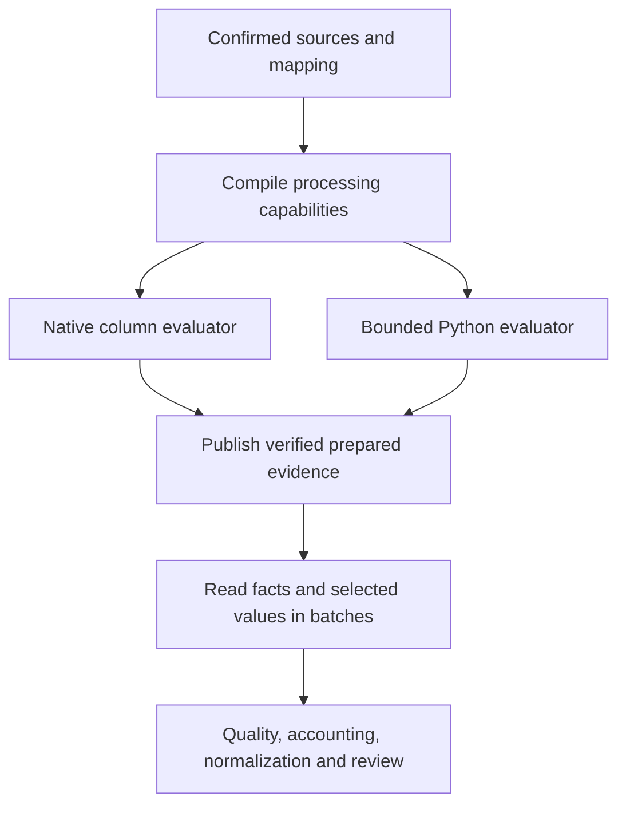

# Reliable and efficient preparation across storage formats

## Status, reader, and outcome

**Status:** Implementation started, 2026-09-15. The first delivery adds generic
admission checks, per-dataset route diagnostics, and a verified shortcut that
avoids a complete-row scan before indexed quality checks. Canonical payloads
are validated while publication hashes them. The remaining work below retains
its acceptance gates; the full plan is not yet complete.

| Step | Current progress |
| --- | --- |
| 0: Baseline | Route diagnostics identify each table and unsupported rule. Generic regression tests compare the old scan with the shortcut. Controlled scale and timing qualification remain open. |
| 1: Storage access and admission | Incoming identity groups are detected before transformation, and publication validates canonical records across both storage representations. The explicit consumer-port refactor remains open. |
| 2: Narrow checks | Exact mapping and published-hash bindings allow indexed quality checks to skip the full-row identity scan. Broader value projections and bounded finding publication remain open. |
| 3: Arithmetic | Common arithmetic now reuses compiled instructions on the bounded Python route. Native decimal formula qualification remains open. |
| 4: Relational identity | Direct complete-group quality uses narrow projections and a database-owned graph. Compiler v9 and Polars evaluate qualified incoming, target-catalog, and hybrid identity references; clean datasets now use exact set-based DuckDB canonical projection within the existing 50,000-row boundary. Larger complete-route scale remains open. |
| 5: Release | Windows Python 3.12 worker measurements passed for 50,000-row custom document/entry and BoM fixtures. Full release qualification remains open. |

First-delivery verification on 2026-09-15:

- The focused 69-test suite finished with 68 passing tests and one opt-in
  100,000-row relationship scale test skipped. It covers admission, ordinary
  links, identity groups, custom models, both storage formats, retry recovery,
  canonical publication, and parity with the authoritative quality evaluator.
- The custom-model comparison observed seven extra full-row reads in the old
  quality guard and zero in the verified-mapping route, with identical results.
  This proves removal of that scan; it is not a timing or memory benchmark.
- The five storage integration tests passed again after adding malformed
  object and issue-shape cases to publication validation.
- The documentation checker and its five architecture tests passed. The
  dependency gate still reports the existing application-to-adapter import
  from `fallout_workbook_service`; it reported no new dependency violation
  from this delivery.
- Browser verification of the new admission message and controlled workflow
  timing and memory measurements remain open. Live workspace data and running
  Impodo sessions were not used for these tests or changed by this delivery.

Arithmetic delivery on 2026-09-15 implements the bounded Python option in
Step 3. Numeric constants, named source values, parentheses, unary signs,
addition, subtraction, multiplication, and division reuse immutable
instructions. Browser preparation binds each eligible formula once per
dataset and supplies only its referenced inputs. Profiles and individual
previews reuse a bounded compilation cache. Other safe expressions retain the
AST evaluator, and invalid formulas retain their row-level errors.

A precision probe returned `0.3333333333333333333333333333` from the Python
Decimal evaluator for `1 / 3`, compared with `0.333333333333` from a Polars
expression using `Decimal(38, 12)`. This disproves parity for that native
translation. Formula capability diagnostics therefore still report bounded
Python fallback; this delivery does not change the row ceilings.

All 86 focused tests passed for this delivery. They include differential
arithmetic and browser preparation tests, profile formulas, native Polars
regressions, direct publication, mixed storage, failed-attempt recovery, and
materialized-result parity. Documentation checks and the five documentation
architecture tests passed. The dependency gate still reports the existing
`fallout_workbook_service` application-to-adapter import.

No browser control, label, or decision changed in this arithmetic delivery.
Browser and screenshot qualification were not run. Full worker timing, memory,
and large incoming identity-group qualification remain open. Tests used
fictional inputs and disposable project stores; live sessions were unchanged.

The [arithmetic diagnostic runner](../../tests/performance/arithmetic_formula_runner.py)
compares exact records and transformation impacts, then alternates route order
over five warm measurements. On Windows 11 with Python 3.14.7, the fictional
3,000-row browser transformation measured these medians:

| Unused source columns | AST baseline | Compiled arithmetic | Reduction |
| --- | --- | --- | --- |
| 0 | 0.1395 seconds | 0.1256 seconds | 9.9% |
| 60 | 0.3343 seconds | 0.1540 seconds | 53.9% |

These are local diagnostics from a working tree under development. They
exclude worker startup, project publication, quality, normalization, and peak
memory. They do not qualify the total preparation performance target. Re-run
the diagnostic with:

```powershell
.\.venv\Scripts\python.exe -m tests.performance.arithmetic_formula_runner --output .codex-artifacts/arithmetic-formula-measurements.json
```

This plan helps maintainers sequence changes to **Prepare data** and decide
whether each change preserves results while reducing unnecessary work.

### Incoming group-quality delivery, 2026-09-15

The group-quality portion of Step 4 now handles direct incoming identities
and scopes within the existing 50,000-source-row direct limit. It removes the
group-specific requirement for the 25,000-row materialized route. Advanced
rules, reference-bundle resolution, non-direct preparation, and the general
materialized fallback retain their separate budgets. At the time of this
delivery, native relational identity transformation still selected bounded
Python evaluation. The later native relational identity delivery below
replaces that fallback for qualified direct mappings.

The domain supplies one extraction rule for dependency roles. The DuckDB
adapter projects only identities, scopes, and ordinary references from
canonical JSON. Projection pages obey row and UTF-8 byte budgets; one larger
legal record travels alone. The adapter reuses the direct identity index and
counts parent keys before matching them. Temporary forward and reverse arcs
preserve the authoritative evaluator's group semantics, with warning policies
filtered before traversal. Distinct recursive traversal keeps the visited set
and frontier in DuckDB rather than calling Python at every hierarchy level.

Group facts are rebuilt transactionally from immutable evidence. Interrupted
projection rolls back, and retry produces the same results without a storage
migration. Tests cover ordinary lookups alongside identity parents, composite
keys, duplicate and missing parents, nested groups, multiple parent roles,
warning policies, target and hybrid references, self-links, cycles, and a
1,024-level hierarchy. Wide scalar values are excluded from graph transport.
A separate 50,000-level graph test converged with DuckDB's memory limit set to
192 MB. That measures graph closure, not peak worker memory or a complete
50,000-row preparation.

Native hybrid lookups rebuild forward facts from hash-verified relationship
columns, using the same reference serialization as canonical replay. This
preserves the authoritative evaluator's canonical-key behavior even when an
older native edge index used the incoming key. It does not change hybrid
matching semantics or rewrite historical prepared data.

This fixture also exposed a separate native serialization limitation: native
hybrid references have the same complete semantic payload as Python replay,
but their existing property order can produce a different canonical content
hash. At that delivery, the hybrid quality test compared every payload value
and bound its quality oracle to the exact published native hash. It also
verified that native relationship projection actually ran. Versioning that serializer while
preserving historical replay hashes was an explicit native qualification
gate. The serializer delivery below addresses that gate; the quality delivery
alone did not claim byte parity for native hybrids.

Full-service fixtures compare order lines, accounting lines, and 26,001
custom-model records with the materialized oracle. Service tests trap
materialized quality and normalization fallback and complete a failed attempt,
retry, and repeat preparation. The oracle's size guards are bypassed only in
the disposable expected-evidence calculation; production admission and
processing limits remain active in the service under test.

The four initial service and scale checks passed in 266.827 seconds. The
26,001-row fixture completed a deliberately failed attempt and two successful
preparations in 131.264 seconds, preserving complete quality and canonical
hashes. The 50,000-level closure completed in 14.355 seconds in that run. These
are local correctness-qualification observations from a changing working tree,
with concurrent tests. They are not controlled performance comparisons or
qualification of the plan's total-time reduction target.

Final focused verification passed all 27 tests covering native hybrid quality,
group parity and interruption recovery, projection row and byte budgets,
admission, and documentation. All 11 native Polars regression tests also
passed. The broader 58-test preparation, normalization, mixed-storage,
readiness, and architecture run finished with 56 passing tests, one opt-in
skip, and the same pre-existing `fallout_workbook_service` dependency violation.
Documentation validation and the module documentation inventory passed.

Reproduce the service and graph qualification with:

```powershell
$env:IMPODO_RUN_PREPARATION_SCALE = '1'
.\.venv\Scripts\python.exe -m unittest tests.performance.test_preparation_identity_groups -v
```

The consumer-port refactor, full error-heavy finding publication, fully
set-based relational identity projection, browser verification, and controlled
workflow timing and peak-memory measurements remain open. This delivery uses
fictional inputs and disposable stores and does not restart Impodo or alter
live workspaces.

### Native reference serialization delivery, 2026-09-15

Before expanding native relational identity evaluation, this delivery closes
the reference-byte compatibility gate discovered during group qualification.
New prepared projections use contract 4. Incoming, target, and hybrid
references use the same exact canonical bytes as the Python evaluator. Target
and hybrid properties are sorted, and empty optional reference metadata is
omitted. The projection version changes independently of the compiled program;
the existing program contract and compiler version remain unchanged.

The DuckDB layout also includes prepared literal columns for constant existing
record choices. Previously, that layout counted only source columns, so a
constant choice produced an empty reference key and an invalid SQL condition.
The corrected layout preserves the declared order for the constant key and
scope. It uses the same generic mechanism for any linked Odoo model.

Historical projection contract 3 continues to select its original serializer.
Captured fictional evidence verifies exact old bytes and hashes. A disposable
workspace test finalizes old evidence, reopens the store, and verifies its
complete original content hash without modifying projection metadata. Changing
its saved projection version fails content-hash validation. Unsupported
versions and changed compiled programs are rejected. No database migration or
live workspace repair is required.

All 40 focused serializer, compiler, Polars transformation, and correction
tests passed. Exact reference-byte tests cover single and composite keys,
scopes, supported aliases, constant choices, null and partially empty keys,
Unicode and escaped values, and page sizes of 1, 17, and 5,000 rows. The generic
hybrid service fixture now requires complete canonical hash parity with the
materialized evaluator rather than accepting semantic equality alone. That
complete service fixture, native projection interruption recovery, and
admission when native projection misses its qualified route all passed: three
tests in 48.856 seconds.

Storage, identity-group quality, admission, schema, and architecture verification
completed 35 tests. After correcting the required documentation links, 34
passed; the dependency gate still reports the existing application-to-adapter
import from `fallout_workbook_service`. The five documentation architecture
tests passed again, and documentation validation, the code documentation
inventory, and whitespace checks passed.

This serialization delivery did not itself qualify native relational identity
evaluation or raise processing limits. The subsequent delivery below uses the
qualified bytes while keeping the existing 50,000-row limit. The consumer-port
refactor, bounded error-heavy finding publication, native Decimal formulas,
browser verification, and controlled complete-workflow time and memory
measurements remain open. Browser controls and decisions do not change, so
screenshots were not recaptured. Implementation and tests do not restart Impodo
or access running user sessions.

### Native relational identity delivery, 2026-09-16

Compiler v9 represents each qualified relational target-identity or target-scope
component with model-neutral resolver metadata. Incoming, target-catalog, and
target-then-incoming references support ordered composite keys and scope.
Hybrid aliases apply only to the target key. An entirely blank optional
relational scope remains a root, while a partially blank composite scope keeps
the authoritative blocking issue. Reference key normalization trims outer
whitespace without collapsing meaningful internal whitespace.

The Polars adapter evaluates these components in bounded prepared batches and
constructs the same `LogicalReference` values and issues as the Python oracle.
Because DuckDB's clean set-based serializer does not yet encode relational
identity components, capability admission retains the 50,000-row direct limit.
These rows store their canonical payload so indexed complete-group quality can
read identity and scope references. Other clean native rows keep the compact
projection representation. The SQL serializer rejects relational identity
programs rather than producing unqualified bytes.

Compiler-v8 portable programs omit the new metadata and retain their prior
content hashes. Unsupported resolver shapes retain
`COLUMNAR_IDENTITY_RESOLVER_UNSUPPORTED`. No model, dataset, or field name
selects the route.

Focused compiler, capability, Polars, and serializer verification covers
incoming, target-catalog, hybrid alias, composite key and scope, all-blank root,
partially blank scope, internal whitespace, batches of 1, 17, and 1,000 rows,
and historical compiler replay. Generic document, accounting, and custom-model
service fixtures pass with whole-run transformation, quality, and normalization
fallbacks disabled and with exact canonical and quality parity. The controlled
26,001-row custom-model gate also passed. Its forced failure and two complete
preparations finished in 175.736 seconds on the local Windows test runtime.
This is qualification evidence for the existing limit, not a complete workflow
benchmark.

This delivery does not increase any processing limit. Fully set-based
relational identity serialization was addressed in the next delivery below;
the consumer-port refactor, bounded
error-heavy finding publication, native Decimal formulas, browser verification,
and complete-workflow time and peak-memory measurements remain open. Tests use
disposable fictional workspaces and do not access Odoo or running user sessions.

### Set-based relational identity delivery, 2026-09-16

Clean compiler-v9 relational identities now use DuckDB set-based canonical
projection. Identity and scope components serialize as one exact portable
reference each, including target-catalog and hybrid alias keys, composite
parts, and all-null optional roots. The SQL label expression preserves Python
reference representation and rejects nonprintable values that require a
different escape form. Rows with transformation issues select the bounded
payload route for the whole dataset. Reviewed target aliases are applied after
incoming-key normalization, preserving their exact bytes in Polars as in the
Python evaluator.

Complete-group quality rebuilds native identity and ordinary relationship
dependencies from verified prepared columns. Incoming identity and scope links
propagate unsafe children to their parents; hybrid lookup dependencies remain
forward only. The adapter keeps the canonical matching key even when an older
relationship-edge index contains an incoming key. Projection contract 3 and
compiler-v8 hashes keep their historical representation.

Exact Python/SQL row bytes passed for incoming, target-catalog, and hybrid
identities across batch sizes 1, 17, and 5,000, including Unicode, punctuation,
escaped characters, composite keys, aliases, and optional roots. A clean
custom parent-and-child service fixture passed the forced-failure retry and
two successful preparations, comparing complete canonical and quality results
while retaining empty stored row payloads for the clean child dataset.
Another clean custom-model fixture induced a child identity collision and
verified that the native group facts produced the same parent propagation and
quality results as the Python evaluator.
The controlled 26,001-row clean custom-model fixture also passed: its forced
failure and two complete preparations took 48.237 seconds (71.361 seconds for
the entire test) on the local Windows runtime. This is a route qualification
measurement for this fixture, not a general preparation-time guarantee.
Identity-program admission remains at 50,000 rows. The 100,000-row
complete-route qualification, browser check, error-heavy publication, and
peak-memory measurements remain open. Tests use disposable fictional workspaces
and do not touch Odoo or running sessions.

### 50,000-row worker qualification, 2026-09-16

The Python 3.12 Windows worker benchmark ran on disposable direct datasets:
2,000 parents and 48,000 children. The custom `x_custom.document` / `x_custom.entry`
fixture uses an incoming parent in both a child identity scope and an ordinary
relationship. Three fresh processes produced identical staging, quality, and
normalization hashes. First preparation took 51.5–59.3 seconds (56.1-second
median), with a 421 MiB median peak worker working set. Repeat preparation
after removing the source artifact took 61.9–64.7 seconds (62.9-second median),
with a 390 MiB median peak. Both datasets used set-based canonical projection;
workers exited and repeat attempts reused the immutable prepared snapshots.

The BoM regression used the same 50,000-row source shape in one fresh process.
First and repeat preparation took 44.9 and 31.5 seconds; worker peaks were
415 and 385 MiB. This is a regression check, not a three-run median. The
benchmark stores CPU, disk, and fixture hashes alongside these values. Its
Windows output capture now decodes UTF-8 explicitly so a diagnostic character
cannot hide the worker result.

These measurements came from a dirty development worktree and are preliminary
until the clean committed revision is rerun. An archived previous revision
failed its 25,000-row parent/child benchmark with a mapping/source mismatch,
so it provides no completed first/repeat timing or memory baseline. The
proposed 30% speedup and no-memory-increase comparison cannot be evaluated
against that revision. Release acceptance must record this limitation and
judge the supported 50,000-row route using its exact-result tests, completed
worker runs, and the existing 120-second / 900-MiB absolute worker probe
budget. No 100,000-row relational identity admission is claimed.

The data manager should be able to prepare related tables without choosing an
internal evaluator or storage format. Examples include orders and their lines,
categories and their children, and BoMs and their component lines.
Impodo should check predictable processing limits before starting, process
supported work in bounded batches, and publish the same reviewed evidence
regardless of the evaluator it selects.

The implementation is model-neutral. BoM is one regression example, not the
unit of design or the only release fixture. All three changes apply to any
currently supported Odoo model whose mapping has the same structural rules.

For example, a fictional parent table identifies a BoM by `BOMId`. Its lines
identify components by `ItemId` within that parent and calculate a quantity
from `quantity / series * 1000`. These ordinary rules should have a qualified
efficient route. A missing or unsafe component must still produce the same
quality findings and treatment of the parent as the authoritative evaluator.

## Scope and authority

The [canonical staging contract](../developer/contracts/canonical-staging.md),
[quality contract](../developer/contracts/quality-and-quarantine.md), and
[normalization contract](../developer/contracts/normalization.md) define the
required meaning. The [Prepare data implementation](../developer/workflow/04-prepare-data.md)
and [user workflow](../user/workflow/04-prepare-data.md) describe current behavior.
The [code organization guide](../architecture/code-organization.md) controls
module ownership and dependency direction.

This work covers preparation, its admission checks, and consumers of prepared
evidence. It preserves saved source data and mapping choices. Preparation
continues to make zero Odoo calls. Execution ordering remains owned by the
existing [relationship dependency plan](scalable-relationship-dependency-planning.md).
Faster preparation does not increase the qualified size of a later load.

### Required model independence

The compiler and evaluator derive behavior from compiled identities, scope,
relationship policies, field types, and captured schema capabilities. They
must not select a preparation algorithm by Odoo model name, field name, source
table name, or a recognized business label. Custom models use the same rules
when their captured schema and mapping satisfy the supported contracts.

A relationship does not automatically make two records one update group.
Complete-group quarantine applies when the compiled relationship forms part
of target identity, as defined by the quality contract. An ordinary linked
field retains its existing propagation rules. The optimizer must preserve
this distinction for every model.

Qualification must include these structural cases:

- A parent and its lines use the parent reference as part of each line's
  identity, as in a document with uniquely identified lines.
- A record links to a parent through an ordinary field without making that
  parent part of its identity.
- A dataset links to itself, including an explicitly empty root scope and
  several levels of children.
- Three or more datasets form nested dependency groups.
- A child has several references with different roles, such as an identity
  parent, a product, and a unit of measure.
- A mapping reuses existing target records, incoming records, or the supported
  combination of both, including missing and ambiguous matches.

Existing supported relationship kinds remain regression cases even when this
delivery does not expand their capabilities. Cycles retain their current
validation and execution meaning.

Large-scale acceptance in this plan applies to direct selected datasets.
Generated hierarchies and other derived datasets retain their separately
qualified routes and limits. Tests must distinguish these cases and verify
early refusal of unsupported sizes; model independence does not imply that
every dataset construction method has the same capacity.

## Original weaknesses and the required changes

| Weakness in the current implementation | Evidence | Proposed result |
| --- | --- | --- |
| Common rules select the Python fallback for an entire dataset. | `COLUMNAR_CAPABILITY_MATRIX` classifies formulas and relational identity components as Python-only. One unsupported field makes the complete dataset use that evaluator. | Qualify common arithmetic and relational identity operations individually, while retaining explicit fallback for unsupported semantics. |
| Later checks reconstruct complete records even when they need only a few facts. | The original `build_bounded_quality_run` always scanned canonical rows to detect incoming identity references before using the quality index. Parts of the prepared-value reader convert records through JSON again. | Quality, accounting, and summaries use narrow, verified projections. Complete records are reconstructed for consumers that need them. |
| Later stages depend on physical storage details. | The quality index and canonical reader inspect stored JSON and prepared-value projections separately. The earlier failure came from requiring a uniform representation across a run. | One application-facing read contract serves both representations. Adapters validate each dataset and own physical layout decisions. |

The observed BoM mapping selected the fallback for both its quantity formula
and its product-and-parent identity components. That is a capability gap in
the evaluator. A BoM line does not inherently require JSON storage.

The corrected implementation has completed a disposable copy of the reported
31,815-row workspace. That establishes recovery evidence, not a controlled
comparison of storage efficiency. Public fixtures must use fictional data.

## Proposed design

### Preserve one meaning across evaluators

The native evaluator processes supported operations in columns. The Python
evaluator handles rules whose exact behavior is not yet qualified natively.
Both publish evidence under the same canonical contract.



Storage belongs behind the application port. The initial changes keep the
existing representations and consolidate their validation. A later measured
decision may let Python output use the same typed prepared-value layout.

The implementation must preserve these invariants:

- Both evaluators produce identical typed values, symbolic relationships,
  issues, transformation impacts, lineage, and source accounting.
- Ordering and canonical serialization remain deterministic. Equal bindings
  and meaning produce equal canonical evidence hashes. A changed compiler or
  writer contract may legitimately change a version-bound artifact hash;
  tests must distinguish that from changed business results.
- Every dataset has a complete, validated representation. Different datasets
  may use different representations. Missing values, corrupt artifacts, or
  mixed representations within one dataset remain errors under the current
  storage contract.
- Quality preserves complete collision groups and incoming identity groups.
  An unsafe component sets aside its identity parent and the other dependent
  records as required by the quality contract.
- Publication rechecks exact source, mapping, schema, plan, and owner bindings
  inside the existing transaction boundary. Failed or cancelled sessions never
  become current successful results.

## Delivery sequence

Each step is a separate reviewable pull request. Steps 0 through 5 form the
proposed delivery. The optional storage decision follows their measurements.

### Step 0 — Establish reproducible evidence

**Purpose:** Identify the expensive stages and create a stable comparison
before changing them.

1. Extend the existing preparation benchmark harnesses with a parameterized
   parent-and-child fixture that combines arithmetic, relational identities,
   and mixed storage. Instantiate it for BoMs, document lines, and arbitrary
   custom model names. Include ordinary linked fields and incoming parents,
   plus a separate hierarchy fixture for self-references and nested groups.
2. Record transformation, artifact writing, canonical hashing, quality,
   normalization, and total wall time separately. Record CPU time, peak worker
   memory, database and artifact bytes, full-record reconstruction counts,
   query counts, and the selected route and reason for each dataset.
3. Measure first preparation and repeat preparation separately in fresh
   production worker processes. Preserve individual measurements and report
   medians from at least three comparable runs.
4. Fix the fixture seed, runtime, machine, batch size, thread settings, source
   hashes, and code revision. Separate instrumented diagnostic runs from timing
   runs so profiling overhead cannot masquerade as a regression.

**Acceptance:** A maintainer can reproduce the baseline and see which stage
accounts for the work. A deliberately unsupported case produces an expected
refusal, rather than an invalid performance comparison.

### Step 1 — Consolidate storage validation and check the route early

**Addresses:** Storage-dependent checks and predictable late failures.

1. Extend the consumer-owned preparation ports with the narrow prepared
   evidence operations needed by quality and accounting. Replace optional
   `getattr` discovery of these capabilities with explicit typed contracts.
   Reuse the existing session and projection contracts rather than adding a
   second owner of prepared data.
2. Have the DuckDB adapter validate each dataset's representation once per
   bound read context. Reuse that verified result within the operation. Check
   artifact hashes, projection versions, ordinal ranges, dataset counts,
   lineage, and required stored values before exposing its facts.
3. Move representation checks into that adapter boundary. Application quality
   logic should consume business facts without testing whether `row_json` is
   empty. Preserve the existing corruption checks behind the port.
4. Extend `compile_preparation_capability` to retain each dataset's actual
   compiler reasons and each later stage's limitations. Include incoming
   identity groups while their bounded quality route remains unsupported.
   Bind this decision to the same inputs used by the worker.
5. Refuse a predictably unsupported route before transformation starts.
   Identify the affected table, rule, and limiting stage in the operator
   explanation. A bounded check of compact facts may refine a conservative
   decision, but it must not materialize the whole run or claim an unsupported
   capability. Unexpected corrupt evidence still fails when detected.

**Acceptance:** All-JSON, all-projected, and mixed-dataset runs have identical
meaning. Missing projection evidence, mixed storage within a dataset, stale
bindings, duplicate ordinals, and incomplete lineage are rejected. A known
unsupported incoming identity group above the current limit stops before
transformation, with an actionable explanation.

### Step 2 — Read the facts each check actually needs

**Addresses:** Complete-record reconstruction and avoidable conversion work.

1. Build the required identity, relationship, issue, and accounting facts
   during the existing batched write. Reuse existing direct indexes wherever
   they already carry that evidence.
2. Replace the full canonical-row scan for incoming identity references with
   a verified fact query. Compiled capabilities can establish that a mapping
   has no such references; data-dependent cases use stored relationship facts.
3. Run duplicate detection, relationship joins, and accounting on the narrow
   indexes. Read selected prepared columns for normalization and summaries.
   Reconstruct complete canonical rows only for explicit detail, export,
   hashing, or other consumers that require their complete meaning.
4. Remove encoding and decoding round trips where an existing typed value can be
   passed directly. Retain canonical serialization at evidence boundaries.
   Do not replace the canonical hash with a hash of the physical Parquet file.
5. Page findings and collision results into the publication path. Replacing
   a database `fetchall()` with an iterator is insufficient if the application
   then accumulates every issue in a dictionary. Bound both layers, including
   large error groups and wide values, and retain deterministic issue order.

**Acceptance:** Supported indexed quality and accounting checks do not
iterate complete canonical rows. Required canonical hashing is measured
separately. Clean and error-heavy fixtures preserve every result while batch
and memory checks cover both rows and findings. Repeated status polling does
not scan prepared values or open the database being written by the worker.

### Step 3 — Qualify common arithmetic formulas

**Addresses:** Whole-dataset fallback caused by ordinary arithmetic, regardless
of the model or field receiving its result.

1. Reuse the validated expression parser in `domain/recipe/value_rules.py`.
   Compile a pure expression representation once per submitted mapping, then
   translate supported operations in the existing Polars adapter.
2. Begin with numeric constants, source fields, parentheses, unary signs,
   addition, subtraction, multiplication, and division. Qualify the fictional
   `quantity / series * 1000` case through to its mapped decimal output. Apply
   the same expression capabilities to other numeric fields and custom models;
   the compiler must not identify quantity fields by name.
3. Prove the current evaluator's exact coercion, decimal precision, rounding,
   null, overflow, and division-by-zero behavior. Conditional evaluation and
   functions remain explicit fallback until their behavior is qualified.
   Do not silently use floating-point arithmetic to obtain a faster result.
4. For arithmetic whose native precision cannot match the current evaluator,
   reuse a once-compiled Python expression on bounded input batches. Route
   this explicitly; do not describe Python execution as native support.
5. Update capability reasons per supported expression. Retain whole-dataset
   fallback for other unsupported operations in this first delivery; a new
   general scheduler that alternates evaluators within each row is unnecessary.

**Acceptance:** Differential tests compare the optimized result with the
authoritative Python evaluator for valid and invalid values, including exact
issues and lineage. The supported arithmetic fixture uses its declared route
and improves measured transformation work. A formula outside the qualified
subset still has a stable, truthful fallback reason.

### Step 4 — Qualify relational identity and complete-group quality

**Addresses:** Fallback caused by relationships used in target identity or
scope, including the reported product-and-parent matching keys.

1. Compile relational identity and scope components into normalized symbolic
   references using the existing relationship contracts. Handle both existing
   target records and incoming records. Derive behavior from the mapping and
   captured schema, with no `mrp.bom` special case.
2. Reuse batched incoming-key indexes and relationship joins. Preserve
   composite keys, scope, explicit null root scope, and deterministic ordering.
   A target-catalog reference stays symbolic during preparation.
3. Implement bounded quality propagation for incoming identity groups. Store
   membership and affected rows in the session's database structures. Use
   set-based joins and a bounded work queue until no new rows are affected.
   Preserve the domain's definition of propagation; an ordinary relationship
   must not accidentally become an identity-group relationship.
4. Cover duplicate parents, missing parents, ambiguous keys, repeated
   components, unsafe children, nested groups, fan-out, and cyclic input. Use
   visited or affected state to terminate, and preserve existing outcomes for
   cycles rather than introducing a new execution policy.
5. Advertise the incoming identity route as supported only when transformation,
   group quality, accounting, and normalization all pass. Native key evaluation
   alone is insufficient to admit the complete preparation route.

**Acceptance:** Small fixtures for every required relationship shape exactly
match the authoritative full evaluator. Include at least two non-BoM shapes
and an arbitrary custom-model fixture. Rename the fixture's model, dataset,
and field identifiers consistently and prove equivalent decisions after
accounting for those renamed identifiers. Hashes that include the identifiers
are expected to change; the rules and outcomes must not.

Large fixtures complete above the 25,000-row materialized boundary within the
currently qualified direct limits, with whole-run fallback disabled in tests.
One unsafe child sets aside the required complete group; unrelated groups
retain their existing outcomes. Preparation makes no Odoo request.

### Step 5 — Qualify the complete workflow and release

**Purpose:** Demonstrate that the changes improve operator experience and
preserve recovery across existing and future workspaces.

1. Repeat the baseline with the same fixtures and runtime. Include a non-BoM
   parent-and-child workload and a hierarchy as release gates. Report first and
   repeat preparation independently, including phase times, CPU, peak memory,
   disk use, route choices, and canonical and quality comparisons.
2. Qualify existing JSON runs, projected runs, mixed runs, retries after each
   publication boundary, cancellation, worker interruption, and stale mapping
   or schema bindings. Read existing evidence under its supported contract.
3. Verify **Prepare data** and its progress page with isolated fictional data.
   Known unsupported work must explain the required action before processing;
   a failed job must show a terminal failure instead of appearing active at its
   last percentage. Preserve polling from the in-memory job snapshot.
4. Update the paired workflow pages, relevant contracts, code documentation,
   and workflow registry with implemented behavior and qualification evidence.
   Recapture screenshots only where the operator's decision or message changes.
5. Activate through the normal release and build-contract process. Save edits
   and warn the operator before a required application restart. Reopen the same
   project and start a fresh preparation attempt from its saved mapping.

**Acceptance:** The report passes the correctness and performance gates below.
The same workspace remains usable after installing the release. No manual
database repair or replacement project is needed to activate these changes.

## Code ownership and focused tests

Paths below are relative to `src/impodo` unless they begin with `tests` or
`scripts`. New modules should stay within the named capability package.

| Change | Implementation owner | Focused verification |
| --- | --- | --- |
| Baseline and release measurements | `scripts/benchmark_preparation.py` and `scripts/benchmark_preparation_workers.py` | `tests/performance/test_preparation_benchmark.py`, `test_preparation_worker_benchmark.py`, and `test_preparation_scale.py`. |
| Prepared evidence ports and admission | `application/workspace/preparation/readiness_ports.py`, `preparation_capability.py`, and `preparation_service.py` | `tests/application/workspace/preparation/test_capability.py` and `test_readiness.py`. |
| Representation validation and reads | `adapters/duckdb/preparation_stored_run_reader.py`, `preparation_quality_index.py`, and `preparation_session_repository.py` | `tests/integration/duckdb/test_preparation_session.py` and `test_preparation_recovery.py`. |
| Narrow checks and bounded publication | `application/workspace/preparation/bounded_quality.py`, `bounded_preparation.py`, and the existing normalization collaborators | `tests/domain/preparation/test_quality.py`, `test_normalization.py`, and `tests/performance/test_preparation_scale.py`. |
| Formula and identity compilation | `domain/compiler/columnar_transformation.py`, `domain/recipe/value_rules.py`, and `adapters/polars_transformation.py` | `tests/domain/recipe/test_columnar_compiler.py`, `tests/domain/preparation/test_profile_formula.py`, and `tests/integration/columnar/test_polars_transformation.py`. |
| Operator feedback and worker recovery | `web/routers/preparation.py`, its presenters and templates, and `web/composition/preparation_job_manager.py` | `tests/integration/web/test_preparation_workflow.py`, `test_recipe_preparation_recovery.py`, and `tests/architecture/test_build_contract.py`. |

Pure compilation and quality meaning stay in the domain layer. Application
code coordinates publication through consumer-owned ports. DuckDB and Polars
adapters own physical queries and expression execution. Browser routes render
the decision and must not contain storage or quality rules. Run the dependency
and inventory architecture checks when ownership or imports change.

## Qualification matrix and performance gates

Use small readable fixtures for exact expected results and larger deterministic
fixtures for scale. Test the supported boundary and the first unsupported row.
The current limits are 25,000 rows for materialized evaluation, 50,000 for
bounded Python and direct related work, and 100,000 for eligible native direct
work. The capability manifest's most restrictive active stage remains binding.

| Dimension | Required coverage |
| --- | --- |
| Storage | All JSON, all projected, mixed between datasets, and corrupt or incomplete representation. |
| Evaluation | Native-only rules, arithmetic, relational identities, both combined, and a deliberately unsupported rule. |
| Relationships | Existing target references, incoming parents, composite keys, null scope, duplicates, missing parents, and nested identity groups. |
| Model independence | Document lines, a self-referencing hierarchy, the BoM regression, arbitrary custom models, ordinary links, and consistently renamed models and fields. |
| Source construction | Direct selected datasets and derived datasets, with completion or early refusal according to each qualified route. |
| Data shape | Clean data, many errors, one large collision group, wide rows, large relationship fan-out, and empty datasets. |
| Lifecycle | First run, repeat run, cancellation, interruption, failed publication, stale inputs, and normal application restart. |

The release requires all of the following evidence:

- Small-fixture output matches the authoritative evaluator, including issues,
  group propagation, control totals, impacts, and normalization decisions.
  Large-fixture checks use independently defined expected counts and keys;
  they do not invoke an unsafe whole-run oracle above its limit.
- Mixed and incoming-parent fixtures using direct datasets complete for BoMs
  and the non-BoM relationship shapes with full materialized fallback made
  unavailable in the test harness. Passing only the BoM example cannot qualify
  the release.
- Query and reconstruction counts prove that narrow checks do not decode all
  full rows. Working batches and queued findings obey explicit budgets even
  when most rows have issues. Database spill and temporary storage are measured.
- A proposed performance target is at least a 30% reduction in median total
  preparation time for the representative parent-and-child workloads, including
  a non-BoM case, with no increase in peak worker memory. First and repeat runs
  are assessed separately. Validate this target after Step 0; it is not an
  existing performance claim.
- A sustained regression above 10% on an already efficient fixture requires
  investigation before release. Store the agreed absolute memory budget and
  timing targets with the baseline before optimization; report any target
  revision and its evidence explicitly.
- Results include the actual Windows worker process. Additional platform
  claims require corresponding qualification. Limits are raised only through
  a separate measured change; a faster individual operation is insufficient.

## Separate decision: one typed output layout

After Steps 0 through 5, use the remaining profile to decide whether Python
should publish the same typed prepared-value layout as the native evaluator.
This is a conditional follow-up, not a prerequisite for the three fixes.

Prototype with disposable fixtures and compare total workflow cost for:

1. The improved existing JSON representation.
2. Python batches written to typed Parquet values with the existing narrow
   DuckDB indexes.
3. Typed DuckDB values where repeated joins and reads justify their storage.

Adopt a new writer only if measured gains justify the extra persistence and
compatibility work. Include issue and lineage storage in that measurement;
moving only scalar values can leave most conversion costs untouched.

The current `PreparedSnapshot` and `PreparedCanonicalProjection` bind values
to a native transformation program. A shared writer must explicitly separate
the logical transformation binding from evaluator-specific reconstruction.
Document the writer, layout, and program-version rules before implementation.
Do not claim old artifacts are compatible by reusing a version number.

Retain readable historical evidence. Use the normal versioned schema upgrade
for any new session metadata and publish new immutable artifacts for future
attempts. If a format cannot be read by an older build, rollback must use a
compatible build or a verified project backup. Never rewrite evidence in place
or lower a version marker to force an old reader to accept it.

## Main risks and decisions

- **Decimal equivalence is the largest formula risk.** Keep an explicit Python
  route for an expression until its complete output and error behavior match.
- **Group propagation is the largest correctness risk.** The tests must prove
  complete affected groups and unchanged unrelated groups before admission
  expands.
- **Narrow facts can become a second source of truth.** Bind and publish them
  atomically with their canonical evidence, and verify consistency on reads.
- **Two representations add maintenance cost.** Consolidate their public read
  contract first, then use measured evidence to decide whether convergence is
  worth a writer and compatibility change.

The recommended starting point is Step 0 followed by Step 1. That gives every
later optimization a reproducible baseline and a consistent storage boundary.
