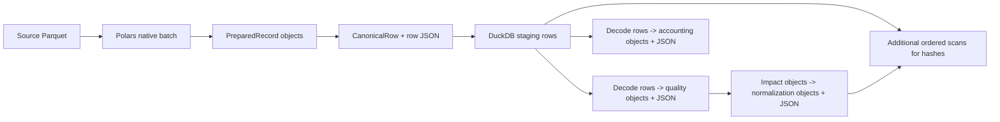

# High-volume transformation architecture implementation plan

## Status and authority

**Status:** Reconciled implementation proposal from 2026-08-11, updated after
critical review of the counterproposal against the current repository and with
an explicit high-volume vectorization contract.

This document expands the related and mixed preparation objective in
[Impodo remaining work](remaining-work.md). It does not describe current
behavior, raise a supported limit, or weaken any source, mapping, staging,
quality, normalization, preflight, or execution evidence contract.

Implementation status and before/after measurements are maintained separately
in [Transformation scale implementation log](../reports/transformation-scale-implementation-log.md).

The immediate business target is one project containing approximately 16,000
products and 80,000 BOM lines. The design must also explain and correct the
reported 800-900 MiB peak for a real 1,000-customer preparation before a larger
limit is trusted.

No Odoo call belongs in this transformation work. Odoo comparison and writing
remain later, separately bounded stages.

## 1. Decision and readiness assessment

Impodo is **not yet qualified** for the intended product-and-BOM workload.
There is a working high-volume foundation, but the currently proven
100,000-row profile applies only when every dataset is direct, every mapping is
compiled to the native columnar path, and every source is bound to an exact
snapshot. A product/BOM migration is related and mixed by nature. That path is
still limited to the lower Python/materialized boundary and its 100,000-row
qualification remains open.

The gap is not primarily "use a faster hash." The current direct path already
streams Polars work and bounds many repository batches, but repeatedly turns
the same logical row into Python objects and canonical JSON for staging,
identity, lineage, quality, source accounting, transformation impact, and
normalization. Several stages also retain complete Python sets or dictionaries
of row IDs, identity keys, effect IDs, and relationship state. Hashing those
representations consumes CPU; constructing, decoding, and retaining them is
the larger memory risk.

The recommended direction is therefore the **B2 lean hybrid evidence
architecture**:

1. reproduce the real 1,000-customer case and report the route of every stage;
2. make admission a full-pipeline capability decision so a dataset cannot enter
   a high-volume route that quality or normalization will later materialize;
3. remove the Python row reconstruction and rule-replay seam immediately after
   native Polars transformation;
4. enforce a measurable vectorization contract: high-volume row-local work is
   expressed as native Polars expressions, global work as DuckDB relations, and
   Python row/cell callbacks are absent from the admitted hot path;
5. reuse the existing prepared snapshot as the bulk value carrier for direct
   one-to-one native datasets, adding only a narrow canonical index and facts;
6. use Polars for row-local expressions and DuckDB for set-global identity,
   relationship, quality, accounting, and normalization work;
7. retain exact governance hashes and current artifact-byte verification while
   eliminating duplicate serialization and duplicate logical calculations;
8. create separate canonical value artifacts only for derived/grouped outputs
   whose rows no longer correspond one-to-one with a prepared snapshot;
9. publish an immutable run only after all pending artifacts and counts have
   been verified; and
10. reclaim all working memory by ending the preparation worker.

This is an evolution of the current architecture, not a reason to replace
DuckDB, Polars, Parquet, or the local worker model.

## 2. Competing proposals and weighted decision

Four proposals are credible enough to compare. They are alternatives at the
architecture level, although the first proposal can also serve as a reversible
first delivery slice for the recommended second proposal.

### 2.1 Proposal A - Optimize the existing bounded row-JSON pipeline

Keep the present logical and physical model: canonical rows, quality results,
source-accounting entries, and effects remain individually encoded as JSON in
DuckDB. Concentrate on removing duplicate work without changing storage
contracts.

Implementation outline:

- calculate immutable mapping, schema, ruleset, and program hashes once;
- encode each row/effect once and reuse those bytes for validation, hashing,
  and persistence;
- remove decode-only-to-rehash passes where database constraints and
  append-time validation provide equivalent proof;
- use row-and-byte-bounded transport throughout;
- replace known slow transport shapes only after direct JSON, Arrow, and
  appender benchmarks;
- extend the existing pending session to related product/BOM batches while
  retaining row JSON as the authoritative payload; and
- move only duplicate and relationship grouping into set-based DuckDB queries.

**Advantages:** shortest path, lowest contract risk, maximum reuse of current
tests and repositories, and likely material CPU improvement.

**Weaknesses:** every logical stage still stores another row-oriented payload;
quality/accounting/effect data remain physically repetitive; wide values still
cross Python/JSON boundaries; and the likely memory headroom beyond 100,000
rows is limited.

**Indicative effort:** two to four weeks for the contained work, plus related
qualification.

**Best use:** an immediate low-risk optimization tranche or fallback if the
real customer peak is dominated by one accidental repeated decode/transport
path. It is not the preferred long-term data plane.

### 2.2 Proposal B - Hybrid columnar artifacts and sparse DuckDB facts

Keep the current engines but change their responsibilities. Polars and Parquet
carry bulk typed values; DuckDB carries manifests, indexes, relationship edges,
issues, sparse exceptions, effects, counts, and current pointers; Python owns
small domain contracts and bounded/page-sized adaptation.

Implementation outline:

- publish immutable typed canonical chunks by dataset;
- maintain compact row, identity, lineage, and relationship indexes in DuckDB;
- evaluate duplicates and product/BOM relationships set-wise;
- represent clean quality/accounting defaults in the manifest and physically
  store exceptions;
- store transformation and normalization rule metadata once, with compact
  row-level effect facts for actual changes;
- calculate hashes from the same encoded batches or immutable chunks being
  published; and
- atomically promote a verified manifest after all data artifacts and facts
  reconcile.

**Advantages:** best balance of memory headroom, governance, current-code reuse,
local operational simplicity, and related/derived scalability. It preserves
the proven source/prepared Parquet path and current DuckDB project boundary.

**Weaknesses:** requires new physical evidence readers, default-plus-exception
reconstruction, storage contract decisions, and careful migration/parity work.
It is more than a transport optimization.

**Indicative effort:** six to ten weeks to qualify the immediate product/BOM
profile, including measurement and contract parity.

**Best use:** recommended target for the local browser product.

### 2.3 Proposal C - DuckDB-first relational transformation engine

Make DuckDB the main transformation and evidence engine. Load or expose each
validated source snapshot as controlled typed relations, compile supported
mappings into SQL expressions, and perform transformation, identity,
relationships, quality, normalization, and finalization through set-based SQL.
Polars would be reduced to ingestion cases DuckDB cannot safely or efficiently
cover.

Implementation outline:

- define dynamic, run-scoped typed dataset tables or controlled snapshot scans;
- compile mapping operations to a constrained SQL intermediate representation;
- express relationship and quality checks as joins, groups, windows, and
  recursive graph operations;
- use DuckDB spill for blocking operators under explicit memory/temp budgets;
- publish typed final relations and manifests without adapting every row to
  Python; and
- retain a small Python evaluator as the semantic oracle.

**Advantages:** one primary set-based data engine, strong larger-than-memory
operators, fewer Polars-to-Python-to-DuckDB transitions, and a natural fit for
relationships and aggregation.

**Weaknesses:** large compiler and parity rewrite; arbitrary Odoo field types
and transformation semantics must be represented safely in SQL; the current
hardened external-access boundary needs careful preservation; DuckDB's
single-writer model remains; and current Polars investment would be partly
duplicated.

**Indicative effort:** eight to fourteen weeks before full product/BOM parity
and qualification.

**Best use:** a conditional alternative if the Phase 1 transport spike proves
that crossing from Polars into the governed evidence store remains the dominant
bottleneck, or if future mapping operations become predominantly relational.

### 2.4 Proposal D - Hosted distributed data plane

Move project metadata and durable state to PostgreSQL, bulk artifacts to object
storage, and transformations to separately scheduled workers. Workers operate
on immutable Arrow/Parquet partitions and publish manifests through a central
coordinator.

Implementation outline:

- PostgreSQL control-plane repositories and transactional current pointers;
- object-store source, prepared, canonical, and evidence chunks;
- durable queue, leases, retries, cancellation, quotas, and worker isolation;
- partitioned relationship/quality/effect processing; and
- deployment observability, disaster recovery, retention, and tenant security.

**Advantages:** strongest horizontal capacity and worker isolation; appropriate
for concurrent hosted tenants and datasets substantially beyond workstation
scale.

**Weaknesses:** does not remove inefficient row/JSON representations by itself;
adds distributed consistency, infrastructure, deployment, security, and
operational work; conflicts with the present local-first need; and has the
largest delivery risk.

**Indicative effort:** twelve to twenty weeks for a credible first hosted
composition, excluding production security and operations qualification.

**Best use:** only when a concrete hosted deployment, multi-user concurrency,
or datasets beyond the local architecture's measured ceiling require it.

### 2.5 Evaluation criteria

Scores use a five-point scale where 5 is strongest. For delivery and
operations, 5 means lower risk, shorter delivery, and simpler operation. The
weights reflect the immediate requirement: reliably prepare the product/BOM
project on the existing local Windows product without weakening evidence.

| Criterion | Weight | What a high score means |
| --- | ---: | --- |
| 96,000-row target likelihood | 20% | Likely to pass the complete related workload below 120 seconds and 900 MiB. |
| Memory headroom | 15% | Peak grows with bounded batches and compact facts rather than repeated row payloads. |
| Governance preservation | 10% | Exact bindings, lineage, deterministic evidence, corruption detection, and fail-closed publication remain strong. |
| Delivery risk and time | 20% | Small change surface, incremental rollout, and fast feedback. |
| Fit with current code | 15% | Reuses the existing compiler, Parquet snapshots, DuckDB repositories, worker, and readers. |
| Related/derived capability | 10% | Handles products, BOMs, graphs, ambiguity, cycles, and multi-source lineage set-wise. |
| Local operational simplicity | 10% | Works in the current browser-first Windows deployment without new services. |

### 2.6 Weighted rating

| Proposal | Target | Headroom | Governance | Delivery | Current fit | Related | Operations | Weighted score |
| --- | ---: | ---: | ---: | ---: | ---: | ---: | ---: | ---: |
| A. Optimize bounded row JSON | 3 | 2 | 5 | 5 | 5 | 3 | 5 | **3.95 / 5** |
| B. Hybrid columnar + sparse facts | 5 | 5 | 5 | 3 | 4 | 5 | 4 | **4.35 / 5** |
| C. DuckDB-first relational engine | 4 | 4 | 5 | 2 | 2 | 5 | 3 | **3.40 / 5** |
| D. Hosted distributed data plane | 5 | 5 | 5 | 1 | 1 | 5 | 1 | **3.20 / 5** |

The numerical result is an initial ordinal decision aid, not measured precision.
The decimal differences must not be interpreted as benchmarked margins. Evidence
confidence is medium for A and B because their main seams are present in the
repository, and low for C and D because neither alternative has an integrated
prototype. Changing the weights can change the ranking: a hosted multi-tenant
product would raise Proposal D, while a two-week emergency optimization would
raise Proposal A.

### 2.7 Selection

Select **Proposal B2**, a narrowed form of Proposal B, as the target
architecture. Deliver it in this order:

1. correct full-pipeline route admission and instrument the real customer case;
2. remove post-Polars Python rule replay and full-row object reconstruction;
3. prove that the existing prepared snapshot can carry direct canonical bulk
   values before introducing another Parquet value artifact;
4. complete sparse multi-dataset quality, construct-once normalization, and
   hybrid set-based product/BOM relationship handling;
5. retain Proposal C as a measured contingency, not a parallel rewrite; and
6. leave Proposal D parked behind the existing hosted-composition trigger.

This sequence avoids an all-at-once rewrite while preventing the short-term
row-JSON optimization from becoming the permanent architecture by default.
The remainder of this document specifies Proposal B2.

### 2.8 Critical review of the counterproposal

#### 2.8.1 Findings accepted

The following counterproposal findings are confirmed in the current repository
and materially improve this plan:

1. **There is a real full-pipeline route mismatch.**
   `supports_bounded_direct_preparation()` and
   `direct_preparation_row_limit()` can admit more than one direct native
   dataset to the 100,000-row preparation route. `BoundedQualityEvaluator`
   rejects that shape when `len(physical_rows) != 1`, and `QualityService`
   responds by materializing the entire staging run. Normalization has the same
   fallback pattern. A 16,000-product/80,000-BOM run could therefore be admitted
   as high-volume and later lose its memory bound. This is a correctness and
   capacity-contract defect, not just a performance opportunity.
2. **The first native seam is too row-oriented.** `_adapt_frame()` iterates a
   Polars frame as Python rows and creates dictionaries, errors, identities,
   scalar maps, issues, `PreparedRecord` objects, trace hashes, and effect
   objects. Polars itself documents that row iteration is not optimal for its
   columnar storage. The high-volume path must not reconstruct every native row
   into the full domain object graph.
3. **Rule impacts are calculated twice in different forms.** The native plan
   transforms values, then `_columnar_rule_results()` replays trim, whitespace,
   replacement, case, and empty-as-null behavior in Python to count impacts.
   Rule observations should be derived by the native expression plan or a
   native aggregate over its output, with the Python evaluator retained only as
   a parity oracle.
4. **The existing prepared snapshot is the correct first bulk-value candidate.**
   It already binds the project, dataset, source snapshot, mapping, schema,
   transformation program, writer version, row count, physical schema, logical
   hash, storage key, and Parquet SHA-256. Direct one-to-one native datasets
   should first reference that artifact from a narrow canonical manifest/index.
   A second canonical-values Parquet should be introduced only when a measured
   contract gap or changed row cardinality requires it.
5. **Sparse physical evidence can preserve a complete logical contract.** Clean
   quality/accounting defaults can live in a manifest while exceptions live in
   compact facts, provided a versioned projector reconstructs every logical row
   in deterministic order and produces exactly the required logical hash.
6. **Normalization should construct effects once.** Eligibility, changed-row
   counts, distinct source/effect counts, and summaries should be derived from
   durable effect facts rather than from a second complete Python effect graph
   and later hash scans.
7. **The engine split is sound.** Polars should own row-local scalar
   transformations; DuckDB should own joins, groups, duplicate classification,
   relationship resolution, propagation, and graph facts; Python should own
   orchestration, policy, manifests, and bounded/page-sized projections. A new
   SQL compiler for scalar transformation is not justified.
8. **Arrow and versioned chunk roots are conditional optimizations.** The
   current dependency set has no `pyarrow`, and DuckDB's documented Polars
   integration requires it. Neither a new dependency nor a hash-contract change
   should precede a benchmark showing a material integrated gain.
9. **Current artifact-byte verification must remain.** The artifact store
   deliberately recalculates the Parquet SHA-256 when materializing it. Skipping
   that check would weaken tamper detection under the current local storage
   trust model. Any future trusted-immutability shortcut requires its own threat
   model, ADR, corruption tests, and equivalent proof.

#### 2.8.2 Findings accepted only with qualification

These counterproposal directions are useful, but their current wording is more
certain than the evidence supports:

- Similar first/repeat timing and RSS are evidence against one simple cache
  explanation; they do not prove which post-Polars phase owns the peak. OS file
  cache, native allocator retention, overlapping frames, artifact verification,
  and downstream materialization need phase checkpoints and allocation/RSS
  telemetry before causal attribution.
- CPU is acceptable only for the current direct native fixtures. It is not yet
  established for the real 1,000-customer shape, effect-heavy normalization, or
  related product/BOM execution.
- Native rule-impact calculation should not automatically add three durable
  boolean columns per rule. That can make wide mappings wider. Compare transient
  native aggregation, a sparse long-form `(row, rule, outcome)` fact stream,
  and a second projection-pruned native scan. Preserve authored rule order,
  fallback/value-mapping semantics, and exact counts in every option.
- The prepared snapshot can carry direct bulk values, but it is not the whole
  canonical evidence model. A narrow canonical layer must still bind stable row
  IDs, dispositions, issues, lineage, field sources, relationship state,
  control totals, and the versioned logical projection. Quality may change a
  disposition without changing prepared values.
- Removing identity hashes categorically is premature. The required fix is to
  canonicalize identity once and reuse one key. A fixed-width digest may still
  be preferable for compact indexes or reduced exposure of sensitive values.
  Choose encoded key, digest, or both from collision/equality, width, privacy,
  and measured join-cost tests; never calculate multiple redundant digests.
- A dataset row-width estimate can choose safer batch row counts, but it is not
  a hard byte bound. Large or skewed cells and engine buffers can exceed an
  average. Use conservative sampled width, maximum-cell guards, actual frame
  size telemetry, and adaptive next-batch sizing. Treat a 16-32 MiB target as a
  benchmark hypothesis, with an absolute row cap, not a promise.
- Direct Polars-to-DuckDB transfer is worth testing, but the documented route
  currently brings a `pyarrow` dependency. Benchmark direct Parquet scans,
  bounded JSON, appender/parameterized paths, and Polars/Arrow registration on
  the actual evidence schema before selecting transport.
- Default-plus-exception storage preserves governance only if reconstruction is
  byte-for-byte deterministic for the versioned logical contract. Parity must
  cover order, empty/default cases, redaction, pagination, and content hashes.
- The hybrid relationship stage is more than a join. It must represent missing
  and ambiguous parents, duplicate identities, dependency propagation, cycles,
  fan-out, grouped/derived rows, and stable output order, without an N+1 scan or
  query per BOM line.

#### 2.8.3 Reconciled final approach

Proposal B2 keeps the counterproposal's ordering discipline while retaining the
governance boundary of the original plan:

| Responsibility | Authoritative representation |
| --- | --- |
| Direct native bulk values | Existing immutable `PreparedSnapshot` Parquet, referenced rather than copied |
| Derived/grouped bulk values | A separate immutable canonical artifact only when row cardinality or values differ |
| Canonical row state | Narrow DuckDB row index and versioned manifest |
| Identity and relationships | One reusable canonical identity representation plus set-based DuckDB indexes/edges |
| Issues, quality, and accounting | Shared definitions, manifest defaults, and sparse exception facts |
| Transformation/normalization effects | Construct-once durable facts plus set-based summaries |
| Logical public evidence | Deterministic bounded/page-sized projectors preserving the versioned contract and hashes |
| Policy and orchestration | Python, without whole-run native row object graphs |
| Integrity | Existing exact artifact byte hashes and immutable binding hashes |

Every route decision must be expressed as a stage-capability manifest covering
transformation, canonical adaptation, quality, normalization, relationships,
reporting, and preflight. The effective row limit is the lowest safe limit of
all required stages. If any stage would materialize the run, the high-volume
route must be rejected before work begins or that stage must first gain a
bounded implementation.

For the 96,000-row release target, “native” must mean vectorized engine
execution, not a Python loop receiving Polars batches. Batch processing bounds
memory but does not by itself provide vectorization.

## 3. Current evidence

### 3.1 What is already proven

The repository currently records these preparation boundaries and results:

| Workload | Current evidence | Meaning |
| --- | --- | --- |
| Narrow related fixture, 1,000 physical rows | 95.9 MiB peak on Windows | Small row count alone does not explain the reported customer peak. |
| Old wide 100,000-row materializing path | 429.175 seconds and 2,897.3 MiB peak | Complete Python materialization does not scale. |
| Current 100,000-row native direct Products | 826.2-869.0 MiB worker peak | It passes the 900 MiB gate, but has too little headroom for relationships. |
| Current 100,000-row native BOM-shaped direct table | 807.6-854.7 MiB worker peak | It is BOM-shaped, not a qualified product-to-BOM relationship workflow. |
| Same BOM direct run with two Polars threads | 906.7 MiB | More parallelism can make the memory result worse. |
| Current Python fallback | Supported only to 50,000 rows | Insufficient for the planned combined workload. |
| Current derived/materialized path | Supported only to 25,000 rows | Insufficient for the planned combined workload. |

The 16,000 products plus 80,000 BOM lines total 96,000 physical rows, but
physical rows are not the correct sizing unit on their own. Row width, mapped
fields, relationship edges, issues, and transformation effects determine the
real work. An 80,000-line BOM with three changed fields can produce 240,000
normalization effects before quality or lineage facts are counted.

### 3.2 What the current code already does well

- `adapters/polars_transformation.py` uses lazy Parquet scans, a streaming
  Parquet sink, bounded batch collection, projection pushdown, one Polars
  thread by default, and no Python UDF inside the native expressions.
- `application/bounded_preparation.py` writes pending canonical rows in
  batches instead of retaining the complete direct run.
- `adapters/duckdb/preparation_session_repository.py` gives the session a
  pending status, uses short transactions, computes final reconciliation
  set-wise, and advances publication only after finalization.
- the spawned preparation worker releases native allocator high-water memory
  when the process exits, while only small progress messages cross back to the
  browser process;
- DuckDB connections are hardened, the preparation-session connection uses one
  thread and a bounded buffer-manager limit (raised from the proposal's 96 MB
  to a measured 192 MB during Phase 7), and Polars defaults to one thread;
  and
- current hashes bind source snapshots, mapping/schema revisions, prepared
  artifacts, canonical staging, quality, normalization, preflight, and
  execution.

These are foundations to preserve.

### 3.3 Where memory and CPU still multiply

The current direct flow is logically bounded but still row-object-heavy:

Specific pressure points are:

- each direct row is adapted from Polars to `PreparedRecord`, then to
  `CanonicalRow`, then to a portable dictionary and canonical JSON;
- rule-impact observation re-executes native text semantics in Python after the
  expression graph has already transformed the column;
- inline value mappings are currently compiled as growing comparison and nested
  `when` expression chains; these remain vectorized but need a bounded strategy
  for large mapping cardinalities;
- a second SHA-256 identity value is built per row for duplicate grouping;
- canonical rows, identity facts, lineage facts, and physical-row facts are
  transported through separate JSON envelopes;
- final staging hashing reads every stored JSON row, decodes it back to a
  `CanonicalRow`, validates it, and then hashes the original text;
- bounded quality first walks every canonical row to build complete sets such
  as all row IDs and identity keys, then decodes the canonical stream again to
  publish quality rows, and again to publish source accounting;
- relationship quality can hold row, parent, dependent, and issue maps in
  Python;
- normalization constructs effects once to aggregate groups, constructs them
  again for persistence, and then scans stored effect JSON in deterministic
  order for hashing;
- clean/default evidence is physically repeated per row even when it can be
  deterministically reconstructed from a run default plus sparse exceptions;
  and
- the materializing fallback still creates complete source tables, prepared
  tuples, canonical rows, impacts, quality results, and normalization objects.

The configured DuckDB memory limit cannot solve this by itself. DuckDB's own
documentation states that `memory_limit` applies to its buffer manager and
that vectors, result sets, and some aggregate state can live outside it. It
also does not control Python or Polars allocations.

## 4. Treat the 1,000-customer peak as a release blocker

The reported real workload takes priority over synthetic fixtures because it
may expose a route, width, or effect pattern the current scale tests do not.
Before changing evidence semantics, capture a reproducible sanitized fixture
or an exact structural twin with:

- source format, file size, worksheet/table selection, row count, and selected
  source-column count;
- mapped scalar-field count, identity and scope fields, value mappings,
  pattern transformations, and default/fallback rules;
- relationship, reference-bundle, derived-entity, and grouping use;
- issue, transformation-impact, normalization-effect, and changed-row counts;
- the selected execution route: native direct, Python direct, or
  derived/materialized;
- parent browser RSS, child worker peak RSS, child ending RSS, and whether a
  parent-plus-child total was accidentally reported as one process;
- elapsed and CPU time by source transform, staging finalization, quality,
  normalization, and publication;
- DuckDB buffer-manager peak, temporary-directory peak, project database
  growth, and prepared/snapshot artifact sizes; and
- Python traced allocations separately from untraced native RSS.

The diagnostic must not log raw customer data. It should retain only counts,
sizes, phase timings, route decisions, hashes, and sanitized stack/allocation
labels.

The first decision after measurement is binary:

- if the customer case is unexpectedly using the materializing fallback,
  close the compiler capability gap or keep a truthful lower limit; or
- if it is using the native bounded path, profile the repeated adaptation,
  quality, normalization, and hash scans described above.

Do not tune batch sizes until that distinction is known.

## 5. Hashing policy: preserve governance, remove duplication

### 5.1 Hashes that must remain

Retain SHA-256 for these evidence boundaries:

- each registered source artifact and immutable source snapshot;
- the selected source/schema/mapping/ruleset and any derived-entity plan;
- each immutable prepared or canonical data artifact;
- each published staging, quality, normalization, preflight, and execution
  manifest;
- the exact target/schema snapshot used by later comparison and execution; and
- review or approval evidence that is explicitly bound to one immutable input.

These hashes answer different governance questions and are not interchangeable.
Removing them would make stale-input rejection and exact-run audit weaker.

### 5.2 Work that should stop

- Do not reserialize an immutable mapping or ruleset every time its hash is
  accessed. Calculate the revision hash once when the revision is created and
  reuse the persisted value.
- Do not create one portable dictionary for validation, a second dictionary
  for persistence, and a third representation for hashing.
- Do not decode a row solely to hash the exact canonical bytes already stored.
  Validate it before publication, enforce scalar/database constraints, and
  hash the stored canonical stream directly.
- Do not calculate a second identity SHA-256 if the columnar transformer can
  emit one canonical identity representation once and every
  duplicate/relationship stage can reuse it. Benchmark whether that reusable
  representation should be encoded values, a fixed-width digest, or both.
- Do not cryptographically hash every transient object, UI projection, count,
  or progress event.
- Do not skip the current exact-byte Parquet verification. The present local
  artifact store recalculates the file SHA-256 at materialization because the
  filesystem is not a trusted immutable store. Measure this cost separately,
  but retain it unless a future ADR defines an equivalent trusted-immutability
  proof, threat model, and corruption-detection test suite.

### 5.3 Versioned chunk-manifest option

If one final full logical-JSON scan remains a material CPU bottleneck, introduce
a new evidence contract rather than silently changing the existing hash:

- encode deterministic immutable chunks with ordinal start, row count, byte
  count, schema version, and chunk SHA-256;
- define the stage root as SHA-256 over the stage bindings, ordered chunk
  descriptors, compact summaries, and artifact hashes;
- write a chunk once, verify it during publication, and never update it in
  place; continue exact byte verification whenever the current artifact store
  materializes that chunk;
- reconstruct the same logical row stream through a versioned reader; and
- retain a forensic command that re-reads all chunks and proves the root.

This is an ordered hash manifest, not a requirement for per-row hashes or a
complex Merkle service. It provides tamper evidence and deterministic restart
checks while keeping hash state constant in memory. Because it changes content
hash semantics, it requires a contract-version decision, migration policy, and
old/new reader tests.

### 5.4 Required hash inventory

Before deleting or redesigning any hash, produce a measured inventory with:

| Item | Required measurement |
| --- | --- |
| Call site | Domain/service/repository and evidence purpose |
| Frequency | Per revision, run, dataset, batch, row, field, effect, or read |
| Input size | Canonical bytes processed per call and in total |
| CPU | Inclusive hashing plus serialization time |
| Memory | Temporary allocation caused before the hash update |
| Reuse | Whether the same canonical bytes already exist elsewhere |
| Decision | Keep, cache, feed incrementally, consolidate, or remove |

The likely outcome is to retain nearly all boundary hashes while eliminating
most repeated serialization and per-row transient hashes.

## 6. Target architecture for Proposal B2

### 6.1 Separate the control plane from the data plane

DuckDB remains the project control database and set-based working engine.
Parquet remains the immutable bulk artifact format. Python domain objects remain
appropriate for small manifests, policies, summaries, and page-sized reads;
they should no longer be the primary representation of an entire preparation.

```mermaid
flowchart LR
    Frozen["Hash-bound source Parquet"]
    Compile["Versioned compiled transformation"]
    Transform["Streaming Polars / bounded Python batches"]
    Batch["Prepared snapshot or derived typed chunk"]
    Pending["Pending narrow canonical index + compact DuckDB facts"]
    Index["Set-based identity and relationship indexes"]
    Check["Set-based quality + sparse effects"]
    Manifest["Verified run manifest and ordered chunk hashes"]
    Current["Atomic current-pointer promotion"]

    Frozen --> Compile --> Transform --> Batch --> Pending
    Pending --> Index --> Check --> Manifest --> Current
    Check -->|failure or cancel| Pending
```

The browser sees only durable progress and the last published run. It never
holds the transformed dataset.

### 6.2 Proposed physical evidence model

Use an immutable run ID and pending namespace for every attempt. The exact
storage choice should be confirmed by a transport spike, but the logical model
should contain:

1. **Run manifest** - project, source, mapping, schema, compiled-program,
   ruleset and policy hashes; contract versions; dataset/chunk descriptors;
   counts; root hashes; status; creator; and timestamps.
2. **Bulk value carrier** - for a direct one-to-one native dataset, reference
   the existing bound prepared-snapshot Parquet instead of copying its values.
   For grouped, combined, or otherwise derived rows, publish typed canonical
   chunks by dataset and ordinal because the prepared row cardinality or values
   no longer match. Prefer Parquet/Arrow-compatible columns over a nested JSON
   object per row.
3. **Row index** - run ID, dataset, ordinal, row ID, source row, target model,
   disposition, and the one canonical identity key required for grouping.
4. **Lineage edge table** - output row ID to physical dataset/source-row edge.
   Direct one-to-one lineage may use a manifest default with only exceptions
   materialized if the logical reader can reconstruct it exactly.
5. **Relationship edge table** - child row, relationship field, parent dataset,
   normalized parent key, resolved parent row ID, and resolution state.
6. **Issue table** - one issue definition and compact row/field links. Do not
   repeat the complete issue message and rule metadata for every linked row.
7. **Transformation/normalization rule dictionary** - rule and group metadata
   stored once per revision/run.
8. **Effect fact table** - row ID, rule/group ID, target field, before/after
   typed display values, eligibility, and ordinal. Store only actual changes or
   required invalid-result evidence.
9. **Quality exception table** - sparse deviations from a run-level clean
   default. The public logical contract may still enumerate row results through
   a deterministic projection.
10. **Accounting exceptions** - direct one-to-one represented rows can be a
    manifest invariant; materialize only combined, created, omitted, ambiguous,
    or otherwise non-default accounting facts.

Bulk values must not be duplicated across a prepared snapshot, a second wide
typed artifact, and complete row JSON unless a measured contract requirement
justifies the additional representation. Referencing a prepared snapshot does
not make it canonical by itself: the manifest, row index, issues, dispositions,
lineage, field-source bindings, relationship state, and totals complete the
canonical evidence.

### 6.3 Atomic publication without one giant transaction

One transaction covering 96,000 rows and every effect would retain too much
state and make cancellation expensive. Instead:

1. create a `PENDING` run bound to immutable inputs;
2. append bounded, independently committed chunks and their descriptors;
3. build indexes and checks against the pending run;
4. verify ordinals, counts, lineage, relationship resolution, control totals,
   chunk hashes, and artifact hashes;
5. freeze the manifest and mark the run `READY`;
6. in one short transaction, advance the current pointers for all required
   stages together; and
7. mark abandoned pending artifacts for repository-owned cleanup.

A failed or cancelled attempt must never change the current pointer. Restart
must either continue from the last verified immutable chunk or discard the
pending run through the repository lifecycle; it must never guess whether a
partial mutable chunk is valid.

DuckDB's documented write model favors one writing process for the project
database. Keep the current single heavy worker and do not have multiple
processes write the same DuckDB file concurrently.

## 7. Pipeline design by stage

### 7.1 Route compilation and capacity estimation

Before starting work, compile a capability and cost manifest per dataset and
for the run as a whole:

- native columnar operations and Python fallback reasons;
- input rows and selected columns;
- mapped scalar, identity, scope, relationship, and derived fields;
- estimated row width and transformed output width;
- expected maximum issue/effect multiplicity;
- parent/child dependencies and required global operators; and
- expected native, Python, DuckDB, and temporary-disk budgets.

The manifest must state bounded support and materialization behavior for every
required stage: transformation, canonical adaptation, quality, normalization,
relationships, reporting, and preflight. Admission is allowed only when the
entire required path is bounded. The effective capacity is the minimum of the
stage capacities, not the transformation limit alone.

Routing must be based on estimated bytes and evidence fan-out, not physical
rows alone. If one unsupported rule would send 96,000 rows to the materializing
path, fail with a truthful capacity explanation or isolate only that rule into
a bounded fallback stage. Never silently claim the direct 100,000-row limit.

### 7.2 Source transformation

- Keep the existing streaming Polars sink for supported transformations.
- Push projection, casts, filters, defaulting, normalization expressions, and
  issue flags into one lazy plan where semantics permit.
- Prefer native sinks for complete artifact writes. Polars documents
  `collect_batches` as useful for larger-than-memory results but slower than a
  native sink; use batch callbacks only at boundaries that genuinely require
  Python domain logic.
- For Python-only rules, read one conservatively byte-aware bounded batch using
  the selected transport, transform it, encode or append it immediately, and
  drop it before reading the next batch.
- Emit the canonical identity representation, row ID inputs, issue codes,
  transient rule observations, and control-total contributions from the same
  native plan or from a projection-pruned native aggregate. Do not replay the
  transformation rules in Python for each consumer.
- Remove `iter_rows()` and full `PreparedRecord`/canonical-object construction
  from the direct native high-volume path. Retain the Python evaluator for
  bounded fallback and parity tests.
- Derive a conservative batch row count from sampled/recorded row width, a
  target byte budget, and an absolute row cap. Record actual frame estimated
  size and adapt the next batch. Because `collect_batches` accepts a row count,
  this is a byte-aware control rather than a strict byte guarantee; wide or
  skewed cells require explicit maximum-cell/source guards.
- Benchmark Arrow `RecordBatch` registration/append, DuckDB's supported
  columnar transport, and the current bounded JSON transport on the integrated
  fixture. Choose by measured wall time, CPU, peak RSS, and exact-value parity.

Arrow's columnar format is designed for data locality, vectorization, and
relocatable/zero-copy access. The goal is not to promise zero copies across
every Python boundary; it is to stop deliberately rebuilding row-oriented
dict/list/JSON structures when both adjacent engines already understand
columnar buffers.

#### 7.2.1 Vectorization contract

B2 treats vectorization as an observable execution property, not an engine
label. A stage is vectorized only when the data-dependent work executes through
native Polars expressions, native sinks, or set-based DuckDB relations. Calling
Python once per Polars batch can be memory-bounded, but the operations inside
that callback are not thereby vectorized.

The high-volume route must satisfy these rules:

1. **No Python row or cell loop in the data plane.** The admitted path must not
   use `iter_rows`, `rows`, `to_dicts`, `map_rows`, `map_elements`, Python
   `apply`, Python `map_groups`, or an equivalent callback for row-local
   transformation, rule observation, identity construction, issue creation, or
   control totals. `collect_batches` may exist only at a boundary that consumes
   whole native columns or persists bounded facts without per-row domain-object
   construction.
2. **Compile every supported row-local operation to `pl.Expr`.** Providers,
   fallback selection, trim/case/replacement, parsing, validation, identity
   normalization, issue flags, and final typed values remain in one authored-
   order expression graph. Intermediate aliases may be introduced to expose
   exact before/after rule states, but must not cause Python evaluation.
3. **Keep global operations relational.** Duplicate identities, Product/BOM
   lookup, ambiguity, propagation, grouping, cycles, quality, accounting, and
   normalization summaries use DuckDB joins, groups, windows, or recursive
   relations. Python may interpret the compact result, not iterate the full
   relation.
4. **Make fallback explicit and capacity-lowering.** Extend the existing
   `NATIVE_COLUMNAR`, `SET_GLOBAL`, and `PYTHON_FALLBACK` capability matrix into
   the full-pipeline route manifest. One Python-only operation must not silently
   make 96,000 rows appear vectorized. The route either gains a parity-proven
   native implementation, isolates a demonstrably safe bounded sidecar with an
   explicit lower limit, or fails admission with the exact operation and field.
5. **Do not sacrifice streaming for a giant plan.** Maximum vectorization does
   not mean retaining the widest possible frame or fusing every output into one
   materialization. Optimize vectorized work per byte: project early, keep
   intermediates narrow, use streaming-native sinks, and allow a cheap
   projection-pruned native rescan when it has lower RSS than a single very wide
   graph.
6. **Keep vector batches large enough to be useful.** The adaptive batch policy
   must impose a memory ceiling without collapsing into tiny frames that lose
   vectorized throughput. Benchmark row-group size, target batch bytes, minimum
   batch rows, thread count, row width, and skew together.

#### 7.2.2 Native expression optimization

The expression compiler should apply these optimizations without changing the
authored semantics:

- select source columns at the scan and drop intermediate columns after their
  last native consumer so Polars projection pushdown and expression
  simplification have the smallest possible working set;
- compute normalized source probes once and reuse their aliases for fallback,
  mapping-match, validation, identity, and rule observations instead of
  rebuilding the same expression tree;
- compare common-subexpression behavior in the optimized plan rather than
  assuming repeated Python `pl.Expr` construction will be eliminated;
- for value mappings, benchmark the current nested comparison/`when` tree
  against `replace_strict` for small and medium mappings and a native lookup
  relation/join for large mappings. Choose thresholds from compile time, plan
  size, CPU, and RSS while preserving stripped-source matching, nulls, duplicate
  key rejection, fallback order, and target type;
- keep sequential text rules in authored order. No regex combination, case
  fusion, or replacement reordering is allowed unless semantic parity is proven
  for overlapping patterns, Unicode, null, empty, and output-length cases;
- emit issue codes and compact states as typed/native columns. Construct verbose
  messages and domain projections only for requested pages;
- represent direct lineage through manifest defaults and narrow source ordinals
  where possible. If a per-row trace digest remains contractual, compute it
  set-wise only after proving byte-identical canonical input; do not reintroduce
  a Python SHA loop; and
- use the native prepared Parquet sink as the principal value output. Do not
  collect the complete transformed frame merely to publish another artifact.

#### 7.2.3 Vectorized rule observations

Rule-impact governance must remain exact without `_columnar_rule_results()`.
Compile each observable rule with native `before`, `matched`, `after`, `changed`,
and `invalid` expressions in authored order, then select the cheapest proven
physical shape:

| Candidate | Benefit | Main risk | Decision condition |
| --- | --- | --- | --- |
| Transient native aggregate | Produces one small count row per rule with no row facts | May require another native evaluation of intermediates | Preferred when only aggregate impact evidence is contractual |
| Projection-pruned prepared-snapshot scan | Keeps the value sink narrow and all replay vectorized | Re-reads required raw/prepared columns | Use when the rescan is cheaper than widening the main sink |
| Sparse long-form rule facts | Preserves row-level changed/invalid evidence without dense flags | Fact fan-out on dirty data | Use only where row-level rule evidence is required |
| Dense per-rule boolean columns | Simple downstream aggregation | Width grows with rule count and rows | Reject by default; allow only if integrated measurements win |

Do not execute one source scan or one materialization per rule. Group compatible
rule aggregates into a small number of native plans, preserve stable rule
fingerprints/order, and reconcile evaluated, matched, changed, and invalid
counts against the Python semantic oracle on bounded fixtures.

#### 7.2.4 Plan inspection and regression protection

Every compiled high-volume program should produce a sanitized vectorization
report alongside benchmark evidence. It is diagnostic evidence, not part of the
governance content hash, because optimizer plan text can change with a pinned
engine upgrade. Record:

- operation counts by `NATIVE_COLUMNAR`, `SET_GLOBAL`, and `PYTHON_FALLBACK`;
- row-weighted native coverage and the exact field/path of every fallback;
- optimized Polars logical/streaming plan and any engine fallback reason;
- source/prepared scan count, projected columns, expression-node count, and
  native sink count;
- rows and scalar values crossing into Python, including domain objects built;
- number and estimated bytes of frames crossing each engine boundary; and
- per-stage CPU, wall time, peak RSS, DuckDB memory/temp peaks, and output size.

Do not make tests depend on the complete textual Polars plan. Assert stable
properties instead: no prohibited Python operation in an admitted plan, full
native coverage for the fixture, bounded scan/sink counts, exact semantic/hash
parity, and no silent streaming-to-materializing route change after dependency
updates.

### 7.3 Products, BOMs, and relationship resolution

Process dependency layers, not individual parent-child requests:

1. transform and publish pending product identities and target keys;
2. group product identities in DuckDB to classify unique, missing, and
   duplicate keys;
3. stream BOM rows and join their normalized product key to that persisted
   index;
4. write resolved, missing, and ambiguous relationship facts in batches;
5. propagate unsafe parent dispositions through a set-based edge query; and
6. finalize datasets in stable dependency and ordinal order.

For recursive structures, materialize the edge graph, detect cycles, and
evaluate topological layers set-wise. Cache target-key derivations per unique
identity. Do not scan all products once per BOM line, recurse through Python
objects per child, or issue per-row Odoo lookups. Those are N+1 designs and are
release blockers.

### 7.4 Quality

- Derive mandatory mapping findings and row disposition from typed columns and
  compact issue links.
- Perform duplicate identity checks with `GROUP BY` on the persisted canonical
  identity key instead of complete Python `set[bytes]` and `dict[bytes, int]`
  structures.
- Perform relationship readiness by joining the relationship edge and parent
  state tables.
- Represent the clean case as a manifest default and retain sparse exceptions;
  reconstruct the current logical `QualityRowResult` stream in deterministic
  pages when a consumer requires it.
- Derive direct source accounting from the row index and lineage invariant;
  store explicit entries for non-default cases.
- Persist issues and quarantine entries as soon as the required global check is
  complete. Keep only group counts and bounded examples in Python.
- Replace all-row `eligible_row_ids` sets with a durable eligibility column or
  relation that normalization can join.

### 7.5 Normalization and transformation effects

- Create each effect once. The same construction must feed the group
  accumulator, durable effect fact, and incremental/chunk hash.
- Store rule/group metadata once and reference it by ID from each effect.
- Keep only counts and the configured bounded examples per group in memory.
- Determine changed-record counts with a set-based distinct query, not a Python
  set containing every changed row ID.
- Join effects to durable eligibility rather than checking membership in a
  complete Python set.
- Retain before/after evidence only where a value changed, a rule rejected the
  value, or the governance contract explicitly requires a row-level fact.
  Clean no-op evaluations belong in aggregate counters, not repeated payloads.
- Order effects in the database or artifact writer before immutable
  finalization. Avoid constructing, persisting, reading, and hashing the same
  effect three times.

### 7.6 Review and downstream reads

- All UI tables must remain paginated and query narrow typed/index columns.
- Fetch the wide row payload only for the visible page or requested download.
- Generate large review files using write-only/streaming writers or CSV/Parquet
  packages; never build the workbook contents as one Python collection.
- Frozen preflight must read a bounded, joined eligible stream and close DuckDB
  before any Odoo network call.
- A completed preparation worker must exit. The browser process retains job
  status, summaries, and page-sized projections only.

## 8. Resource governance

### 8.1 Memory envelope

Define three separate measurements:

- **worker peak:** the highest preparation-child RSS/working set;
- **worker ending:** useful for locating allocator high-water, but not a
  production leak if the child exits; and
- **browser steady state:** parent-process memory before and after the child,
  which must return close to its pre-job baseline.

Use a soft worker budget that leaves headroom below the 900 MiB hard gate. A
starting proposal is 700 MiB soft and 900 MiB hard on the reference Windows
workstation. Crossing the soft budget should reduce subsequent byte-batch size
or force a spill-capable set operation; crossing the hard budget should fail
closed with the last published run untouched.

Do not rely on Python garbage collection as the primary bound. Each stage must
have an explicit maximum live batch plus documented global indexes. Native
allocator high-water is reclaimed by worker exit.

### 8.2 DuckDB and temporary disk

- Keep a bounded DuckDB `memory_limit`, but measure total process memory because
  the limit does not cover every allocation.
- Configure a project-owned, validated temporary directory and a maximum temp
  size. This is especially important on Windows, where temp-directory ACLs have
  previously caused unrelated-looking failures.
- Allow DuckDB to spill blocking group, join, sort, and window operations when
  needed. Record peak spill bytes and clean temporary files after success,
  cancellation, and failure.
- Use the narrowest correct physical types. DuckDB notes that unnecessarily
  wide types consume more processing memory even when storage compression is
  effective.
- Avoid `list(...)`, giant result sets, and unrestricted `fetchall()` for
  high-cardinality facts. Use aggregate scalars, server-side insertion, or
  bounded cursors.

### 8.3 CPU and parallelism

- Retain one heavy preparation worker and the measured one-thread Polars
  default until a representative benchmark proves another setting below the
  memory gate.
- Report wall time and CPU time. A faster wall-clock result that exceeds peak
  memory does not pass.
- Time canonical encoding, hash updates, JSON decode, Python adaptation,
  DuckDB transport, joins/groups, artifact writes, and file verification
  separately.
- Cache only immutable compiled plans and small revision metadata. Do not cache
  complete dataframes or row collections in the browser process.

## 9. Implementation sequence

### Phase 0 - Correct admission and establish evidence (2-5 engineering days)

1. Add the sanitized 1,000-customer structural fixture and exact per-stage
   route report.
2. Add a full-pipeline capability decision covering transformation, canonical
   adaptation, quality, normalization, relationships, reporting, and preflight.
3. Until bounded multi-dataset quality and normalization exist, reject the
   100,000-row route for shapes those stages would materialize. Never catch an
   unsupported bounded stage and silently materialize a high-volume run.
4. Extend the spawned scale harness to sample parent and worker separately and
   capture checkpoint CPU/RSS, Python traced allocations, DuckDB buffer/temp
   peaks, artifact/database size, row width and skew, issue/effect fan-out,
   artifact verification, encoding, and hashing time. Capture the vectorization
   report from section 7.2.4, including Python row/value crossings and scan/sink
   counts.
5. Add the real target fixture: 16,000 products plus 80,000 related BOM lines.
6. Retain the existing 100,000-row Products, BOM-shaped direct, and 4,000-row
   effect-heavy fixtures for comparison.
7. Produce the hash inventory in section 5.4.

**Gate:** the 1,000-customer peak is reproducible or its earlier measurement is
explained; every stage reports bounded/materializing behavior; a multi-dataset
route cannot pass admission and later materialize; phase totals reconcile with
complete worker time; no raw business values enter telemetry.

### Phase 1 - Remove the post-Polars Python replay seam (1-2 weeks)

1. Derive rule applied/changed/invalid observations through native expressions,
   transient native aggregation, or a sparse native fact stream. Benchmark the
   alternatives before making per-rule columns durable.
2. Remove `iter_rows()` and construction of full `PreparedRecord`, canonical
   row, raw dictionary, scalar dictionary, issue, trace, and effect graphs from
   the direct native high-volume route.
3. Produce the small facts and control totals required by downstream stages
   without replaying trim, collapse, replacement, case, or null rules in Python.
4. Cache small immutable mapping, schema, ruleset, and compiled-program hashes;
   retain exact artifact-byte verification.
5. Select one reusable identity representation after width, equality, privacy,
   and join benchmarks; eliminate redundant identity encoding/digests.
6. Optimize value mappings with a measured `replace_strict`/native lookup
   strategy instead of allowing nested conditional plans to grow without a
   limit.
7. Capture optimized plans and assert the stable vectorization properties in
   section 7.2.4.
8. Keep the current logical evidence and hash values unchanged in this phase.

**Gate:** the native and Python oracle paths produce identical values, ordered
rule impacts, issues, identities, traces, control totals, and hashes for batch
sizes 1, 17, and production default. Injected failure/cancellation preserves the
prior current run. The direct high-volume fixtures report 100 percent row-
weighted native coverage, zero Python row/cell callbacks, and zero full domain
rows constructed. They show meaningful memory improvement before a new physical
artifact is considered.

### Phase 2 - Reuse prepared values and add a narrow canonical index (1-2 weeks)

1. For direct one-to-one native datasets, bind the canonical run manifest to
   the existing prepared snapshot instead of copying transformed values.
2. Persist only the narrow row index, disposition, issue links, lineage/field
   source bindings, identity representation, totals, and other non-value facts.
3. Implement a versioned, bounded projector that joins the index to prepared
   values and reconstructs the current public canonical evidence in stable
   dataset/ordinal order.
4. Define explicit invalidation rules when source selection, mapping, schema,
   compiled plan, evaluator/writer version, or field-source bindings change.
5. Retain a separate canonical-values artifact only for derived/grouped output
   or a contract requirement demonstrated by the spike.

**Gate:** direct runs contain no duplicated wide value payload; the projector is
semantically and hash identical to the existing logical contract; stale or
modified prepared artifacts fail closed; page size does not change ordering or
evidence.

### Phase 3 - Add bounded multi-dataset quality and accounting (1-2 weeks)

1. Replace the single-physical-dataset restriction with bounded set-based
   evaluation over canonical row indexes and prepared/derived value relations.
2. Move identity collisions, represented-row accounting, and row disposition
   checks into DuckDB queries scoped to the pending run.
3. Represent clean/default outcomes in the manifest and persist shared issue
   definitions plus sparse exception links.
4. Add a deterministic logical projector for the complete current quality and
   accounting contracts.
5. Retain the materializing evaluator only as a small-fixture oracle; it must
   never be an admitted high-volume fallback.

**Gate:** direct single- and multi-dataset fixtures have exact quality,
accounting, ordering, redaction, pagination, and logical-hash parity. The
production route has no complete `tuple(staging.rows)` or complete Python ID
sets.

### Phase 4 - Construct normalization once (about 1 week)

1. Create each transformation/normalization effect once and append it directly
   to durable bounded facts.
2. Derive eligibility, changed-row counts, distinct rule/group/source counts,
   and summaries through set-based queries over those facts.
3. Replace complete Python row/effect ID sets and second full effect scans with
   bounded readers or SQL aggregates.
4. Preserve the existing effect order, display/redaction behavior, hashes, and
   invalid-result evidence through the logical projector.

**Gate:** the effect-heavy fixture has no whole-run Python effect collection or
second logical construction pass and remains contract-identical to the oracle.

### Phase 5 - Add hybrid relationships and derived rows (2-3 weeks)

1. Extend the pending session to identity groups, relationship edges,
   multi-source lineage, and derived/grouped value artifacts where cardinality
   changes.
2. Transform product and BOM keys with Polars, then resolve all BOM references
   through set-based DuckDB joins.
3. Represent unique, missing, ambiguous, duplicate, unsafe-parent, and resolved
   states explicitly; add set-based dependency propagation.
4. Add cycle, fan-out, deep-chain, grouping, topological order, and stable
   finalization behavior.
5. Add query/scan-count assertions proving that BOM volume does not create one
   database query, source scan, or Odoo call per line.
6. Ensure relationship-key normalization is compiled once and shared by edge
   construction, duplicate classification, and resolution; it must not be
   recomputed in Python or once per relationship consumer.

**Gate:** the related product/BOM fixture preserves exact ordering, row IDs,
lineage, issues, reconciliation, control totals, relationship states, and
fail-closed semantics across batch sizes. Query-count tests reject N+1 behavior.

### Phase 6 - Optimize transport or hash roots only if still material (1-2 weeks)

1. Benchmark direct prepared/canonical Parquet scans, current bounded JSON,
   DuckDB appender/parameterized transport, and Polars/Arrow registration on the
   integrated schemas. Include dependency size and conversion copies.
2. Add `pyarrow` only if the selected route has a material end-to-end benefit
   after packaging and memory costs.
3. If full logical-stream hashing remains material, write an ADR for a versioned
   ordered chunk-root contract, compatibility policy, and forensic verifier.
4. Do not weaken current artifact-byte verification or introduce row signatures.

**Gate:** adopt an option only when repeated measurements improve the limiting
CPU/RSS metric without changing values or governance. Otherwise skip this phase.

### Phase 7 - Qualify and raise limits (about 1 week)

Run three fresh spawned-worker attempts on the reference Windows workstation
for every release fixture. First and repeat preparation must be measured
separately, and each worker must exit.

Only then update route limits, browser messages, developer runbooks, and
acceptance evidence. Limits remain capability-based; one unsupported operation
may select a lower route even when the row count is small.

## 10. Acceptance matrix

### 10.1 Required fixtures

| Fixture | Purpose |
| --- | --- |
| Sanitized real 1,000-customer twin | Reproduce the reported 800-900 MiB peak and route/effect pattern. |
| 100,000-row direct Products | Preserve and improve the current native path. |
| 16,000 Products + 80,000 related BOM lines | Immediate business release target. |
| 100,000-row mixed/derived fixture | Relationships, grouping, aliases, multi-source lineage, ambiguity, and cycles. |
| 4,000-row effect-heavy fixture | Guard against effect transport and repeated normalization work. |
| Wide/no-op fixture | Prove clean/default evidence is physically sparse. |
| Dirty/high-effect fixture | Prove worst-case evidence fan-out stays bounded. |

### 10.2 Correctness and governance gates

- identical inputs and contract version produce identical logical evidence and
  hashes regardless of batch size;
- every physical row is represented, created, combined, excluded, quarantined,
  or blocked exactly once under the accounting rules;
- each relationship is uniquely resolved or fails closed with explicit
  evidence;
- source, mapping, schema, ruleset, target, and run bindings reject stale or
  mismatched evidence;
- a crash after any chunk, index, check, or manifest step leaves the previous
  current run intact;
- retry and cancellation do not duplicate rows, lineage, issues, or effects;
- full forensic verification detects modified chunk bytes, order, counts, or
  manifests; and
- transformation performs zero Odoo network calls.

### 10.3 Performance gates

On the reference Windows workstation:

- the 16,000-product/80,000-BOM complete preparation finishes below 120 seconds
  and 900 MiB worker peak for both first and repeat preparation;
- the direct 100,000-row fixtures retain the same limits with at least 150 MiB
  of headroom as the design target;
- the sanitized 1,000-customer fixture falls below 500 MiB and improves by at
  least 30 percent from its reproducible same-machine baseline;
- parent browser memory after worker exit returns within a defined small delta
  of its pre-job baseline;
- no individual row/effect/relationship collection grows in Python with total
  project size; only explicitly approved compact metadata does;
- temporary-disk and project-storage growth are reported and remain within the
  configured project budget; and
- increasing Polars or DuckDB threads is accepted only if both time and memory
  gates still pass.

These are release gates for a defined fixture and workstation, not general
hardware-independent capacity promises.

### 10.4 Vectorization gates

The 100,000-row direct fixtures and the 16,000-product/80,000-BOM fixture do not
qualify merely by meeting time and memory limits. Their vectorization reports
must also prove:

- 100 percent of row-weighted row-local transformation evaluations execute as
  `NATIVE_COLUMNAR` operations for the admitted workload;
- every global data-dependent operation is classified `SET_GLOBAL` and executes
  through bounded DuckDB relations;
- zero Python row/cell callbacks and zero full `PreparedRecord` or canonical-row
  objects are constructed in the high-volume data plane;
- Python receives only manifest-sized summaries or explicitly bounded/page-
  sized projections, with reported row and byte counts;
- rule-impact evidence is calculated natively with no Python semantic replay and
  no scan/materialization per rule;
- value-mapping compile time, expression-plan size, and execution cost remain
  bounded at the largest supported mapping cardinality;
- the number of source/prepared scans and DuckDB statements is bounded by
  datasets/stages or a small documented plan count, never rows, BOM lines,
  relationships, or rules;
- optimized plan inspection confirms projection pushdown and no silent engine
  fallback that would materialize the complete run; and
- native expressions, set-based results, logical projections, and governance
  hashes remain exactly equivalent to the Python oracle on parity fixtures.

These gates maximize vectorization subject to the equally binding memory and
governance gates. A wider fused plan that increases peak RSS or weakens exact
evidence is not an optimization even if it performs fewer scans.

## 11. Files and boundaries expected to change later

This proposal contains no code. Likely implementation areas are:

- `tests/test_preparation_scale.py` and `scripts/benchmark_preparation.py` for
  representative fixtures, route reporting, and resource telemetry;
- `domain/compiler/columnar_transformation.py` and
  `adapters/polars_transformation.py` for a full-pipeline capability manifest,
  optimized native expression graph, native rule observations, bounded value-
  mapping strategy, vectorization report, and typed outputs;
- `application/bounded_preparation.py` for one-pass batch orchestration and
  full-pipeline capability admission and related dataset sequencing;
- `application/quality_service.py` and `application/normalization_service.py`
  so unsupported bounded stages cannot silently materialize an admitted
  high-volume run;
- `adapters/duckdb/preparation_session_repository.py` for typed pending facts,
  set-based identity/relationship finalization, and manifest publication;
- `application/bounded_quality.py` and
  `adapters/duckdb/quality_repository.py` for default-plus-exception quality;
- `application/bounded_normalization.py` and
  `adapters/duckdb/normalization_repository.py` for construct-once effects and
  durable eligibility joins;
- `domain/serialization.py` and DuckDB serialization helpers for encoded-once
  hashing and measured columnar transport;
- staging, quality, normalization, preflight, reporting, and browser projection
  readers for deterministic logical reconstruction; and
- architecture, contracts, developer runbooks, limits, acceptance evidence, and an ADR
  if a versioned chunk-root contract is adopted.

Repository modules should be split by manifest, row/chunk, relationship,
quality, and effect responsibilities as this work proceeds. Do not grow the
existing 2,500-line preparation-session repository into a broader god module.

## 12. Approaches explicitly rejected

- **Deleting most hashes first:** reduces governance and is unlikely to remove
  the peak caused by materialized Python/JSON representations.
- **Raising the row limit because 96,000 is below 100,000:** ignores route,
  width, relationships, and effect fan-out.
- **Increasing threads or running several preparations concurrently:** current
  evidence already shows higher memory with two Polars threads.
- **A single enormous DuckDB transaction:** increases retained state and makes
  restart/cancellation worse.
- **Pandas or complete in-memory dataframes:** recreates the failure mode this
  plan is intended to remove.
- **Dropping row-level lineage, issues, or actual-change evidence:** saves space
  by weakening the product rather than by encoding it efficiently.
- **Adding a second canonical-values Parquet before testing prepared-snapshot
  reuse:** can duplicate the widest payload without fixing the row/index seam.
- **Persisting several boolean columns per rule by default:** can trade Python
  objects for an unnecessarily wide artifact; choose the observation shape from
  integrated measurements and semantic parity.
- **Skipping Parquet byte verification because a recorded hash exists:** assumes
  filesystem immutability that the current local artifact store does not provide.
- **Per-row Odoo reads while transforming relationships:** creates N+1 network
  behavior and mixes target state into an immutable local stage.
- **Immediate PostgreSQL/distributed-worker rewrite:** unnecessary for the
  96,000-row local target and would add coordination work before the data-plane
  representation is fixed.
- **Assuming a streaming iterator is sufficient:** global duplicates,
  relationships, ordering, and atomic publication still require durable
  indexes, explicit bounds, and finalization.
- **Calling Python once per batch and labeling it vectorized:** batching bounds
  memory but leaves row/cell work in the interpreter and blocks native query
  optimization.
- **Forcing every output into one enormous native plan:** can widen the working
  set and increase peak RSS. A small number of projection-pruned vectorized
  passes is preferable when measured memory is lower.

## 13. Recommended delivery decision

Approve Proposal B2 as the scoped implementation required for the product/BOM
project. Its decisive near-term order is: correct full-pipeline admission,
remove post-Polars replay/object construction, reuse prepared bulk values, make
multi-dataset quality and normalization bounded, then add hybrid relationships.
Treat transport and chunk-root changes in Phase 6 as conditional. Do not raise
the related/mixed limit until Phase 7 passes. Proposal C remains a contingency;
Proposal D remains conditional hosted-composition work.

For one engineer, use seven to eleven engineering weeks as a rough planning
envelope to qualify the 96,000-row product/BOM workflow, excluding an optional
Phase 6 contract change. Confidence in that estimate is low until Phase 0 shows
the real customer route and Phase 2 establishes the projector change surface.
A further 250,000-row headroom target should be planned only after the
96,000-row invariants are proven; it should not delay the immediate release
gate.

## 14. Primary technical references

- [DuckDB memory management](https://duckdb.org/2024/07/09/memory-management/)
  explains streaming execution, buffer management, and adaptive disk spilling.
- [DuckDB workload tuning](https://duckdb.org/docs/current/guides/performance/how_to_tune_workloads)
  identifies grouping, joins, sorting, and windows as blocking operators and
  documents larger-than-memory processing.
- [DuckDB configuration and pragmas](https://duckdb.org/docs/stable/configuration/pragmas)
  documents the scope and limitations of `memory_limit` and the
  `temp_directory` setting.
- [DuckDB concurrency](https://duckdb.org/docs/current/connect/concurrency)
  documents the single-process write model relevant to one project database.
- [Polars `collect_batches`](https://docs.pola.rs/api/python/stable/reference/lazyframe/api/polars.LazyFrame.collect_batches.html)
  documents streaming batch collection, its larger-than-memory use, and its
  performance warning relative to native sinks. Its `chunk_size` is a number of
  rows, which is why the proposed byte budget remains estimated and adaptive.
- [Polars `iter_rows`](https://docs.pola.rs/api/python/stable/reference/dataframe/api/polars.DataFrame.iter_rows.html)
  explicitly warns that row iteration is not optimal for columnar storage.
- [Polars lazy optimizations](https://docs.pola.rs/user-guide/lazy/optimizations/)
  documents projection/predicate pushdown, type coercion, and join ordering.
- [Polars `replace_strict`](https://docs.pola.rs/api/python/stable/reference/expressions/api/polars.Expr.replace_strict.html)
  documents native sequence/mapping replacement with explicit unmatched-value
  and return-type behavior; it is a benchmark candidate, not an assumed win.
- [Polars `LazyFrame.explain`](https://docs.pola.rs/api/python/stable/reference/lazyframe/api/polars.LazyFrame.explain.html)
  exposes optimized plan inspection, including common subexpression and
  projection optimizations. Tests should assert stable properties rather than
  pinning its complete textual output.
- [DuckDB integration with Polars](https://duckdb.org/docs/current/guides/python/polars)
  documents Arrow-based transfer and the current `pyarrow` installation
  requirement; dependency and conversion costs therefore belong in the spike.
- [DuckDB metrics](https://duckdb.org/docs/current/dev/metrics) is the reference
  for engine-level observability to supplement process RSS and Python allocation
  measurements.
- [Apache Arrow columnar format](https://arrow.apache.org/docs/format/Columnar.html)
  documents data locality, vectorization, relocatability, and zero-copy-capable
  columnar buffers.
- [Apache Parquet concepts](https://parquet.apache.org/docs/concepts/) describes
  row groups, column chunks, pages, and their roles in I/O and parallelization.
