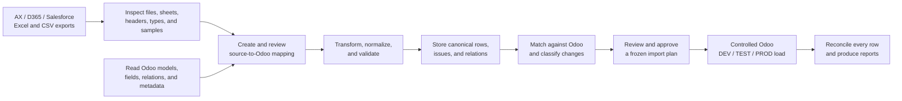
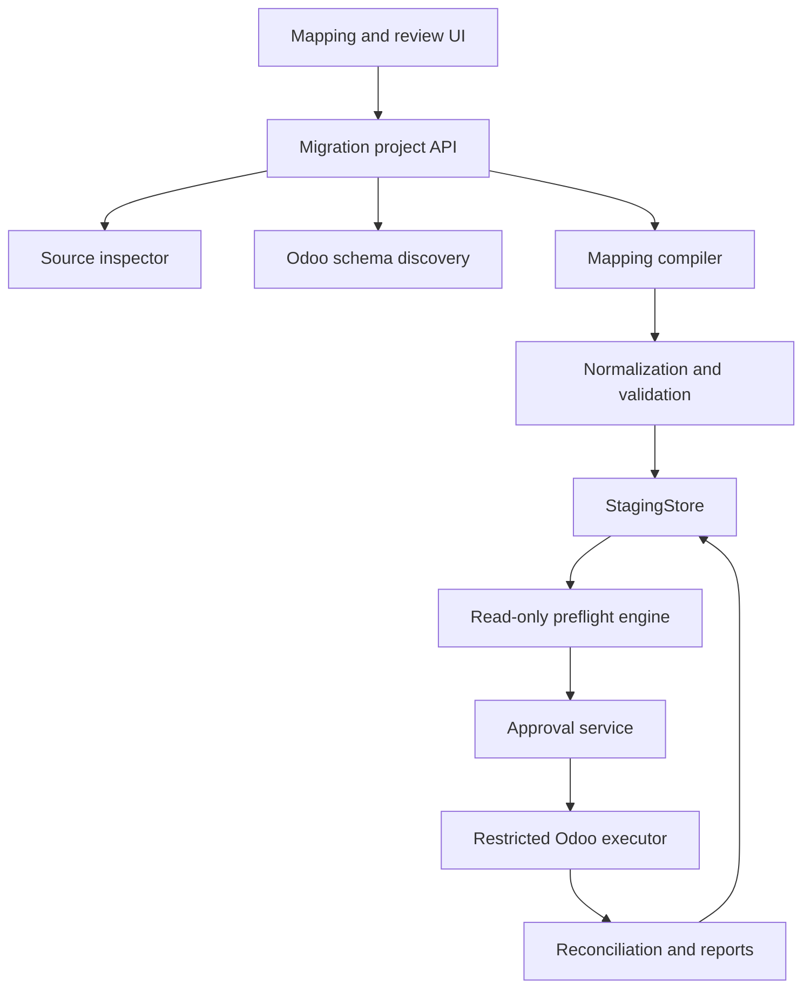

# End-to-end migration product vision

## 1. Product goal

Impodo is intended to become an end-to-end, governed data-migration tool for
moving business data into a new Odoo instance.

The primary user is a data manager who receives Excel or CSV exports from
systems such as:

- Microsoft Dynamics AX 2012;
- Microsoft Dynamics 365;
- Salesforce;
- other tabular source systems.

The target may contain:

- standard Odoo models and fields;
- additional fields on extended standard models;
- entirely new custom models and relations.

The complete product covers source discovery, target-schema discovery,
mapping, normalization, validation, staging, target preflight, approval,
controlled loading, and reconciliation. The intended product category is
similar to [STML's Odoo migration tooling](https://www.stml.io/), but Impodo
is an independent implementation with explicit governance and safety
boundaries.

The current proof of concept is the strict CSV and profile-declared XLSX
worksheet preparation plus read-only preflight foundation. It does not yet
provide pre-mapping workbook discovery, an interactive mapping workspace,
durable staging, approval, or Odoo writes.

## 2. User workflow



For a non-technical data manager, the final product cannot depend on editing
YAML by hand. YAML remains the versioned machine contract and expert escape
hatch, while a guided mapping workspace creates and maintains it.

## 3. Product stages

### Stage A — Register a migration project

A migration project identifies:

- source system and export date;
- target Odoo environment;
- responsible data manager and functional owner;
- source files;
- intended target applications and models;
- data-retention classification;
- current mapping version;
- current run and approval status.

All subsequent artifacts are bound to that project and run.

### Stage B — Inspect source files

The source inspector reads files before a mapping exists. It produces a source
catalog containing:

- file name, size, byte hash, encoding, and delimiter;
- workbook sheets and named tables;
- header row and column names;
- row count;
- inferred candidate types;
- null, distinct, duplicate, minimum/maximum, and length statistics;
- bounded, access-controlled sample values;
- formula, merged-cell, and formatting warnings.

Initial formats:

- `.xlsx`;
- `.csv`, including configurable delimiter and encoding.

Legacy `.xls`, compressed packages, JSON, APIs, and direct AX, D365, or
Salesforce connectors can be added behind the same source-catalog boundary
later.

Source inspection never modifies an input file. Exact file bytes are hashed so
later runs detect replacement or edits.

### Stage C — Discover the Odoo target schema

The mapping workflow needs a read-only schema catalog before it can ask the
data manager to choose target fields.

The catalog exposes permitted:

- model technical name and description;
- installed application or module;
- field technical name and label;
- field type;
- required and readonly flags;
- selection values;
- related model and inverse field;
- company-dependent behavior where discoverable;
- custom or extended field marker;
- target business-key candidates approved by the functional owner.

Discovery includes standard, extended, and custom models. It must not assume
that an `x_` prefix is the only way to identify custom behavior.

Schema discovery is read-only but broader than the current profile-driven
metadata request. It should use a separate, narrow metadata capability with
an environment and model allowlist. It must not add a generic Odoo call to the
preflight connector.

### Stage D — Build and approve the mapping

The mapping workspace presents source columns beside target Odoo fields.
Users can:

- map one source table to one or more Odoo datasets;
- map source columns to scalar target fields;
- select source and target identities;
- define company, site, or parent scope;
- define many2one, one2many, and many2many relationships;
- define constants, defaults, and allowed transformations;
- join multiple source tables;
- split one source row into multiple target records;
- aggregate several source rows when a business rule requires it;
- mark fields as validate-only;
- choose create, update, skip, or error behavior;
- preview raw, normalized, and proposed values;
- save mapping drafts and submit a version for functional approval.

Suggested mappings may use exact names, aliases, labels, types, and optional
fuzzy or AI assistance. A suggestion is never an approved mapping. The user
must see why it was suggested and explicitly accept it.

Transformations are declarative and allowlisted. Arbitrary Python, SQL,
spreadsheet formulas, or Odoo method execution are not part of a mapping.

### Stage E — Normalize and validate

The engine applies the approved mapping to every source row and creates
canonical staged records.

Validation layers:

1. **Structural:** files, sheets, headers, duplicate columns, and row shape.
2. **Type:** string, integer, decimal, boolean, date, datetime, and selection.
3. **Normalization:** trim, whitespace, casing, null rules, decimal precision,
   timezone, and code formatting.
4. **Field:** required, maximum length, allowed value, and readonly/proposed
   conflict.
5. **Identity:** missing keys, source duplicates, target-key collisions,
   composite keys, and scoped uniqueness.
6. **Relationship:** referenced source or target key missing, ambiguous,
   blocked, or cyclic.
7. **Cross-row/business:** balances, date order, totals, parent/child rules,
   and other declarative project rules.
8. **Target metadata:** model, field, type, relation, and selection
   compatibility.

Normalization is never invisible. Reviewers see raw and canonical values plus
the rule that changed them. The data manager may accept a governed correction
to the local staging dataset; the raw source file remains unchanged, and the
correction is versioned with its reason and operator evidence.

Read-only validation cannot prove every Odoo ORM constraint, automation, or
custom business rule. A controlled DEV/TEST rehearsal remains necessary
before production.

#### Initial first-migration rule proposal

The first real migration SHOULD use a small, explicit allowlist rather than a
general-purpose transformation language:

- whitespace trim/collapse, Unicode normalization, controlled casing, and
  explicit empty-to-null handling;
- declared locale parsing and canonical formatting for decimals, dates,
  datetimes, booleans, and selection values; the tool must never guess a
  locale;
- source-code preservation and normalization, including leading-zero rules;
- explicit value lookups, constants, defaults, split/concatenate rules, and
  approved reference-data translations;
- scoped source-key uniqueness, mandatory-field completeness, and duplicate
  handling;
- parent/child and many2one/many2many reference integrity, dependency order,
  and cycle detection;
- source-to-staging row-count reconciliation and a declared exception list;
- project-selected cross-row controls such as date-order checks, balance or
  total reconciliation, and one-active-record-per-scoped-key rules.

The data manager selects the applicable rules for a project and records their
versions in the mapping. Rules that alter financial totals, legal status, or
master-data semantics require documented functional input before approval;
they are not safe generic defaults.

### Stage F — Store canonical staging data

Validated data must survive beyond one Python process. The staging boundary
stores:

```text
MigrationProject
├── immutable source files and hashes
├── source schema and profile statistics
├── Odoo schema snapshot
├── approved mapping version
├── canonical staged records
├── row and grouped issues
├── logical business-key relationships
├── target metadata and record snapshots
├── preflight decisions and differences
└── run history
```

Canonical staging records contain source trace identity, target model,
business identity and scope, typed values, logical relations, provenance, and
issues. They do not contain target numeric Odoo IDs.

The storage implementation sits behind a `StagingStore` interface:

- DuckDB plus Parquet is suitable for an initial local or controlled-runner
  implementation and large tabular files;
- PostgreSQL is preferable when several users, permissions, concurrent runs,
  and a hosted mapping UI are required.

The selection depends on the deployment model. Portable contracts must not
depend on either database.

Real customer data, staging databases, snapshots, and reports must be
encrypted and excluded from Git. Development fixtures remain sanitized.

### Stage G — Resolve relationships

Relations remain business-key references until execution.

#### Many2one

The child carries a logical reference to:

- another staged dataset; or
- an existing target record catalog.

The referenced record must resolve uniquely before the child is ready.

#### One2many

In Odoo, the many2one field on the child normally owns the relationship.
Migration mappings therefore model one2many input as a child dataset with an
explicit many2one to its parent. The tool does not write a parent's one2many
list directly unless a separately reviewed model-specific operation requires
it.

#### Many2many

The staging layer stores a set of logical business references. All referenced
records must exist or be scheduled earlier. The plan then applies explicit
`replace`, `add`, or `remove` semantics.

### Stage H — Read-only target preflight

This is the capability implemented by the current proof of concept:

- capture target metadata and relevant records;
- resolve target relations through governed business keys;
- match scoped identities;
- classify `CREATE`, `UPDATE`, `UNCHANGED`, `AMBIGUOUS`, or `BLOCKED`;
- produce exact field differences;
- create a portable JSON manifest and review workbook.

It must later consume the durable staging store rather than only an in-memory
prepared source bundle.

### Stage I — Freeze an approved import plan

The write phase never executes directly from a mutable mapping or staging
table. Approval freezes:

- source hashes;
- target schema and record snapshot hashes;
- mapping ID, version, and hash;
- validation-rule version;
- canonical staged-data hash;
- exact planned actions and dependency order;
- target environment;
- approver, time, scope, and expiry or staleness policy.

Any changed input invalidates approval and requires a new preflight.

For the first release, the **data manager** approves mapping versions and
import plans. The approval record identifies that person, the approved scope,
the target environment, and the expiry. Functional stakeholders may review
business rules, but their review does not replace the data manager's recorded
approval.

### Stage J — Controlled Odoo execution

The executor is a separate capability and security milestone. It:

- runs first in DEV, then TEST, and only later in approved production;
- accepts only a frozen approved plan;
- uses a dedicated restricted service account;
- creates and updates in dependency order;
- keeps writes in bounded batches;
- records an environment-specific source-key-to-Odoo-ID crosswalk;
- resolves staged business references to runtime IDs only at execution;
- supports idempotency and restart;
- captures every success and failure;
- never exposes arbitrary RPC or SQL;
- stops or isolates dependent records after a parent failure.

Odoo IDs are allowed in the execution journal and crosswalk because those
artifacts are environment-specific. They remain forbidden from portable
mapping, staging, approval, and review contracts.

### Stage K — Reconcile

Every import-candidate row ends as:

- created;
- updated;
- skipped or unchanged;
- failed;
- blocked by dependency;
- deliberately excluded.

The reconciliation package includes:

- source-to-target traceability;
- Odoo response and safe error category;
- created and updated counts;
- unresolved or retriable work;
- post-load read-back checks;
- business and technical reports;
- restart and resume evidence.

## 4. Mapping contract

The current profile is a preflight mapping contract for declared CSV files
and XLSX worksheets. The end-to-end product needs a new mapping contract rather than
silently stretching the proof-of-concept shape.

Conceptual example:

```yaml
mapping:
  id: d365_products_to_odoo
  version: 1.0.0
  source_system: dynamics365

sources:
  products:
    file: D365 Products.xlsx
    sheet: Released products
    header_row: 1

datasets:
  - name: products
    from: products
    target:
      model: product.template
      mode: upsert
      on_match: update

    source_identity:
      fields: [ItemNumber, DataAreaId]

    target_identity:
      components:
        - source: ItemNumber
          target: default_code
          type: string
          normalize: [trim]
      scope:
        - source: DataAreaId
          target: company_id
          resolve:
            model: res.company
            key: x_ax_company_code

    fields:
      name:
        source: ProductName
        type: string
        normalize: [trim, collapse_whitespace]
        required_on_create: true
      active:
        source: IsActive
        type: boolean
      x_legacy_item_group:
        source: ItemGroupId
        type: string

    relations:
      categ_id:
        kind: many2one
        source: ProductCategory
        resolve:
          model: product.category
          key: complete_name
        required: true

      tag_ids:
        kind: many2many
        source: SalesTags
        split: ";"
        resolve:
          model: product.tag
          key: name
        operation: replace
```

This is a design example, not the current profile schema. It demonstrates that
the mapping preserves source provenance, target identity, scope,
transformations, relationship semantics, and load policy.

## 5. Mapping edge cases

| Edge case | Required behavior |
| --- | --- |
| Two sheets contain the same header | Qualify by source table or sheet |
| Duplicate or blank column names | Block mapping until disambiguated |
| Leading-zero codes | Preserve as strings unless explicitly typed otherwise |
| Excel date serials | Convert using the workbook date system and show the canonical date |
| Formula cell without cached result | Block or require an explicit formula policy |
| Locale decimal `1.234,56` | Require a declared locale or parser; never guess silently |
| CSV encoding or delimiter mismatch | Detect and require confirmation |
| Salesforce 15 or 18-character IDs | Treat as source identifiers, not Odoo IDs |
| AX `RecId` or D365 GUID | Retain as governed source provenance or cross-reference |
| One source row creates several Odoo records | Use an explicit expansion rule and trace suffix |
| Several source rows form one target record | Use explicit grouping and conflict rules |
| Source column maps to two target fields | Permit only as two explicit mappings |
| Required Odoo field has no source | Require a constant, default, derived rule, or block |
| Target field is custom, readonly, or computed | Show metadata and prevent an invalid proposal |
| Same business key exists in two companies | Require scope |
| Relation points to a record created in the same run | Add a dependency edge |
| Circular relationship | Reject or define a reviewed multi-pass strategy |
| Many2many contains duplicates | Report and canonicalize only under explicit policy |
| Parent fails during execution | Do not attempt dependent children |
| Mapping changes after validation | Invalidate staged results, preflight, and approval |
| Target changes after approval | Fail the staleness check and recapture |

## 6. Product components



The current repository implements the Phase A local-browser project workflow,
governed source intake and project metadata storage, strict CSV and
declared-sheet XLSX loading, mapping through the profile, normalization and
validation, and the read-only preflight path. It does not yet implement Stage
B workbook inventory and preview, the interactive mapping workspace, full
schema discovery, durable canonical staging, the approval service, executor,
or reconciliation service.

## 7. Delivery roadmap

### Phase 1 — Source discovery

- build sheet/table inventory and preview above the strict XLSX reader;
- enhanced CSV detection;
- source profiling and preview;
- immutable source manifest and hashes;
- file edge-case tests.

### Phase 2 — Mapping workspace and schema discovery

- permitted Odoo model and field catalog;
- mapping draft and version lifecycle;
- visual source-to-target field selection;
- identity, scope, relation, constant, and transformation configuration;
- mapping import and export;
- mapping validation and approval.

### Phase 3 — Durable staging and data quality

- `StagingStore` port;
- canonical raw and normalized values with lineage;
- grouped and row-level issues;
- joins, expansion, grouping, and declarative business rules;
- scalable execution against large files.

### Phase 4 — Integrated preflight

- consume staged datasets;
- preserve the current business-key matcher and comparator;
- strengthen snapshot request and domain binding;
- add a reviewed 100–300-record UC slice;
- complete live DEV and TEST read-only validation.

### Phase 5 — Approval and restricted executor

- frozen import-plan contract;
- signatures, roles, staleness, and expiry;
- DEV/TEST-only initial executor;
- dependency ordering and runtime crosswalk;
- idempotency, retries, and reconciliation;
- separate security review.

### Phase 6 — Production readiness

- production access and change controls;
- observability, backups, retention, and disaster recovery;
- expected-scale performance and concurrency;
- release and rollback procedure;
- business-owner acceptance.

## 8. Confirmed implementation decisions

Confirmed:

- initial source formats are `.xlsx` and `.csv`;
- legacy `.xls` is deferred;
- direct AX, D365, and Salesforce connections are deferred;
- the eventual Odoo deployment is on-premise;
- Impodo must be testable entirely on one local machine before on-premise
  access is available.

- the hardened local-only browser architecture is preferred to a native
  wrapper for the first release;
- the first release begins with exported `.xlsx`/`.csv` files, a local DuckDB
  staging store, and a disposable local Odoo laboratory;
- the initial on-premise target is Odoo 19.4. The planned Odoo 20.0 move in
  September requires a separate compatibility check and DEV/TEST rehearsal;
- the data manager approves mapping versions and frozen import plans;
- the initial transformation and business-rule proposal is recorded in
  [Stage E](#stage-e--normalize-and-validate);
- the proposed default customer-data storage, retention, deletion, and access
  controls are recorded in the [local security architecture](local-application-security.md#proposed-first-release-data-handling-policy).

The mapping workspace may make governed local changes to drafts and derived
staging records in order to validate and correct data. This does **not** give
the current read-only preflight connector permission to change Odoo. Odoo
writes remain a separate, approval-bound executor capability, as defined in
Stage J.
