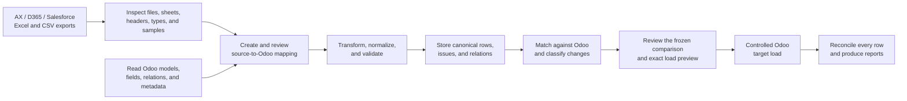
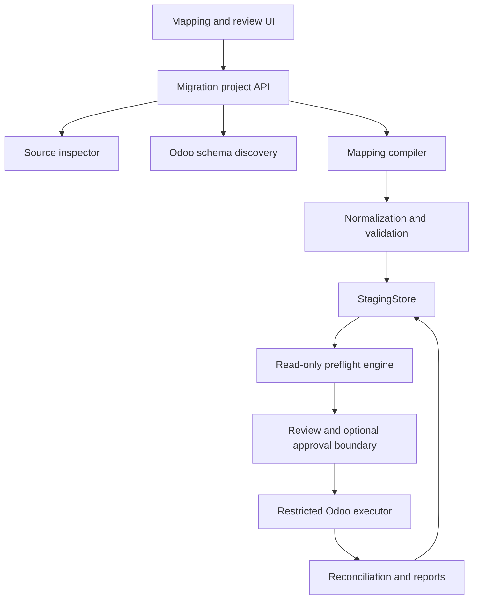

# End-to-end migration product vision

## 1. Product goal

Impodo is intended to become an end-to-end, governed data-migration tool for
moving business data into a new Odoo instance.

The primary user is a data manager who receives Excel or CSV exports from
systems such as:

- Microsoft Dynamics AX 2012;
- Microsoft Dynamics 365;
- Salesforce;
- other tabular source systems.

The target may contain:

- standard Odoo models and fields;
- additional fields on extended standard models;
- entirely new custom models and relations.

The complete product covers source discovery, target-schema discovery,
mapping, normalization, validation, staging, target preflight, approval,
controlled loading, and reconciliation. 

The current product provides local-browser project setup, CSV/XLSX source
discovery and frozen datasets, read-only target-schema capture, governed
mapping authoring, durable canonical and effective staging, integrated quality
and normalization approval, read-only Odoo comparison, a reviewed disposable
local or remote Odoo 19 load, a durable write journal, and post-write
reconciliation.

The supported preparation boundary is currently 100,000 physical rows for an
exact-snapshot direct mapping compiled entirely to the native columnar path,
50,000 rows for a direct mapping that still requires the Python oracle, and
25,000 rows for derived or materialized paths. Loading is restricted to the
separately governed local, remote Test, or qualified-plan Production Odoo 19
capabilities. Production loading outside the selected qualified-plan workflow
is not a current capability.

The completed disposable-target migration is retained as acceptance evidence.
The active [remaining-work roadmap](plans/remaining-work.md) now prioritizes
the clean Migration Project, Project-owned data package, optional Recipe, and
multi-Recipe cutover architecture. Scale expansion, optional clean-package,
general production, gateway, and hosted capabilities remain deferred.

## 2. User workflow



For a non-technical data manager, the final product cannot depend on editing
YAML by hand. YAML remains the versioned machine contract and expert escape
hatch, while a guided mapping workspace creates and maintains it.

## 3. Terminology

Use the following terms consistently:

- **Workflow steps** are the browser-facing names: Source data, Odoo data,
  Match data, Prepare data, Final review, and Load into Odoo. Project creation
  and registration happen before those six stages.
- **Product stages** describe the end-to-end business lifecycle and are named
  Stage A through Stage K below.
- **Delivery phases** describe implementation increments. Phases 1–5 now
  provide the bounded, disposable-target path through staging, preflight,
  execution, and reconciliation. Phase 6 and the active remaining-work plan
  cover scale expansion, optional certification, retained remote acceptance,
  production loading, and production operations.

The legacy labels “Phase A” and “Phase B” are retired and must not be used.

## 4. Product stages

### Stage A — Register a migration project

A local migration project starts with only:

- a project name;
- one source mode: files or records already in Odoo;
- the selected source files, or the exact read-only Odoo source connection.

For file migrations, the Odoo destination is bound later when the manager
reaches Odoo data. Export as-of date is a Test or Production DataVersion input,
not an initial project-creation field. The current Odoo-source workflow uses
one database as both the capture source and eventual pinned update target;
cross-Odoo migration requires separate source and destination bindings and is
not yet offered.

All subsequent artifacts are bound to that project and run.

### Stage B — Inspect source files

The source inspector reads files before a mapping exists. It produces a source
catalog containing:

- file name, size, byte hash, encoding, and delimiter;
- workbook sheets and named tables;
- header row and column names;
- row count;
- inferred candidate types;
- null, distinct, duplicate, minimum/maximum, and length statistics;
- bounded, access-controlled sample values;
- formula, merged-cell, and formatting warnings.

Initial formats:

- `.xlsx`;
- `.csv`, including configurable delimiter and encoding.

Legacy `.xls`, compressed packages, JSON, APIs, and direct AX, D365, or
Salesforce connectors can be added behind the same source-catalog boundary
later.

Source inspection never modifies an input file. Exact file bytes are hashed so
later runs detect replacement or edits.

### Stage C — Discover the Odoo target schema

The mapping workflow needs a read-only schema catalog before it can ask the
data manager to choose target fields.

Before capture, Impodo reads a lightweight catalog of concrete, persistent
models from the exact connected Odoo database. The optional Stage A
application scope filters and prioritizes the choices shown to the data
manager; it never silently authorizes a model. The data manager then confirms
the exact technical models allowed for schema reads and mapping choices.
Changing that explicit model scope invalidates the captured schema and its
dependent business-key and mapping decisions.

The catalog exposes permitted:

- model technical name and description;
- installed application or module;
- field technical name and label;
- field type;
- required and readonly flags;
- selection values;
- related model and inverse field;
- company-dependent behavior where discoverable;
- custom or extended field marker;
- target business-key candidates approved by the functional owner.

Discovery includes standard, extended, and custom models. It must not assume
that an `x_` prefix is the only way to identify custom behavior.

Schema discovery is implemented through a separate narrow metadata
capability. Remote reads expose only Odoo 19 JSON-2 `fields_get` and
`search_read`; Local mode uses fixed, bounded metadata and record-reading
scripts derived from the selected `odoo.conf`. Neither reader exposes a
generic Odoo method surface.

### Stage D — Build and approve the mapping

The mapping workspace presents source columns beside target Odoo fields.
Users can:

- map one source table to one or more Odoo datasets;
- map source columns to scalar target fields;
- select source and target identities;
- define company, site, or parent scope;
- define many2one, one2many, and many2many relationships;
- define constants, defaults, and allowed transformations;
- join multiple source tables;
- split one source row into multiple target records;
- aggregate several source rows when a business rule requires it;
- mark fields as validate-only;
- choose create, update, skip, or error behavior;
- preview raw, normalized, and proposed values;
- save mapping drafts and submit a version for functional approval.

Suggested mappings may use exact names, aliases, labels, types, and optional
fuzzy or AI assistance. A suggestion is never an approved mapping. The user
must see why it was suggested and explicitly accept it.

Transformations are declarative and allowlisted. Arbitrary Python, SQL,
spreadsheet formulas, or Odoo method execution are not part of a mapping.

### Stage E — Normalize and validate

The engine applies the approved mapping to every source row and creates
canonical staged records.

Validation layers:

1. **Structural:** files, sheets, headers, duplicate columns, and row shape.
2. **Type:** string, integer, decimal, boolean, date, datetime, and selection.
3. **Normalization:** trim, whitespace, casing, null rules, decimal precision,
   timezone, and code formatting.
4. **Field:** required, maximum length, allowed value, and readonly/proposed
   conflict.
5. **Identity:** missing keys, source duplicates, target-key collisions,
   composite keys, and scoped uniqueness.
6. **Relationship:** referenced source or target key missing, ambiguous,
   blocked, or cyclic.
7. **Cross-row/business:** balances, date order, totals, parent/child rules,
   and other declarative project rules.
8. **Target metadata:** model, field, type, relation, and selection
   compatibility.

Normalization is never invisible. Reviewers see raw and canonical values plus
the rule that changed them. The data manager may accept a governed correction
to the local staging dataset; the raw source file remains unchanged, and the
correction is versioned with its reason and operator evidence.

Read-only validation cannot prove every Odoo ORM constraint, automation, or
custom business rule. A controlled target rehearsal remains necessary
before production.

#### Initial first-migration rule proposal

The first real migration SHOULD use a small, explicit allowlist rather than a
general-purpose transformation language:

- whitespace trim/collapse, Unicode normalization, controlled casing, and
  explicit empty-to-null handling;
- declared locale parsing and canonical formatting for decimals, dates,
  datetimes, booleans, and selection values; the tool must never guess a
  locale;
- source-code preservation and normalization, including leading-zero rules;
- explicit value lookups, constants, defaults, split/concatenate rules, and
  approved reference-data translations;
- scoped source-key uniqueness, mandatory-field completeness, and duplicate
  handling;
- parent/child and many2one/many2many reference integrity, dependency order,
  required-at-create cycle rejection, and explicit deferral of safe
  create-time relationship cycles;
- source-to-staging row-count reconciliation and a declared exception list;
- project-selected cross-row controls such as date-order checks, balance or
  total reconciliation, and one-active-record-per-scoped-key rules.

The data manager selects the applicable rules for a project and records their
versions in the mapping. Rules that alter financial totals, legal status, or
master-data semantics require documented functional input before approval;
they are not safe generic defaults.

### Stage F — Store canonical staging data

Validated data must survive beyond one Python process. The staging boundary
stores:

```text
MigrationProject
├── immutable source files and hashes
├── immutable source and prepared Parquet snapshots
├── source schema and profile statistics
├── Odoo schema snapshot
├── approved mapping version
├── canonical staged records
├── row and grouped issues
├── logical business-key relationships
├── target metadata and record snapshots
├── preflight decisions and differences
└── run history
```

Canonical staging records contain source trace identity, target model,
business identity and scope, typed values, logical relations, provenance, and
issues. They do not contain target numeric Odoo IDs.

The storage implementation sits behind application-owned repositories and a
staging port:

- the current local implementation uses one protected DuckDB database per
  project for manifests, current pointers, canonical rows, quality evidence,
  normalization decisions, and lifecycle history;
- source freezing publishes a lossless, immutable Parquet snapshot, and the
  verified native-columnar path publishes a mapping-bound immutable prepared
  Parquet snapshot for bulk values;
- DuckDB remains the control and evidence authority: it owns each snapshot
  manifest and advances the prepared-snapshot pointer only after canonical
  publication succeeds;
- PostgreSQL is preferable when several users, permissions, concurrent runs,
  and a hosted mapping UI are required.

The selection depends on the deployment model. Portable contracts must not
depend on either database.

Real customer data, staging databases, snapshots, and reports must be
encrypted and excluded from Git. Development fixtures remain sanitized.

### Stage G — Resolve relationships

Relations remain business-key references until execution.

#### Many2one

The child carries a logical reference to:

- another staged dataset; or
- an existing target record catalog.

The referenced record must resolve uniquely before the child is ready.

#### One2many

In Odoo, the many2one field on the child normally owns the relationship.
Migration mappings therefore model one2many input as a child dataset with an
explicit many2one to its parent. The tool does not write a parent's one2many
list directly unless a separately reviewed model-specific operation requires
it.

#### Many2many

The staging layer stores a set of logical business references. All referenced
records must exist, be scheduled earlier, or be part of an explicitly
deferrable create-time cycle. The plan then applies explicit `replace`, `add`,
or `remove` semantics.

#### Relationship cycles

A cycle is invalid when every path requires its related record during create;
the mapping and load preview block before any write. When at least one
relationship is safe to defer, Impodo creates the records first and applies
the exact reviewed relationship in a second ORM `write` after the related IDs
exist. A rejected or uncertain second write retains the created record ID and
is reported as partially applied or outcome unknown for reconciliation.

### Stage H — Read-only target preflight

This capability is implemented for the current bounded browser workflow and
the expert profile path:

- capture target metadata and relevant records;
- resolve target relations through governed business keys;
- match scoped identities;
- classify `CREATE`, `UPDATE`, `UNCHANGED`, `AMBIGUOUS`, or `BLOCKED`;
- produce exact field differences;
- create a portable JSON manifest and review workbook.

The browser path consumes the exact approved durable staging, quality, and
normalization evidence. The expert profile path retains its declared-source
adapter and feeds the same compiled plan, matcher, resolver, and classifier.

### Stage I — Freeze exact execution input

The write stage never executes directly from a mutable mapping or staging
table. For the practical disposable-target path, Impodo automatically freezes:

- source hashes;
- target schema and record snapshot hashes;
- mapping ID, version, and hash;
- validation-rule version;
- canonical staged-data hash;
- exact planned actions, row dispositions, field intentions, and dependency
  order;
- exact target identity.

Any changed input invalidates the snapshot and requires a new preflight. The
user reviews the resulting preview and makes one explicit **Load** choice; the
snapshot itself is internal evidence, not a separate approval screen.

For a later production or otherwise higher-risk profile, a **data manager** may
also approve the import plan. That optional approval record identifies the
person, scope, target, and expiry. Functional stakeholders may review business
rules, but their review does not replace a required production approval.

### Stage J — Controlled Odoo execution

The first implemented executor profile is deliberately environment-bounded: a
disposable local or remote Odoo 19 database, create and explicit update,
reviewed many2one/many2many relations, a native JSON-2 capability derived from
the exact captured-schema-bound preview, bounded dependency-ordered batches,
and a durable row journal. It has no global business-model or field allowlist, so
standard, extension, and custom schema surfaces follow the same validated
path. Deferrable create-time relationship cycles use a reviewed second ORM
write after the related records exist. Remote creates use bounded Odoo `load`
requests with generated stable External IDs; local creates use bounded
`create` requests. One explicit **Load into Odoo** action consumes the current
frozen snapshot. A lost write response is recorded as outcome unknown and is
never blindly retried.

Broader or production execution remains a separate security milestone. It:

- runs only against organisation-approved targets under the project's own
  promotion policy;
- accepts only a frozen approved plan;
- uses a dedicated restricted service account;
- creates and updates in dependency order;
- keeps writes in bounded batches;
- records a target-database-specific source-key-to-Odoo-ID crosswalk;
- resolves staged business references to runtime IDs only at execution;
- supports idempotency and restart;
- captures every success and failure;
- never exposes arbitrary RPC or SQL;
- stops or isolates dependent records after a parent failure.

Odoo IDs are allowed in the execution journal and crosswalk because those
artifacts are target-database-specific. They remain forbidden from portable
mapping, staging, approval, and review contracts.

### Stage K — Reconcile

The practical disposable-target path implements this stage for the exact
standard or custom models and writable fields in the reviewed, schema-bound
preview: committed rows are read by saved target ID, uncertain responses are
re-matched by governed keys, and a hash-bound result with downloadable fallout
is retained. The broader package below remains the target for controlled
production profiles.

Every import-candidate row ends as:

- created;
- updated;
- skipped or unchanged;
- failed;
- blocked by dependency;
- deliberately excluded.

The reconciliation package includes:

- source-to-target traceability;
- Odoo response and safe error category;
- created and updated counts;
- unresolved or retriable work;
- post-load read-back checks;
- business and technical reports;
- restart and resume evidence.

## 5. Mapping contract

The browser now persists a versioned, dataset-centric mapping contract for
frozen CSV/XLSX datasets and derived datasets. It covers target mode, source
and target identity, scope, scalar providers and transformations, exact value
matches, and incoming-dataset or existing-target relations. The expert YAML
profile remains a separate versioned entry point that compiles into the same
planning semantics; it is not the browser contract's serialization format.

Conceptual example:

```yaml
mapping:
  id: d365_products_to_odoo
  version: 1.0.0
  source_system: dynamics365

sources:
  products:
    file: D365 Products.xlsx
    sheet: Released products
    header_row: 1

datasets:
  - name: products
    from: products
    target:
      model: product.template
      mode: upsert
      on_match: update

    source_identity:
      fields: [ItemNumber, DataAreaId]

    target_identity:
      components:
        - source: ItemNumber
          target: default_code
          type: string
          normalize: [trim]
      scope:
        - source: DataAreaId
          target: company_id
          resolve:
            model: res.company
            key: x_ax_company_code

    fields:
      name:
        source: ProductName
        type: string
        normalize: [trim, collapse_whitespace]
        required_on_create: true
      active:
        source: IsActive
        type: boolean
      x_legacy_item_group:
        source: ItemGroupId
        type: string

    relations:
      categ_id:
        kind: many2one
        source: ProductCategory
        resolve:
          model: product.category
          key: complete_name
        required: true

      tag_ids:
        kind: many2many
        source: SalesTags
        split: ";"
        resolve:
          model: product.tag
          key: name
        operation: replace
```

This is a design example, not the literal browser-contract or expert-profile
serialization. It demonstrates that the mapping preserves source provenance,
target identity, scope, transformations, relationship semantics, and load
policy.

## 6. Mapping edge cases

| Edge case | Required behavior |
| --- | --- |
| Two sheets contain the same header | Qualify by source table or sheet |
| Duplicate or blank column names | Block mapping until disambiguated |
| Leading-zero codes | Preserve as strings unless explicitly typed otherwise |
| Excel date serials | Convert using the workbook date system and show the canonical date |
| Formula cell without cached result | Block or require an explicit formula policy |
| Locale decimal `1.234,56` | Require a declared locale or parser; never guess silently |
| CSV encoding or delimiter mismatch | Detect and require confirmation |
| Salesforce 15 or 18-character IDs | Treat as source identifiers, not Odoo IDs |
| AX `RecId` or D365 GUID | Retain as governed source provenance or cross-reference |
| One source row creates several Odoo records | Use an explicit expansion rule and trace suffix |
| Several source rows form one target record | Use explicit grouping and conflict rules |
| Source column maps to two target fields | Permit only as two explicit mappings |
| Required Odoo field has no source | Require a constant, default, derived rule, or block |
| Target field is custom, readonly, or computed | Show metadata and prevent an invalid proposal |
| Same business key exists in two companies | Require scope |
| Relation points to a record created in the same run | Add a dependency edge |
| Circular relationship | Reject or define a reviewed multi-pass strategy |
| Many2many contains duplicates | Report and canonicalize only under explicit policy |
| Parent fails during execution | Do not attempt dependent children |
| Mapping changes after validation | Invalidate staged results, preflight, and approval |
| Target changes after approval | Fail the staleness check and recapture |

## 7. Product components



The current repository implements `MigrationProject` as the business root,
Project-owned Authoring DataVersions and runs, contained workspaces, optional
portable Recipe publication, and the bounded browser path
from Stage A through Stage K: data-version registration; governed CSV/XLSX intake; target-schema
governance; mapping and derived-dataset authoring; exact choice matching;
durable canonical staging; quality, quarantine, and normalization review;
read-only target comparison; automatic execution-snapshot freezing; explicit
controlled local, remote Test, or qualified-plan Production loading; a durable
write journal; and post-write read-back reconciliation. The expert profile
path retains strict CSV and declared-sheet
XLSX loading and feeds the same compiled planning semantics.

It does not yet provide a general 100,000-row boundary for Python-fallback,
related, or derived preparation; general mapping import/export; a separate
functional mapping-approval lifecycle; optional clean-package certification;
Production loading outside the selected qualified-plan workflow; a target-side
gateway; or hosted multi-user infrastructure.

Product ownership has accepted an architecture in which `MigrationProject` is
the business root, DataVersion owns a complete Project source package, and
several Project-scoped Recipes can participate in one qualified CutoverPlan.
Phases M0 through M7 implement the Project root, source ownership, one-off
authoring, optional Recipe publication, and integrated Test planning with one
isolated workspace per Recipe application. Exact ordered application evidence,
qualified CutoverPlans, and separate rollout-candidate selection are now
implemented. A selected plan now creates a fresh latest-data Production run,
different Odoo 19 target binding, independent credential authority, and fresh
isolated applications. The
[Migration projects and multi-Recipe cutover implementation
plan](plans/migration-projects-and-multi-recipe-cutover-implementation-plan.md)
records the completed clean-cutover architecture.

## 8. Delivery roadmap

**Current priority note, 2026-08-23:** The historical capability phases below
describe the wider product progression. The [Migration projects and
multi-Recipe cutover
plan](plans/migration-projects-and-multi-recipe-cutover-implementation-plan.md)
is complete. The completed Recipe-first plan remains historical implementation
evidence only. Scale expansion, general
certification, general production hardening, Odoo-source guarded updates,
gateway, and hosted work remain deferred under the [authoritative
remaining-work roadmap](plans/remaining-work.md).

### Phase 1 — Source discovery

- build sheet/table inventory and preview above the strict XLSX reader;
- enhanced CSV detection;
- source profiling and preview;
- immutable source manifest and hashes;
- file edge-case tests.

Current status: **complete for the current CSV/XLSX scope.** The browser
implements hash-bound CSV detection, explicit encoding/delimiter/header
overrides, separately selectable XLSX worksheets and named tables, candidate
headers, bounded previews, streaming column profiles, warning acknowledgement,
source confirmation, and a versioned frozen dataset selection. Reinspection
invalidates dependent confirmations, selections, and mapping drafts. Browser
acceptance covers a real CSV and a real XLSX named table.

### Phase 2 — Target schema and governed mapping

Delivery increments:

- **Phase 2A — Target-schema governance:** permitted Odoo model and field
  catalog, captured schema, governed target business keys, and scope.
- **Phase 2B — Governed mapping:** mapping drafts, visual source-to-target
  selection, source and target identities, scope, and relationships.
- **Phase 2C.1 — Scalar providers and transformations:** constants, source
  fallbacks, explicit Odoo-default intent, allowlisted scalar transformations,
  bounded previews, and exact-hash mapping submission.
- **Remaining Phase 2C scope:** general mapping import/export and a separate
  functional review and approval lifecycle.

- permitted Odoo model and field catalog;
- mapping draft and version lifecycle;
- visual source-to-target field selection;
- identity, scope, relation, constant, and transformation configuration;
- mapping import and export;
- mapping validation and approval.

Current status: **Phases 2A, 2B, and the practical Phase 2C mapping scope are
implemented.** The local browser discovers a lightweight,
application-filtered Odoo 19 model catalog, captures the effective field
catalog once per explicitly permitted model, then requires explicit governed
business keys and scope. Dataset-centric revisions support source and target
identity, scalar policies, exact source-choice matches, incoming-dataset and
existing-target many2one/many2many resolution, and one2many inverse ownership
guidance. Derived authoring can extract reusable lookup datasets and split
grouped parent/child rows without changing the frozen source.

Scalar providers support source columns, constants, source fallbacks, and
explicit omission for an Odoo runtime default. An allowlisted policy supports
trim/collapse, empty-to-null, casing, strict boolean/integer/decimal parsing
with declared decimal locale, explicit date formats, and UTC datetime
normalization. Bounded source samples preview raw and proposed values. A pure
compiler/validator checks the complete mapping and persists deterministic
validation evidence. Submission is permitted only for the exact validated
mapping hash and acknowledged current warnings. Historical revisions,
validations, submissions, and actors remain append-only.

Still required to close the broader authoring vision: general mapping
import/export and a distinct functional review and approval lifecycle.

### Phase 3 — Durable staging and data quality

- `StagingStore` port;
- canonical raw and normalized values with lineage;
- grouped and row-level issues;
- joins, expansion, grouping, and declarative business rules;
- scalable execution against large files.

Current status: **implemented for the supported bounded scope.** Preparation
publishes deterministic canonical rows with lineage and control totals,
quality issues and quarantine, normalization groups and decisions, derived
datasets, hash-bound source and prepared Parquet snapshots, and transactional
current pointers. The supported limits are 100,000 physical rows for verified
native-columnar direct mappings, 50,000 for direct Python-fallback mappings,
and 25,000 for derived or materialized paths. Impodo selects and explains the
applicable limit from the current mapping and snapshot path before preparation.
The mixed related-dataset scale proof and remaining advanced project-specific
coverage are maintained in the [remaining-work plan](plans/remaining-work.md).

### Phase 4 — Integrated preflight

- consume staged datasets;
- preserve the current business-key matcher and comparator;
- strengthen snapshot request and domain binding;
- add a reviewed 100–300-record organization-specific slice;
- complete live-target read-only validation.

Current status: **implemented for the bounded browser and expert-profile
paths.** Browser preflight consumes only approved durable staging, quality,
and normalization evidence; captures protected metadata and record snapshots;
classifies every row; persists the report; and freezes the practical execution
snapshot. Organization-specific ACL, record-rule, company-scope, and sanitized
live-target acceptance remain required before a higher-risk target is used.

### Phase 5 — Practical controlled execution and higher-risk approval

- frozen import-plan contract;
- signatures, roles, staleness, and expiry;
- organisation-approved-target-only initial executor;
- dependency ordering and runtime crosswalk;
- idempotency, retries, and reconciliation;
- separate security review.

Current status: **the practical disposable local and remote paths are
implemented.** One explicit Load into Odoo action consumes the current
schema-bound execution snapshot. The writer permits only preview-derived
models and fields, exact-key lookups, remote External-ID `load` batches or
local `create` batches of at most 50 rows, and single-record updates. It
journals every row, stops after an uncertain response, and performs hash-bound
read-back reconciliation. A retained remote on-premises acceptance result is
still pending. Signed or dual approval, expiry, production controls,
generalized restart/resume, and customer security acceptance remain later
higher-risk capabilities.

### Phase 6 — Production readiness

- production access and change controls;
- observability, backups, retention, and disaster recovery;
- expected-scale performance and concurrency;
- release and rollback procedure;
- business-owner acceptance.

## 9. Confirmed implementation decisions

Confirmed:

- initial source formats are `.xlsx` and `.csv`;
- legacy `.xls` is deferred;
- direct AX, D365, and Salesforce connections are deferred;
- the eventual Odoo deployment is on-premise;
- Impodo must be testable entirely on one local machine before on-premise
  access is available.

- the hardened local-only browser architecture is preferred to a native
  wrapper for the first release;
- the first release begins with exported `.xlsx`/`.csv` files, a local DuckDB
  staging store, and a disposable local Odoo laboratory;
- the implemented schema, preflight, load, and reconciliation path accepts
  Odoo 19.x. The recorded initial on-premise business target is Odoo 19.4 and
  must be reconfirmed before cutover. Any Odoo 20 move requires a separate
  compatibility change and target rehearsal;
- in the practical disposable-target path, the data manager confirms the validated mapping
  and explicitly confirms the current frozen load preview. A later
  higher-risk profile may require a separate signed or dual approval;
- the initial transformation and business-rule proposal is recorded in
  [Stage E](#stage-e--normalize-and-validate);
- the proposed default customer-data storage, retention, deletion, and access
  controls are recorded in the
  [security and infrastructure overview](architecture/security-and-infrastructure.md#data-handling).

The mapping workspace may make governed local changes to drafts and derived
staging records in order to validate and correct data. This does **not** give
the read-only preflight connector permission to change Odoo. The practical
writer is a separate, explicitly confirmed disposable-target capability. A later
production profile may add approval-bound execution as defined in Stage J.
