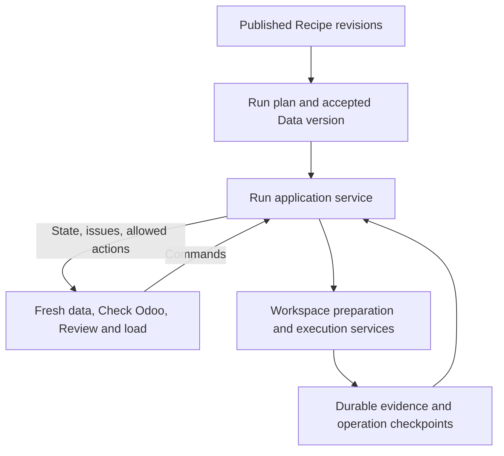

# Recipe workflow architecture review

This is a point-in-time review of commit `d6b5b41`, performed on 9 September
2026. It supports a decision about stabilizing Recipe runs before adding more
recovery paths. It does not change runtime behavior.

The underlying model is worth keeping. A Project owns accepted Data versions,
versioned Recipes, and runs. A run applies exact Recipe revisions through
isolated workspaces and retains its own target and outcome evidence.
The implementation does not yet deliver that model consistently from start
to finish. There are confirmed correctness defects, conflicting navigation
decisions, and important gaps between component tests and the assembled flow.
I would prioritize workflow stabilization before expanding the Recipe UI.

## Scope and evidence

The review traced publication, source matching, run values, Odoo requirements,
activation, mapping materialization, target adaptation, preparation, comparison,
load progress, qualification, and Production setup. Evidence came from current
contracts, code, templates, automated tests, and isolated reproduction probes.
The working tree was clean when the review began.

The probes use fictional data and no Odoo transport. The quality-composition
probe constructs the actual web and preparation-worker services. The activation
probe uses real DuckDB lifecycle repositories with the existing test compiler
substitute. Resume-routing probes invoke the actual route with controlled
saved states and job snapshots. These distinctions matter: they reproduce
specific defects without claiming a real Odoo migration was performed.

There was no browser-control tool available. This is a code and request-level
UI review, not a visual or accessibility audit. No screenshots, keyboard tests,
live Odoo write, load benchmark, or complete real Recipe journey were performed.

## Findings in priority order

### 1. High: Recipe business checks are omitted from runtime composition

When Impodo materializes a Recipe, `RecipeApplicationService.materialize` saves
its reusable quality rules through `RecipeQualitySeedRepository`. However,
both `create_local_app` and `create_preparation_worker` construct `QualityService`
without its `recipe_quality` dependency. The default is `None`. When preparation
builds a fresh ruleset, it therefore supplies no Recipe business rules.

The runtime probe confirmed that this dependency is absent in both actual
composition roots. Standard automatic quality checks still exist; this defect
concerns additional business checks carried by the Recipe. A successful
preparation result therefore does not prove those saved checks ran.

There is a second defect behind the wiring problem. The seed repository returns
an empty tuple when the mapping hash changes. Target-value adaptation changes
that hash, but `confirm_mapping` does not rebuild the seed. A repository probe
returned one rule for the original hash and zero for a changed hash. Connecting
the dependency alone would leave this failure mode in place.

**Required change:** make Recipe quality evidence mandatory for Recipe
applications in both composition roots. When an allowed run decision changes
the mapping, rebind the applicable rules from the pinned Recipe and record the
new evidence. Missing or incompatible rules must produce a visible blocker.

**Acceptance:** publish a Recipe with a business rule, apply fresh data that
violates it, make a permitted target-value decision, and verify that the real
background worker still reports the violation.

Evidence: [application materialization](../../src/impodo/application/recipe_application_service.py),
[web composition](../../src/impodo/web/app.py),
[worker composition](../../src/impodo/web/composition/preparation_worker.py),
[quality evaluation](../../src/impodo/application/workspace/preparation/quality_service.py),
[seed persistence](../../src/impodo/adapters/duckdb/recipe_quality_seed_repository.py).

### 2. High: interrupted Test activation can finish without its cutover plan

The activation transaction marks `TestRunSetupBinding` active before application
stores and mappings are complete. The cutover-plan binding is created afterward.
If activation stops after `REGISTRY_COMMITTED`, the active retry branch of
`TestRunActivationUseCase.activate` resumes materialization and returns without
calling `_ensure_cutover_plan`.

The isolated fault probe reproduced this exact sequence. Retrying produced two
application workspaces and a committed operation, but reading the plan binding
raised `Test run CutoverPlan binding not found`. The normal run page requires
that binding and cannot render the expected review.

The browser has a further recovery gap: `check_test_run_odoo` treats every active
binding as an Odoo-default recovery case. It does not resume an unfinished
activation. An active binding currently conflates target registration with
completion of all required activation work.

**Required change:** give activation one recoverable operation that includes
application materialization and the cutover-plan binding. Every retry must
resume that operation from its durable checkpoint. Default adaptation should
run only after activation is complete.

**Acceptance:** interrupt before and after each registry, store, mapping, and
plan publication boundary. Retrying through the browser must return the same
identities, finish the plan, and open the run page.

Evidence: [Test activation](../../src/impodo/application/run/test_activation.py),
[activation repository](../../src/impodo/adapters/duckdb/migration_run_planning_repository.py),
[Odoo check route](../../src/impodo/web/routers/schema.py),
[run page](../../src/impodo/web/routers/integrated_runs.py).

### 3. High: application mapping edits can change meaning while retaining Recipe lineage

The accepted lifecycle contract prohibits editable mapping authoring in a
Recipe application. `_APPLICATION_AREAS` nevertheless allows the entire
`mapping` route family. The full mapping form accepts dataset mappings through
the ordinary authoring service. Recovery paths deliberately direct users there.

`RunApplicationRecoveryUseCase.confirm_mapping` verifies that the current
mapping ID and submission agree, then records the new mapping hash and clears
`MAPPING_` issues. It does not compare transformations, identity rules,
relationships, or control definitions with the pinned Recipe. A mapping ID
identifies a revision lineage; it does not prove unchanged business meaning.

For example, a user can reach the ordinary editor while resolving target
values and change an existing field's transformation. These paths contain no
Recipe-equivalence check that would distinguish that change from an allowed
run-specific decision. Qualification checks the updated application mapping
hash, while the plan continues to pin the original Recipe revision. Production
recompiles that original Recipe. This creates a risk that Test proves behavior
which Production will not reproduce.

This is a code-confirmed missing semantic boundary. The review did not execute
an altered mapping against Odoo or demonstrate a write-permission bypass.

**Required change:** define an explicit set of permitted application decisions,
such as target-value choices, current control expectations, and reviewed Odoo
defaults. Validate the resulting mapping against the Recipe plus those
decisions. Changes to reusable meaning must return to Authoring and publish a
new revision before qualification.

Evidence: [journey policy](../../src/impodo/web/workspace_journeys.py),
[mapping routes](../../src/impodo/web/routers/mapping.py),
[mapping recovery](../../src/impodo/application/run/application_recovery.py),
[qualification checks](../../src/impodo/application/cutover_plan_service.py),
[lifecycle contract](../developer/contracts/integrated-run-lifecycle.md).

### 4. Medium: progress and resume decisions have several competing owners

The run card, application-entry route, preparation command, and progress
listeners each interpret application state independently. Some decisions prefer
the registry; others prefer the latest in-memory job regardless of the newer
durable milestone.

The route probes reproduced three inconsistencies:

| Saved situation | Observed behavior |
| --- | --- |
| An application is `RECONCILED` and job snapshots are absent after restart. | The application entry redirects to `/prepare`. |
| An application is `COMPARED`, with an earlier successful preparation snapshot. | Entry redirects to `/normalization` instead of the checked load review. |
| An application is reset to `READY`, with an earlier successful preparation snapshot. | `start_next_preparation` refuses to start because the old result is waiting for review. |

The last case matters when a mapping is reconfirmed after preparation. Job
selection is keyed by workspace, without checking that the snapshot belongs to
the current mapping evidence.

Both job managers also catch and log failures when publishing registry
milestones. Keeping a projection failure from changing an Odoo outcome is
correct, but these milestones also control later commands. There is no retry
in those listeners. A card can infer completion from a successful load snapshot
while the next-action command still sees an unreconciled registry application.

**Required change:** have one application-level resolver produce current state,
allowed commands, issue owner, and resume destination. Bind jobs to an attempt
and its input evidence. Publish milestones durably, or rebuild them from the
workspace journal when recovering. A display snapshot must not independently
grant or remove workflow readiness.

Evidence: [run progress and commands](../../src/impodo/web/run_review.py),
[application entry](../../src/impodo/web/routers/integrated_runs.py),
[preparation listener](../../src/impodo/web/composition/preparation_job_manager.py),
[load listener](../../src/impodo/application/workspace/execution/load_jobs.py).

### 5. Medium: fresh control totals have no complete guided Test path

Publication preserves reusable control definitions and deliberately excludes
delivery-specific expected totals. The Fresh data projection collects
`parameter_definitions` but does not collect `control_definitions`.
Guided Test activation passes `control_values=None` to the reviewer.

The application compiler consequently creates control definitions without the
current delivery's expectations. The mapping validator correctly blocks this
with `MAPPING_CONTROL_EXPECTATION_REQUIRED`. This affects Recipes with changing
quantity or amount totals, such as stock and transactional data. Invariant
expectations have a separate supported path.

The later materialization error handler makes recovery worse: it discards the
mapping reference in the returned result and reports a generic
`RECIPE_MAPPING_MATERIALIZATION_BLOCKED` issue. A safe draft may exist in the
workspace, while the run card cannot offer its normal mapping recovery action.
Other validation failures or unacknowledged warnings can reach the same handler.

**Required change:** collect current control expectations alongside parameters
on Fresh data. Preserve typed validation issues and safe draft references when
materialization needs a decision. Report an owning page and executable recovery
action for every supported blocker.

Evidence: [Fresh data projection](../../src/impodo/application/run/fresh_data_setup.py),
[Test activation](../../src/impodo/application/run/test_activation.py),
[application compiler](../../src/impodo/application/recipe_application_compilation.py),
[control validation](../../src/impodo/domain/mapping/validation/control_totals.py),
[materialization error handling](../../src/impodo/application/recipe_application_service.py).

### 6. Medium: the three-page UI does not consistently represent workflow state

The three-page model is a useful direction, but its current implementation is
partly a navigation wrapper around the workspace journey.

| Step | Current health and mismatch |
| --- | --- |
| 1. Author and publish | The ownership boundary is strong. Published meaning and source evidence are separated. |
| 2. Select Recipes and supply fresh data | Logical matching and shared parameters are useful. The form still asks users to recreate dependency edges, and current control totals are missing. |
| 3. Check Odoo | Requirements are derived and supporting reads are grouped. Activation recovery is incomplete. |
| 4. Resolve target differences | Focused choices are useful, but unsupported cases return to unrestricted mapping authoring. |
| 5. Prepare, review, and load | The run provides ordered cards, but detailed actions and resume state are split across workspace routes. |
| 6. Verify and qualify | Exact outcome evidence is checked. Returning to verified work after restart is misrouted. |
| 7. Start Production | Separate authority is well designed. Production still uses generic source setup and a separate activation page; the full shared three-page implementation remains unfinished. |

On the run page, **Check Odoo** is always rendered complete even when a card
asks the user to return there for an Odoo default. On the focused target-value
page, navigation instead marks Check Odoo as needing attention and locks
Review and load. These two screens disagree about the same run.

Application navigation also sends **Fresh data** to the run overview, and
**Review and load** to the workspace preparation page. Labels therefore do not
consistently identify their destinations.

The new-run form renders every ordered pair of Recipes as a possible dependency:
ten Recipes produce ninety checkboxes. The engine then serializes all Recipes
in its selected order, including unrelated Recipes. Serialization can be a valid
first-release constraint, but it should be deliberate and visible. Reusable
dependency meaning should belong to a saved Recipe set or plan rather than be
reconstructed on every Test run.

**Required change:** derive step status, links, and primary actions from the
same run state used by commands. Keep progressive detail, but give every detail
page one owning run step and a correct return destination. Complete Production
using the same application workflow with its separate authority policy.

Evidence: [run template](../../src/impodo/web/templates/project_integrated_run.html),
[application navigation](../../src/impodo/web/presenters/navigation.py),
[new-run form](../../src/impodo/web/templates/project_test_run_new.html),
[Production routes](../../src/impodo/web/routers/production_runs.py),
[refactor plan](../plans/recipe-run-three-page-ui-refactor.md).

### 7. Medium: local batching does not yet make the whole interaction efficient

There are good bounded operations: Fresh data uses a bulk revision read;
supporting Odoo values are grouped by model and fields; run progress avoids
opening every workspace; categorical coverage scans affected fields together.
These should be retained.

However, `RunReviewUseCase.review` still calls `RecipeService.get` and
`read_revision` per Recipe. `read_revision` calls `get` again. The ordinary
success path therefore opens three recipe-registry connections per selected
Recipe, even though `read_revisions` already provides a bulk API.

`check_test_run_odoo` calls activation synchronously inside an async route.
Activation performs registry work, materializes each application, and collects
source coverage. The focused target-value GET also runs coverage collection
synchronously. These operations occupy the request event loop while they run;
their impact needs a latency measurement under representative workloads.

The run's progress hash includes percent and progress messages. Each changed
hash triggers a full page reload, which rereads and verifies Recipe envelopes
and fetches plan and qualification evidence. Thus progress updates repeatedly
pay for stable page data. This is bounded by Recipe count, but it is avoidable
work and can interrupt a reader opening details.

**Required change:** use the bulk revision API during activation, move long
activation work into an explicit background operation, and update progress in
place. Reuse validated coverage only when its mapping, source, schema, and
policy evidence are exact. Measure complete interactions before changing
storage engines or increasing concurrency.

No production-scale latency or memory claim is made here. The registry access
pattern and synchronous calls are code findings, not benchmark results.

Evidence: [run review](../../src/impodo/application/run/review.py),
[Recipe service](../../src/impodo/application/recipe/service.py),
[Recipe repository](../../src/impodo/adapters/duckdb/recipe_repository.py),
[Odoo check route](../../src/impodo/web/routers/schema.py),
[target-value review](../../src/impodo/web/recipe_target_matches.py),
[polling](../../src/impodo/web/static/job-polling.js).

## What the architecture gets right

The core ownership model separates reusable meaning, accepted data, application
evidence, and external write authority. Protected Recipe envelopes and immutable
revision selection are suitable foundations for repeatable runs. Source
projections refer to accepted data rather than copying workspace databases.

Planning rejects dependency cycles and conflicting field ownership. Test and
Production create separate evidence and credentials. Comparison, explicit load
confirmation, execution journals, and reconciliation are valuable boundaries.
The dependency and canonical-ownership tests passed in this review. The problem
is not a general absence of layering or validation.

The accumulated workarounds are concentrated where those layers meet. Web
helpers coordinate domain progress, HTTP routes import command helpers from
other routers, and issue-code prefixes choose recovery behavior. The focused
application use cases are a good start, but untyped collaborator chains and
multiple workflow interpreters make changes difficult to reason about. Merely
splitting large files would leave that problem intact.

## Recommended architecture and delivery order

Use one application service to own the Recipe run's commands and state
transitions. Keep workspace services responsible for their detailed evidence.
Have the UI render the service's projection and submit its allowed commands.



1. Fix the Recipe quality omission and activation recovery defect. Preserve
   the current safety gates and add regressions through actual composition.
2. Introduce the single state and action resolver. Remove independent
   next-step decisions from cards, routes, and job listeners.
3. Define allowed run adaptations and current control expectations. Check that
   effective behavior still equals the pinned Recipe plus those decisions.
4. Connect Test and Production pages to this shared workflow. Preserve their
   different authority requirements. Remove generic authoring escape paths
   only after their legitimate recovery decisions have an owner.
5. Measure and reduce repeated registry reads, source scans, and full-page
   progress refreshes. Keep isolated evidence stores unless measurements show
   they are the actual bottleneck.

A suitable release gate is a small set of complete vertical journeys:
customer data with a reusable business rule; target-value adaptation; products
followed by bills of materials; stock with a changing expected total; and a
supported transaction with headers and lines. At least one must continue
through Test qualification and separate Production activation. Exercise renamed
files, ambiguous inputs, mixed blockers, no changes, interrupted activation,
restart after preparation and verification, and uncertain load outcomes.
Use the real compiler, repositories, and background worker. Substitute only
the external Odoo transport for deterministic CI tests, then separately verify
the supported live-target path.

## Verification record

The first focused run executed 47 tests covering Recipe application and
planning, target matching, Odoo requirements, Production rollout, representative
Recipe shapes, dependency rules, and canonical ownership. Forty-six passed.
The request-level browser test encountered the sandbox's Windows worker-pipe
restriction (`WinError 5`). It passed when rerun outside that restriction.
This was an environment failure, not a product regression.

An additional 33 tests covered quality, navigation, default policy, and
qualification. Twenty-seven passed on the first run, five encountered sandbox
temporary-directory permissions, and one was skipped. All five affected
quality-store tests passed outside the sandbox. Across both focused groups,
79 tests passed and one remained skipped. The skipped test is an opt-in scale
check; these results do not establish production-scale performance.

`scripts/documentation_quality.py --check`, all five tests in
`tests.architecture.test_documentation_quality`, and `git diff --check` passed.
The documentation test module uses its current architecture-package location.

The focused modules were:

```text
tests.application.run.test_integrated_recipe_runs
tests.application.run.test_recipe_target_matches
tests.application.run.test_odoo_requirements
tests.application.run.test_production_rollout
tests.domain.recipe.test_representative_shapes
tests.architecture.test_dependency_rules
tests.architecture.test_canonical_ownership
tests.domain.preparation.test_quality
tests.application.workspace.test_journeys
tests.application.run.test_target_defaults
tests.application.cutover.test_qualification
```

The isolated probes reproduced the absent quality dependency, the missing
cutover-plan binding after activation retry, the incorrect verified and compared
resume destinations, the old preparation snapshot refusal, the open mapping
route policy, and the empty quality seed after a mapping-hash change.

Passing existing tests does not resolve these findings. The principal
integrated-run fixture replaces compilation and materialization with
`IntegratedRecipeCompiler`. The long browser request test substitutes
activation. Both are useful focused tests, but neither proves the complete
Recipe-to-worker-to-qualified-outcome path. The representative shape tests also
cannot establish composition correctness.

Local reproduction code and outputs are retained under
`.codex-artifacts/recipe-workflow-review-2026-09-09/`. That directory is ignored
by Git. Run `probes.py` with the repository Python environment to reproduce the
point-in-time observations. The probes report existing defects; they are not
regressions asserting the desired fixed behavior.
