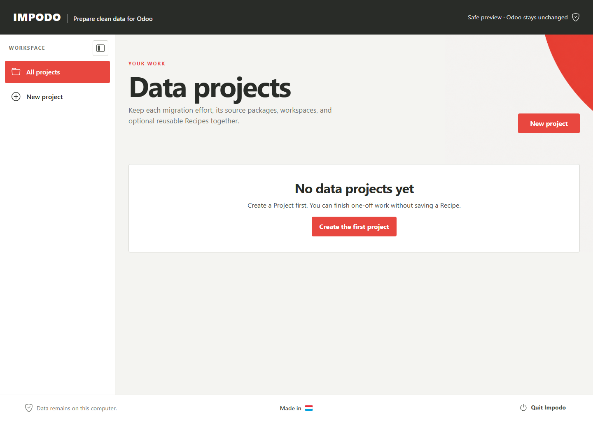

# Impodo user documentation

This documentation is for the data manager preparing and reviewing an Odoo 19
migration in the Impodo browser.

Start with [Create a data project](getting-started.md),
then follow the six stages shown in the workspace sidebar:

1. [Source data](workflow/01-source-data.md)
2. [Odoo data](workflow/02-odoo-data.md)
3. [Match data](workflow/03-match-data.md)
4. [Prepare data](workflow/04-prepare-data.md)
5. [Final review](workflow/05-final-review.md)
6. [Load into Odoo](workflow/06-load-into-odoo.md)

For a guided practice migration using fictional customers, products,
categories, and bills of materials, use the
[end-to-end training tutorial](tutorials/end-to-end-training.md).

## Installation and focused guides

- [Install Impodo on Windows](installation/windows.md)
- [Connect to Odoo on this computer](guides/local-odoo.md)
- [Prepare related tables](guides/related-tables.md)
- [Plan an integrated multi-Recipe Test run](guides/integrated-test-runs.md)
- [Qualify an integrated Test](guides/qualify-integrated-test.md)
- [Run the qualified plan with latest data](guides/production-rollout.md)

The user pages explain what to do, what to check, and what completion means.
Implementation details are kept in the paired developer pages.

Stage screenshots use isolated fictional workspaces and contain no operational
or customer data. Recipe-first setup screenshots were removed when the
Project-first browser replaced that lifecycle.

