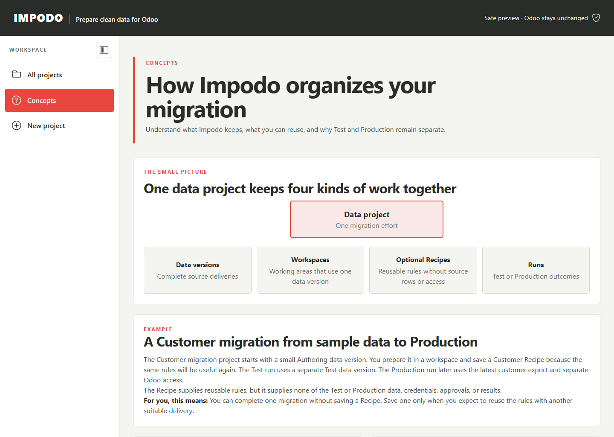

# How Impodo organizes your migration

Use this page when you want to understand what Impodo keeps, what you can
reuse, and why Test and Production remain separate. The same explanations are
available from the **Concepts** link in Impodo and from the question-mark help
beside selected headings.

## The small picture

One **data project** keeps one migration effort together. It can contain:

- **data versions**, which are complete deliveries of source data;
- **workspaces**, which are working areas that each use one data version;
- optional **Recipes**, which save reusable rules without source rows or Odoo
  access; and
- **runs**, which keep the outcomes of Test or Production work.

Creating a data project does not inspect Odoo, write to Odoo, or require you to
save a Recipe.

## Data version and workspace

A **data version** is one complete delivery of source data that Impodo accepts
and keeps unchanged. A corrected delivery becomes another data version instead
of silently replacing the delivery you already reviewed.

A **workspace** is where you inspect, match, prepare, compare, and load the
selected data for one use. The workspace uses data from one data version. It
does not own or replace that accepted source delivery.

## Recipe and Recipe version

A **Recipe** saves reusable preparation, matching, relationship, and checking
rules. It does not contain source rows, Odoo addresses or keys, approvals,
numeric Odoo record IDs, or migration results.

A **Recipe version** is one saved set of those rules. If you change reusable
rules, Impodo saves another version and keeps the earlier version unchanged.
This allows later Test evidence to keep pointing to the exact rules that were
used.

You can complete one migration without saving a Recipe. Save one only when you
expect to reuse the rules with another suitable delivery.

## Test run and Recipe work area

An **Integrated Test run** rehearses selected Recipe versions together with one
accepted Test data version and one reviewed Odoo target. Each Recipe receives a
separate **Recipe work area**, so one Recipe cannot silently change the mapping
or evidence of another.

The run also records any required order. For example, a Customer Recipe can
finish and verify before a Sales Order Recipe begins.

## Cutover plan and Production run

A **Cutover plan** records the exact Recipe versions, required order, writable
fields, and shared controls that the Integrated Test proved. Qualification or
selection does not authorize a Production write.

A **Production run** applies the selected plan to the latest accepted source
delivery and the intended Production Odoo target. Production supplies fresh
data, access, comparison, approval, load records, and verification. Impodo does
not treat Test data, credentials, approvals, or results as Production evidence.

## Using contextual help

Select a question-mark help link to open the explanation for that concept.
Press **Escape** or select **Close** to return to the same page and control. If
JavaScript is unavailable, the link opens the matching section of the full
Concepts page instead. Opening or closing help changes no project data or
evidence.

## Related documentation

- [Create a data project](getting-started.md)
- [Plan an integrated multi-Recipe Test run](guides/integrated-test-runs.md)
- [Developer implementation](../developer/workflow/00-project-setup.md)
