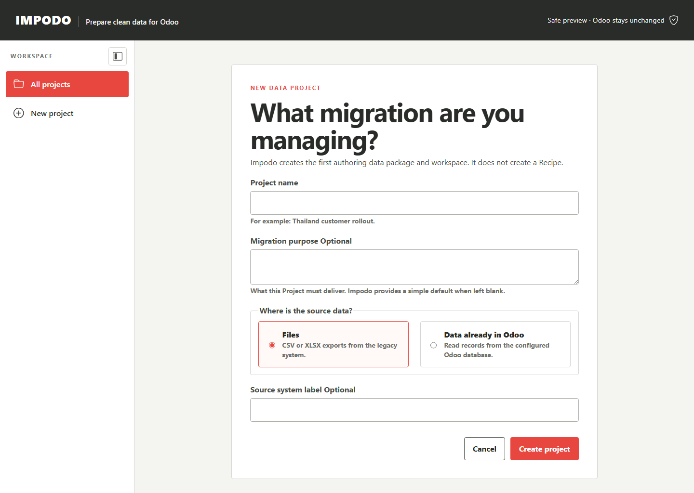

# Data project and authoring workspace setup

## Goal

Create one governed data project for a migration effort. You do not need a
Recipe to start or finish the work.

## Before you start

For a file project, collect the related CSV or XLSX exports from the legacy
system. For an Odoo-source project, have the exact Odoo 19 address, database
name, and read-only API key.

## Steps in Impodo

1. Open Impodo and select **New project**.
2. Enter a data project name and explain the migration purpose.
3. Choose **Files** or **Data already in Odoo**.
4. Enter a clear source-system name, such as the legacy ERP name.
5. Select **Create project**.
6. On the data project overview, select **Open workspace**.
7. For files, add all related CSV or XLSX exports and select **Use these files
   and continue**. For Odoo data, continue with the read-only source setup.

Impodo creates an Authoring data version and workspace for the data project. It
does not create a Recipe, inspect Odoo, or write to Odoo during data project
creation.

## Data project, data version, workspace, and Recipe

- The **data project** is the migration effort you govern.
- The **data version** is one complete delivery of source data that Impodo
  accepts and keeps unchanged.
- The **workspace** is where you inspect, match, prepare, compare, and load the
  data.
- A **Recipe** is optional reusable rules saved after the mapping is ready.

The data project can contain no Recipe, one Recipe, or several Recipes. Saving
a Recipe never moves the files or data version out of the data project. See
[How Impodo organizes your migration](concepts.md) for the complete model.

## What to check

- The source mode matches the real origin of the data.
- All related source tables are in the same data project when they must be prepared
  or loaded together.
- The source-system label clearly identifies the legacy system or Odoo source.
- The workspace shows the expected Authoring data version number.

## Save reusable rules only when useful

Complete Source data, Odoo data, Match data, and the required preparation and
quality checks first. When the workspace is eligible, return to the data project
overview. You can then:

- complete this migration once without a Recipe;
- select **Save as a new Recipe** to preserve reusable rules; or
- select **Save a new Recipe version** after reusable rules change.

A Recipe saves logical source shapes, transformations, mappings, relationships,
Odoo requirements, and reusable checks. It does not save source rows, server
addresses, API keys, numeric Odoo record IDs, approvals, or load results.

When several saved Recipes must be checked together, start an
[integrated Test run](guides/integrated-test-runs.md) from the data project
overview. This uses an already accepted Test data version and creates one
separate Recipe work area per Recipe. It does not yet execute or qualify
the integrated rollout plan.

## What Complete means

The data project overview lists the Authoring data version and workspace. The
workspace is usable with zero Recipes. Data project creation does not load data into
Odoo.

## What changes and what does not

Creating the data project saves its identity and its first data version,
run, and workspace. It does not inspect source rows, contact Odoo, save a
Recipe, approve a load, or write business records.

## Needs attention

If Impodo reports that a form is stale, reopen the current page and review the
latest values. If the source mode is wrong, create a correctly scoped data project
instead of reinterpreting existing evidence.

After an Impodo update, the first Project or workspace open may update its
saved database before showing the page. Impodo keeps the saved source data,
Recipes, and evidence unchanged during a storage update. If the update is
interrupted, Impodo rolls back that database and retries it on a later open.
Impodo does not downgrade data created by a newer application.

## What makes this work stale

The data project identity does not become stale when later evidence changes. A source
mode or source-system correction that changes what the data project means requires
a new correctly scoped data project during development; do not relabel accepted
evidence.

## Next stage

For a file source, continue to [Source data](workflow/01-source-data.md). For an
Odoo source, continue to [Odoo data](workflow/02-odoo-data.md).

## Related documentation

- [End-to-end training tutorial](tutorials/end-to-end-training.md)
- [How Impodo organizes your migration](concepts.md)
- [Developer implementation](../developer/workflow/00-project-setup.md)
