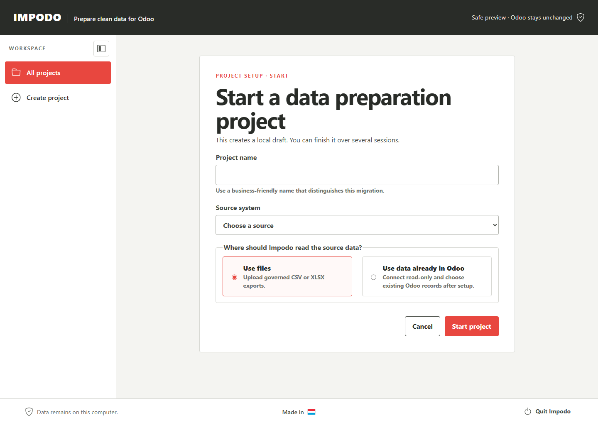

# Recipe and data-version setup

## Goal

Create a local migration project with a clear name and one source: files or
records already in Odoo.

## Before you start

For a file project, collect the related CSV or XLSX files. For an Odoo-source
project, have the exact Odoo 19 address, database name, and read-only API key.

## Steps in Impodo

1. Open Impodo and select **New project**.
2. Enter the project name and choose whether the source is files or existing
   Odoo records.
3. For a file source, add one or more related CSV or XLSX files and select
   **Use these files and continue**. The Odoo destination is requested later,
   when you reach **Odoo data**.
4. For an Odoo source, enter the exact source connection and run the read-only
   check. Impodo currently prepares updates for records in that same database;
   moving records between two Odoo databases is not available yet.

Keep related tables in one Recipe when they must be loaded in dependency
order. Do not create one Recipe per Odoo record type.

## What to check

- The source mode matches the real origin of the data.
- File-source projects contain the intended exports.
- An Odoo-source connection identifies the database that already contains the
  records.
- A file project's destination is connected only when **Odoo data** begins.

## What Complete means

The data-version overview opens, the setup is registered, and Impodo shows the
first available workflow action. Registration does not publish the Recipe or
load data into Odoo.

## Declare inputs that change with each data version

After the authoring workspace is registered, the Recipe overview shows
**Inputs for each data version**. File Recipes always include the required
export as-of date. It is not requested during initial project creation; enter
the current value when creating each Test or Production data version. Add other
reusable context before publishing, for example a required text input named
`warehouse` with the label **Warehouse**.

The declaration belongs to the Recipe revision; the value does not. A Test
data version can therefore use `WH-TEST` and the rollout data version can use
`WH-LUX` without changing the qualified Recipe. Adding a new input, changing
its type, or removing it changes reusable meaning and must be published and
tested as a new Recipe revision. A value for an input that the selected
revision did not declare is rejected.

Application inputs are typed context and control/provenance evidence. They do
not silently replace a matched source value or grant Odoo write authority.

When the Recipe is not ready to publish, the Recipe overview explains the
problem and shows one button for the stage that owns the correction. Use that
button, complete the named review, and return to the Recipe overview. A
reviewed Country, Language, or Currency code used only to find an existing
Odoo record does not require you to add that record type to the project's
primary Odoo data selection.

## What changes and what does not

Registration saves an auditable contained workspace boundary. It does not edit
a source file, publish reusable Recipe meaning, read business records from
Odoo, or write to Odoo.

## Test a published Recipe with replacement data

After the authoring workspace is complete and its Recipe revision is
published, return to the Recipe overview and select **Test on Odoo**.

1. Create a fresh Test data version and enter its declared values, such as the
   current export date and warehouse.
2. Add and freeze the representative replacement files through the normal
   Source data step.
3. Connect the remote Test Odoo server and supply its current read-only API
   key. Test server settings and credentials are not copied from authoring and
   never become part of the Recipe.
4. Capture Odoo data, then return to the Recipe overview and select
   **Apply Recipe**.
5. Review only the current differences. A renamed used column needs an exact
   replacement choice; new unused columns need no action. Missing target
   fields, uncovered choices, or a changed credential block this Test
   application without changing the published Recipe.
6. Select **Apply Recipe to current data** when the focused review is ready.
   Impodo opens the familiar Match data screen with a fresh Recipe-built draft
   for final review and confirmation.

Applying the Recipe does not authorize a load. Preparation, final comparison,
explicit write credentials, loading, and read-back remain separate steps.

## Run the selected Recipe with latest Production data

After the Test load is reconciled, qualify that exact Recipe revision and
select it for rollout. The Recipe overview then offers **Run with latest data**.

1. Confirm the latest-data label, declared parameter values, and current
   business-control totals. Impodo pins the selected revision even if a newer,
   untested Recipe revision exists.
2. Add and freeze the complete latest source package in the clean Production
   data version.
3. Enter the current Production Odoo endpoint and database, then supply and
   probe its read-only API key. No Test server setting, key, schema, reference,
   or approval is copied.
4. Apply the selected Recipe and review only current source, target, reference,
   parameter, control, or credential differences.
5. Continue through the familiar matching confirmation, preparation, quality,
   comparison, and approval stages using fresh Production evidence.
6. At load confirmation, establish the separate current Production write key.
   Confirm the exact snapshot, execute it, and complete Odoo read-back and
   reconciliation.

Test qualification proves the reusable rules. It does not approve the latest
Production data, authorize the Production server, or grant write access.

For file data versions, an incorrect source file can still be replaced before the
first table selection is frozen. The file is never edited in place.

## Needs attention

Return to the source-files or Odoo-connection page when Impodo reports missing
source or connection information. If the project was created with the wrong
source mode, create a correctly scoped project instead of reinterpreting its
evidence.

## What makes this work stale

Draft changes increment the workspace revision. A form opened before another
change may be rejected as stale; reopen it and review the current values.
Registered business and target setup is not silently rewritten by later
workflow stages.

## Next stage

For a file source, continue to [Source data](workflow/01-source-data.md). For an
Odoo source, continue to [Odoo data](workflow/02-odoo-data.md) to choose the
record type and eligible fields.

## Related documentation

- [End-to-end training tutorial](tutorials/end-to-end-training.md)
- [Developer implementation: Recipe and data-version setup](../developer/workflow/00-project-setup.md)
