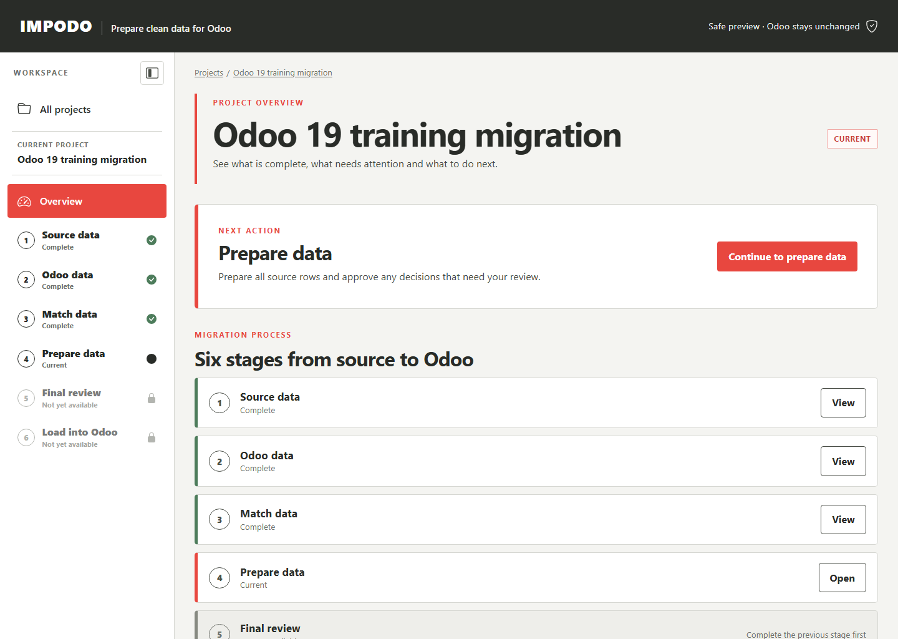

# Project setup

## Goal

Create one governed migration project and register the people, source, target,
purpose, and retention information that belong together.

## Before you start

Have the source owner, data manager, functional owner, source system, export
date, classification, retention period, and intended Odoo 19 target ready. For
a file project, collect the related CSV or XLSX files for the same migration.

## Steps in Impodo

1. Open Impodo and select **New project**.
2. Choose whether the source is files or existing Odoo records.
3. Enter the project and governance details.
4. Configure the Local or Remote Odoo target.
5. For a file source, add the related CSV or XLSX files.
6. Review the complete setup.
7. Select **Register project**.

Keep related tables in one project when they must be loaded in dependency
order. Do not create one project per Odoo record type.

## What to check

- The source mode matches the real origin of the data.
- The target URL and database identify the intended Odoo 19 environment.
- The data manager and functional owner are real responsibilities, not generic
  placeholders.
- Classification, purpose, and retention match the data being handled.
- File-source projects contain the intended exports.

## What Complete means

The project overview opens, the setup is registered, and Impodo shows the
first available workflow action. Registration does not load data into Odoo.

## What changes and what does not

Registration saves an auditable project boundary. It does not edit a source
file, read business records from Odoo, or write to Odoo.

For file projects, an incorrect source file can still be replaced before the
first table selection is frozen. The file is never edited in place.

## Needs attention

Return to the relevant setup page when Impodo reports missing ownership,
governance, source, or target information. If the project was created for the
wrong source mode or Odoo environment, create a correctly scoped project
instead of trying to reinterpret its evidence.

## What makes this work stale

Draft changes increment the project revision. A form opened before another
change may be rejected as stale; reopen it and review the current values.
Registered business and target setup is not silently rewritten by later
workflow stages.

## Next stage

For a file source, continue to [Source data](workflow/01-source-data.md). For an
Odoo source, continue to [Odoo data](workflow/02-odoo-data.md) to choose the
record type and eligible fields.

## Related documentation

- [End-to-end training tutorial](tutorials/end-to-end-training.md)
- [Developer implementation: Project setup](../developer/workflow/00-project-setup.md)
