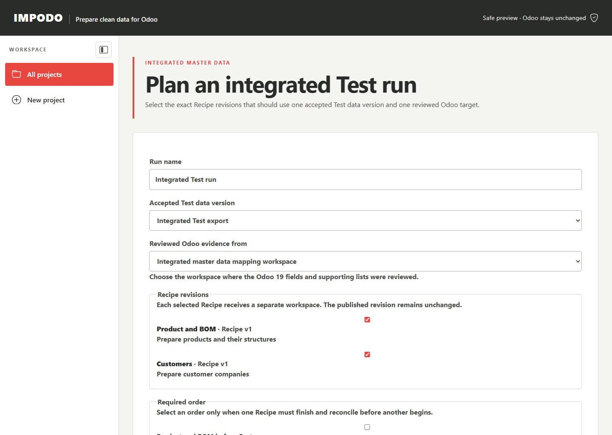

# Integrated multi-Recipe Test run

## Goal

Test selected Recipe versions with a newer source delivery and the Odoo target
you choose for this Test run. Impodo keeps this work inside the same data
project, but creates a fresh Test data version and a separate working area for
each Recipe. The Authoring sample and saved Recipes remain unchanged.

## Before you start

Your data project needs at least one saved Recipe from an accepted Authoring
data version. Have the complete newer Test delivery and the connection details
for your chosen Odoo target ready. Impodo will collect both as fresh Test
evidence.

## Steps in Impodo

1. Open the data project and select **Test with new data**.
2. Select the exact saved Recipe versions to test.
3. Under **Required order**, select a dependency only when one Recipe must
   finish and reconcile before another can begin.
4. Enter the newer data cutoff and select **Create Test setup**. Impodo opens
   **Fresh data** for this run.
5. Review the exact Recipe versions and their required source tables. Expand a
   table only when you need to see its required columns.
6. Under **Fresh data**, select the complete newer delivery. Select **Add fresh
   files**. You can remove an incorrect file on the same page.
7. Select **Check files and match tables**. Impodo shows the table chosen for
   each Recipe input. If two tables could be right, choose one. If a file is not
   used by the Recipe, remove it and check the files again.
8. Select **Use this fresh data**. This accepts the matched tables as the Test
   data version.
9. Under **Check Odoo**, connect the Odoo target for this Test run.
10. Review the Odoo record types, fields, and current supporting values taken from the
    exact selected Recipe versions. You cannot replace them with other Odoo
    choices in this run, and you do not select related tables again.
11. Select **Check this Odoo**. Impodo checks the required fields, refreshes
    the related Odoo values in bounded groups, checks every selected Recipe,
    and creates its separate Recipe work areas when everything is ready.
12. Impodo takes you directly to **Review and load** and starts preparing the
    first compatible Recipe. The page updates while Impodo works locally.
13. If a card says **Action needed**, open only that card's named review. A
    later Recipe stays waiting until the earlier result is verified.
14. When a card says **Ready for review**, review its prepared rows, exclusions,
    warnings, relationships, and proposed load. **Check changes** remains
    read-only. If Odoo already matches every prepared row, Impodo records that
    verified result and returns to **Review and load** without asking you to
    confirm an empty load. Otherwise, **Confirm and load** remains your
    explicit decision.
15. Review **Verify result**. After successful verification, Impodo starts the
    next compatible Recipe automatically. When every card is verified, review
    and qualify that exact Test run as the Production candidate.

Before creating Recipe work areas, the same Odoo check confirms that the
Recipe order has no cycle and that two Recipes do not claim the same writable
Odoo field. Reordering two conflicting Recipes is not a safe repair; one
Recipe must own that field.

## What to check

- The Test data version represents one complete, accepted delivery.
- Every selected Recipe version is the intended saved version.
- The required source tables shown under **Fresh data** match the business
  content you expect for each Recipe.
- Dependencies describe real business order, not a workaround for a collision.
- The reviewed Odoo workspace belongs to this data project and target.
- The selected Recipe versions declare non-overlapping writable Odoo fields.

## What Impodo creates

**Create Test setup** creates one draft Test data version, one Test run, and
one shared setup workspace. **Check this Odoo** activates that same run after
you accept the newer delivery and check the chosen Odoo target.
Before you add files, **Fresh data** reads the exact selected Recipe versions
and shows their reusable source requirements. Archiving a Recipe later does
not change the version already pinned to this run.
Each selected Recipe then receives:

- its exact saved version;
- only the logical datasets it needs from the Test data version;
- only its required Odoo models, fields, and supporting lists;
- a freshly checked mapping for this run, or a named issue that prevents its
  automatic confirmation; and
- its own issues and working evidence.

The saved Recipe remains unchanged. No source table or prior workspace is
copied.

The **Fresh data** page explains what the Recipes require and accepts or removes
the new delivery files in the run journey. **Check files and match tables**
compares each safe detected table with the required Recipe columns. A renamed
file can match automatically when its table is the only compatible choice.
Impodo asks only when more than one table could fill the same Recipe input.
Missing inputs, unsafe formula or error tables, and files the Recipe does not
use remain on this page with a clear correction.

The page also asks for details that belong only to this run, such as a stock
date, warehouse, location, or batch reference. The questions and labels come
from the selected Recipe versions, so the same page works for customers,
products, stock balances, and transactional data. If several Recipes use the
same compatible detail, enter it once. The delivery cutoff is already supplied
and appears read-only.

Impodo checks the value type and any saved limit before accepting it. A missing
required value or disagreement between selected Recipes keeps **Fresh data**
current and explains what needs attention. Saved answers belong to the Test
run; they do not change the Recipe or the Authoring workspace. If an earlier
Test delivery was accepted before run details were stored, return to **Fresh
data**, supply the missing details, and continue to **Check Odoo**.
After the details are accepted with the fresh data, they are read-only. Start a
new Test run if an accepted answer needs to change.

**Review and load** is the visible home from preparation through verification.
It shows the saved Recipe order, one current action, background progress, and
the verified count. A clean Recipe card stays compact. Open its detailed
workspace only to review prepared data, compare changes, confirm a load, or
resolve a named current-data issue. Returning to the run shows the next safe
action.

A card remembers whether preparation finished, Odoo changes were checked, or
verification still needs attention. Restarting Impodo may clear an in-memory
progress message, but it does not discard the saved Recipe application state
or silently repeat an Odoo load.

The setup and Recipe workspaces still keep the detailed evidence. Their browser
navigation belongs to the run: setup permits fresh-data and Odoo-check pages,
while an application permits only preparation, review, load, and verification.
A saved or copied setup schema link returns to the run-owned **Check Odoo**
page. The ordinary Authoring workspace keeps its editable Odoo model picker
and six-stage journey.

## Ready and Blocked

**Ready to prepare** means the Recipe was rebound to the current source and
target and its fresh mapping passed the current checks. It does not mean
the integrated run is executed or qualified for rollout.

**Blocked** means the run page names the current difference and the next
action. Typical examples are a missing source column, a changed Odoo field, a
missing supporting list, a required parameter, uncovered values, or a quality
scope that must be reviewed again. A blocked application may still contain a
fresh draft when the issue can be reviewed in that workspace.

## What Complete means

All selected Recipes appear in the validated order, each with a distinct
Recipe work area. The run shows one shared Test data version, one shared
Odoo target review, and the exact Cutover plan version created for the run.
Planning alone does not call the Test result qualified.

## What changes and what does not

Starting setup creates fresh Test identities. Activating the setup creates one
new Recipe work area for each selected version. Neither action changes the
saved Recipes, Authoring data version, Authoring workspace, Odoo data, or
rollout authority. Test credentials belong to the shared Test setup and never
become Recipe content.

## Needs attention

If planning stops before workspace creation, correct the named missing
dataset, target field, supporting list, dependency cycle, or overlapping field
owner. If a Recipe application is blocked after creation, return to
**Review and load** and open the one card marked **Action needed**. Do not enter its Source
data, Odoo data, or Match data pages and do not save a new Recipe version merely
to hide current-data drift.

## What makes this work stale

A different Test data version, Recipe version, dependency edge, target schema,
supporting-reference version, or credential generation requires a new exact
plan. Earlier Ready status does not transfer.

## Next stage

Complete preparation, comparison, load, and verified read-back from **Review
and load** for each Recipe. Follow dependency order, then
[qualify the integrated Test](qualify-integrated-test.md).

## Related documentation

- [Create a data project](../getting-started.md)
- [Match data](../workflow/03-match-data.md)
- [Prepare data](../workflow/04-prepare-data.md)
- [Developer implementation](../../developer/workflow/07-integrated-test-runs.md)
