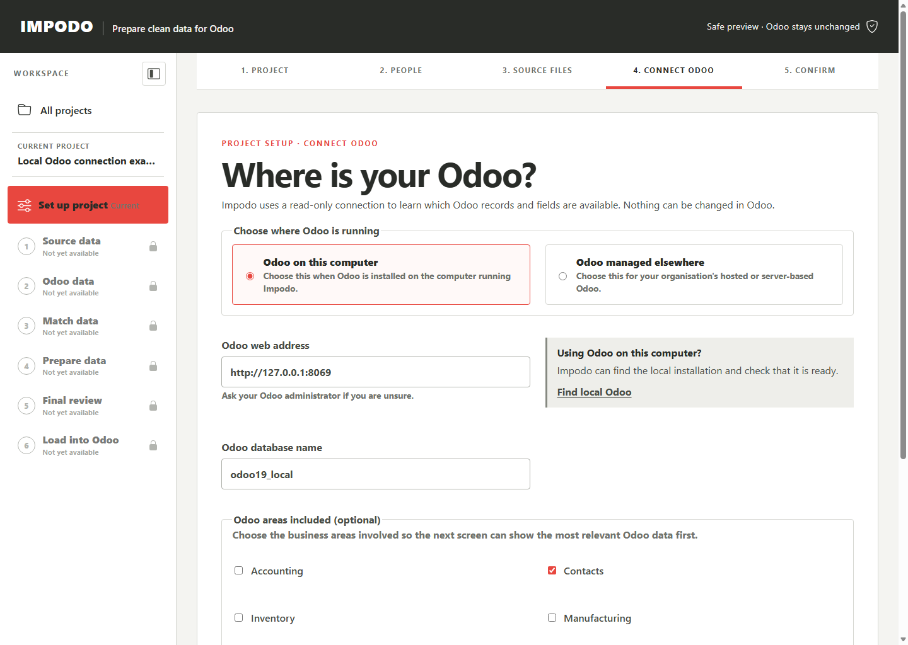
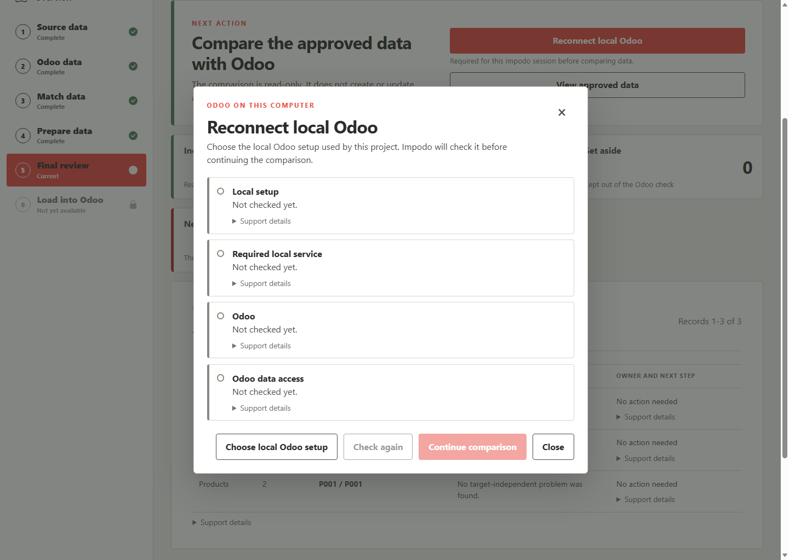
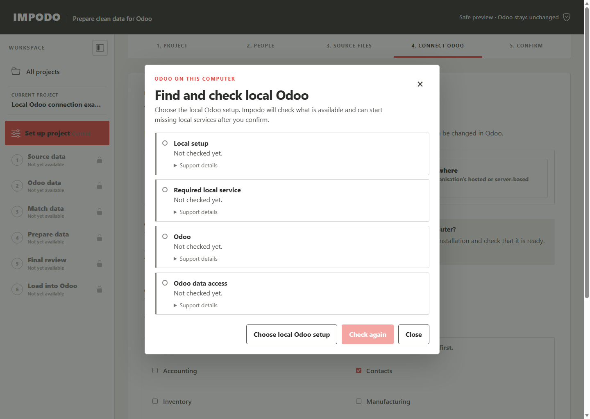

# Connect to Odoo on this computer

Use this guide when Odoo 19 and PostgreSQL already run, or are installed, on
the same Windows computer as Impodo. Impodo can check the local setup and help
start it, but it does not install Odoo or PostgreSQL.

## Before you start

Have the exact `odoo.conf` for the Odoo workspace you intend to use. If more
than one Odoo installation is present, confirm the correct workspace and
database with the person responsible for it.

Working locally does not authorize a load. Use a disposable database for
practice, and follow the same review and confirmation steps used for a remote
Odoo target.

## Connect

1. In the Recipe's authoring data-version setup, choose **Local Odoo**.
2. Select **Help me connect to local Odoo**.
3. Choose the exact `odoo.conf` for the intended workspace.
4. Review the detected Odoo, PostgreSQL, log, port, and database details.
5. If a check needs attention, correct the reported problem and select
   **Check again**.
6. When every required check is ready, select **Save and test connection**.
7. Select **Load Odoo record types** to save the models and fields available
   for this project.

Local mode does not require an Odoo API key. Impodo does not retain database
or Odoo master passwords from the configuration file.

## Reconnect during final review

The local setup choice lasts only for the current Impodo session. If **Final
review** shows **Reconnect local Odoo**:

1. Choose the matching local Odoo setup.
2. Review the checks.
3. Select **Continue comparison** when every check is ready.

Impodo blocks a setup that points to a different address or database.

## Understand the checks

| Check | What it means |
| --- | --- |
| Configuration | The selected paths and local connection settings are safe to use |
| PostgreSQL | The configured database server is accepting connections |
| Odoo server | The local web address responds as Odoo 19 |
| Database access | Impodo can open the chosen database read-only |

Always read the message beside a check. Green means ready; orange or red needs
attention; grey means the check has not run.

Impodo may offer **Start managed services** when PostgreSQL or Odoo is not
running. Starting them requires explicit confirmation. Impodo only manages the
exact processes it starts during the current session; it does not take control
of services that were already running.

Before quitting Impodo, use **Stop managed services** if the page says that
Impodo started them. This stops the managed Odoo process first and PostgreSQL
second. It does not change Odoo business records.

## When to refresh Odoo record types

The saved model and field list is project evidence. Use **Refresh Odoo record
types** only after relevant Odoo modules or custom fields changed, or when your
organization requires a fresh snapshot.

For process ownership, restart safeguards, and troubleshooting details, see
the [developer local Odoo runbook](../../developer/runbooks/local-odoo.md).
