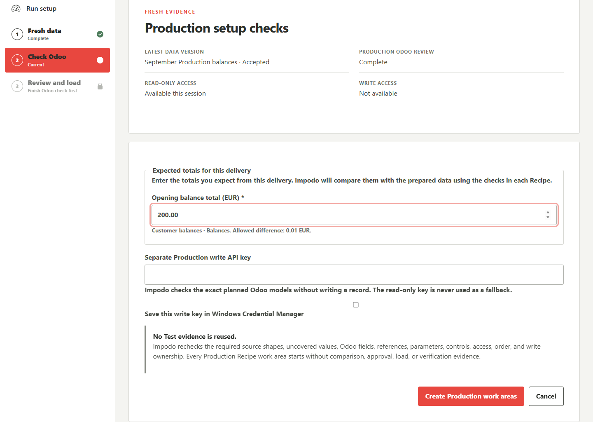
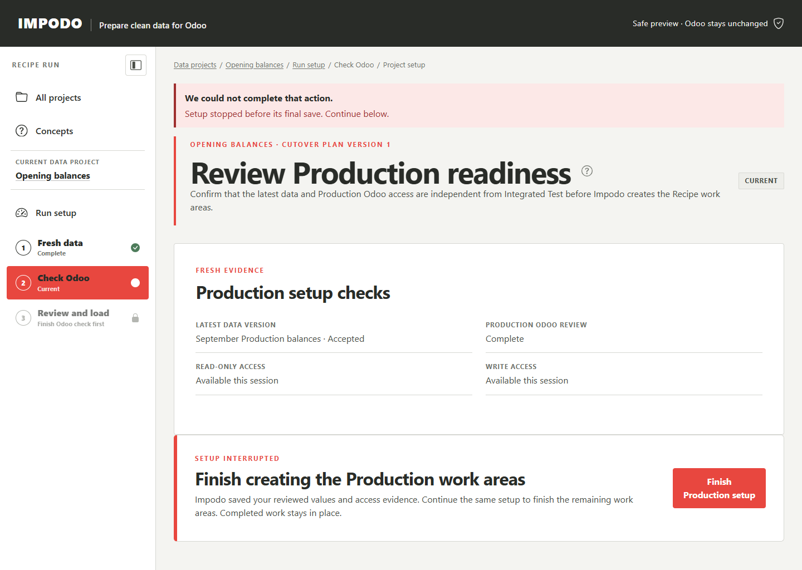

# Production rollout with latest data

## Goal

Apply the exact selected Cutover plan to the complete rollout-day data and a
different compatible Odoo 19 Production database. The Recipe rules come from
the qualified plan. The data, access, checks, approval, load results, and
verification are all new Production evidence.

## Before you start

The data project needs one selected integrated Test qualification. Prepare the
complete latest legacy-ERP delivery and know the business cutoff that all its
files represent.

Have two current Production API keys ready:

- a read-only key for Odoo fields, supporting lists, and comparison; and
- a different, limited write key for the exact record types in the plan.

Do not reuse the Test database or treat a successful Test comparison as a
Production check.

## Steps in Impodo

1. Open the data project and select **Start Production setup**.
2. Name the rollout and enter the latest export cutoff.
3. Under **Fresh data**, add the complete latest file delivery.
4. Review every required file and table, then accept the Production data
   version.
5. Under **Check Odoo**, connect the Production Odoo 19 database with the read-only key and capture
   its current fields and supporting lists.
6. Select **Return to Production run setup**.
7. Under **Details for this run**, enter the values requested by the Recipes.
   Shared values are entered once. Under **Expected totals for this delivery**,
   enter each Recipe's latest totals. The export date comes from this delivery;
   checks fixed by a Recipe are shown without an editing control.
8. Enter the separate Production write key and select **Create Production work
   areas**.
9. Open the Production run and follow its current **Review and load** action.
   Prepare, compare, approve, load, and verify each Recipe in dependency order.

Impodo creates one Recipe work area for each Recipe in the selected plan.
They share the accepted Production data version and reviewed target identity,
but they do not share mutable mappings, approvals, or results.

## What to check

- The latest data version contains every file and table expected for the
  business cutoff.
- The Odoo database is Production and is not the qualified Test target.
- The read and write keys are different and have only the required access.
- The Cutover plan version and Recipe versions match the selected candidate.
- New values, changed columns, missing Odoo fields, missing supporting values,
  and write conflicts are resolved before activation.
- Each Production Recipe work area starts without Test comparison, approval, load,
  or reconciliation evidence.

## What Complete means

**Complete** on the readiness page means Impodo finished creating the
Production Recipe work areas. The Project overview then shows **Setup complete**
and directs you to continue review and load. Preparing the work areas does not
load records into Odoo.

The rollout is complete only after every Recipe work area has its own approved
comparison, controlled load, and verified reconciliation in dependency order.

## What changes and what does not

Starting setup creates a new Production data version, Production run, and
setup workspace. Activating it creates isolated Recipe work areas and
records non-secret hashes for the exact Production target and credential
generations.

The selected Cutover plan and Recipe versions do not change. Test files,
credentials, comparisons, approvals, execution journals, and reconciliation
results are not copied into Production.

## Needs attention

If activation stops, use the recovery action shown by Impodo. Common causes
are an incomplete latest delivery, a changed source structure, a new uncovered
business value, an incompatible Odoo field or supporting value, a rotated key,
or a conflicting write owner.

If the page offers **Finish Production setup**, select it to continue with
the saved values and access review. Impodo keeps completed work areas and
finishes the remaining setup, even after restarting the app. This action
does not load records. You still need current access for comparison and load.

For example, a customer balances Test might total 125.50 EUR while the latest
Production delivery totals 200.00 EUR. Enter 200.00 for Production. If a value
needs correction, the page retains your other entries; it never redisplays
the write key. Once setup starts creating work areas, its saved values are
fixed. Older interrupted setups that lack saved values direct you to
**Start Production setup** again.

Correct reusable transformation meaning in authoring and qualify a new plan
revision. Do not add a hidden Production-only rule. Correct delivery-specific
data or access in the Production setup and recheck it.

If an Odoo write response is lost, reconcile the saved journal before retrying
or opening a dependent Recipe work area. Missing source rows never tell Impodo to
delete or archive Odoo records.

## What makes this work stale

A different selected rollout candidate, changed Recipe or plan meaning,
changed target, rotated read or write key, refreshed schema context, changed
parameters or controls, or a new comparison invalidates the affected
Production readiness. Impodo requires the owning check again and never falls
back to Test evidence.

## Next stage

Open the Production run and work through its Recipes in the shown order. For
each Recipe, use **Review and load** through the verified load outcome. The
normal six-stage workspace remains the Authoring journey.

## Related documentation

- [Qualify an integrated Test](qualify-integrated-test.md)
- [Load into Odoo](../workflow/06-load-into-odoo.md)
- [Developer implementation](../../developer/workflow/09-production-rollout.md)
