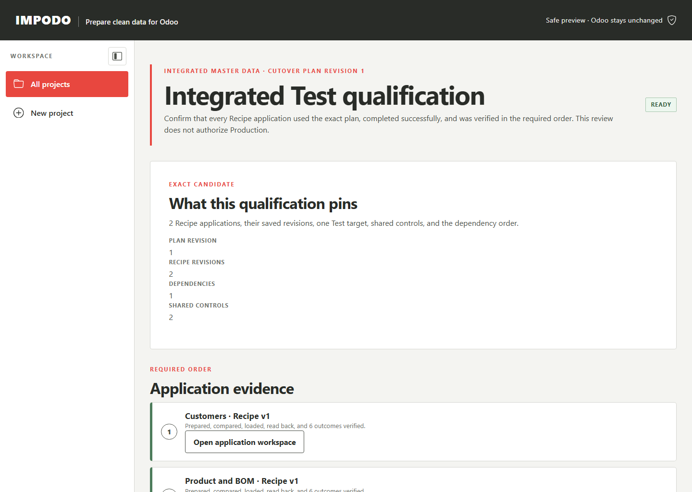

# Integrated Test qualification

## Goal

Prove that the exact saved Recipe versions work together on the accepted Test
data version and reviewed Test Odoo target. Qualification records the complete
result. It does not authorize a Production load.

## Before you start

Open every Recipe work area from the integrated Test run and complete the
normal work in that workspace:

1. submit the exact field matches;
2. prepare the data and pass the declared control totals;
3. resolve all data checks;
4. compare with the Test Odoo target;
5. load the reviewed records; and
6. read the result back until every outcome is verified.

If one Recipe depends on another, finish and verify the upstream Recipe work area
before starting the downstream load. Impodo blocks the downstream write until
that evidence exists.

## Steps in Impodo

1. From the integrated Test run, select **Review integrated qualification**.
2. Review the exact plan version and Recipe work areas in the required order.
3. Open the named Recipe work area when a check needs attention.
4. Return after every work area shows complete verified evidence.
5. Select **Qualify integrated Test**.
6. If this is the intended rollout candidate, select **Select rollout
   candidate** separately.

Impodo shows the exact Cutover plan version and the Recipe work areas in their
required order. Each work area must show complete preparation, comparison,
load, read-back, and reconciliation evidence.

When a check needs attention, open only the named Recipe work area and
complete the recovery action. Return to the qualification page afterward.

### Qualify and select

When every Recipe work area and both data project checks pass, select **Qualify
integrated Test**. This saves protected evidence for each Recipe work area
and one data-project-level result for the complete plan.

Qualification and rollout selection are separate decisions. After
qualification, select **Select rollout candidate** if this is the exact plan
you intend to use later. Selection still does not connect to Production or
grant Production write authority.

## What to check

- The plan lists the intended Recipe versions.
- The dependency order matches the real business sequence.
- Every Recipe work area shows all outcomes verified.
- The source-delivery and integrated reconciliation controls pass.
- The qualification page names the reviewed Test target, not Production.

## What Complete means

**Qualified** means Impodo retained protected exact evidence for every
Recipe work area and for the complete Cutover plan version. **Selected** means the
data manager separately chose that qualification as the future rollout
candidate.

## What changes and what does not

Qualification adds immutable evidence and completes the Test run. Selection
adds a data project rollout-candidate record. Neither action changes a Recipe,
data version, workspace evidence, target credentials, or Odoo records. Neither
action creates a Production run.

## Needs attention

If qualification is not ready, use the named recovery action. Complete the
missing field matches, preparation, controls, data checks, comparison, load,
or read-back in that one work area. Do not save a new Recipe version to hide an
incomplete Test run.

## What makes this work stale

A change to a selected Recipe version, dependency, declared write owner,
shared control, or combined Odoo requirement creates a new Cutover plan version.
The new revision starts unqualified. Impodo never transfers an earlier result
to changed meaning.

Starting another Test run with the same unchanged plan can reuse the same plan
version, but that run must still produce its own exact Test evidence before
it can qualify the plan.

## Next stage

The selected result is a rollout candidate only. Continue with [Production
rollout with latest data](production-rollout.md), which creates a fresh
complete data version, independent target and credentials, fresh comparison,
explicit approval, execution, and reconciliation.

## Related documentation

- [Plan an integrated Test run](integrated-test-runs.md)
- [Load into Odoo](../workflow/06-load-into-odoo.md)
- [Production rollout with latest data](production-rollout.md)
- [Developer implementation](../../developer/workflow/08-integrated-qualification.md)
