# Impodo end-to-end local-browser guide

## Who this guide is for

This guide is for a data manager who understands customers, products, product
categories, bills of materials (BoMs), and other ERP records, but does not need
to know how Impodo is designed internally.

It follows one complete fictional project from source files to a reviewed Odoo
19 load. The same pattern applies to approved disposable local or remote
targets and to standard or custom Odoo record types.

## Confidentiality and safety

Every name, email address, reference, filename, quantity, database name, and
value in this guide was invented for training. The screenshots were captured
from a separate local project containing only this dummy data. No corporate
source data was copied into the guide or its images.

The screenshots show the current controls at representative checkpoints. They
use a minimal fictional customer-and-product fixture so labels and controls are
easy to read; the downloadable training files exercise the wider scenario
described below.

Use the examples as templates, not as production data.

Impodo has two different safety boundaries:

- Source inspection, preparation, transformation review, and Odoo comparison
  are read-only. They do not change the registered files or Odoo.
- **Load into Odoo** is a separate, explicit action. It is currently available
  for an approved disposable Local or Remote Odoo 19 target. It is not a
  production cutover action.

## The training project

The fictional project migrates:

- nine customers;
- ten products and services;
- seven product categories extracted from the product file;
- three BoM headers and eight BoM component lines.

Copyable starter files are included with this guide:

- [customers_training.csv](../../examples/impodo-end-to-end-training/customers_training.csv)
- [products_training.csv](../../examples/impodo-end-to-end-training/products_training.csv)
- [bom_lines_training.csv](../../examples/impodo-end-to-end-training/bom_lines_training.csv)

The downloadable files are an expanded practice set. The screenshots use a
smaller core slice so labels and controls remain readable. Your row counts,
transformation totals, and Odoo comparison totals will therefore be larger
than the example screenshots. Always approve the totals shown for your own
current run.

The files demonstrate two ways of organizing related information:

~~~text
Product Category column -> product_categories -> products

Repeated BoM rows -> bom_headers (one per BoM)
                  -> bom_components (every component line)
~~~

The Odoo load order follows the relationships:

~~~text
Existing countries -> customers

product_categories -> products -> bom_headers -> bom_components
~~~

Impodo keeps the whole migration in one project. It prepares and loads tables
in dependency order; the data manager does not create unrelated projects for
each Odoo model.

## Before you start

Have these decisions ready:

- the final CSV or XLSX exports;
- the source export date and source-system name;
- the data manager and functional owner;
- the classification, purpose, and retention period;
- the Local or Remote Odoo URL and database;
- the Odoo record types included in the migration;
- one stable business key for each record type;
- an Odoo API key only if an approved disposable local or remote load will be
  performed.

Do not use Odoo's numeric database IDs as source keys. Use portable business
values such as customer reference, internal product reference, country code,
or BoM reference.

## 1. Start Impodo and create one project

Start Impodo from the approved shortcut. A developer installation may be
started from PowerShell with:

~~~powershell
.\.venv\Scripts\impodo.exe
~~~

Impodo opens a local 127.0.0.1 address with a short-lived sign-in token. Do not
bookmark or share that address.

Select **New project** and enter:

- Project name: **Odoo 19 training migration**
- Source system: **Northstar ERP (fictional)**
- Export status: **Files received**
- Export date: the date of the governed export
- Data manager: **Alex Morgan**
- Functional owner: **Jamie Laurent**
- Classification: **Confidential**
- Retention: **30 days** for this rehearsal

Add all related files before selecting **Register project**. Registration
freezes the file list; it does not yet freeze the individual tables.

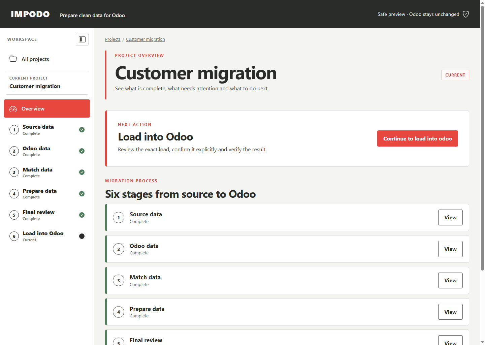

The six stages are the data manager's main route:

1. Source data
2. Odoo data
3. Match data
4. Prepare data
5. Final review
6. Load into Odoo

Use the next action shown on the overview. Avoid jumping ahead through sidebar
links when an earlier stage still needs attention.

## 2. Check and confirm the source files

Open **Source data** and select **Check source files**. Impodo verifies the
stored file hash before reading it and shows a bounded preview.

For every CSV, review:

- text format and column separator;
- the row containing column names;
- included table;
- row and column counts;
- preview values;
- likely data types, blanks, distinct values, and repeated values;
- structural warnings.

For every XLSX, also review the worksheet, named-table, and range choices.

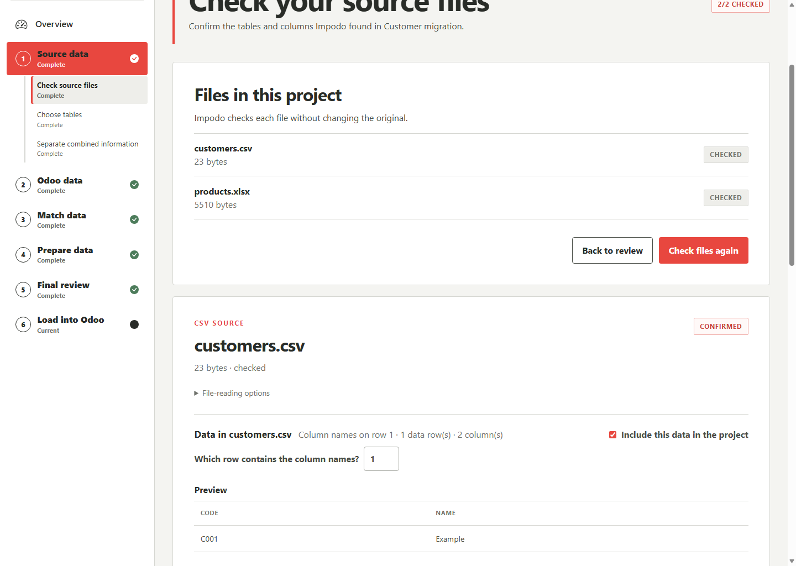

In the product example, notice that two source columns have different business
meanings:

| Source column | Example values | Odoo meaning |
| --- | --- | --- |
| Type de produit | Article, Service, Ensemble | Product Type choice on product.template.type |
| Product Category | Bottles, Design services | Related Product Category through product.template.categ_id |

These columns must not be treated as interchangeable.

### What the expanded customer rows teach

| Row | Case | How to handle it |
| --- | --- | --- |
| CUST-004 | Outer spaces around the customer name | Preview a trim rule and confirm that only the outer spaces disappear. |
| CUST-005 | Blank email | Decide whether blank means leave unchanged, clear the field, or block. Never invent an address. |
| CUST-006 | Accented character in Mistral Café | Preserve the UTF-8 name. Do not remove accents merely to simplify matching. |
| CUST-007 | Uppercase email | Use lowercase conversion only if the functional owner approves that normalization. |
| CUST-008 | Lowercase country code lu | Convert or match it explicitly to LU, then resolve exactly one res.country record by code. |
| CUST-009 | Same email as CUST-001 | Do not merge automatically. Customer Ref is the identity; the repeated email is a separate business-review finding. |

For a blank value on an update, clearing an existing Odoo value is materially
different from leaving it unchanged. If the selected rule cannot express the
owner's decision, stop and correct the source or mapping.

### What the expanded product and BoM rows teach

| Row or group | Case | How to handle it |
| --- | --- | --- |
| PROD-100 | Padded name and French decimal 1,25 | Trim the name and parse the price with French decimal rules. |
| PROD-100 and PROD-110 | Repeated Bottles category | Extract one category row and link both products to it. Do not create duplicates. |
| SERV-210 | Blank Sales Price | Confirm whether to retain an existing value, use a verified Odoo default on create, set a constant, or block. Blank is not zero. |
| COMP-040 | Explicit price 0,00 | Preserve numeric zero unless an approved business rule rejects it. |
| PACK-400 | New source choice Ensemble | Match it explicitly to Odoo Combo, stored as combo. Never let a new choice pass silently. |
| SUB-300 | A subassembly used by another BoM | Load products first, then BoM headers, then child lines in dependency order. |
| Fractional quantities | 0,10, 0,25 and 0,50 | Parse with the declared French decimal format and verify the prepared numeric values. |
| PROD-110 lines 20 and 30 | The same component occurs twice | Keep both when intentional because their line identities differ; otherwise request corrected source data. |

Select **Confirm this file** only when the preview represents the intended
table. Confirmation records the review; it does not trim, deduplicate, repair,
or rewrite the source.

## 3. Freeze the physical tables

After all files are confirmed, open **Choose tables** and assign stable table
names:

| File | Table name in Impodo |
| --- | --- |
| customers_training.csv | customers |
| products_training.csv | products |
| bom_lines_training.csv | bom_source_rows |

Select **Freeze selected tables**. The selection is now bound to the confirmed
source hashes.

If the source owner sends a corrected export before table choices are saved,
return to **Check source files**, add the corrected file, and remove the wrong
one. Once table choices are saved, start a new project rather than editing a
registered source file or the project database.

## 4. Create additional tables from source data

Open **Prepare related datasets** from Source data. This optional step organizes
denormalized files without changing the original files.

### 4.1 Create product_categories from one column

Choose **One field contains reusable values** and enter:

| Choice | Training value |
| --- | --- |
| Use values from | products - Product Category |
| Name shown in Impodo | product_categories |
| Type of Odoo record | Product Category (product.category) |
| Odoo name field | Name (name) |
| If a source value is blank | Stop and ask me to correct it |

Select **Preview**, review the unique values and counts, then select **Create
this related table**.

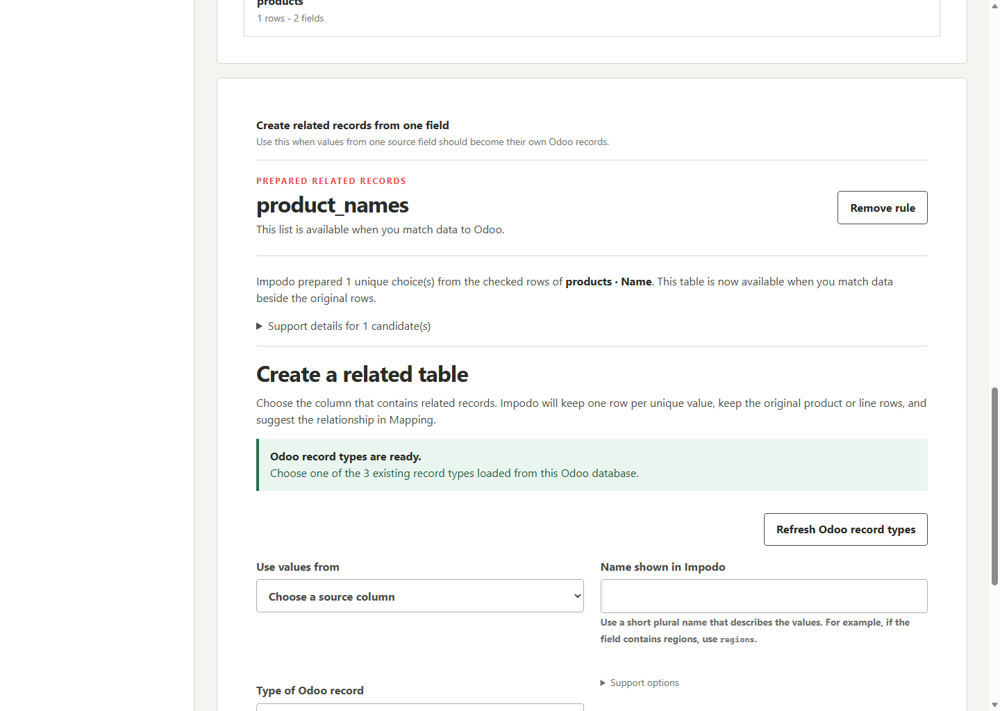

Impodo now presents product_categories beside products during matching. It
retains the original product rows and repeats the extraction over every frozen
row during preparation.

The expanded products file should preview seven unique category values from
ten product rows. Repeated values such as Bottles and Raw materials become one
related category row each.

This training file uses flat, globally unique category names. In a real Odoo
hierarchy, the same category name may appear under different parents. Preserve
the parent path and agree a compound matching rule instead of merging records
only because their final labels are equal.

Do not create categories from Type de produit. For this example, match its
choices instead:

| Source choice | Odoo choice | Stored Odoo value |
| --- | --- | --- |
| Article | Goods | consu |
| Service | Service | service |
| Ensemble | Combo | combo |

### 4.2 Split repeated BoM rows into parent and child tables

Choose **Several rows describe the same record** for bom_source_rows and enter:

| Choice | Training value |
| --- | --- |
| Table with one row per group | bom_headers |
| Table that keeps every source row | bom_components |
| Which field groups rows together? | BOM Reference |
| Which field identifies each row within its group? | Line No |
| If required information is missing | Stop and ask |

Preview the grouping. The expanded training result is three BoM headers and
eight retained component rows. Select **Create these separate tables**.

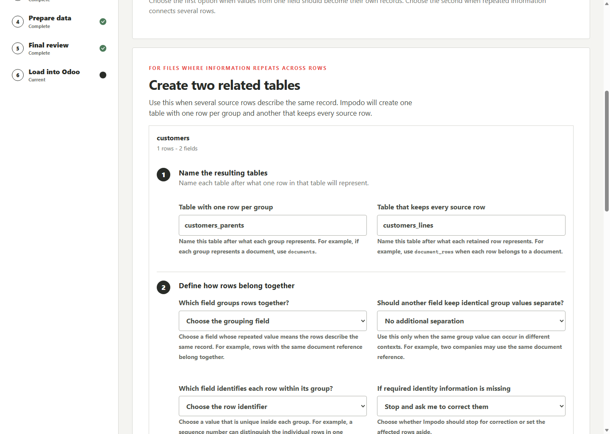

This source split prepares the data shape. It does not create an Odoo BoM.
Here, BOM Reference deliberately equals the finished product's Internal
Reference. When the source uses different references, include a separate
Finished Product Reference column rather than inferring the product from its
name.

## 5. Choose Odoo records and matching rules

Open **Odoo data**. Show the available Odoo record types, select only the
approved scope, and load the selected Odoo details.

For the training project, the scope is:

| Business record | Odoo model | Matching rule |
| --- | --- | --- |
| Customer | res.partner | Customer reference (ref) |
| Country | res.country | Country code (code) |
| Product Category | product.category | Category name (name) |
| Product | product.template | Internal reference (default_code) |
| Product Variant | product.product | Internal reference (default_code) |
| Bill of Materials | mrp.bom | BoM reference (code) |
| BoM Component | mrp.bom.line | BoM plus line sequence (bom_id, sequence) |

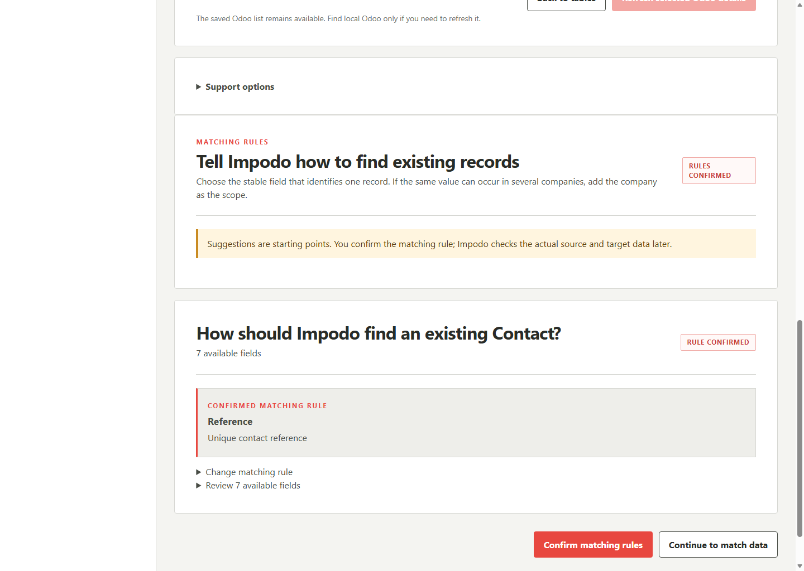

A matching rule answers: “How can Impodo find exactly one existing Odoo
record?” It does not guarantee uniqueness merely because a sample looks
unique. Confirm the rule with the functional owner.

Changing the Odoo model scope, recapturing fields, or changing a business key
invalidates dependent matching work and requires a new check.

## 6. Match every prepared table to Odoo

Open **Match data**. Work through one table at a time.

The training mapping is:

| Impodo table | Odoo record | Main choices |
| --- | --- | --- |
| customers | Contact | Upsert by Customer Ref; fill Name and Email; link Country by Country Code |
| product_categories | Product Category | Upsert by Category Name |
| products | Product | Upsert by Internal Reference; fill Name, Product Type, and Sales Price; link Product Category |
| bom_headers | Bill of Materials | Upsert by BoM Reference; link the finished Product |
| bom_components | BoM Component | Upsert by BoM Reference plus Line No; link the parent BoM and component variant |

### Save behavior

Typing, searching, filtering, and opening a field do not save or validate.

- **Save progress** stores the current choices without checking them.
- **Check matches** runs the semantic mapping check.
- **Confirm field matches** confirms the exact checked revision.

Use **Save progress** before leaving the page. A checked or confirmed mapping
does not load Odoo.

### 6.1 Map the Product Type choice

Find **Product Type** in products and choose:

- Value comes from: **Source value**
- Source column: **Type de produit**
- Value type: **Text**
- **Review source choices**: Article to Goods, Service to Service, Ensemble to
  Combo

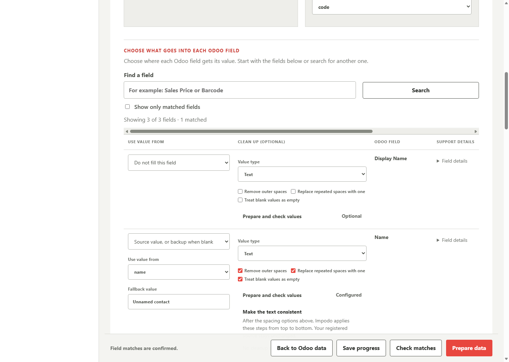

The Odoo label is shown to the data manager, while Impodo retains the stable
Odoo code. If a new source choice appears later, it must be reviewed; Impodo
does not guess.

For the training price column, choose decimal format **French** so 1,25 becomes
the numeric value 1.25. For Product Name, enable removal of outer spaces and
repeated-space cleanup.

### 6.2 Add ordered cleanup steps

Open **Prepare and check values** for a text field when values need more than
spacing or capitalisation cleanup. For a Phone or Mobile field, choose
**Use phone cleanup** to add an editable two-step starting point. Impodo does
not save the suggestion until you choose **Save progress**.

You can also add each step yourself in the order it should run. For an
international phone field:

1. Add **Replace text at the beginning**, find `00`, and replace it with `+`.
2. Add **Remove separators between numbers** and select spaces, dots, and
   hyphens.

The result turns `00352-621.23.45` into `+3526212345`, while a value such as
`120034` keeps its internal `00`. Use **Move up** and **Move down** when one
step depends on the result of another. Guided steps update the sample preview;
**Advanced pattern** remains an explicit expert choice and is validated only
after **Save progress**.

Saving does not alter the registered source. Before confirming the field
matches, **Review rule effects** shows how many values each cleanup step
matched and changed. A step that changed no values must be fixed or explicitly
kept.

### 6.3 Handle a Many2one relationship

A Many2one means one row points to one related Odoo record. The product's
categ_id points to one Product Category.

For **Product Category** on products, choose:

- Use values from: **Product Category**
- Find the matching choice in: **Another table in this project**
- Project table: **product_categories**
- Matching rule: **Category name**
- If missing or several match: **Stop and ask**

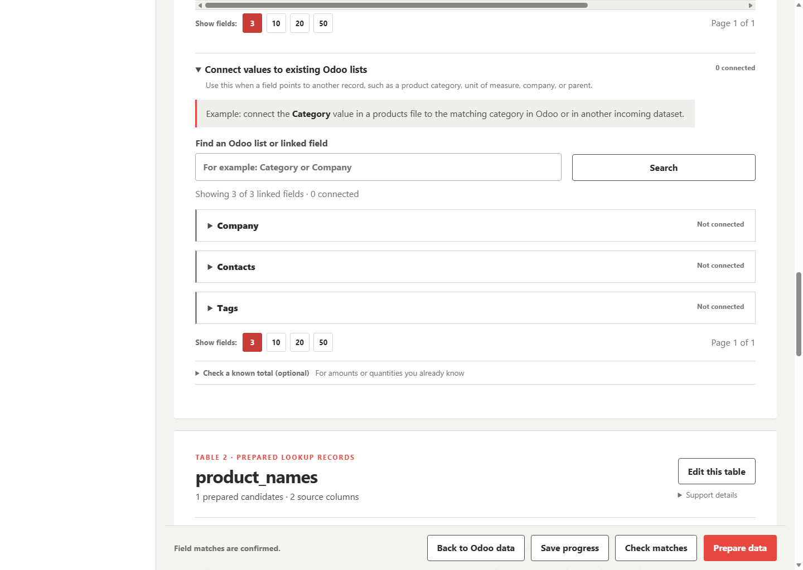

For a relationship to records that already exist in Odoo, choose **Existing
Odoo choices** and the related model's confirmed matching rule. The customer
Country example uses source Country Code against res.country.code.

Impodo stores the source business value and resolver—not an Odoo numeric ID.

### 6.4 Handle a One2many relationship

A One2many list is owned by its child rows in Odoo. Do not write the parent
mrp.bom.bom_line_ids list directly.

Impodo keeps linked Odoo fields together in the relationship section shown
above. For One2many fields, follow the instruction to map the inverse field on
the child table.

Instead, map bom_components to mrp.bom.line:

- source identity: BOM Reference plus Line No;
- Odoo matching rule: Bill of Materials plus Sequence;
- connect BOM Reference to the incoming bom_headers table;
- connect Component Ref to product.product.default_code;
- map Quantity to product_qty.

The owning inverse field is the child's Many2one mrp.bom.line.bom_id.

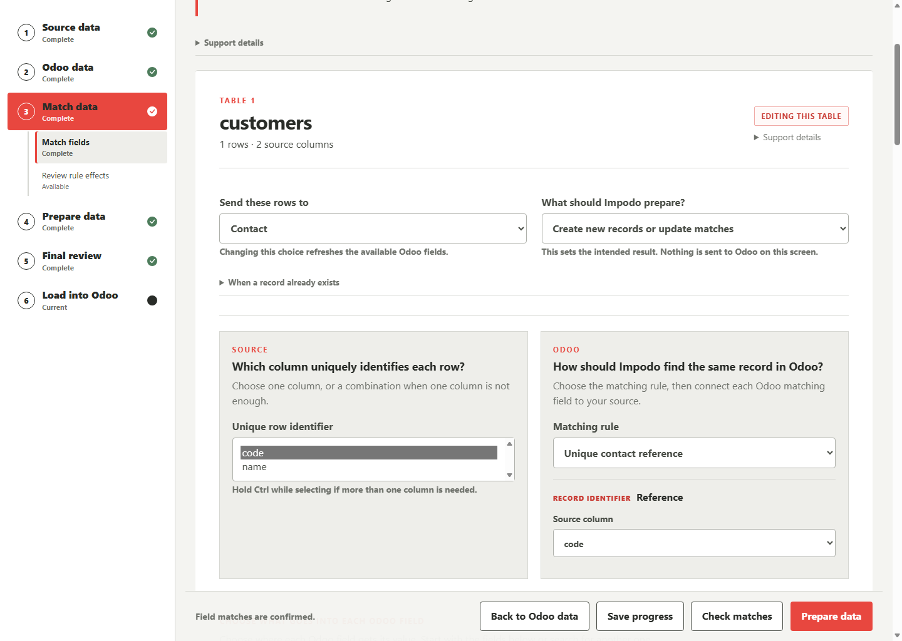

If the parent BoM, finished product, or component variant is missing or
ambiguous, the affected row is blocked. Never choose the first match.
If line numbers can be reordered, use a stable source line reference as part
of the identity; do not assume a display sequence is permanent.

## 7. Review transformations before confirming

After **Check matches** succeeds, select **Preview rule effects**.

This read-only report compares original source values with the values Impodo
will prepare. It does not contact or change Odoo.

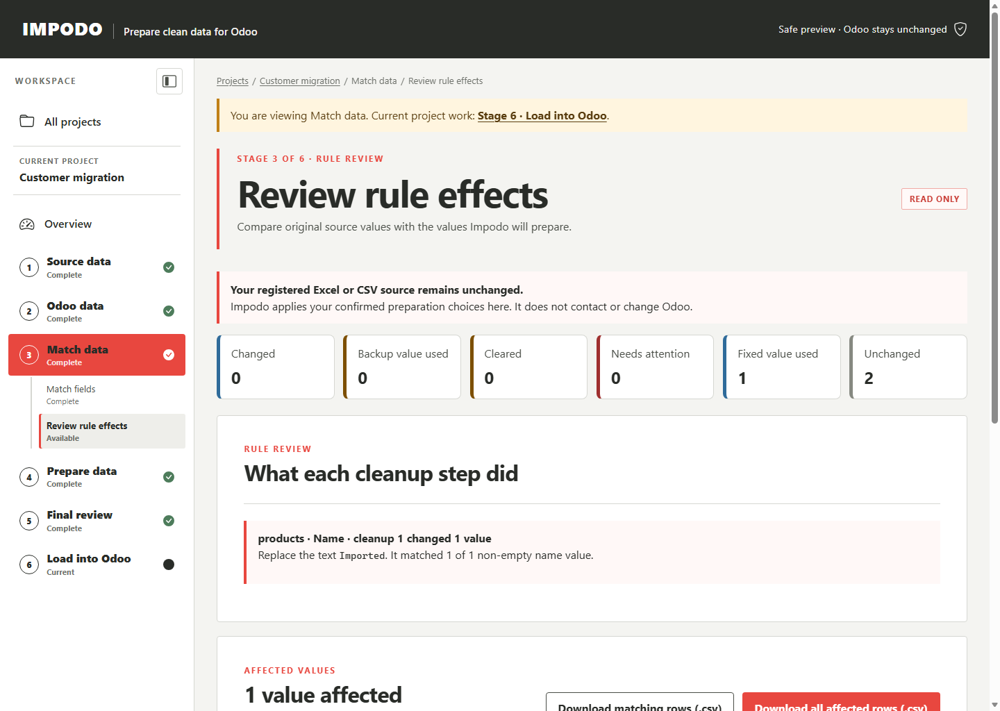

Review the outcome cards and use the filters for table, result, Odoo field, or
text. Download all affected rows when the review needs to be shared or signed
off.

For each affected value, verify:

- source row and source column;
- original value;
- prepared value;
- field rules;
- result and any message.

Return to Match data and select **Confirm field matches** only after the report
is acceptable.

## 8. Prepare all rows and resolve findings

Select **Prepare data**. Impodo applies the confirmed rules to every frozen
source row, materializes derived tables, evaluates data-quality checks, and
records row lineage.

Review every decision that needs attention. Do not continue while a required
relationship, identity, value conversion, or business rule is unresolved.

Then open **Final review** and select **Check all rows**. Impodo compares the
prepared data with read-only Odoo evidence and classifies each row:

- **Create** — no existing record matched;
- **Update** — exactly one existing record matched and values differ;
- **No change** — exactly one existing record matched and values agree;
- **Blocked** — a required value or relationship cannot be resolved;
- **Ambiguous** — more than one target record matched.

Generate the review workbook when the run is ready and a durable reviewer
package is required. The workbook and browser report are evidence; neither is
an Odoo import.

## 9. Plan BoM loading in the right sequence

Products and BoMs have an important Odoo dependency: a BoM component points to
product.product, while the product file normally maps to product.template.
Odoo creates the variant record for a new product template.

Therefore use one of these safe cases:

1. Referenced product variants already exist and are uniquely found by Internal
   Reference; or
2. Load new categories and products first, run a fresh Odoo comparison after
   Odoo has created the variants, then load the BoM headers and components.

Do not assume a product variant exists during a preflight performed before its
new template was loaded. A fresh comparison is the evidence boundary.

The two passes remain inside the same migration project. Each pass has its own
frozen comparison and explicit load confirmation.

## 10. Preview and submit the Odoo load

The current load action is limited to an approved disposable Local or Remote
Odoo 19 target. Production loading requires separate change, access, backup,
monitoring, and cutover controls.

Open **Load into Odoo** only after the latest comparison is complete. Review:

- exact database and Odoo version;
- total Create, Update, and No change counts;
- per-table Odoo record type and counts;
- the current preview identity under Support details when support asks for it.

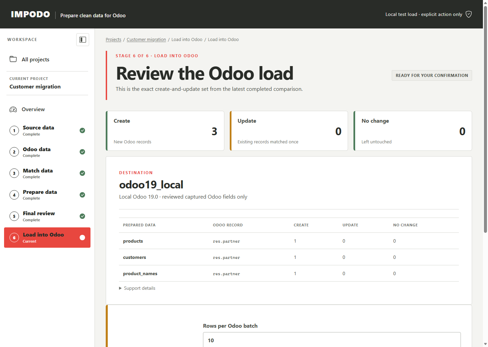

The fictional preview shows the table dependency order. Product records are
updates or unchanged in this BoM pass, so their variants are already available
for component resolution. Its totals illustrate the confirmation screen; they
are not the expected totals for the expanded practice files.

If reviewed relationships form a deferrable cycle, the confirmation page says
how many new records need a second relationship step. Impodo creates those
records first and then sets the relationships through Odoo after the related
records exist. Identity, scope, and fields required during create cannot use
this second step.

When every total and the destination are correct:

1. Enter the Odoo API key.
2. Optionally store it in the operating-system credential vault.
3. Select **Load into Odoo** once.
4. Keep the page open until Impodo records the API outcome.
5. Select **Verify in Odoo**, provide the key if needed, and wait for the
   read-back result.

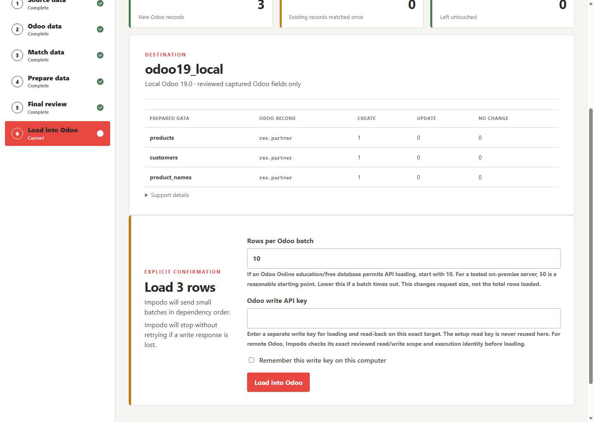

Do not refresh, repeat, or start another load when the response is uncertain.
Impodo deliberately stops without blindly retrying a lost write response.

## 11. Review the Odoo read-back result

After Impodo records the API outcome, select **Verify in Odoo**. Impodo then
reads the affected records back and compares them with the confirmed preview.

Review:

- verified rows;
- fallout rows and differing fields;
- unknown outcomes;
- rows marked safe to plan again after a fresh comparison.

`Partially applied` means that the Odoo record exists but one or more deferred
relationship updates did not finish cleanly. Do not load the same preview
again. Verify the records, review the fallout, and prepare a fresh comparison
only after the actual Odoo state is understood.

Download the fallout CSV when any row is not verified. Correct the cause, run a
new preparation and comparison, and approve a new preview. Do not edit stored
evidence or replay an uncertain row manually through Impodo.

## Relation quick reference

| Odoo relationship | What it means | Impodo handling |
| --- | --- | --- |
| Many2one | This row points to one related record | Resolve one business key in an incoming table or existing Odoo data |
| One2many | This parent displays its child rows | Map the child table's inverse Many2one; do not write the parent list |
| Many2many | This row links to a set of records | Resolve every business key and explicitly choose replace, add, or remove |

Every required relationship must resolve to exactly one record. Missing and
ambiguous matches are review findings, not opportunities to guess.

## Completion checklist

- [ ] All source files are final, checked, and confirmed.
- [ ] Physical tables are frozen with clear names.
- [ ] Category extraction uses Product Category, not Type de produit.
- [ ] BoM parent and child tables retain every source row.
- [ ] Odoo record types and fields come from the intended Odoo 19 database.
- [ ] Every model has a functionally confirmed business key.
- [ ] Article, Service, and Ensemble are matched to valid Odoo Product Type codes.
- [ ] Many2one relationships use portable business keys.
- [ ] One2many relationships are owned through the child inverse Many2one.
- [ ] Save progress was selected explicitly before leaving Match data.
- [ ] The transformation-impact report and export were reviewed.
- [ ] Every prepared row passed quality and Odoo comparison checks.
- [ ] New product variants exist before BoM component preflight.
- [ ] The exact target database and Create/Update/No change totals were approved.
- [ ] **Load into Odoo** was selected once for the approved preview.
- [ ] Odoo read-back and any fallout were reviewed.

## Stop Impodo

Use **Quit Impodo** in the browser. This ends the local session; it does not
delete project evidence. Apply the agreed retention process after migration
acceptance and reconciliation.

For workstation startup and local Odoo assistance, see the
[local Odoo guide](../guides/local-odoo.md).
