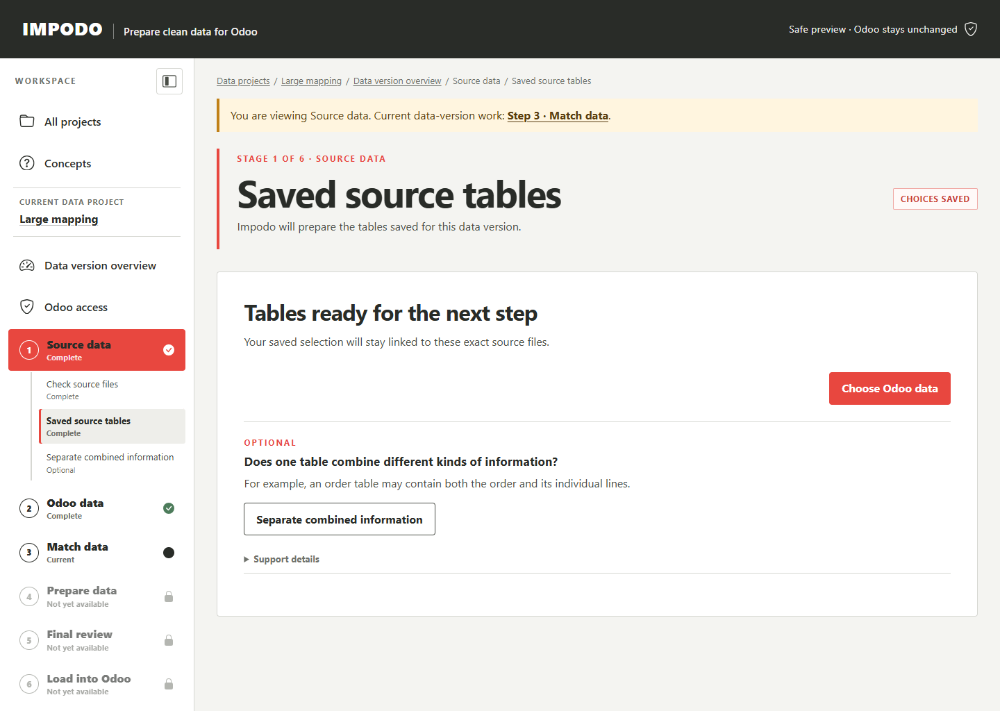

# Source data

## Goal

Confirm the exact records and columns that Impodo may prepare, then freeze
them as evidence for the current data version.

## Before you start

The current data version must be available. For files, use the complete CSV
or XLSX delivery for this authoring work and know which
worksheets, tables, or ranges belong to the migration. For an Odoo source,
first complete the eligible-field capture described in
[Odoo data](02-odoo-data.md).

## Steps in Impodo

### File source

1. Add all related CSV or XLSX files and select **Use these files and
   continue**. Impodo checks the files and opens the source preview.
2. Review the delimiter or worksheet, headings, bounded preview, counts, data
   types, blanks, repeated values, and warnings.
3. Configure the intended tables for every file.
4. Add a corrected file and remove the wrong file if necessary.
5. After every file is confirmed, give each table a **Name shown in Impodo**
   and select **Save tables for this data version**.
6. Optionally open **Separate combined information** when combined information
   must become separate related tables.

Once table choices are frozen, the file list cannot be changed in that data
version.

### Odoo source

1. Open **Freeze Odoo records** after eligible fields have been captured.
2. Choose each **Odoo record type** in turn. The page shows that record
   type's eligible fields and its own saved plan.
3. Save one bounded plan for every selected record type. For example, save a
   Product plan and then a Unit of Measure plan.
4. Select **Check matching records**. Impodo shows the count and request
   estimate for each dataset and for the complete capture.
5. Confirm the read-only action and wait while Impodo freezes every dataset as
   one source version. A failure leaves the previous complete version current.

The Odoo-source route reads selected business records; it does not authorize a
write back to Odoo.

For a Product and Unit of Measure example, the two record types remain separate
datasets. Capturing both gives Match data both field lists. It does not by
itself define the relationship between them or authorize recreating records in
another Odoo instance.

## How Recipes reuse this work

The exact files, rows, hashes, and frozen snapshots belong only to this data
version. A saved Recipe retains the reusable source shape and logical
table and column bindings, not the source records.

Every later data version must therefore start clean and accept its complete
replacement delivery again. An integrated Test run can select different
logical datasets from one already accepted Test data version for several
Recipes; it still never reuses the Authoring rows as current Test evidence.

## What to check

- Counts and headings match the governed export or every Odoo selection.
- Preview values belong to the intended business population.
- Stable business identities are present.
- Warnings are understood before freezing.
- Optional related tables represent real record types, not merely convenient
  display groupings.

## What Complete means

Impodo shows the source stage as frozen or complete only after every selected
Odoo record type has a saved plan and the complete set has been captured.
Every selected dataset is bound to protected evidence for this data version.

## What changes and what does not

Freezing creates a governed snapshot for preparation. It does not modify the
original file or Odoo records, save a Recipe version, or copy evidence
from another data version. Optional related-table rules create a plan; they do
not rewrite the frozen source.

## Needs attention

Stop when a file hash has changed, a worksheet is missing, headings are wrong,
or the Odoo capture is broader than intended. Before table freeze, replace an
incorrect file. Never replace frozen evidence in place. If the migration scope
is wrong, create a correctly scoped data project.

For combined source information, use the
[related-table authoring guide](../guides/related-tables.md)
instead of manually altering the project database.

## What makes this work stale

A changed source file, table choice, Odoo selection, or related-table plan
changes this data version's source evidence. Downstream schema, mapping,
preparation, and review evidence must be regenerated when Impodo invalidates
them. Earlier data-version evidence remains protected history.

## Next stage

For a file source, continue to [Odoo data](02-odoo-data.md). For an Odoo
source, continue to Match data after the complete capture is frozen. The
current Odoo-source update workflow remains bound to the same configured
database. Moving Product and Unit of Measure records into another Odoo
instance is not yet an authorized load path.

## Related documentation

- [End-to-end training tutorial](../tutorials/end-to-end-training.md)
- [Developer implementation: Source data](../../developer/workflow/01-source-data.md)
- [Remaining guarded Odoo-source update work](../../plans/remaining-work.md#4-complete-guarded-odoo-source-updates)
