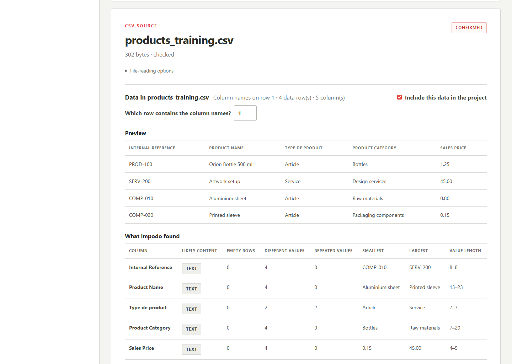

# Source data

## Goal

Confirm the exact records and columns that Impodo may prepare, then freeze
them as the project's source evidence.

## Before you start

The project must be registered. For files, use the final CSV or XLSX exports
and know which worksheets, tables, or ranges belong to the migration. For an
Odoo source, first complete the eligible-field capture described in
[Odoo data](02-odoo-data.md).

## Steps in Impodo

### File source

1. Open **Source data** and select **Check source files**.
2. Review the delimiter or worksheet, headings, bounded preview, counts, data
   types, blanks, repeated values, and warnings.
3. Configure the intended tables for every file.
4. Add a corrected file and remove the wrong file if necessary.
5. Open **Choose tables** and select **Freeze selected tables**.
6. Optionally open **Prepare related datasets** when combined information must
   become separate related tables.

Once table choices are frozen, the file list cannot be changed in that
project.

### Odoo source

1. Open **Freeze Odoo records** after eligible fields have been captured.
2. Define a bounded selection for the intended Odoo record type.
3. Review the capture estimate and selection rules.
4. Run the capture and wait for the frozen source result.

The Odoo-source route reads selected business records; it does not authorize a
write back to Odoo.

## What to check

- Counts and headings match the governed export or Odoo selection.
- Preview values belong to the intended business population.
- Stable business identities are present.
- Warnings are understood before freezing.
- Optional related tables represent real record types, not merely convenient
  display groupings.

## What Complete means

Impodo shows the source stage as frozen or complete and the next stage becomes
available. Every selected dataset is bound to immutable source evidence.

## What changes and what does not

Freezing creates a governed snapshot for preparation. It does not modify the
original file or Odoo records. Optional related-table rules create a plan;
they do not rewrite the frozen source.

## Needs attention

Stop when a file hash has changed, a worksheet is missing, headings are wrong,
or the Odoo capture is broader than intended. Before table freeze, replace an
incorrect file. After freeze, start a new project for corrected source data.

For combined source information, use the
[related-table authoring guide](../../operations/08-related-dataset-authoring.md)
instead of manually altering the project database.

## What makes this work stale

A changed source file, table choice, Odoo selection, or related-table plan
changes the source evidence. Downstream schema, mapping, preparation, and
review evidence must be regenerated when Impodo invalidates them.

## Next stage

For a file source, continue to [Odoo data](02-odoo-data.md). For an Odoo
source, freezing the records completes the currently implemented source-capture
workflow. Match, preparation, and round-trip update remain planned and are not
yet available for that source mode.

## Related documentation

- [End-to-end training tutorial](../tutorials/end-to-end-training.md)
- [Developer implementation: Source data](../../developer/workflow/01-source-data.md)
- [Odoo source import and round-trip update plan](../../plans/odoo-source-import-plan.md)
