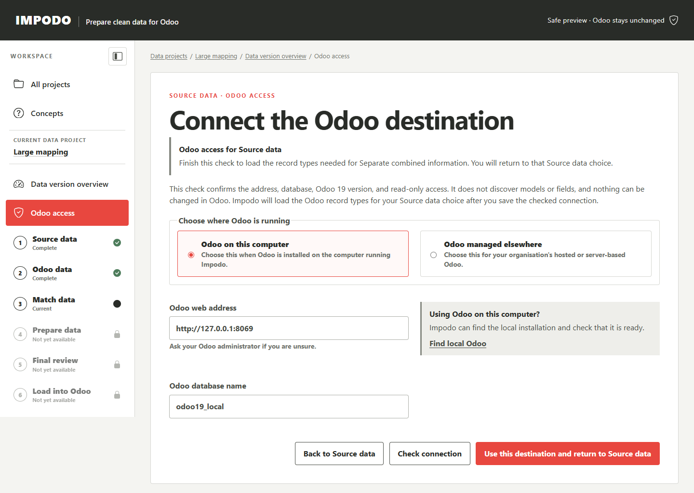

# Source data

## Goal

Confirm the exact records and columns that Impodo may prepare, then freeze
them as evidence for the current data version.

## Before you start

The current data version must be available. For files, use the complete CSV
or XLSX delivery for this authoring work and know which
worksheets, tables, or ranges belong to the migration. For an Odoo source,
first complete the eligible-field capture described in
[Odoo data](02-odoo-data.md).

## Steps in Impodo

### File source

1. Add all related CSV or XLSX files and select **Use these files and
   continue**. Impodo checks the files and opens the source preview.
2. Review the delimiter or worksheet, headings, bounded preview, counts, data
   types, blanks, repeated values, and warnings.
3. Configure the intended tables for every file.
4. Add a corrected file and remove the wrong file if necessary.
5. After every file is confirmed, give each table a **Name shown in Impodo**
   and select **Save tables for this data version**.
6. Optionally open **Separate combined information** when combined information
   must become separate related tables.

Some related-table choices need the list of record types from your Odoo
destination. If only the read-only key is missing, select **Enter key and show
Odoo record types**. Impodo saves the key for this destination, loads the list,
and keeps you on the same Source data choice. If the destination itself needs
setup, select **Set up Odoo access**. Check the connection and select **Use
this destination and return to Source data**. Impodo loads the record types
and returns to the choice you opened. **Odoo access** is a shared setup page
outside the numbered stages; Stage 2 begins when you choose the Odoo data to
use.

For example, if a Product file has separate category levels, you can start
the hierarchy in Stage 1, check Odoo access when prompted, and then finish
the hierarchy without searching for the same source table again.

For a multi-column parent-and-child hierarchy, follow [Prepare related
tables](../guides/related-tables.md#build-a-hierarchy-from-separate-fields).

Once table choices are frozen, the file list cannot be changed in that data
version.

### Odoo source

1. Open **Download and freeze** after eligible fields have been captured.
2. Choose each **Odoo record type** in turn. The page shows that record
   type's eligible fields and its own saved plan.
3. Review the page's related record types outside the selection, then save one
   bounded plan for every selected type. A Contact, Product, transaction, or
   supporting record type each has its own plan. Include the fields needed by
   the migration when they appear among the eligible fields. To limit a root
   group, choose **Root record filter (optional)** and enter an **Exact value**.
   For example, filter Contacts by a shared reference code. Impodo keeps the
   value in protected project evidence and uses it when counting and freezing.
   For a supporting type, choose **Capture only records linked from the
   selected source records**. Impodo finds its records through eligible
   relationships from the root group and other selected supporting types.
4. If you chose a linked supporting type, review **Relationship fields used to
   find linked records** and confirm **I reviewed the selected relationship
   fields above**. Then select **Check matching records and continue**. Impodo
   shows the count and request estimate for each dataset and for the complete
   capture.
5. Confirm the read-only action and wait while Impodo freezes every dataset as
   one source version. A failure leaves the previous complete version current.

The Odoo-source route reads selected business records; it does not authorize a
write back to Odoo.

Selected record types remain separate datasets. Capturing both ends of a
relationship gives **Match destination data** the records and protected link
evidence it needs. A link to an unselected record type is not transferred.
The related-type warning helps you find types missing from the selection. Once
you select a supporting type and mark it for linked capture, Impodo finds its
records from selected relationship fields. It stops if a referenced record is
missing, inaccessible, or outside the selected root group. Capture alone does
not authorize recreating records in another Odoo instance.

The root filter currently matches one direct field by exact value. Editing
other plan choices keeps a saved filter. Enter a new field and value to replace
it, or choose **Remove the saved root filter** to remove it. Related record
types still need their own selected types and plans. Impodo follows links only
between those selected types, up to four steps. The current interface reviews
the eligible fields as a group; it does not offer a field-by-field link choice.

Impodo accepts finite Odoo floating point values such as quantities, rates,
and durations in this source capture. Review the captured values before
loading another instance.

## How Recipes reuse this work

The exact files, rows, hashes, and frozen snapshots belong only to this data
version. A saved Recipe retains the reusable source shape and logical
table and column bindings, not the source records.

Every later data version must therefore start clean and accept its complete
replacement delivery again. An integrated Test run can select different
logical datasets from one already accepted Test data version for several
Recipes; it still never reuses the Authoring rows as current Test evidence.

## What to check

- Counts and headings match the governed export or every Odoo selection.
- Preview values belong to the intended business population.
- Stable business identities are present.
- Warnings are understood before freezing.
- Optional related tables represent real record types, not merely convenient
  display groupings.

## What Complete means

Impodo shows the source stage as frozen or complete only after every selected
Odoo record type has a saved plan and the complete set has been captured.
Every selected dataset is bound to protected evidence for this data version.

## What changes and what does not

Freezing creates a governed snapshot for preparation. It does not modify the
original file or Odoo records, save a Recipe version, or copy evidence
from another data version. Optional related-table rules create a plan; they do
not rewrite the frozen source.

## Needs attention

Stop when a file hash has changed, a worksheet is missing, headings are wrong,
or the Odoo capture is broader than intended. Before table freeze, replace an
incorrect file. Never replace frozen evidence in place. If the migration scope
is wrong, create a correctly scoped data project.

For combined source information, use the
[related-table authoring guide](../guides/related-tables.md)
instead of manually altering the project database.

## What makes this work stale

A changed source file, table choice, Odoo selection, or related-table plan
changes this data version's source evidence. Downstream schema, mapping,
preparation, and review evidence must be regenerated when Impodo invalidates
them. Earlier data-version evidence remains protected history.

## Next stage

For a file source, continue to [Odoo data](02-odoo-data.md). For an Odoo
source, continue to **Connect destination Odoo** after the complete capture is
frozen. You then match destination records, validate relationship order,
approve the transfer, and run the read-only destination preflight. When it
passes, continue through Stage 8B to prepare the exact load, explicitly confirm
it, and verify the destination result.

## Related documentation

- [End-to-end training tutorial](../tutorials/end-to-end-training.md)
- [Developer implementation: Source data](../../developer/workflow/01-source-data.md)
- [Remaining guarded Odoo-source update work](../../plans/remaining-work.md#4-complete-guarded-odoo-source-updates)
