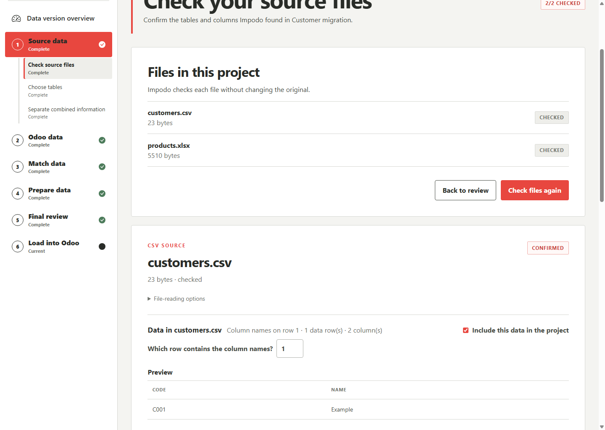
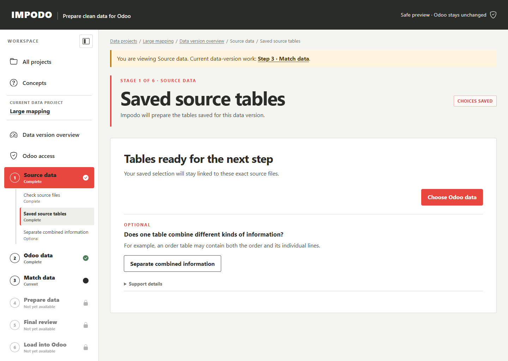
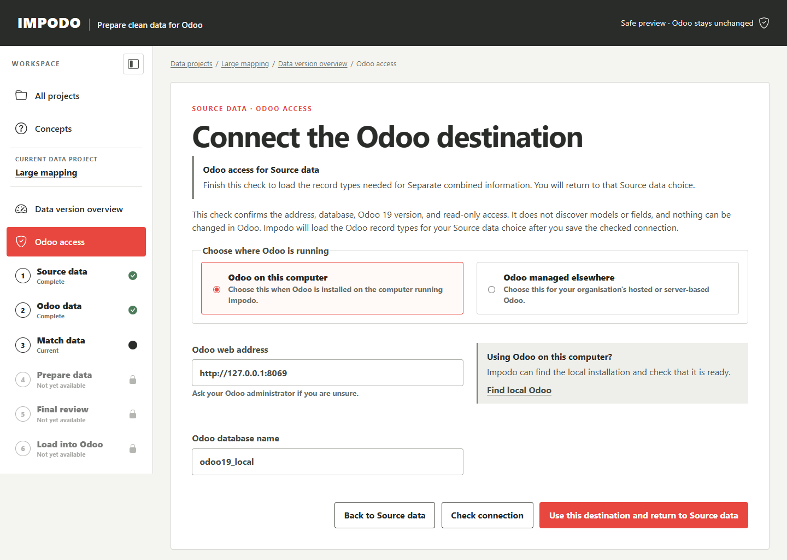

# Source data

## Goal

Confirm the exact records and columns that Impodo may prepare, then freeze
them as evidence for the current data version.

## Before you start

The current data version must be available. For files, use the complete CSV
or XLSX delivery for this authoring work and know which
worksheets, tables, or ranges belong to the migration. For an Odoo source,
first complete the eligible-field capture described in
[Odoo data](02-odoo-data.md).

## Steps in Impodo

### File source

1. Add all related CSV or XLSX files and select **Use these files and
   continue**. Impodo checks the files and opens the source preview.
2. Review the delimiter or worksheet, headings, bounded preview, counts, data
   types, blanks, repeated values, and warnings.
3. Configure the intended tables for every file.
4. Add a corrected file and remove the wrong file if necessary.
5. After every file is confirmed, give each table a **Name shown in Impodo**
   and select **Save tables for this data version**.
6. Optionally open **Separate combined information** when combined information
   must become separate related tables.

For **Create a related table from one field**, select **Review resulting
table** after choosing the source field and Odoo record type. Impodo checks
every accepted source row and shows the expected table size, repeated values,
unusable values, extra parent rows, and spelling differences it will combine.
Select **Add related table to Match data** only when that result is correct.
The original source table stays unchanged, and this action does not create or
change Odoo records.

Some related-table choices need the list of record types from your Odoo
destination. If only the read-only key is missing, select **Enter key and show
Odoo record types**. Impodo saves the key for this destination, loads the list,
and keeps you on the same Source data choice. If the destination itself needs
setup, select **Set up Odoo access**. Check the connection and select **Use
this destination and return to Source data**. Impodo loads the record types
and returns to the choice you opened. **Odoo access** is a shared setup page
outside the numbered stages; Stage 2 begins when you choose the Odoo data to
use.

For example, if a Product file has separate category levels, you can start
the hierarchy in Stage 1, check Odoo access when prompted, and then finish
the hierarchy without searching for the same source table again.

For a multi-column parent-and-child hierarchy, follow [Prepare related
tables](../guides/related-tables.md#build-a-hierarchy-from-separate-fields).

Once table choices are frozen, the file list cannot be changed in that data
version.

### Odoo source

1. Open **Download and freeze** after eligible fields have been captured.
2. Choose each **Odoo record type** in turn. The page shows that record
   type's eligible fields and its own saved plan.
3. Review **Review the related data for this migration**. Impodo groups the
   available links into supporting records needed to preserve meaning,
   optional business data, destination setup to reuse, records created by
   Odoo, separate business processes, history to leave out, and links with no
   standard default. For ordinary linked values, Impodo recommends **Keep
   linked value**. This reuses an exact destination match or creates only the
   minimum record needed when no match exists; it does not follow optional
   relationships from that record type. Open **Advanced: choose a different
   outcome** only when you need **Transfer related records as migration data**, **Use existing
   destination records only**, or **Do not include**. Full transfer captures
   reached records and reviews their own relationships. Existing-only captures
   reached identity evidence, stops relationship expansion, and prevents that
   record type from being created or updated. If you explicitly make the same
   record type a source root by clearing **Capture only records linked from the
   selected source records**, it may still lead Impodo to its reviewed linked
   child records. This does not allow Impodo to create or update that root in
   the destination. For Products, Impodo recommends
   appropriate initial actions for Product Categories and Units of Measure when
   those record types are available. Then select **Save related-data
   decisions**. One action applies to every link shown beneath that related
   record type. Impodo saves each link as a separate
   decision, so a later recommendation change does not silently change what
   you approved. **Keep linked value** leaves exact identity and any missing
   create-only values for **Match destination data**. **Use existing destination
   records only** requires Stage 4 to prove an exact existing destination match
   and never permits creation. Destination-owned choices such as Company do not
   offer creation of identity and required values. Odoo-managed records and
   excluded history show their automatic handling. Separate-process profiles
   remain editable recommendations. If a transferred
   record type reveals more relationships, Impodo shows them as **Needs review**
   in the next review on the same page. Repeat **Save related-data decisions**
   until the page shows **Related-data review complete**. Impodo does not
   expand optional relationships from a record kept this way, and it will not let
   you check or freeze records while a newly found relationship still needs a decision. If a
   related record type is unavailable, Impodo shows that as a blocker instead
   of treating the relationship as excluded.
   Saving a changed model choice refreshes its eligible fields from Odoo and
   requires you to review the affected capture plans again. A record type added
   from this section starts with **Capture only records linked from the selected
   source records** selected. Use **Review all available Odoo data** only when
   you need to change the wider model scope.
4. When the related-data review is complete, select **Prepare capture plans**
   when that action is shown. Impodo prepares every capture plan it can prove
   safely. Main record types receive their eligible business
   values. Full related records receive the same full plan. Existing-only
   records receive identity evidence, while **Keep linked value** records
   receive their identity and required values only. Impodo does
   not replace a plan you already edited. If one record type has no safe
   identity or exceeds a capture limit, the page names that exception and opens
   only that plan for review. You do not need to configure all the other record
   types individually.

   Review the saved-plan summary before continuing. An automatically prepared
   root plan reads all matching records and remains subject to the 10,000-row
   safety limit. Select **Edit saved capture plans** if you need to add an exact
   **Root record filter**, change the fields, or change the request size. A
   related plan remains limited to records reached through the reviewed links.
5. If you chose a linked supporting type, review **Relationship fields used to
   find linked records** and confirm **I reviewed the selected relationship
   fields above**. Then select **Check matching records and continue**. Impodo
   shows the count and request estimate for each dataset and for the complete
   capture.
6. Confirm the read-only action and wait while Impodo freezes every dataset as
   one source version. A failure leaves the previous complete version current.

If you return to this stage and change the selected Odoo record types, fields,
or capture plans, Impodo locks the later stages immediately. Complete a capture
plan for every selected record type, then confirm **Download and freeze** again.
Impodo does not combine the earlier frozen records with the new choices. The
earlier version remains protected history until the new complete version is
frozen.

The Odoo-source route reads selected business records; it does not authorize a
write back to Odoo.

Selected record types remain separate datasets. Capturing both ends of a
relationship gives **Match destination data** the records and protected link
evidence it needs. A link to an unselected record type is not transferred. The
related-data proposal explains why each available link may or may not belong
in the migration. Its technical model and field names remain under **Support
details**. The page does not require a separate checkbox for every technical
field, but Impodo records the resulting decision for each displayed link. Once
you select a supporting type and mark it for linked capture,
Impodo finds its records from selected relationship fields. It stops if a
referenced record is missing, inaccessible, or outside the selected root
group. Capture alone does not authorize recreating records in another Odoo
instance.

The root filter currently matches one direct field by exact value. Editing
other plan choices keeps a saved filter. Enter a new field and value to replace
it, or choose **Remove the saved root filter** to remove it. Related record
types still need their own selected types and plans. Impodo follows links only
between those selected types, up to four steps. The current interface reviews
the eligible fields as a group; it does not offer a field-by-field link choice.

Impodo accepts finite Odoo floating point values such as quantities, rates,
and durations in this source capture. Review the captured values before
loading another instance.

## How Recipes reuse this work

The exact files, rows, hashes, and frozen snapshots belong only to this data
version. A saved Recipe retains the reusable source shape and logical
table and column bindings, not the source records.

Every later data version must therefore start clean and accept its complete
replacement delivery again. An integrated Test run can select different
logical datasets from one already accepted Test data version for several
Recipes; it still never reuses the Authoring rows as current Test evidence.

## What to check

- Counts and headings match the governed export or every Odoo selection.
- Preview values belong to the intended business population.
- Stable business identities are present.
- Warnings are understood before freezing.
- Optional related tables represent real record types, not merely convenient
  display groupings.

## What Complete means

Impodo shows the source stage as frozen or complete only after every selected
Odoo record type has a saved plan and the complete set has been captured.
Every selected dataset is bound to protected evidence for this data version.

## What changes and what does not

Freezing creates a governed snapshot for preparation. It does not modify the
original file or Odoo records, save a Recipe version, or copy evidence
from another data version. Optional related-table rules create a plan; they do
not rewrite the frozen source.

## Needs attention

Stop when a file hash has changed, a worksheet is missing, headings are wrong,
or the Odoo capture is broader than intended. Before table freeze, replace an
incorrect file. Never replace frozen evidence in place. If the migration scope
is wrong, create a correctly scoped data project.

For combined source information, use the
[related-table authoring guide](../guides/related-tables.md)
instead of manually altering the project database.

## What makes this work stale

A changed source file, table choice, Odoo selection, or related-table plan
changes this data version's source evidence. Downstream schema, mapping,
preparation, and review evidence must be regenerated when Impodo invalidates
them. If you open a saved later-stage link after such a change, Impodo returns
you to the unfinished Source data choice instead of starting preparation.
Earlier data-version evidence remains protected history.

## Next stage

For a file source, continue to [Odoo data](02-odoo-data.md). For an Odoo
source, continue to **Connect destination Odoo** after the complete capture is
frozen. You then match destination records, validate relationship order,
approve the transfer, and run the read-only destination preflight. When it
passes, continue through Stage 6 to prepare the exact load, explicitly confirm
it, and verify the destination result.

## Related documentation

- [End-to-end training tutorial](../tutorials/end-to-end-training.md)
- [Developer implementation: Source data](../../developer/workflow/01-source-data.md)
- [Planned same-database guarded Odoo-source updates](../../plans/remaining-work.md#4-complete-guarded-odoo-source-updates)
