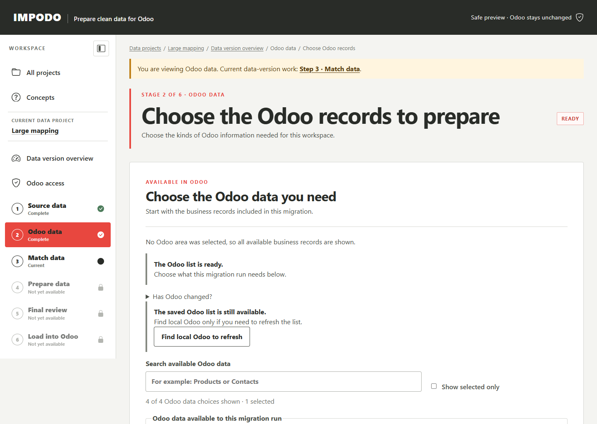

# Odoo data

## Goal

Choose the Odoo 19 record types and fields needed by the current data project
version, and confirm how Impodo can identify one existing record.

## Before you start

The current data-version target must be configured. A file-source data version
also needs frozen source tables. Know the intended Odoo business records and
agree stable business keys with the functional owner.

When you connect a Remote Odoo target, enter the API key that Impodo should
use for checking. You can keep it for checking only, or select **Use this key
for checking and loading** when the same Odoo account is approved to write.
Impodo keeps the checking and loading access separately even when they use the
same secret. Production continues to require a separate limited write key.

## Steps in Impodo

1. Open **Odoo data**. In an Odoo-source project this is shown first as
   **Odoo source data**.
2. Select **Show available Odoo data**.
3. Choose only the record types included in the approved scope.
4. Load the selected Odoo details.
5. Review fields, types, required values, selections, and relationships.
6. For a file-source migration, choose the business key for each writable
   record type and confirm the exact captured schema and matching rules.
7. For an Odoo source, confirm the eligible fields needed by the bounded source
   capture.

After the first capture, **Check for Odoo changes** reads the same selected
record types again. If their technical Odoo details are unchanged, Impodo
records the successful check and keeps the current mapping and later review
work. A new check time or translated display label does not replace that work.

If Odoo fields, types, requirements, selections, relationships, constraints,
target identity, or selected scope changed, **Odoo data** becomes **Needs
attention**. Impodo shows the detected differences but keeps the current
evidence in place. Review the differences, then select **Use updated Odoo
details** only when the new target definition is correct. That confirmation
replaces the schema and retires dependent work that described the previous
definition.

Use portable values such as customer reference, internal product reference,
country code, or BoM reference. Do not choose an Odoo numeric database ID as a
portable business key.

A reviewed standard reference, such as Country matched by its Odoo 19 country
code, can remain outside the migration record-type scope. Impodo may read only
the bounded reference values needed for matching and Final review. It does not
turn that supporting record type into data that the project will create or
update.

## How Recipes reuse this work

The saved Recipe keeps the portable Odoo target contract: required models,
fields, selection codes, relationships, and matching meaning. It does not keep
the server address, database, API key, live schema snapshot, or numeric Odoo
record IDs.

Each later data version must connect its own target, use a fresh read-only key,
and capture current Odoo details. Applying Recipes to later data versions uses
fresh work areas and target evidence. Saving a Recipe never copies the
current target evidence.

## What to check

- The model is the intended Odoo record type, including custom models when
  applicable.
- Required fields and selection choices reflect the connected database.
- For a file source, each business key is expected to find zero or one record,
  never several.
- Linked records can be resolved by an incoming table or approved existing
  Odoo data.
- A supporting reference is read-only and does not enter the intended Odoo
  write scope merely because another record links to it.
- The scope contains no unrelated business areas.

## What Complete means

For a file source, the selected schema and business-key governance are saved
together and **Match data** becomes available. For an Odoo source, the eligible
schema is captured and you next define and freeze the bounded source-record
selection.

## What changes and what does not

This stage reads and stores target metadata for this data version. It does not
create or update Odoo records, save a Recipe version, or reuse a Test
credential in Production. Saving a key for later loading does not authorize a
load; Stage 6 verifies its exact write access and requires explicit
confirmation. Confirming a business key does not prove that every current
value is unique; the later comparison checks current target evidence.

## Needs attention

Do not continue when the wrong database, model, inherited field, or business
key is shown. Refresh the available record types or select **Check for Odoo
changes**. When Impodo finds a change, review it before selecting **Use updated
Odoo details**. If access is unavailable, resolve the Odoo plan, credentials,
or permissions instead of guessing field definitions.

## What makes this work stale

Checking unchanged Odoo details does not make later work stale. Confirming a
changed model scope, field definition, or business key invalidates dependent
mapping and review evidence in this data version. Recheck the next stages
against the new captured schema. A target change does not rewrite an already
saved Recipe version.

## Next stage

For a file source, continue to [Match data](03-match-data.md). For an Odoo
source, return to [Source data](01-source-data.md) and freeze the selected
records before matching.

## Related documentation

- [Connect to Odoo on this computer](../guides/local-odoo.md)
- [Developer implementation: Odoo data](../../developer/workflow/02-odoo-data.md)
