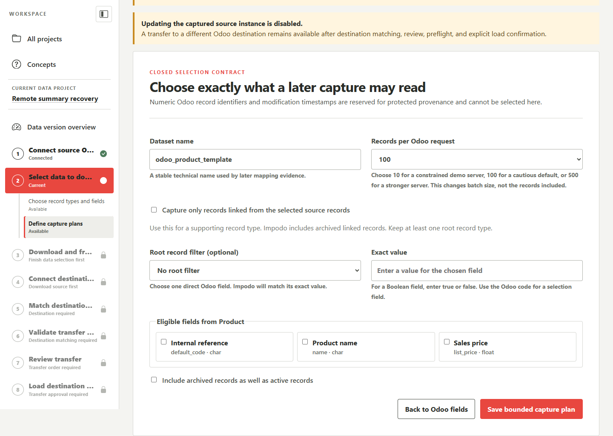
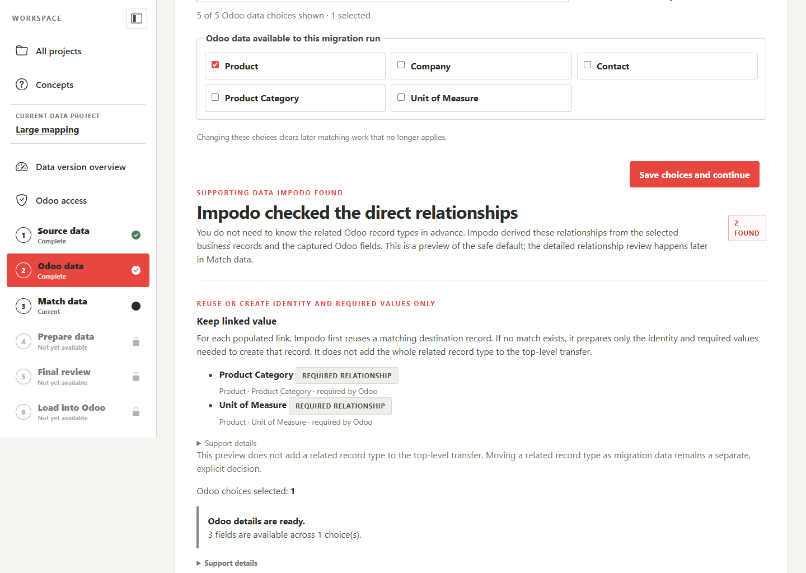
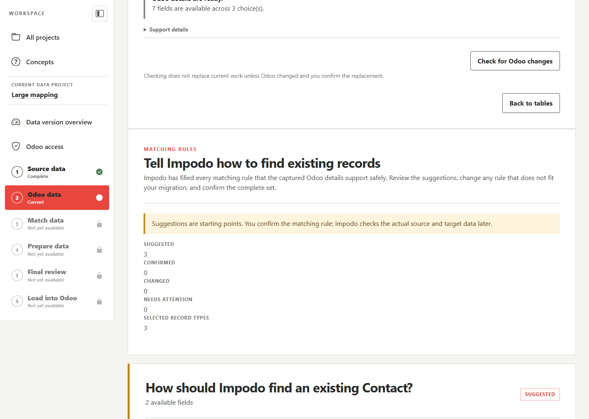
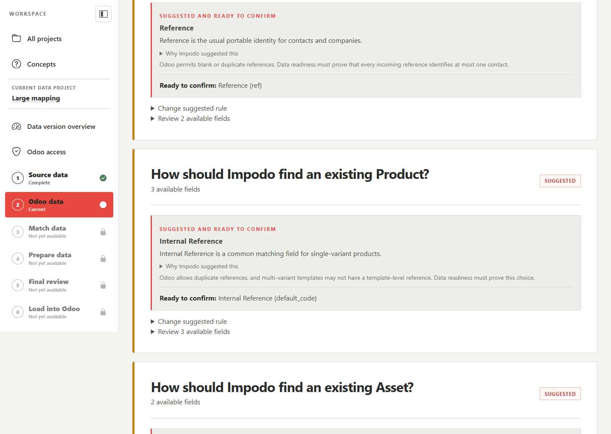
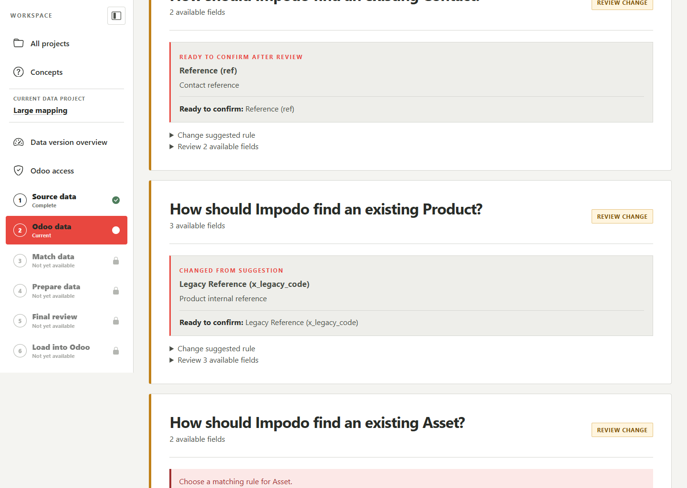
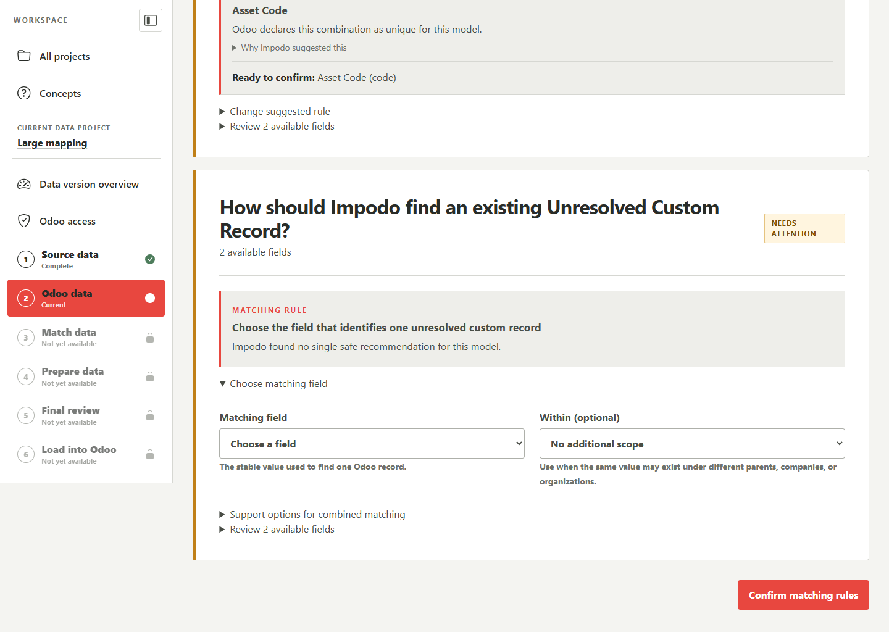
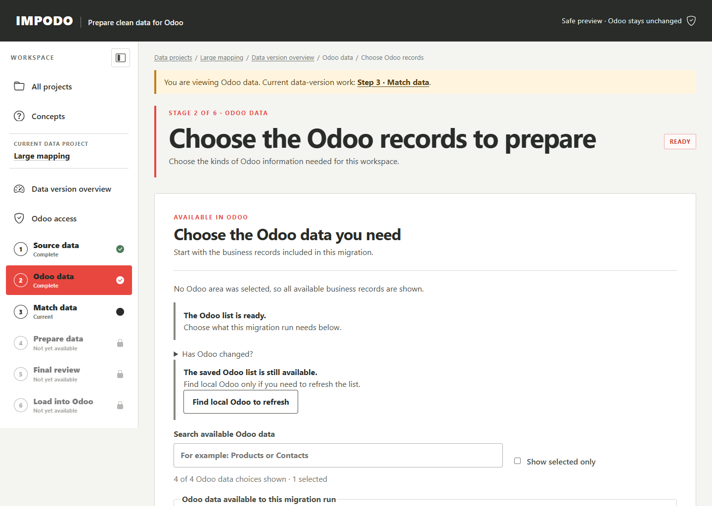

# Odoo data

## Goal

Choose the top-level Odoo 19 or final Odoo 20 business records needed by the
current data project version. Let Impodo expose their direct supporting
relationships, preview how linked values will be kept, then confirm how it can
identify one destination record.

## Before you start

The current data-version target must be configured. A file-source data version
also needs frozen source tables. Know the top-level business records that the
migration should create or update and agree stable business keys with the
functional owner. You do not need to know Odoo's supporting record types in
advance.

For a file source, **Odoo access** is a separate setup page in the sidebar.
You can check the destination there while finishing Source data, or open it
when this stage asks for access. After the connection check, Stage 2 is where
you choose Odoo record types and inspect their fields. If you opened Odoo
access from **Separate combined information**, Impodo returns to that Source
data choice after it loads the record types.

Impodo supports Odoo 19 and final Odoo 20 workflows. For either supported
major, you can check the connection, capture the live schema, freeze a bounded
Odoo source, read matching values, author a Recipe, and continue to same-major
loading and recovery. Odoo 20 Production remains disabled. If the server
reports an unknown, prerelease, SaaS, later-minor, or conflicting version,
resolve that connection check before capturing details.
A Recipe applies only to its authored Odoo major version, and an Odoo source
and destination must use the same major version.

When you connect a Remote Odoo target, enter the API key that Impodo should
use for checking. You can keep it for checking only, or select **Use this key
for checking and loading** when the same Odoo account is approved to write.
Impodo keeps the checking and loading access separately even when they use the
same secret. Production continues to require a separate limited write key.

## Steps in Impodo

1. Open **Odoo data**. In an Odoo-source project this is shown first as
   **Odoo source data**.
2. Select **Show available Odoo data**.
3. Choose the top-level business record types included in the approved scope.
4. Load the selected Odoo details.
5. Review **Supporting data Impodo found**. For ordinary linked values, Impodo
   previews **Keep linked value**: reuse a destination match or create only the
   minimum related record when no match exists. Destination-owned setup such as
   Company is shown separately as **Use existing destination records only**.
6. Review fields, types, required values, selections, and relationships.
7. For a file-source migration, review the matching rule that Impodo prepared
   for each supported writable record type. Change a rule when the proposed
   identity does not fit the migration, resolve every **Needs attention** card,
   then confirm the complete set once.
8. For an Odoo source, confirm the eligible fields needed by the bounded source
   capture.

For an Odoo source, select only the fields that the migration needs. The
**Records per Odoo request** choice changes how Impodo batches the read; it
does not add or remove records. Numeric Odoo record identifiers and modification
timestamps remain protected provenance and are not selectable source values.

The supporting-data review uses the direct relationships in the captured live
Odoo schema. It is a preview, not another record-type picker. It does not add a
related record type to the top-level transfer or make the whole related model
eligible for creation. Stage 3, **Match data**, proves which source links are
populated and applies the exact outcome.

**Keep linked value** first reuses a matching destination record. When no match
exists, Impodo prepares only the portable identity and required values needed
to create the related record; it does not follow the rest of that record's
relationship graph. **Use existing destination records only** protects
destination setup such as Company: a missing match stops the load instead of
creating or updating that setup. Moving related records as migration data remains a
separate, explicit migration-scope decision.

The matching-rule summary separates **Suggested**, **Confirmed**, **Changed**,
and **Needs attention** record types. When every card has a proposed or saved
rule, select **Confirm suggested matching rules**. The suggested values are
already in the form; you do not need to select a suggestion on every card.

For a child record, **Within** can identify the owning parent. For example,
Impodo proposes:

- **Sequence**, within **Parent BoM**, for a Bill of Material Line; and
- **Operation**, within **Bill of Material**, for a Work Center Usage.

This parent scope means that the child value needs to identify one line only
inside that parent. It does not use either record's numeric Odoo ID. A component
can legitimately appear more than once in one BoM, so **Component within Parent
BoM** remains an advanced override rather than the default. Use **Change
suggested rule** when the functional owner has approved a different identity.

If you change a suggestion, Impodo keeps the changed values in the form when
another card needs correction. After confirmation and reopening, the reviewed
override remains the matching rule instead of being replaced by the original
suggestion.

Impodo leaves a record type as **Needs attention** when Odoo exposes several
possible unique rules or no reviewed rule. It does not guess from a field name
or translated label. A convention warning also remains visible because Prepare
data and Final review must still prove that the actual values are populated and
unique.

After the first capture, **Check for Odoo changes** reads the same selected
record types again. If their technical Odoo details are unchanged, Impodo
records the successful check and keeps the current mapping and later review
work. A new check time or translated display label does not replace that work.

If Odoo fields, types, requirements, selections, relationships, constraints,
target identity, or selected scope changed, **Odoo data** becomes **Needs
attention**. Impodo shows the detected differences but keeps the current
evidence in place. Review the differences, then select **Use updated Odoo
details** only when the new target definition is correct. That confirmation
replaces the schema and retires dependent work that described the previous
definition.

Use portable values such as customer reference, internal product reference,
country code, or BoM reference. Do not choose an Odoo numeric database ID as a
portable business key.

A reviewed standard reference, such as Country matched by its version-specific
country code, can remain outside the top-level migration scope. Impodo may read
only the bounded identity and required values needed for matching and Final
review. That minimum relationship evidence does not turn the whole supporting
record type into full migration data.

Odoo 20 changed several unit fields. Bills of Materials and their lines use
`uom_id` instead of `product_uom_id`; Product no longer has `uom_po_id`; and a
Unit of Measure uses a reference-unit relationship instead of the Odoo 19
category, rounding, and unit-type fields. Impodo shows the native fields from
the connected database. It does not treat an Odoo 19 field as an automatic
alias, and it does not treat a unit category and a reference unit as the same
business concept.

## How Recipes reuse this work

The saved Recipe keeps the portable Odoo target contract: required models,
fields, selection codes, relationships, and matching meaning. It does not keep
the server address, database, API key, live schema snapshot, or numeric Odoo
record IDs.

Each later data version must connect its own target, use a fresh read-only key,
and capture current Odoo details. Applying Recipes to later data versions uses
fresh work areas and target evidence. Saving a Recipe never copies the
current target evidence.

## What to check

- The model is the intended Odoo record type, including custom models when
  applicable.
- Required fields and selection choices reflect the connected database.
- For a file source, each business key is expected to find zero or one record,
  never several.
- For a parent-owned child, the matching field is unique within the chosen
  parent scope. Repeated components, operations, or line numbers are reviewed
  before confirming the rule.
- An ordinary populated link can reuse one destination match or create only the
  minimum related record when no match exists.
- Destination-owned setup such as Company uses an approved existing destination
  record and is not created or updated by the relationship default.
- A related record type does not enter the top-level transfer merely because
  another record links to it.
- The scope contains no unrelated business areas.

## What Complete means

For a file source, every selected writable record type has one confirmed rule.
Every required direct relationship has an available, safe default for later
matching: keep the linked value, use existing destination setup, or let Odoo
manage it. The selected schema and complete business-key governance are saved
together and **Match data** becomes available. For an Odoo source, the eligible
schema is captured and you next define and freeze the bounded source-record
selection.

## What changes and what does not

This stage reads and stores target metadata for this data version. It does not
create or update Odoo records, save a Recipe version, or reuse a Test
credential in Production. Saving a key for later loading does not authorize a
load; Stage 6 verifies its exact write access and requires explicit
confirmation. Confirming a business key does not prove that every current
value is unique; the later comparison checks current target evidence.

## Needs attention

If your Odoo choices were saved but their details could not load, select
**Try loading details again**. When the saved record-type list needs fresh
access verification, Impodo refreshes it once and retries your saved choices.
You do not need to select those choices again or start a new project. If the
check finds changed details or access, review the result before selecting
**Use updated Odoo details**.

If access changes again during that retry, Impodo stops and keeps the current
details. Check the read user and company access before retrying.

If **Migration issues** says that required related Odoo data is unavailable,
use **Review available Odoo data**. The issue names the affected business
record and field, the correction owner, what remains saved, and the required
recheck. Refresh the available Odoo record types or correct the read user's
access, then load the selected Odoo details again. Impodo preserves the
accepted source data and the selected top-level business records.

Do not continue when the wrong database, model, inherited field, or business
key is shown. Refresh the available record types or select **Check for Odoo
changes**. When Impodo finds a change, review it before selecting **Use updated
Odoo details**. If access is unavailable, resolve the Odoo plan, credentials,
or permissions instead of guessing field definitions.

## What makes this work stale

Checking unchanged Odoo details does not make later work stale. Confirming a
changed model scope, field definition, or business key invalidates dependent
mapping and review evidence in this data version. Recheck the next stages
against the new captured schema. A target change does not rewrite an already
saved Recipe version.

## Next stage

For a file source, continue to [Match data](03-match-data.md). For an Odoo
source, return to [Source data](01-source-data.md) and freeze the selected
records before matching.

## Related documentation

- [Connect to Odoo on this computer](../guides/local-odoo.md)
- [Developer implementation: Odoo data](../../developer/workflow/02-odoo-data.md)
