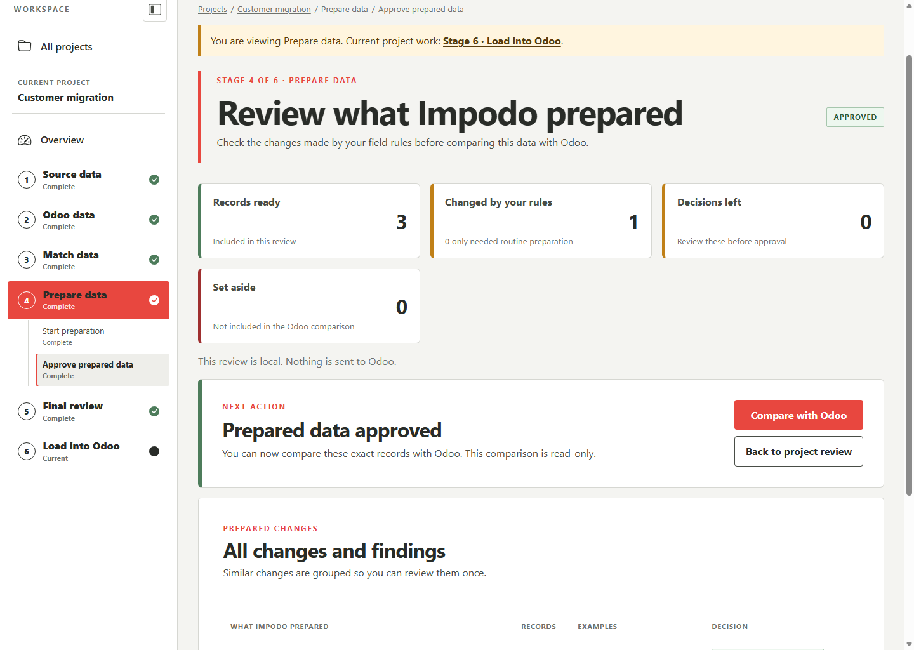

# Prepare data

## Goal

Apply the confirmed mapping to every frozen row, check data quality, and
resolve findings before comparing anything with Odoo.

## Before you start

The exact mapping revision must be checked and confirmed. Do not start while a
source, schema, key, or transformation decision is still changing.

## Steps in Impodo

1. Open **Prepare data**.
2. Select **Prepare data** once and follow the progress page.
3. Review row totals, warnings, quarantined rows, and preparation failures.
4. Open **Resolve possible duplicates** when Impodo finds records that may
   describe the same business entity.
5. Merge or keep candidates separate using business evidence.
6. Review prepared-value groups and accept or reject proposed normalization
   decisions when they are present.
7. Approve the resolved prepared data only when no required decision remains.

## What to check

- Source, prepared, quarantined, and rejected totals reconcile.
- Every source row is accounted for.
- Relationship values resolve to exactly one intended record.
- Duplicate decisions preserve distinct business entities.
- Prepared values still express the source meaning after cleanup.
- Blocking findings are resolved rather than hidden.

## What Complete means

Impodo has a frozen, fully accounted prepared result for the current source,
schema, and mapping evidence. **Final review** becomes available for file
projects. For captured Odoo records, the prepared result is complete but Final
review remains locked until the protected three-way comparison is available.

## What changes and what does not

Preparation publishes local canonical evidence. It does not call Odoo and
does not change the frozen source. Merge and normalization decisions affect
the prepared result, not the original evidence.

For captured Odoo records, Impodo verifies the encrypted origin sidecar once,
then reads only the frozen local snapshot. Protected record IDs remain outside
the portable prepared rows and reports.

## Needs attention

Investigate blocked rows, unresolved relationships, unexpected quarantine,
count differences, or a stopped background job. A cancelled or failed attempt
may be retried only after its recorded outcome is understood.

## What makes this work stale

Any change to source evidence, Odoo schema, business keys, mapping revision,
or required resolution invalidates the prepared result. Run preparation again
instead of modifying stored artifacts.

## Next stage

Continue to [Final review](05-final-review.md).

## Related documentation

- [Developer implementation: Prepare data](../../developer/workflow/04-prepare-data.md)
