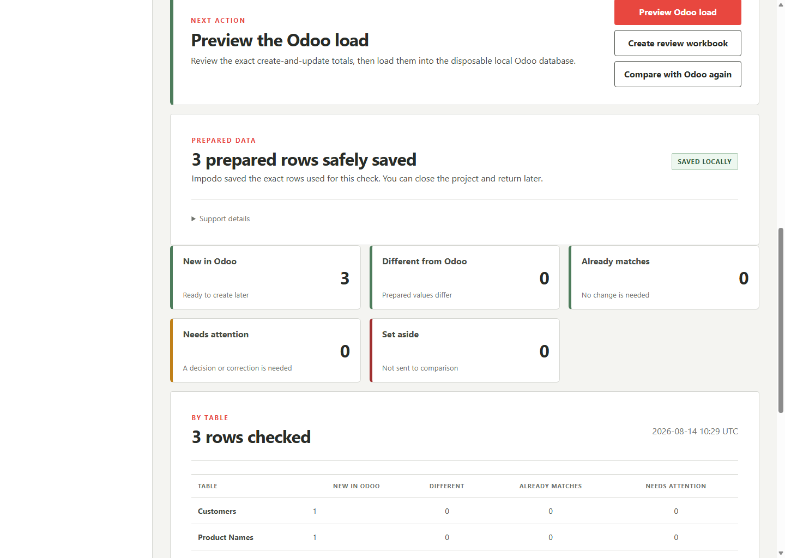

# Final review

## Goal

Compare every eligible prepared row with current Odoo evidence and decide
whether the proposed outcome is safe to take to the load stage.

## Before you start

Prepared data must be complete for the current source, schema, and mapping.
Use a reachable Odoo 19 target with the approved read access.

## Steps in Impodo

1. Open **Final review**.
2. Select **Check all rows**.
3. Review totals for **Create**, **Update**, **Unchanged**, **Needs review**, and
   **Blocked**.
4. Inspect field-level differences and relationship resolutions.
5. Resolve every ambiguous or blocked row upstream, then prepare and compare
   again.
6. Download the workbook or technical evidence package when required for the
   rehearsal record.

## What to check

- The target fingerprint identifies the intended Odoo database.
- Create and update totals match the migration purpose.
- Unchanged rows require no write.
- Every changed field is expected and approved.
- No relationship points to an unresolved or ambiguous record.
- A rerun against refreshed Odoo evidence gives an explainable result.

For an update-only reload of existing records, any nonzero **Create** count is
a hard stop until the identity or target evidence is corrected.

## What Complete means

The current report is **Ready** with no ambiguous or blocked rows and remains
bound to the exact prepared and target evidence. The load stage becomes
available.

## What changes and what does not

Comparison reads Odoo and stores review evidence. It does not write to Odoo.
Downloading a workbook or package does not authorize execution.

## Needs attention

Stop for an unexpected create count, duplicate match, blocked relationship,
wrong target fingerprint, or remote read failure. A browser HTTP error may
wrap an upstream Odoo or network failure; check the recorded cause before
retrying.

## What makes this work stale

Source, schema, business-key, mapping, prepared-data, target-evidence, or
dependency-order changes require a fresh comparison. Never load from an older
report after one of those changes.

## Next stage

Continue to [Load into Odoo](06-load-into-odoo.md) only for an explicitly
approved disposable target and the exact current review.

## Related documentation

- [Developer implementation: Final review](../../developer/workflow/05-final-review.md)
