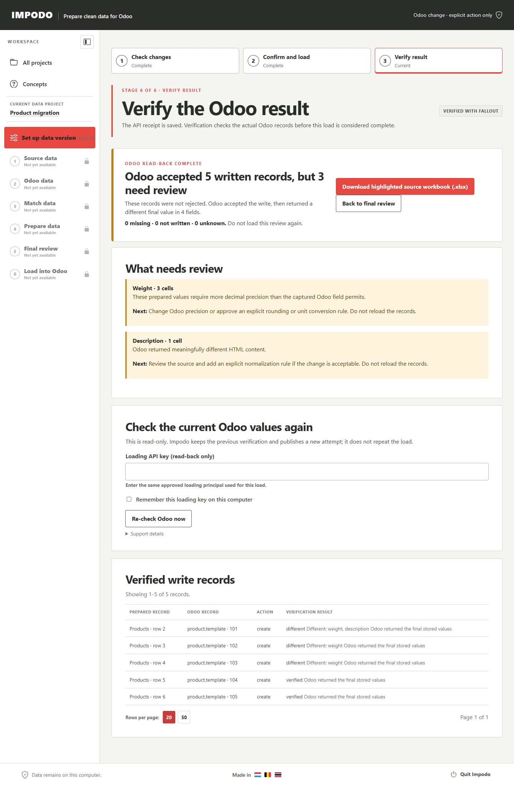
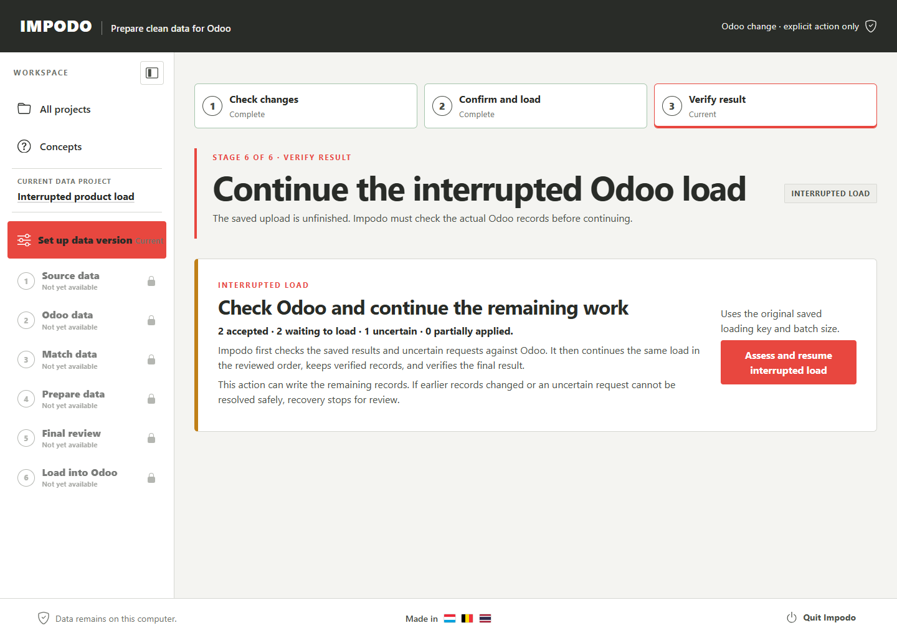

# Load into Odoo

## Goal

Explicitly load the exact reviewed plan for the current data version
into its approved Odoo 19 target, then verify the recorded outcome.

Impodo currently has two paths at this stage. A prepared-data workspace can
continue through the existing load and verification steps. An Odoo-to-Odoo
workspace can continue from its read-only destination preflight through a
separate preparation, explicit load confirmation, and destination read-back.

## Odoo-to-Odoo transfer through Stage 8B

When you download records from one Odoo database for transfer to another,
Impodo keeps the source-fetch key separate from the destination transfer key.
The destination key is the second and final API key in this workflow. Impodo
uses it for read-only matching and preflight. It uses that same destination key
for loading and verification only after you explicitly confirm the prepared
load. There is no third API key.

1. Complete **Connect destination Odoo** with the destination transfer key.
2. In **Match destination data**, choose a stable text field for every record
   type. If that field repeats within a record type, add a second or third
   captured text or integer field. Impodo matches the complete combination
   and classifies each unique source record as existing or missing. A parent
   record or company relationship cannot yet be used as one of these fields.
3. Review **Validate transfer order**. Supporting records appear before the
   records that refer to them, while safe optional cycles use a later
   relationship pass.
4. In **Review transfer**, choose a policy for each record type: **Reuse
   existing, create missing** (the browser default), **Reuse existing only**,
   or **Update existing, create missing**. This applies to Contacts, Products,
   supporting records, and any other selected model. A reuse-only choice stops
   package creation if any destination record is missing. The frozen review
   shows each create-only field and its value source without revealing a
   protected fixed value or linked-record identity. Build and approve the
   exact package after checking those choices. If some captured fields cannot
   be written to the destination, Impodo can still reuse existing records;
   creating or updating that record type requires resolving the field issues.
   For a new record, Impodo also checks the destination's required fields.
   Use **Complete values for new records** when a current Odoo default needs
   review or Odoo supplies no usable value. You can confirm the current Odoo
   default, set one typed value for all new records, or choose a compatible
   captured source field. These choices apply only to new records; they never
   replace a value on a reused destination record. For a required linked
   record, you can choose an existing destination record when its related
   record type is selected and its business key identifies one current
   record. A current Odoo default can also be reviewed without adding that
   related record type; Impodo verifies the linked record after creation. If
   the related record type is one of your selected source tables, you can also
   choose **Use one selected source record**. That choice uses the same
   reviewed record for every new record of this type. Impodo reuses it when it
   already exists in the destination, or places its source table in an earlier
   transfer wave when it must be created. If Impodo cannot prove one of these
   routes, it stops creation instead of asking for a numeric Odoo ID. You can
   choose reuse only when every source record already exists there.
   If the destination record type has a **State** field, Impodo can reuse
   existing records but stops ordinary create or update until its business
   workflow has been qualified.
5. Select **Continue to destination preflight**, then select **Run read-only
   preflight**.
6. Compare the approved and freshly observed reuse, create, field, and
   relationship totals. If the page shows **Preflight passed**, Stage 8A is
   complete. No record has been written to Odoo.
7. Select **Continue to Stage 8B**, then **Prepare exact load confirmation**.
   Impodo performs one last destination read and compiles the exact load. This
   action still cannot write to Odoo.
8. On **Confirm and load**, check the destination database, total records,
   creates, updates, reused records, relationship fields, and approved wave order.
   If every record is reused, the page says that no destination write is needed
   and offers no load action.
9. Select the single **Load ... into destination Odoo** action once. This is the
   first action in the cross-instance workflow that can start a write.
10. Follow progress to **Verify result**. Impodo attempts read-back
    automatically; if it could not finish verification, use **Verify what
    happened in Odoo** on the saved outcome page. If Impodo itself stopped
    while the transfer was running, use **Assess and resume interrupted
    transfer**. Impodo reads the destination first and continues only the work
    that it can prove is safe.

For example, a Product can refer to a Unit of Measure through a many-to-one
field. Impodo first checks whether each Unit's chosen business key is unique
in the destination. It then counts Product links that can reuse a destination
Unit and links that will depend on an incoming Unit. The same rule applies to
many-to-many fields and to inverse one-to-many metadata; it is not specific to
Product and Unit of Measure.

For you, this means that a new destination record matching an approved
"create" key stops the transfer before loading, which protects against a
duplicate. A changed field, permission context, or relationship resolution
also stops the transfer. Return to **Match destination data**, rebuild the
order and review, approve the new package, and run preflight again.

The preparation is bound to the current workspace revision, preflight, target,
and exact load snapshot. A changed destination sends you back to preflight. A
saved load journal prevents the same approved transfer from being submitted a
second time.

## Before you start

The current final review must be **Ready**. Confirm the data version purpose,
target, exact write totals, dependency order, writable fields, and required API
key. This key authorizes only the reviewed target operation; it does not grant
authority to another data project, data version, or future rollout.

## Steps in Impodo

The following steps apply to a prepared-data workspace. Use the Stage 8A and
Stage 8B sequence above for an Odoo-to-Odoo workspace.

1. Open **Load into Odoo**, then review **Check changes**.
2. Confirm the target, exact snapshot, new and changed totals, field scope, and
   the compact **What Impodo will load first** order.
3. Continue to **Confirm and load**.
4. If Stage 2 did not save a loading key, enter an API key approved for this
   load. If a loading key is available, Impodo uses it without asking you to
   enter it again.
5. Read the explicit confirmation and select the single load action once.
6. Follow the current load group and relationship-completion totals. Do not
   resubmit an uncertain request.
7. Open **Verify result** to read back the affected records.
8. Review reconciliation when any row cannot be verified. A read-back
   difference means Odoo accepted the record but stored at least one different
   value; it does not mean that Odoo rejected the row. Use **See the different
   values** to filter by field or find a prepared row, Odoo record, or value.
   For a BOM line, the card also shows the reviewed BOM and component keys.
   Compare the prepared and Odoo values and read **What to check** before
   deciding whether the change matters. When a BOM line's prepared Sequence is
   blank and Odoo returns 0, the card counts those lines. Confirm that 0 gives
   the intended line order; the read-back difference alone does not mean the
   component is missing. Select **Re-check Odoo now** for a
   fresh read-only attempt, or download the highlighted source workbook to
   locate the original worksheet cells. The original source workbook is never
   changed. Do not load the same review again.

## Correct a verified Authoring load

When an eligible Authoring load is fully verified, its data-project page shows
**Correct this Odoo load**. The original load and workspace become historical
evidence; Impodo creates a separate correction workspace over the same data.

1. Select **Correct this Odoo load**, then **Start correction**.
2. Select **Edit correction rules**.
3. Change only the rule that was wrong. This can be a source-to-field value
   rule, a Selection choice, a constant or fallback, or trimming and casing
   behavior. The same editor also lets you inspect relationship matches.
4. Return to the correction page and select **Review correction**.
5. Review the compact counts by dataset, Odoo model, and field. The review
   always shows zero creates.
6. If there are no blockers, explicitly confirm and select **Apply N
   corrections**.
7. Leave the progress page open or return to it later. Impodo rereads the exact
   affected records, applies only the reviewed fields, and verifies the
   outcome automatically.

Impodo compares the previous prepared intent, the current Odoo value, and the
corrected prepared intent. It does not rerun the whole migration and does not
search for another target by business key. If the corrected result is already
present in Odoo, the page shows that no write is needed.

Impodo can also correct a many-to-one choice when both the previous choice and
the corrected choice each match exactly one existing Odoo record. For example,
you can correct 37 Products from a mistaken `UNI` Unit choice to the existing
standard `Unit` record. Impodo changes only each Product's Unit field. It does
not create, rename, merge, or otherwise change a Unit of Measure record.

Matching remains case-sensitive. `Kg`, `kg`, and `KG` stay different unless
you explicitly confirm another rule in **Match data**. A missing or duplicate
relationship match, a move to another target field, a missing Product, or a
concurrent Odoo change stops the whole correction before writing.

## How saving a Recipe relates to the verified outcome

Loading does not create, change, or save a Recipe. If you save the
workspace's reusable rules, the resulting Recipe version still does not own
this execution or its read-back evidence.

Applying saved rules to replacement rollout data requires a fresh run. That
run must start with a new data version and
must not inherit this run's files, server settings, credentials, comparison,
approval, execution, or read-back evidence.

## What to check

- The target is the intended disposable Local or Remote Odoo 19 database.
- The preview hash and totals are the current reviewed values.
- Every writable field is within the approved scope.
- The first visible load groups put supporting records before records that use
  them. The summary shows at most five groups and reports how many later groups
  follow.
- The journal records every attempted row.
- Read-back verification accounts for the final outcome.
- A weight or amount with more decimal places than the captured Odoo field can
  store is resolved before confirmation. Impodo stops the load rather than
  silently rounding it or guessing a unit conversion.

When **Load unavailable** names `TARGET_NUMERIC_PRECISION_LOSS`, choose one
explicit recovery:

- Select **Refresh Odoo precision** after an Odoo developer changes the field
  to the required precision. In **Odoo data**, check for Odoo changes and use
  the updated details. Then submit the field matches, prepare, approve, and
  compare again.
- Select **Adjust the number rule** only when the business accepts a documented
  rounding rule. In **Match data**, open the affected field, set **Decimal
  rounding**, its places, and method, review the impact, then prepare, approve,
  and compare again.

Changing the Odoo field precision is the non-lossy option when the prepared
values are correct. A unit conversion is a separate business rule and is safe
only when the source unit and Odoo unit are both explicitly known.

## How Impodo handles related records

Impodo reads the relationships that you confirmed in **Match data** and places
supporting record types before the records that use them. For example, it
loads reviewed units and categories before new Products, and reviewed Products
and bill of materials (BOM) headers before their component lines. You do not
need to arrange the source files in that order.

If two new records have an optional relationship to each other, Impodo creates
what it safely can and then finishes that relationship after both records
exist. If a required supporting record is missing, ambiguous, or cannot exist
first, **Check changes** must stop the load. Resolve that warning before you
select **Confirm and load**.

Impodo also freezes dependencies between rows in the same dataset. A parent
row therefore loads before its child when their reviewed business keys make
that order clear. Impodo uses the second relationship step only for an actual
optional cycle; it does not require you to rearrange an acyclic hierarchy.

**Check changes** expresses that frozen order as plain numbered load groups.
Each group names at most three prepared record types and a record count; later
groups are summarized rather than expanded into a very long list. This is an
explanation of the current reviewed mappings, not a fixed Product or BOM
workflow. You keep the freedom to change included rows, business keys,
mappings, and optional relationships, then compare again to produce another
safe order.

When loading starts, the progress page names the current group. A record is
counted as having a final write result only after Impodo has saved its Odoo
outcome. An in-flight call or a row waiting for its reviewed relationship does
not count as finished. If optional relationships need a second pass, the page
shows how many affected new records are finished and how many remain.

Immediately before loading, Impodo checks existing Odoo records and related
records in bounded groups. A reviewed key must still point to the same unique
record. If it was removed, became ambiguous, or now points somewhere else,
Impodo creates no load journal and writes nothing; return to **Check changes**
for a fresh comparison. You still control the mappings, included rows, and
optional relationships. This check derives safety from those choices rather
than imposing a Product- or BOM-specific workflow.

Larger, multi-level BOM migrations remain part of the
[deferred scale qualification](../../plans/remaining-work.md#1-qualify-related-and-mixed-preparation-at-100000-rows).
The current related-data limit stays in place while that work remains open.

## What Complete means

Either the reviewed snapshot required no writes, or execution finished and
reconciliation verified the expected Odoo state. A successful HTTP response
alone is not completion evidence.

For the Odoo-to-Odoo path, **Preflight passed** completes only Stage 8A.
**Load destination Odoo** becomes complete only after the confirmed Stage 8B
load has a verified destination read-back. A prepared confirmation or accepted
Odoo response alone is not completion evidence.

For a completed-load correction, Complete means its automatic exact-record
read-back is verified. A submitted correction request or accepted API response
is not completion evidence.

## What changes and what does not

This is the workflow stage that can create or update Odoo records. It does not
provide whole-migration rollback, save a Recipe, or carry write authority
into another run. Unchanged and blocked rows are not written.

## Needs attention

When relationship planning blocks the load, **Check changes** groups equivalent
issues by reason and record type. Each message states why those records cannot
load and the next business action, such as adding a missing supporting record,
choosing a unique key, or making a relationship optional. Resolve the listed
issue in the earlier workflow, then compare again. Support details remain
bounded and do not expose source values or internal row identifiers.

Do not blindly retry a timeout, connection reset, HTTP 422, or other unknown
write outcome. First inspect the execution journal and reconcile the target.
For an Odoo-to-Odoo transfer whose page shows **Interrupted transfer**, select
**Assess and resume interrupted transfer**. Impodo uses the same destination
transfer key to read the exact affected fields before it continues the same
saved journal. It can retry an interrupted create only when no matching record
exists, and it keeps the same External ID so the retry cannot silently create
an unrelated duplicate. If the saved outcome is terminal rather than
interrupted, use **Verify what happened in Odoo**; do not submit the transfer
again.

For a prepared-data load interrupted when Impodo or your computer stopped,
open **Review interrupted load**, then select **Assess and resume interrupted
load**. The page shows accepted records, records waiting to load, uncertain
requests, and partially applied records. Impodo checks uncertain requests and
the earlier records that the remaining work depends on. It then continues the
same saved load with the original loading key and batch size. Impodo reads all
loaded records after the remaining work before it can report a verified result.
Keep the workspace and its matching rules intact while recovering; the
original preview totals do not show how many records remain.

If Odoo access changed and you keep the new access, refresh the Odoo fields,
confirm the prepared review, and compare again. **Confirm and load** then
explains that an earlier upload was interrupted. Its load action checks the
saved receipts and closes the earlier attempt before loading the fresh
comparison. The original records and receipts remain saved.

For an Odoo-to-Odoo transfer, Impodo checks every earlier completed group before
it continues. For a prepared-data load, it checks the earlier records needed by
the remaining work. If a created record is waiting for an optional relationship,
recovery writes only the relationship fields that were already reviewed. A
changed required record, ambiguous record, missing receipt, changed key, or
changed loading identity stops recovery and requires a new review. The final
read-back can also find a change in an earlier record that was not needed to
resume. In that case, the result needs attention; Impodo cannot undo the new
Odoo writes automatically.

If the load is complete but the newest verification shows fallout, do not
reload the records. Use **Re-check Odoo now** after correcting Odoo or the
affected exact records. The previous verification remains as history and the
new read becomes the current result. The highlighted workbook is a local
derivative containing business values; it is access-controlled and
integrity-checked inside the project, while API keys remain in the operating-
system credential vault.

## What makes this work stale

A new source, schema, mapping, reusable-rule, parameter, control,
preparation, comparison, target fingerprint, credential generation, or
dependency order invalidates the execution preview. Return to the earliest
changed stage and regenerate the evidence for this data version.

## Next stage

Keep the execution journal, reconciliation result, and approved review package
with the data project. Resolve any fallout before considering the data version
complete. You may separately save the reusable transformation rules from the
data project overview; that action does not change this load record.

## Related documentation

- [Developer implementation: Load into Odoo](../../developer/workflow/06-load-into-odoo.md)
